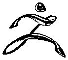
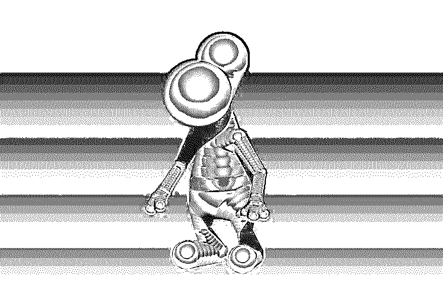

# mudbox vs Zbrush–5 个主要和重要的区别点

> 原文：<https://www.educba.com/mudbox-vs-zbrush/>

在 ZBrush 和 Mudbox 中你是否很迷茫该学哪个软件？当你遇到两个很棒的软件包却只能选择一个时，感到困惑是很自然的。

放轻松；我们将为你提供大量关于这两种雕刻软件包的利与弊的信息。在你读完这篇文章之前，你会对学习 Z Brush 或 Autodesk Mudbox 能获得什么有一个清晰的想法。

Z Brush 和 Mudbox 都是强大的雕刻软件包，它们看起来几乎与外部外观相似。但是有许多属性使它们彼此不同。

<small>3D 动画、建模、仿真、游戏开发&其他</small>

## zbrush

Z Brush 是一个全面的雕刻工具，提供频繁更新；这意味着更多的学习。如果你有一个原始的 Z 笔刷工具包，你所有的更新都是免费的。Z Brush 的界面非常无缝，让新生很容易理解工作流程。

谈到工具功能，天空是极限在 Z 刷。它允许在几乎所有你想处理的表面和物体上进行雕刻，让艺术家释放无限的创造力。雕刻工具和画笔是如此自然，没有其他软件可以与 Z 画笔提供的易用性相媲美。

Z 笔刷爱好者喜欢的另一个优点是它能够在 2.5D 和 3D 模型上雕刻。如果你不知道 2.5 维，这是一种雕刻方法，通常在一个平坦的 2D 平面上进行，主要用于游戏行业。在特殊情况下，没有必要建立一个完整的三维模型，一个一维的外观就可以满足目的，2.5 维的物体就可以使用了。它们很容易接近，因为它们的混乱和规模较小。

但是，学习软件 Z brush 有点复杂，比它的对手需要更多的时间。但好消息是，该软件有许多在线教程。你可以在 YouTube 和许多其他国家艺术家的个人博客上找到大量的免费教程。如果你想学习更高端的课程，你可以在网上注册付费课程，这些课程有同等数量的图书馆。

您可以在 Z 画笔中访问的颜色范围是有限的；同样，多边形上的阴影也较低。但是，你很少在你的 3D 物体上使用大量的色调饱和度。

## 泥浆箱

关于 Mudbox，你观察到的第一件事是该软件是 3D 巨头 Autodesk 的一部分。它立即使 Mudbox 得分一分，在那里你可以期望从 Autodesk 行李的其他软件包之间的无缝流动。

Mudbox 掌握了雕刻软件的工作流程技术；如果您习惯于使用 Maya 或 3DS MAX，您可能会觉得使用 Mudbox 更舒服。软件中的绘画模块要好很多。

它为更好的跨平台兼容性打开了大门，因为您已经增强了 Adobe Photoshop 和其他 2D 设计软件之间的工作流程。你甚至可以将著名的 Photoshop 混合模式应用于 Mudbox 中的 3D 对象。也可以在你的模型上使用 Photoshop 图层蒙版。

Mudbox 是一个完整的 3D 雕刻工具，但是雕刻的形状数量有限。该软件使用更多的计算能力，这是获得完整 3D 优势的代价。

所以，你对 Z 笔刷和 Mudbox 有了一个简单的概念。让我们深入比较两者的特性。

## #1.网状物

创建任何三维模型的主要对象是网格。你可以从软件中现成的平面、球体、立方体和各种各样的网格对象中创建模型，也可以自己创建模型。你有越多的网格创建选项，你就越容易在软件上工作。

在雕刻软件包时，您没有必要从头开始处理您的模型。您可以选择从 Maya 和 3DS Max 等其他软件导入 3D 模型，并开始雕刻它们。在这一部分中，您可以了解 Z Brush 和 Mudbox 在创建和导入网格模型时为您提供的选项和灵活性。

*   ### zbrush

当创建一个网格时，艺术家们喜欢在 Z Brush 上为它提供的各种各样的对象工作。你可以在每个物体上工作来创建你的网格。

最著名的部分是 ZSphere，它帮助你从无到有建立角色模型。您可以从零开始，在 Z Brush 中完全构建模型，而无需使用任何其他 3D 软件。

用于在 Z Brush 中创建网格模型的两个突出特性是 ShadowBox 和 Dynamesh。ShadowBox 使用遮罩技术，通过交叉两个或多个遮罩来创建复杂、坚硬的表面模型。Dynamesh 是一种增加灵活性的功能，可以根据需要快速剪切和连接网格的各个部分。

*   ### Mud tank

与 Z 笔刷相比，Mudbox 的强大之处绝对不在于创建网格。您必须在网格上工作的对象数量非常有限，使用 Mudbox 的人通常在他们在其他软件应用程序中创建的模型上工作。

这使得理解 Mudbox 在使用 3D 平台的其他软件导入和导出 3D 模型方面具有更好的控制成为可能。除此之外，Mudbox 还有一个重新造型选项，允许艺术家从雕刻的形状中创建基础形状。

## #2.刷子

没有一套好的画笔，雕刻是不完整的。为了获得更多的控制雕刻和定义你的三维模型的细节，软件应该允许你创建和访问画笔的无限控制。你能调整的笔刷越多，你能在你的模型中获得的细节就越多。

*   ### zbrush

Z Brush 有大量现成的自定义笔刷，您可以通过 Lightbox 浏览器访问更多的笔刷。Z Brush 中的笔刷非常强大，您可以在粘土堆积笔刷的帮助下在角色的表面创建材质堆积，并且您可以使用 Move 从模型中拉出对象的整体形状。使用 DamStandard 笔刷可以轻松创建边缘和折痕。它让我们了解了 Z Brush 提供给艺术家的全套画笔。

除了库中的画笔数量之外，你对画笔的控制是不可思议的。有许多选项可以修改笔刷的参数。笔画类型和以曲线形式改变笔画的灵活性使 Z Brush 在控制笔刷设置方面处于领先地位。

如果你试图在 2.5 维的物体上工作，事情将会比你习惯的三维视图更加不同。尽管如此，这是一个更顺利的工作流程，享受绘画雕刻。

*   ### Mud tank

Mudbox 有许多共性，当谈到最常见的笔刷用来塑造一个模型。使用抓取笔刷移动对象，使用蜡笔刷在模型上构建材质。

然而，与 Z 笔刷相比，用于控制笔刷的参数在 Mudbox 中是有限的。但是好的一面是 Autodesk 把更多的注意力放在了笔刷上，这将是雕刻中最常用的。使用最常用的工具和笔刷的工作流在 Mudbox 中可以更加自由和舒适。

一个可取的特点，突出的画笔部门是 Mudbox 的可访问性，以矢量位移地图邮票。您可以立即使用这些地图创建折痕和底切。

## #3.肌理绘画

到目前为止，Z 刷得分比较多。但这还没有结束。在某些地方，Mudbox 会变得非常强大。其中一面是纹理绘画。不是每个艺术家都必须在雕刻软件中使用纹理，但是纹理绘画仍然被认为是 3D 部门的重要组成部分之一。

*   ### zbrush

z 笔刷有它在模型上绘制纹理的方法。它使用多边形绘制技术，利用多边形网格的复杂性来绘制纹理。网格上的多边形数量越多，纹理绘制的质量就越高。这个模型的背景是它不能在低分辨率下为模型绘制出很好的纹理。

Z 画笔绘画的积极方面是没有 UV 映射到您的模型。是的，你答对了。对于那些不想花时间解开贴图的人来说，将纹理美工从繁琐的 UV 贴图过程中解脱出来是一个显著的优势。在 Z Brush 中，你可以直接在你的模型上开始绘画，只要你雕刻它们。

*   ### Mud tank

Mudbox 中的纹理绘制是一个高级过程。它提供了传统的全长基于层的纹理工作流程，比 Z 笔刷更容易控制。每个贴图都被指定了材质，并且每个材质都可以有多个层。由于 Mudbox 引入了标准图层方法，就像在其他软件中一样，艺术家很容易理解这个过程。

在 Mudbox 中工作的另一个好处是，你可以在绘画时实时看到你的绘画效果。它适用于每一种材质，包括白炽灯和镜面反射。通过使用 Ptex，您可以忘记 Mudbox 中的 UV 贴图。

优势清楚地向我们展示了当事情是关于纹理绘制时，记分牌滑向泥巴盒。

## **#4。**重组学

使用雕刻软件的关键部分是获得完整的雕刻和绘制拓扑。这种拓扑通过雕刻和纹理绘制模型集来增强外观和感觉，以便在生产管道中使用。Z Brush 和 Mudbox 都有自己的方法来创建一个可以使用的拓扑结构。

创建新拓扑是一个自动化的过程，它根据网格流和雕刻模型的分辨率来构建模型。但是，如果没有适当的验证，您从任何软件获得的拓扑都不能与生产团队共享。这里那里总是少了几个多边形，手动调整。

Z Brush 使用 ZRemesher 工具来创建它的拓扑，而 Mudbox 有一个 Retopologize 函数来实现它的目的。虽然与 Mudbox 相比，Z Brush 有一点多余的功能，但这主要是因为该软件是在 Mudbox 进入市场之前几年设计的。

从这个意义上说，我们可以给两个软件包相同的分数。

## **#5。**烘焙地图

雕刻的最后一步是计算法线贴图，从你雕刻的高分辨率物体到重建的低分辨率模型，这些模型将在制作过程中使用。

*   ### zbrush

z 笔刷使用了一种独特的有点奇怪的方式来使用地图。应该从细分多边形网格开始，并将细节输入到相同的细分几何体中。然后，您应该在最终几何体上计算法线和置换贴图。这个过程有点混乱，Z Brush 是唯一一个使用该技术烘焙地图的软件。

*   ### Mud tank

另一方面，Mudbox 的功能使烘焙贴图变得更容易、更好。您可以选择使用相同的几何体并在不同的级别上工作，或者您甚至可以在一个全新的几何体上工作。一些烘焙设置可以自动保存以备再次使用，使您可以像以前一样轻松地访问所有选项。

在烘焙地图时，Mudbox 具有所有的灵活性，它具有更高的优势。

我们希望你已经对这两个软件包的优缺点有了很好的了解。Z Brush 和 Mudbox 都是用于雕刻的综合工具，但是你可以根据自己的需求来决定哪一个更适合你。

