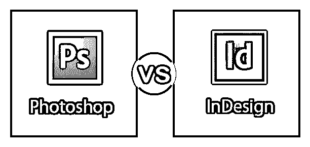

# Photoshop vs InDesign

> 原文：<https://www.educba.com/photoshop-vs-indesign/>

## Photoshop 和 InDesign 的区别

Photoshop，也就是通常所说的 Adobe Photoshop，是一种用于编辑和创建可定制图形输入的软件，使用 3D 软件如 [Maya 或 3D Max](https://www.educba.com/maya-vs-3ds-max/) 对 3D 模型进行纹理处理，编辑照片，为平面媒体和网络媒体创建传单、横幅和图像。Photoshop 也称为光栅图像编辑器，可以保存为 JPEG、PNG、GIF 和 TIFF 等文件格式。它已经被公认为一个行业标准的图像渲染软件。Adobe InDesign 是 Adobe Systems 为各种商业活动的排版和出版制作的软件应用程序。InDesign 以前被认为是 Creative Suite 的一部分。对于艺术家来说，有很多很好的用途，比如海报、传单、小册子、杂志、报纸、演示文稿、电子书。

### Adobe Photoshop 中

Adobe Photoshop 在蒙版、alpha 合成和调整其他颜色模式(如 RGB、CMYK、CIELAB、专色和双色调)时使用并支持多层输出。虽然它的用途令人惊讶，但这使 Photoshop 成为专家，并作为专门从事各方面工作的工作场所中的一种商品而更有价值。

<small>3D 动画、建模、仿真、游戏开发&其他</small>

这个程序是由托马斯和约翰·诺尔在 1988 年设计的。直到现在，托马斯和约翰·诺尔都不知道到底是谁给了“Photoshop”这个名字。在它的第一个预处理阶段，商店的字母“S”在开始时是大写的，之后，inter cap 被改变。

在 1989 年 4 月左右的那段时间里，当它在 1990 年代初正式发布时，它的开发继续考虑各种目的的建议。1990 年 2 月，Photoshop 1.0 终于发布，成为业内公认的软件的终极资源。

### Adobe InDesign

在最近的版本中，有了更多的交互式输出选项。有了它，你可以像 Kindle 一样从你的设备上生成电子书。您还可以创建布局，以便在 iPad 等平板电脑上观看，并添加视频或导出交互式 PDF 文件。与 Illustrator 之类的程序相比，InDesign 也非常类似于一个基于矢量的程序，尽管 InDesign 拥有自己的优势，即它能够处理多个打印并生成母版打印。

InDesign 被网络艺术家、平面设计师、出版商和营销专业人士广泛用于商业作品。它可以单独使用，也可以作为 Adobe Creative Cloud 的一部分使用。您也可以使用 InDesign 中的可用工具创建简单的矢量插图。它的第一个版本发布于 1999 年 8 月 31 日，在此之前很久就开始开发了。它与另一家名为 Aldus 的公司有关联，该公司总部设在西雅图，开发了桌面出版软件。

如此等等，Aldus 开发了一些图形和桌面出版程序，这些程序运行早期版本的 Windows 和 Mac 操作系统，包括 Superpaint 和 PageMaker 等应用程序。Aldus 在 1985 年 7 月发布了 PageMaker 的第一个版本。并因其早期的桌面出版应用而闻名。

### Photoshop 和 InDesign 之间的直接比较(信息图表)

以下是 Photoshop 和 InDesign 之间的 9 大区别:

### Photoshop 和 InDesign 之间的主要区别

两者都是市场上的热门选择；让我们讨论一些主要的区别:

*   使用 Adobe Photoshop，在应用时用于设计的效果是其最佳效果，以后打开后可以再次查看。按照线，其层的深度和复杂性使用混合模式和调整面具是容易和用户友好的。
*   虽然在 Adobe Indesign 中使用它来应用各种印刷效果可能是一个明智的选择，但它也有助于在整个作品中保持这些效果的一致性。
*   Photoshop 是设计的最佳用途，它被称为基于光栅的项目软件，这意味着它在像素到像素的水平上工作，没有任何妥协，同时被大公司或工作室用于大预算电影或电视节目的大量工作。使用它构建的图像很容易像素化，但在某些条件和环境下可以避免。
*   Indesign 是为其大多数基于矢量的项目而设计的，这些项目可以用线条和曲线构建图像，这些线条和曲线可以放大或缩小到任何大小(例如，徽标)。

### Photoshop 与 InDesign 比较表

下面是最上面的比较:

| **Photoshop** | **InDesign** |
| Adobe Photoshop 是为用户编辑、绘制和创建行业标准光栅图形的软件。 | Adobe InDesign 是一种用于各种排版和出版各种商业活动的软件。 |
| Adobe Photoshop，一旦它被导入其中，就被转换成路径或假的矢量文件，但最终输出仍然是像素化的。 | Adobe InDesign 在导入时支持所有矢量文件。艾和。EPS 文件及其矢量数据编码。 |
| Adobe Photoshop 支持 XML(可扩展标记语言)。 | Adobe Indesign 不支持 XML(可扩展标记语言)。 |
| Adobe Photoshop 将它指定的对象或设计保存在文档中。 | Adobe Indesign 从存储中的不同位置链接其设计对象或选项。 |
| 它的过滤效果可以在 Adobe Photoshop 中使用并很好地调整。 | 它的过滤效果在 Adobe InDesign 中受到限制。 |
| Adobe Photoshop 可以在 Windows 和 OS X 这两种系统中运行。 | 与 Photoshop 类似，Adobe InDesign 可以在 Windows 和 macOS 等系统中运行。 |
| Adobe InDesign 不创建页面布局。 | Adobe InDesign 创建页面布局。 |
| Adobe Photoshop 发布于 1990 年。 | Adobe InDesign 发布于 1999 年。 |
| Adobe Photoshop 有 26 种不同的语言版本。 | Adobe InDesign 有 24 种不同的语言版本。 |

### 结论

最后，我们可以从所有这些中学到的是，面向所有用户的 Photoshop 在最大限度地利用图层方面远胜于充分利用 InDesign。考虑到 Photoshop 的图层面板比 InDesign 的图层面板在所有艺术家的每个工作流程中都更有成效，这一点从未发生变化。Photoshop 和 InDesign 软件都有各自的优点和缺点，Photoshop 是为最终输出创建打印设计的非常有用的工具。

### 推荐文章

这是 Photoshop 和 InDesign 之间最大区别的指南。在这里，我们还将讨论 Photoshop 和 InDesign 在信息图表和比较表格方面的主要差异。您也可以看看以下文章，了解更多信息–

1.  [Photoshop vs Photoshop Elements](https://www.educba.com/photoshop-vs-photoshop-elements/)
2.  [InDesign vs QuarkXPress](https://www.educba.com/quarkxpress-vs-indesign/)
3.  [Adobe Photoshop 与 CorelDraw](https://www.educba.com/adobe-photoshop-vs-coreldraw/)
4.  [QuarkXPress vs InDesign](https://www.educba.com/quarkxpress-vs-indesign/)

