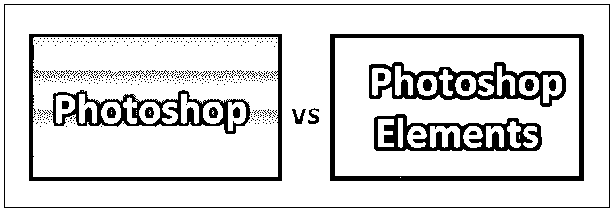
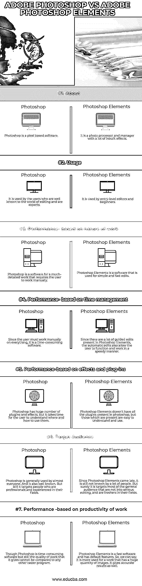

# Photoshop vs Photoshop Elements

> 原文：<https://www.educba.com/photoshop-vs-photoshop-elements/>

## Photoshop 和 Photoshop Elements 的区别

Adobe photoshop elements 是一款初学者软件，面向首次摄影、创意编辑和非专业人士。允许用户编辑、组织、创建和共享照片的简单软件。通过根据日期、时间、智能标签和位置来组织文件夹，可以很容易地使用软件来跟踪数千个文件夹。基本上，一个人可以使用这个程序，因为它有自动化和渐进的编辑，花更多的时间在创造性上，而不是手动做所有的事情。Adobe Photoshop 是一款专业软件，具有复杂的编辑和高级功能。这么说可能没有错；这是一个非常耗时的软件，编辑量很大，对于初级编辑来说很难使用。Photoshop 更像是一个高级软件，因为它是由美国兄弟在 1988 年推出的；托马斯和约翰·诺尔。迄今为止，它已经得到了巨大的更新，已经变得庞大，是所有复杂照片编辑的媒介。

### Photoshop 和 Photoshop Elements 的直接对比(信息图)

以下是 Photoshop 和 Photoshop Elements 的 7 大区别:

<small>3D 动画、建模、仿真、游戏开发&其他</small>

### Photoshop 和 Photoshop Elements 之间的主要区别

两者都是企业中推荐的选项。让我们检查一些关键的区别:

*   Photoshop Elements 通常是为简单的照片编辑设计的，适合非专业人士和快速编辑，而 Photoshop 相比之下有点难，也是专业人士使用的软件。
*   Photoshop Elements 是一个内置的组织者，可以根据日期、人物、主题等不同参数对照片进行排序。自动管理功能帮助用户找到不同属性的照片，如智能标记、标签等。尽管 Photoshop 没有管理器，但它使用 Adobe Bridge 来管理许多照片。
*   Photoshop Elements 无法导出 CMYK 格式的文件，因此缺少印刷制作工作。它也是一个简单的色彩管理程序，不能用于打印目的。而 photoshop 可以保存 CMYK 和 RGB 颜色模式的文件，并有详细的颜色管理理论。
*   Photoshop Elements 具有各种各样的集成编辑功能，可以帮助用户只需一次点击即可编辑图像的背景，并且只需一次点击即可实现叠加效果、创建双重曝光、照片绘画、照片的多种效果、照片到文本的转换、全景图、团体照等等。而使用 Photoshop，一切都必须手动完成。
*   Photoshop 是 Photoshop Elements 的前身，由于 Photoshop 出现的比较早，所以在人们当中还是比较有知名度的。此外，Photoshop 让用户在图像的最小细节上工作，直到一个工业像素。而 Photoshop Elements 基本上用于一组或一个工业图像。
*   Photoshop Elements 对初学者来说是一个优势，因为它拥有一个没有任何编辑知识的人想要在软件中拥有的一切。Photoshop Elements 的一些重要功能包括相机抖动消除、微调滤镜、裁剪建议、红眼消除等。虽然 photoshop 也加载了很多效果，但对于初学者来说，理解这些功能需要时间。
*   Photoshop Elements 中不包括的一些功能有动作、高级文本格式、钢笔工具、高级颜色管理、镜头模糊滤镜、智能对象等等。
*   Photoshop Elements 允许用户精确地编辑照片，并且比 Photoshop 更快。例如，它允许用户从一张照片中复制睁开的眼睛，并将其合并到有人眨眼的照片中。用户也可以在 photoshop 中实现这些效果，但是需要手动操作。
*   Photoshop Elements 允许用户将编辑和放大的图像直接分享到社交媒体，如日历、拼贴画、幻灯片等。，而 photoshop 没有这个直接分享的功能；相反，它使用 Adobe bridge。

### Photoshop 与 Photoshop Elements 比较表

让我们看看顶部的对比——

| **比较的基础** | **Photoshop** | **Photoshop 元素** |
| **关于** | Photoshop 是基于像素的软件。 | 这是一个照片处理器和管理器，有很多内置的效果。 |
| **用途** | 它由编辑界众所周知的专家用户使用。 | 供入门级编辑和初学者使用。 |
| **绩效-基于工作性质。** | Photoshop 是一款需要用户手工操作的软件，用于处理非常复杂的工作。 | Photoshop Elements 是用于简单快速编辑的软件。 |
| **绩效——基于时间管理。** | 由于用户必须手动操作一切，这是一个耗时的软件。 | 由于 Photoshop Elements 中有许多引导式编辑，自动编辑还允许用户以快速的方式工作。 |
| **性能-基于效果和插件** | Photoshop 有大量的插件和效果，但用户需要时间来理解在哪里以及如何使用它们。 | Photoshop Elements 没有 Photoshop 中的所有插件，但这些插件很容易理解和使用。 |
| **目标受众** | Photoshop 一般几乎人人都会用。这也是众所周知的。但是，它的目标人群是专业人士和在各自领域有经验的人。 | 由于 Photoshop Elements 的出现较晚，它仍然不为很多人所知。但可以肯定的是，它的目标是大多数普通观众，他们对严肃的编辑不感兴趣，并且是他们领域的新手。 |
| **绩效——基于工作的生产率** | 虽然 Photoshop 是一款耗时的软件，但它所提供的工作质量仍然无法与任何其他光栅程序相比。 | Photoshop Elements 是一款快速软件，具有默认功能。因此，我们可以说它更多地用于有大量图像的工作。它也能给出准确的结果。 |

### 结论

Photoshop vs Photoshop Elements 都是赢家，它的使用取决于作品的数量和质量。Photoshop 可能是 Photoshop Elements 的老大哥，但 Photoshop Elements 并不亚于它的前辈。重要的是使用软件的受众和他们使用的工作类型。

目前，我们的 photoshop 有很多 Photoshop Elements 中没有的效果，而 Photoshop Elements 也包含一些 Photoshop 中没有的照片自动组织。

所以，我们可以说，两者都以不同的工作性质针对不同的受众，Photoshop vs Photoshop Elements 本身都是专家。

### 推荐文章

这是 Photoshop 和 Photoshop Elements 之间最大区别的指南。在这里，我们还将讨论信息图和比较表的主要区别。您也可以看看以下文章，了解更多信息–

1.  [QuarkXPress vs InDesign](https://www.educba.com/quarkxpress-vs-indesign/)
2.  [索尼维加斯专业版 vs Adobe Premiere](https://www.educba.com/sony-vegas-pro-vs-adobe-premiere/)
3.  [Adobe Photoshop vs GIMP](https://www.educba.com/adobe-photoshop-vs-gimp/)
4.  [Adobe Illustrator vs Adobe Photoshop](https://www.educba.com/adobe-illustrator-vs-adobe-photoshop/)

