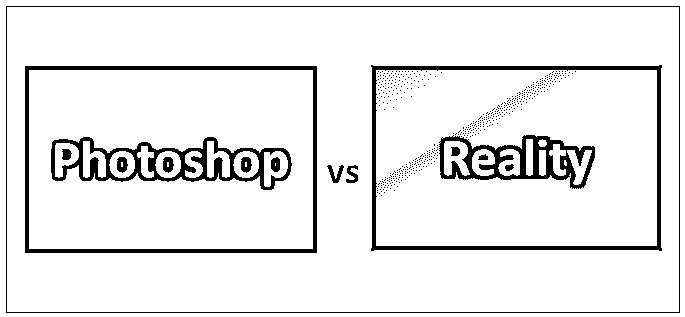
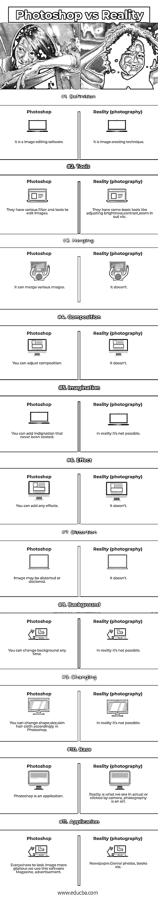
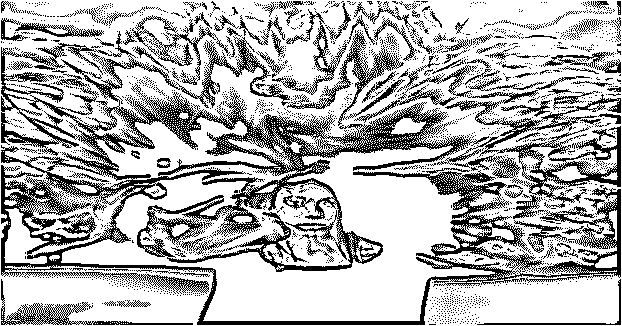
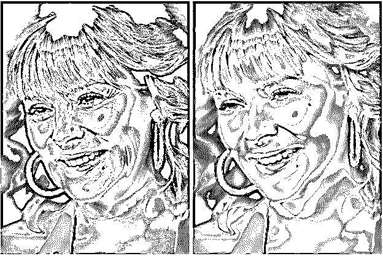

# Photoshop vs 现实

> 原文：<https://www.educba.com/photoshop-vs-reality/>

## Photoshop 和现实的区别

Photoshop 基本上是用于编辑和操作图形、照片编辑、图像编辑等的软件。Adobe Photoshop 实际上是一个光栅图形编辑器，可以处理像素和矢量图形。它可以在支持透明和可用作遮罩的多个图层中编辑光栅图像。在现实中，当我们点击一张图片时，我们得到的是一个有着实际身材、形状大小、风景、背景的图像；一切都是真实的，例如，任何摄影师点击报纸上的图像，他们都可以调整相机位置，固定镜头，放大和缩小，给人摆好姿势，调整亮度和对比度，但只能达到一定的限度。

### 使用计算机软件对…进行处理

美国人在 1987 年开发了 Photoshop 软件；后来，他们在 1988 年将许可证卖给了 Adobe。这个软件的第一个官方版本 Photoshop 1.0 于 1990 年发布。

<small>3D 动画、建模、仿真、游戏开发&其他</small>

现在，Adobe Photoshop 成了图像编辑的同义词。它们支持 alpha 和各种颜色模型。它能够编辑或渲染文本、3D 图形、矢量图形和视频。该软件支持操作系统 Mac OS、Windows 和 Linux。Photoshop 支持 26 种语言。Photoshop 许可证可租赁使用。Creative Cloud 提供 creative cloud (cc)下的各种相关软件，如 Adobe Image Ready、Adobe Fireworks、Adobe Bridge、Adobe Device Central 和 Adobe Camera Raw。

Adobe 还计划在 2019 年推出适用于 iPad 的完整版 Photoshop。

除了 Photoshop，Adobe 还推出了各种支持工具，如 Photoshop Element、Photoshop Lightroom、Photoshop Express、Photoshop Fix、Photoshop Sketch 和 Photoshop mix。

该软件主要由专业人士使用，如摄影师、图像编辑、图形设计师、网页设计师、3D 艺术家等。

#### Photoshop 的主要应用。

照片编辑，如固定颜色，添加效果，控制噪音，饱和度，固定亮度对比度和润色照片。为政治和社交媒体创建高质量的图形、海报、横幅、图案和纹理设计，设计引用图像、徽标设计和品牌，纠正图片错误、轻变形形状，创建电影海报、书籍封面和许多其他内容。

Photoshop 文件另存为。私营部门司和。PSB 扩展格式，PSD 代表 Photoshop 文档。PSD 文件的高度和宽度限制为 300，000 像素，长度为 4 EB。这种文件格式可以导出到任何其他 Adobe 软件包中。

Photoshop 功能可以通过添加一些 Adobe 插件或第三方插件来扩展，提供额外的效果。插件是 Photoshop 的催化剂。

这是 Adobe 开发的一些插件。

过滤器插件、导入插件、导出插件、文件格式插件、自动化插件、选择插件和解析器插件。Adobe camera raw 是 Adobe 免费提供的插件。最流行的插件是滤镜插件，可以在 Photoshop 的滤镜菜单下找到。

许多流行的公司也开发了插件。

颜色校正，

特效，

3D 效果插件，

Photoshop 版本

最初，Photoshop 推出了从 0.07、0.63、0.87、1.0 到 7.0 的数字版本，到 2002 年这个系列结束。后来，他们推出了 CS 格式的版本，从 CS1 (8.0)到 CS6 (13.0)开始，到 2012 年结束。CS 代表创意套房。

之后，adobe 以 CC 格式发布，从 CC (14.0)开始到 2018 年 CC (19.0)。CC 代表创意云。该软件的最新版本是 2018 年 10 月推出的 CC (20.0)。

### 现实

我们总是在流行杂志上寻找模特、歌手、女演员、演员、运动员和政治家各种各样的个性和场景，那么我们对这些有什么看法呢？

有各种各样的问题浮现在脑海里。

多酷？

多可爱？

多么惊人的性格？

多可爱的照片啊？

什么美女？

都是真的吗？?

“不”

这些都不是真的，都是 PS 的。

摄影师更多关注的是画面，但与此同时，如果摄影师为了婚礼或造型的目的拍摄一张照片，那么他会试图通过相机中可用的可能工具来增加一些额外的努力。也许他尝试了更大功率的镜头，也许他调整了亮度和对比度或点击不同的姿势，但这是否足以获得更好的照片呢？如果我们在任何软件上 PS 这些图片，这些图像会更好。通常在所有的智能手机中，我们都有软件或应用程序来改善我们的图片质量，编辑照片，改变背景，以及许多其他事情。因此，我们通过普通相机点击的是一张真实的照片，而通过 Photoshop 软件得到的是一张经过 PS 处理的照片。

### Photoshop 和现实的直接对比(信息图)

以下是 Photoshop 和 Reality 之间的 11 大区别:

### Photoshop 和现实之间的主要区别

两者都是市场上的热门选择；让我们讨论一些主要差异:

#### Adobe Photoshop 中

Adobe Photoshop 是最广泛用于图像编辑的软件。

Photoshop 有许多滤镜，如亮度、对比度、便于蒙版的框架工具等。

多次撤消

可用性改进

实时混合模式预览

对称模式

色轮

主屏幕

内容感知型填充重新设计并满足客户需求

用户界面大小首选项

更好地作为经验输出

翻转文档视图

#### 现实

摄影是一门借助一些技术和应用捕捉瞬间的艺术。

通常，用于摄影的照相机设备使用透镜在定时曝光期间将从物体反射或限制的光聚焦到照相机内部的光敏表面上的真实物体中。

你可以根据视角旋转相机。

你可以根据你的目的安装镜片

你设置了灯。

你可以调整亮度，对比度。

你可以调整姿势。  

你觉得这幅画怎么样？

是真的还是 PS 的？

当然是 PS 过的；现实中，这是不可能的。

假设一个摄影师改变了照片的构图。你可以通过仔细观察光线的误差来发现这些变化。

 

**现实****Photoshop**

是的，这是好莱坞著名女演员金·凯特罗尔。

你可以很容易地区分真实的和照片希望的。你可以在现实中观察到脸上的皱纹，但在 PS 过的图像中观察不到。

在 Photoshop 中，各种滤镜和工具可以让任何模特和女演员变得更年轻、更美丽。

有一些方法可以检测出 PS 过的图像。

外观检验

灯光和阴影

噪声颗粒

弯曲表面

通过网络应用和谷歌搜索

### 对比表格 Photoshop vs Reality

下面是最上面的比较:

| **比较的基础** | **Photoshop** | **现实(摄影)** |
| **定义** | 这是一个图像编辑软件 | 这是一种图像创造技术 |
| **工具** | 他们有各种过滤器和工具来编辑图像 | 他们有一些基本的工具，如调节亮度、对比度、放大缩小等 |
| **合并** | 它可以合并各种图像 | 它没有 |
| **构图** | 你可以调整构图 | 它没有 |
| **想象力** | 你可以加上从未有过的愤怒 | 事实上，这是不可能的 |
| **效果** | 你可以添加任何效果 | 它没有 |
| **扭曲** | 图像可能被扭曲或篡改 | 它没有 |
| **背景** | 您可以随时更改背景 | 事实上，这是不可能的 |
| **改变** | 您可以在 Photoshop 中相应地更改形状、大小、皮肤和头发布料 | 事实上，这是不可能的 |
| **基地** | Photoshop 是一个应用程序 | 现实是我们在实际中看到的或被相机点击的东西；摄影是一门艺术。 |
| **应用** | 为了让形象更光彩，我们到处使用这个软件杂志、广告。 | 报纸、普通照片、书籍等 |

### 结论

其实你分不清 Photoshop vs reality(摄影)；它们是一个连续的过程。我们只是添加一些想象力，应用一些滤镜，通过 Photoshop 中可用的各种工具调整图片。在摄影与现实中，Photoshop 可以用于许多不同的事情，从基本的照片编辑到数字艺术的创作，而现实(摄影)允许你增强现实(真实的图片)

我们通过摄影获得真实的图像，并通过在 Adobe Photoshop 中应用滤镜来进行精彩、有趣和迷人的冒险。

### 推荐文章

这是 Photoshop 和现实之间最大差异的指南。在这里，我们还将讨论信息图和比较表的主要区别。你也可以看看下面的文章来了解更多。

1.  [Photoshop vs 亲和照](https://www.educba.com/photoshop-vs-affinity-photo/)
2.  [ZBrush vs Maya–最大差异](https://www.educba.com/maya-vs-zbrush/)
3.  [Photoshop vs Photoshop Elements](https://www.educba.com/photoshop-vs-photoshop-elements/)
4.  [Photoshop vs Illustrator](https://www.educba.com/photoshop-vs-illustrator/)

