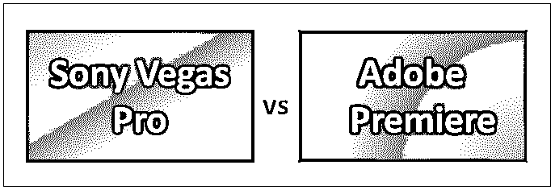
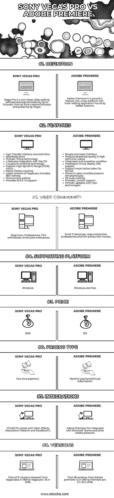

# 索尼维加斯专业版 vs Adobe Premiere

> 原文：<https://www.educba.com/sony-vegas-pro-vs-adobe-premiere/>

## 索尼维加斯专业版和 Adobe Premiere 的区别

视频技术是记录、存储和播放动态图像的电子媒体。从 1951 年第一台录像机拍摄现场图像开始，视频技术建立到广泛的领域。在这个领域已经引入了许多技术，使得视频捕捉变得容易，任何人都可以用手中的小设备来完成。视频编辑是在捕获视频后对其进行编辑的过程。视频编辑包括各种应用，如添加特殊效果和音频，重新安排视频片段，提高视频质量等。

在这一部分，我们将根据不同的因素比较两个最受欢迎的视频编辑软件，索尼 Vegas Pro 与 Adobe premiere。在我们进行比较之前，让我们对 Sony Vegas Pro 和 Adobe premiere 软件包有一个基本的了解。

<small>3D 动画、建模、仿真、游戏开发&其他</small>

Vegas Pro 是一个视频编辑软件包，由 Sonic Foundry 创建，然后由 Sony Creative Software 创建，现在由 Magix 创建。这是一个非线性视频编辑(NLE)软件。在这种方法中，当未编辑的视频文件被传送到计算机硬盘时，可以独立于其线性顺序对其进行编辑，而无需考虑中间场景的空间。Vegas pro 适合在几乎所有标准 windows 电脑上运行，适用于各种硬件。此外，它的入门级成本软件具有一些良好的编辑功能和某些附加功能，可以提高性能。由于它是相对便宜的软件，许多人，包括初学者到专业人士，都在使用它。

Adobe Premiere 是 Adobe Systems 最早发现的非线性视频编辑软件之一。目前，它被称为 premiere pro，是 adobe premiere 的重新设计的继任者。它于 1991 年首次推出，可在 Mac 平台上使用。从第一个版本开始，到目前为止已经出版了 28 个版本。Premiere Pro CC 2019 是 2018 年 10 月 15 日发布的最新版本。Adobe premiere 提供了比任何其他软件都好的视频编辑功能和质量。

### 索尼 Vegas Pro 和 Adobe Premiere 的正面对比(信息图)

以下是索尼维加斯专业版与 Adobe Premiere 之间的 8 大差异

### Sony Vegas Pro 和 Adobe Premiere 之间的主要区别

两者都是企业中推荐的选项。让我们检查一些关键的区别:

*   与 Adobe Premiere 相比，Sony Vegas Pro 是一款更加用户友好和简单的工具。Premiere 的工作流程比 Vegas pro 更专业。Adobe premiere 建议使用 adobe creative cloud 中可用的更多支持工具来获得更好的性能。同时 Vegas pro 不推荐这类附加软件，而且都是一个包。
*   索尼 Vegas Pro 与 Adobe Premiere 软件的另一个重要区别是它们支持的平台。索尼 Vegas Pro 设计为仅在 Windows 操作系统中执行，而 Adobe premiere 支持 Windows 和 Mac 操作系统。
*   用户可以以 199 美元的价格购买 Vegas pro，并且它仅作为一次性结算提供。Adobe Premiere 每月收费 19 美元，并提供年度订阅。
*   这两者之间的其他重要区别是用户界面的复杂性。与 Vegas pro 的界面相比，Adobe Premiere 更复杂，也不是用户友好的。
*   有许多著名的电影是用 Adobe premiere 制作的，但没有一部是用 Sony Vegas Pro 制作的。这显示了 Adobe premiere 对 Vegas pro 的专业影响。
*   当我们看一下规格，我们找不到任何区别，但 Premiere 有更先进的音频和效果模块。不过索尼 Vegas Pro 的工作流程更简单，对于新手来说会是更好的选择。
*   与 Vegas pro 相比，Adobe Premiere 可以支持两倍的格式数量，premier 具有实时播放选项，可以节省大量时间并减少工作量。

### 索尼维加斯专业版与 Adobe Premiere 对比表

让我们看看顶部的对比——

| **比较的基础** | **索尼维加斯专业版** | **Adobe Premiere** |
| **定义** | Vegas Pro 是一个非线性视频编辑软件包，由 Sonic Foundry 创建，然后由 Sony Creative Software 创建，现在由 Magix 创建。 | Adobe Premiere 是 Adobe Systems 开发的一款功能强大、功能丰富的跨平台非线性编辑应用程序。 |
| **特性** | 用户友好的界面和工作流程。
·实惠的价格
·ProType Titling technology
·可与 24p DV 集成
·支持脚本技术
·支持高动态范围(HDR)色彩。
允许运动跟踪
最新版本的 Vegas pro 包含 360°编辑。
·多摄像机编辑
·提供 ACES 1.0 支持。 | 简单干净的界面
制作广播质量&高清视频
集成且更流畅的工作流程
令人印象深刻的虚拟现实(VR)支持
支持更多原生视频文件格式
允许同时打开多个项目。
·VR 音频编辑
·提供 Lumetri 支持
·利用新技术定期更新。 |
| **用户社区** | 初学者，专业人士，电影爱好者，小型企业。 | 小企业，大企业，专业人士和电影制作公司。 |
| **支撑平台** | Windows 操作系统 | Windows 和 Mac |
| **价格** | $199 | $19 |
| **定价类型** | 一次性付款 | 月供/年费 |
| **集成** | VEGAS Pro 与 Open Effects Association Platform 和 NewBlueFX 一起工作。 | Adobe Premiere Pro 与微软团队和其他 Adobe 产品集成。 |
| **版本** | 共发布了 21 个版本，从 1999 年的 Vegas beta 到 2018 年的 Vegas Pro -16 | 总共 28 个版本，从 1991 年的 Adobe premiere 1.0 到 2018 年的 Premiere Pro-CC-19 |

### 结论

最后，当我们总结时，我们得到了两个视频编辑程序。在一端，我们有 Sony Vegas，这是一个本能的软件包，可以帮助您快速、轻松地完成工作。另一方面，我们有 Adobe Premiere，这是一个更专业的软件包，借助外部软件的附加功能，为您提供更多编辑自由。

我们可以说，索尼维加斯专业版和 Adobe Premiere 软件各有所长。索尼维加斯专业版和 Adobe Premiere 都表现良好，并为最终用户提供了完全的满意度。虽然 Sony Vegas pro 以一种方式处理所有事情，但 Adobe premiere 可以通过与 Photoshop 或 Adobe 系列 After effects 等其他软件的集成更进一步。

由于每个应用程序和用户的特性和用法都不同，因此很难断言哪一个更好。当我们总结时，不是关于哪个软件是最好的，而是哪个软件最适合你。

### 推荐文章

这是索尼维加斯专业版与 Adobe Premiere 之间最大差异的指南。在这里，我们还将讨论信息图和比较表的主要区别。您也可以看看以下文章，了解更多信息–

1.  [Adobe Illustrator vs Adobe Photoshop](https://www.educba.com/adobe-illustrator-vs-adobe-photoshop/)
2.  [Adobe Photoshop vs GIMP](https://www.educba.com/adobe-photoshop-vs-gimp/)
3.  [QuarkXPress Vs InDesign](https://www.educba.com/quarkxpress-vs-indesign/)
4.  [Photoshop 和亲和照片](https://www.educba.com/photoshop-vs-affinity-photo/)

