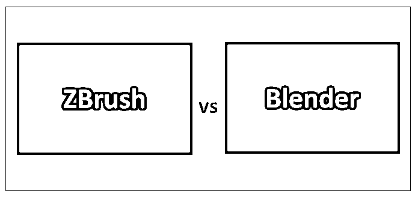
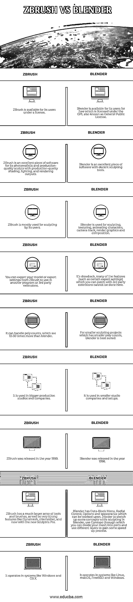

# ZBrush vs Blender

> 原文：<https://www.educba.com/zbrush-vs-blender/>

## ZBrush 和 Blender 的区别

[ZBrush 是](https://www.educba.com/what-is-zbrush/)也被称为数字雕塑家，用于 3D 建模/ 3D 打印、纹理和绘画。它还具有 2.5D 的造型能力。它是最常用和最有效的软件，用于大片、视频游戏、美术和收藏品中的视觉效果，这些都是当今的突出产品，如漫威和 DC 收藏品，这在许多粉丝中非常流行。blender 是一种工具，也称为 3D 打包工具集的开源工具，用于建模、雕刻、纹理、动画、相机跟踪甚至渲染文件以进行合成。它已经成为电影、电视、3D 游戏、3D 打印等的一部分。

### 布鲁什

它的 Gizmo 3D 提供了更好的方法来分析各种选项，如移动、旋转和缩放，以建模形状，同时使用 ZModeler 笔刷，这使您可以自由地进行多边形建模，包括低分辨率建模。

<small>3D 动画、建模、仿真、游戏开发&其他</small>

Pixologic，Inc .最近改进了它，此后它在 1999 年首次出现，从而在 2009 年在 Win 和 Mac 上发布。ZBrush 可以以自己的方式开发高端 3D 模型，这些模型可以定义超过 4000 万个多边形，结合其在电影、电视节目、动画和游戏中的最佳用途。

### 搅拌机

它是在 1995 年由 Ton Roosendaal 提出的，作为荷兰动画工作室 NeoGeo 的原始软件，因为它被卖给了其他工作室公司。Ton Roosendaal 在一些投资者的帮助下抓住了一个机会，并被说服将 Blender 转换为 GPL，也称为通用公共许可证，从而筹集了 10 万欧元。

Ton Roosendaal 开始了建立“免费搅拌机”运动的想法，并一直免费至今。也就是说，由于社区的慷慨捐助，它一直在开发各种功能。Blender 现在是一个免费的、完全开源的软件，由社区在一个完整的帐户上开发，包括两个全职和两个兼职员工。它的发行日期是 1998 年 1 月。

### ZBrush 和 Blender 的正面比较(信息图)

以下是 ZBrush 与 Blender 的 9 大区别:

### ZBrush 和 Blender 的主要区别

两者都是市场上的热门选择；让我们来讨论一些显著的区别:

*   当我们使用 Blender 时，ZBrush 中提供的多语言系统给你提供了用户定制语言的优势，Blender 是嵌入在 Python3 中的语言，它可以编写附加组件，操纵建模的角色来同时激活它们，等等。
*   ZBrush 是各种公司的一部分，并在大规模的工作室制作，以获得更好的效果，如照片级和生产质量的雕塑。与 ZBrush 相比，Blender 处理高质量 3D 渲染和生产质量雕塑的方式没有那么好。
*   ZBrush 与 Blender 之间的一些等效设置和击键，例如，

1.  在 Zbrush 中，您有 Z 强度(U)，而在 Blender 中，您有强度(Shift+F)。
2.  在 Zbrush 中，您有绘制大小(S)，而在 Blender 中，您有半径(F)。
3.  在 Zbrush 中，你有矩形遮罩(Ctrl+LMB)，而在 Blender 中，你也有方框遮罩(B)。

*   ZBrush 在为更大的工作室制作更高端和更好的输出方面起着重要的作用。Blender 在制作短片、电视剧、视频和广告的小型工作室和设置中发挥着重要作用。
*   使用 ZBrush，我们有一些很好的功能，允许你在建模结构中工作时保持与它的连接，例如，使用曲线模式的笔刷。在 Blender 中，我们也有一些功能，如曲线和数组修改器，但有时当你通过它工作时，结果和工作流程会变慢。
*   与各种 3D 软件包相比，自 ZBrush 成立以来，它一直得到其母公司或社区的支持。在 Blender 的类似案例中，一直有一个庞大的社区在入门过程中提供协助。

### ZBrush 与 Blender 对比表

我们来看顶部对比:

| **ZBrush** | **搅拌机** |
| ZBrush 的用户可以通过许可证获得。 | Blender 免费提供给它的用户，这是根据 GPL 许可的，也称为通用公共许可证。 |
| ZBrush 是一款优秀的软件，它具有照片级的真实感和产品级的雕刻效果，并具有产品级的着色、照明和渲染输出。 | Blender 是一款优秀的软件，配有像样的雕刻工具。 |
| ZBrush 主要用于用户雕刻。 | Blender 用于雕刻，纹理，动画人物，摄像机跟踪，渲染图形和合成。 |
| 您可以从 ZBrush 导出您的模型或导出设置，以便在另一个程序或第三方扩展中使用。 | 这是一个缺点；许多可以用第三方扩展修补的功能(如某些导出设置)在这里无法实现。 |
| 它可以处理比搅拌机多 10-50 倍的聚粒数。 | 对于较小的雕刻项目，有较小的聚计数，搅拌机是最适合的。 |
| 它用于更大的制作工作室和公司。 | 它用于较小的工作室公司和设置。 |
| ZBrush 于 1999 年发行。 | Blender 于 1998 年发布。 |
| ZBrush 有更多的工具和画笔，以及非常强大的功能，如 Dynamesh，zRemesher，现在还有新的 Sculptris Pro。 | 搅拌机有数据块菜单，径向控制，选项和外观，可以工作。为了在 Blender 中雕刻时勾画出一些概念，使用 Dyntopo，通过它你可以将你的网格分成几个部分，并使用不同的层来获得一些加速过程。 |
| 它可以在 Windows 和 OS X 等系统中运行。 | 它可以在 Linux、FreeBSD、macOS 和 Windows 等系统中运行。 |

### 结论

当然，这里的结论是，ZBrush 通常用于全球的主要行业，例如交付各种 3D 输出定义和支持它，已经有许多用户很喜欢它，因为他们在使用它时非常满意。搅拌机也是一样；尽管你不能比较 ZBrush 的某些属性，因为它的细节非常清晰，但它确实有能力通过选择它来保证结果。你有学生或更大的艺术家作为用户推荐它。

ZBrush 有它自己的方式，例如当我们用 ZBrush 雕刻时，它可以包含数十亿个多边形，但有一个解决方案，即他们提供的清理和减少多边形数量的工具。对于 Blender 来说，对于它的用户来说，它通常支持低多边形和高多边形建模，这在使用它时给用户提供了更好的画面和满意度。

使用 ZBrush，用户可以在雕刻对象的过程中，使用其 3D 画笔帮助定义其细节，这些细节可以定制，而在 Blender 中，它不仅为用户提供了完整的装配系统，还可以通过在关键帧位置之间添加来自动制作动画。

理解这两个软件功能的总体方式和结果是，基于艺术家或使用它的制作公司的要求，ZBrush vs Blender 都是有效和有用的。

### 推荐文章

这是 ZBrush 和 Blender 之间最大区别的指南。在这里，我们还将讨论信息图和比较表的主要区别。您也可以看看以下文章，了解更多信息–

1.  [Mudbox vs Zbrush](https://www.educba.com/mudbox-vs-zbrush/)
2.  [玛雅 vs 搅拌机](https://www.educba.com/maya-vs-blender/)
3.  [3DS Max vs Blender](https://www.educba.com/3ds-max-vs-blender/)
4.  [3D 外套和 ZBrush](https://www.educba.com/3d-coat-vs-zbrush/)

