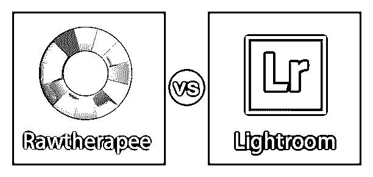
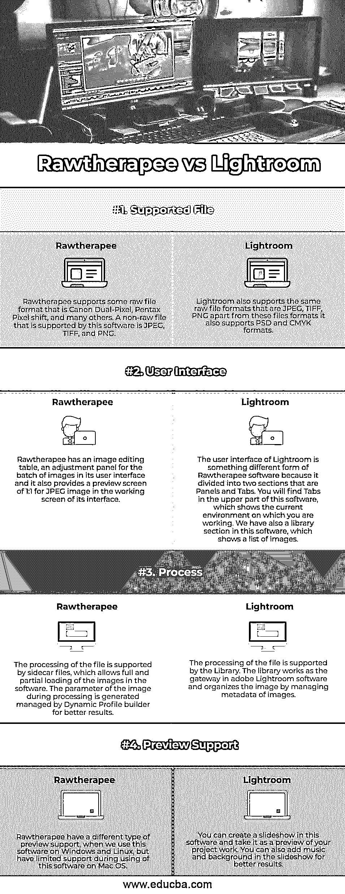

# Rawtherapee vs Lightroom

> 原文：<https://www.educba.com/rawtherapee-vs-lightroom/>

## Rawtherapee 和 Lightroom 的区别

在本文中，我们将看到 Rawtherapee 与 Lightroom 的概要。Rawtherapee 软件和 Adobe Lightroom 软件都是图像编辑软件，就像 [Adobe Photoshop 软件](https://www.educba.com/adobe-photoshop-tools/)一样，只是在某些方面有不同的特点。Rawtherapee 软件是开源程序之一，这意味着它可以免费供所有人使用，并有助于一次进行大量的图像编辑。另一方面，adobe Lightroom 软件是 adobe 系列的一部分，使用非破坏性方法进行图像编辑。本文将讨论所有的软件，例如，我们将一步步地看到软件的主要差异、软件的比较表以及关于 Rawtherapee 软件和 Lightroom 软件的其他重要术语。

### Rawtherapee 和 Lightroom 之间的直接比较(信息图)

以下是 Rawtherapee 与 Lightroom 的四大对比:

<small>3D 动画、建模、仿真、游戏开发&其他</small>

### Rawtherapee 和 Lightroom 的主要区别

让我们讨论一些主要的关键差异:

#### Rawtherapee 软件

*   Rawtherapee 是一款[图像编辑软件](https://www.educba.com/best-editing-software/)，最初由匈牙利布达佩斯的公民加博·霍瓦特开发，但后来在 2010 年 1 月作为开源程序在 GNU 通用公共许可证第 3 版下推出。最初，它被命名为“实验性原始照片编辑器”，但后来它改为“Rawtherapee”，并用 C++计算机语言编写。
*   您可以在 Windows、Linux 和 Mac OS 等不同的操作软件上运行该软件。如果你想在你的个人电脑上安装这个软件，那么只要去这个软件的官方网站[www.rawtherapee.com](https://www.rawtherapee.com/)就可以免费得到你的版本并享受它。
*   Rawtherapee 软件也有许多不同的语言版本，因此理解该软件的语言没有问题。
*   我们在这个软件中添加了一些新工具:Retinex 工具，支持打印的软打样，从曲线上拾取正确的点以获得更好的结果的曲线吸管，以及许多其他令人兴奋的功能。

#### Adobe Lightroom 软件

*   Lightroom 软件，adobe 系列软件，通过使用其激动人心的功能来组织和操作图像。它是用 C++和计算机语言 Lua 编写的，由 Adobe Systems 于 2007 年 2 月开发。
*   您可以在 Windows 7、Windows 10 及其更高版本、Mac OS 及其更高版本中安装该软件。它的上一个版本是 Lightroom Classic 软件，于 2019 年 11 月推出。你可以从 Adobe Systems 的官方网站下载这个软件是[www.adobe.com](https://www.adobe.com/)。
*   只要在你的浏览器的网址上搜索这个网站，进入这个网站的主页，然后在那里搜索这个软件。Adobe 为您提供任何一款软件的免费试用版，以便您更好地理解该软件。
*   它也有一个不同类型的工具是自动工具，帮助您将您的图像放在软件的正确区域，因为在 Lightroom 软件中没有撤消选项；放置图像后，您可以在该软件中调整黑白组合，以增加任何效果的有效性。

### Rawtherapee 与 Lightroom 对比表

让我们来看看 Rawtherapee 和 Lightroom 之间的主要比较:

| **比较的基础** | **Rawtherapee 软件** | **Lightroom 软件** |
| **支持的文件** | Rawtherapee 支持一些原始文件格式，如佳能双像素，宾得像素偏移，以及许多其他格式。该软件支持的非原始文件是 JPEG、TIFF 和 PNG。 | Lightroom 还支持相同的原始文件格式，如 JPEG、TIFF、PNG 除了这些文件格式，它还支持 PSD 和 CMYK 格式。 |
| **用户界面** | Rawtherapee 在其用户界面中有一个图像编辑表，一个用于批量图像的调整面板，并且在其界面的工作屏幕中还提供了 JPEG 图像的 1:1 预览屏幕。 | Lightroom 的用户界面与 Rawtherapee 软件有些不同，因为它分为面板和标签两部分。您会在该软件的上半部分找到选项卡，它显示您当前工作的环境。我们在这个软件中也有一个库部分，显示图像列表。 |
| **流程** | sidecar 文件支持文件的处理，允许在软件中完全和部分加载图像。处理过程中的图像参数由动态配置文件生成器生成和管理，以获得更好的结果。 | 文件的处理由库支持。该库在 adobe Lightroom 软件中充当网关，通过管理图像的元数据来组织图像。 |
| **预览支持** | 当我们在 Windows 和 Linux 上使用此软件时，Rawtherapee 有不同类型的预览支持，但在 Mac OS 上使用此软件时，支持有限。 | 您可以在此软件中创建幻灯片，并将其作为项目工作的预览。您还可以在幻灯片中添加音乐和背景，以获得更好的效果。 |

### 结论

现在，在这篇文章之后，你可以发现 Rawtherapee 软件和 Lightroom 软件之间的重要和有效的区别。一旦你从头到尾看完这篇文章，你会很容易找到适合你的图像编辑软件，通过在这个软件上练习，你可以很好地掌握它。

### 推荐文章

这是 Rawtherapee vs Lightroom 的指南。在这里，我们通过信息图和比较表来讨论 Rawtherapee 和 Lightroom 的主要区别。您也可以浏览我们的其他相关文章，了解更多信息——

1.  [Inkscape vs Illustrator |最大差异](https://www.educba.com/inkscape-vs-illustrator/)
2.  [找出 Photoshop 和 Illustrator 的区别](https://www.educba.com/photoshop-vs-illustrator/)
3.  [QuarkXPress 与 InDesign 的对比](https://www.educba.com/quarkxpress-vs-indesign/)
4.  [After Effect Vs 4D 电影院简介](https://www.educba.com/adobe-after-effect-vs-cinema-4d/)
5.  【Lightroom 软件的五大备选方案
6.  [Capture One 与 Lightroom 的区别](https://www.educba.com/capture-one-vs-lightroom/)
7.  [了解 Inkscape 与 GIMP 的 8 个不同点](https://www.educba.com/inkscape-vs-gimp/)
8.  [Camera Raw 与 Lightroom 的有用差异](https://www.educba.com/camera-raw-vs-lightroom/)
9.  [ON1 与 Lightroom 的主要差异](https://www.educba.com/on1-vs-lightroom/)
10.  [ACDSee 与 Lightroom 的区别与比较](https://www.educba.com/acdsee-vs-lightroom/)
11.  [暗台 vs Lightroom |最大差异](https://www.educba.com/darktable-vs-lightroom/)
12.  [亲和力与 Lightroom |最大差异](https://www.educba.com/affinity-vs-lightroom/)

