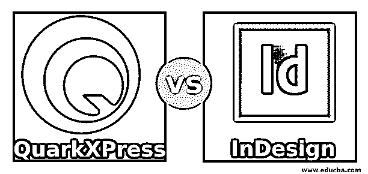
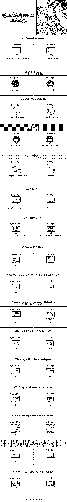

# QuarkXPress vs InDesign

> 原文：<https://www.educba.com/quarkxpress-vs-indesign/>

## QuarkXPress 和 InDesign 的区别

QuarkXPress 是 1987 年为麦金塔电脑发布的。QuarkXPress 由 Quark 拥有和开发。这是对所见即所得环境的工作。QuarkXPress 是一款桌面出版软件(DTP ),供图形设计师、营销人员和企业专业人士使用。对于不同的应用程序，例如，创建布局，制作广告等等。QuarkXPress 是多语言软件，支持除英语以外的 36 种语言。该软件可以导入各种格式的文件，如 pdf、illustrator 和 EPS 文件。在本主题中，我们将了解 QuarkXPress 与 InDesign。

#### 下面列出了 QuarkXPress 的主要应用。

在该软件的帮助下，我们可以创建和制作横幅、贴纸、broachers、杂志书籍、目录、动画书、报纸、印刷品、书籍和用户指南、财务报告、标志设计、营销广告、专业印刷品和数字输出。

<small>3D 动画、建模、仿真、游戏开发&其他</small>

QuarkXPress 2017 分为四大类。

1.  图像和矢量
2.  排版和文本
3.  客户愿望清单项目
4.  数字出版

**QuarkXPress 版本**

夸克公司推出 QuarkXPress 1，到 1987 年才支持 Mac OS。

该软件的最新版本是 2018 年 10 月推出的 QuarkXPress 14.1。其运行于 MAC OS 和 Window 操作系统并受其支持。最新版本支持电子书、网络和移动应用。

### InDesign

InDesign 软件归 Adobe system 所有，Adobe system 于 1999 年 8 月 31 日开发；InDesign 基本上是桌面出版软件(DTP ),由图形设计师、市场营销和社会专业人士用于不同的应用，例如，创建布局、组合文本和图像、设计电子书。该软件提供了一个平台来创建专业页面，这些页面可以通过印刷或在线方式发布和分发。

#### 下面列出了 Adobe InDesign 的主要应用程序。

海报、横幅、传单、小册子、杂志、报纸、演示文稿、书籍、电子书、书籍封面、明信片、贴纸、漫画等。通过这个软件，文件可以以不同的方式共享，如数字和打印格式。这个软件适用于 Mac OS 和 Windows。

InDesign 可用于与云服务中的其他应用程序结合使用。

**Adobe InDesign 版本。**

Adobe InDesign 于 1999 年 8 月推出其第一版 InDesign 1.0，旨在取代 PageMaker。2002 年，他们推出了 InDesign 2.0，这是第一个支持 Mac OS X 的版本。

后来，Adobe 于 2003 年 10 月推出了 InDesign 版本 InDesign CS。CS 格式，代表创意套件。这项服务只需一次性付款。该系列的最后一个版本是 CS6，于 2012 年 4 月推出。

Adobe 推出的最新系列是 CC，InDesign CC 于 2014 年 1 月推出，CC 代表 Creative Cloud，InDesign CC 是一种订阅基础服务，可以按月或按年购买。

订阅。它提供了一个捆绑包，包括 photoshop.illustrator 等。

Adobe 将于 2018 年 10 月推出 InDesign 软件系列的最新版本 CC 2018(14.0.0.130)

这些是使 InDesign 优于 QuarkXPress 一些功能

1.  **文本设置:-** 为本地语言提供特殊设置，如阿拉伯语
2.  **双向文本流:-** 允许从左向右书写，反之亦然
3.  **目录:-** 根据当地语言提供一套目录
4.  **索引:-** 可以根据语言写下索引
5.  **导入和导出:-** 可以导入 QuarkXPress 文件，包括 50 个以相同方式保留布局和内容的导入/导出文件
6.  **反转布局:-** 反转布局文档时，类似于文本布局的功能是可逆的
7.  **复杂的脚本渲染:-** 它们支持本地语言的 Unicode 字符编码

### QuarkXPress 和 InDesign 的直接对比(信息图表)

以下是 QuarkXPress 与 InDesign 之间的 16 大差异

### QuarkXPress 和 InDesign 的主要区别

两者都是市场上的热门选择；让我们讨论一些主要的区别:

**夸克快车**

*   图书馆
*   新的 pdf 打印引擎。
*   直接 InDesign IDML 导入。
*   优化的分辨率。
*   氙气图形功能。
*   数字预览改进。
*   HTML5 导出优化。
*   创建一个无限制的单一 android 应用程序。
*   基于 V8 的内置 JavaScript ES6+。
*   升级的字体列表。
*   更新了颜色字体支持。
*   第一种开放式控制。

**Adobe InDesign**

*   您的团队可以同时在同一个布局上工作。
*   你可以用文本、颜色、图形等创建自己的库。，并与您的团队分享。
*   从您的 pdf 导入注释和编辑。
*   每当您更改文档的大小时，您的布局都会自动调整。
*   图像会自动调整大小并适合屏幕。
*   你可以浏览不同的字体。
*   你可以设计多种颜色的字体。
*   您可以在表格中创建脚注。
*   在段落中增加间距更容易，而且你可以用同样的风格分享。

### QuarkXPress 与 InDesign 对照表

下面是最上面的比较

| **基本比较** | **夸克快车** | **InDesign** |
| **操作系统** | 经典 Mac OS、Mac OS、Microsoft Windows | Windows 和 Mac OS |
| **语言** | 使用多种语言的 | 24 语言 |
| **质量与数量** | 功能丰富的软件 | 质量丰富的软件 |
| **执照** | 终身许可证 | 订阅基本许可证 |
| **颜色** | 它支持十六进制铬色 | 它没有 |
| **页面尺寸** | 48 英寸见方(QX 6.0) | 216 平方英寸 |
| **安装** | 禁止同时安装 | 允许并行安装 |
| **导出 JDF 文件** | 是 | 不 |
| **将打印内容转换为 HTML 以便在 Dreamweaver 中使用** | 是 | 不 |
| **设计与 Dreamweaver 兼容的网页** | 是 | 不 |
| **导入 pdf 格式的 flash swf 文件** | 不 | 是 |
| **支持 illustrator 图层** | 不 | 是 |
| **从 illustrator 中拖放** | 不 | 是 |
| **Photoshop 透明度控制** | 是 | 不 |
| **类似 Photoshop 的调色板控件** | 是 | 不 |
| **控制 Photoshop 专色** | 是 | 不 |

### 结论

QuarkXPress 专注于添加更多新功能，而不是改进以前的工具和功能。一方面，Quark 专注于改进各种类型的 HTML 工具，以便您可以在单个文档中创建多种布局，但另一方面，它们的排版和布局功能没有更新。所以我们为什么称之为 QuarkXPress 是功能丰富的软件。

Adobe InDesign 不仅仅关注添加一个功能；他们也试图改进以前的功能。例如，Adobe InDesign 具有比 QuarkXPress 更强大的印刷功能，但 Adobe 所做的，在 InDesign 2.0 的新版本中也有所改进。Adobe InDesign 专注于提高性能和速度，因此 Adobe InDesign 的性能优于任何其他竞争软件。

### 推荐文章

这是 QuarkXPress 与 InDesign 之间最大差异的指南。在这里，我们还将讨论信息图和比较表的主要区别。您也可以看看以下文章，了解更多信息–

1.  [影院 4d vs 3ds Max](https://www.educba.com/cinema-4d-vs-3ds-max/)
2.  [4D 电影院 vs 搅拌机](https://www.educba.com/cinema-4d-vs-blender/)
3.  [4D 电影院 vs 玛雅](https://www.educba.com/cinema-4d-vs-maya/)
4.  [Photoshop vs InDesign](https://www.educba.com/photoshop-vs-indesign/)

