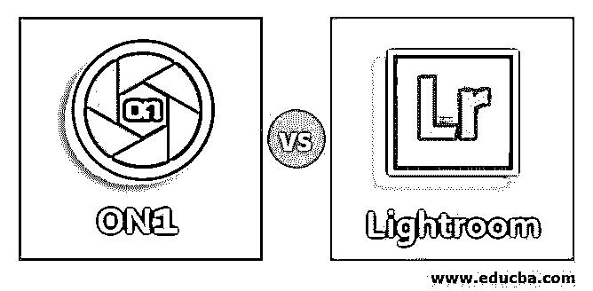
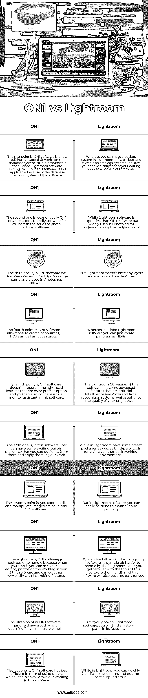

# ON1 与 Lightroom

> 原文：<https://www.educba.com/on1-vs-lightroom/>

## ON1 与 Lightroom 的区别

在本文中，我们将了解 ON1 和 Lightroom 之间的区别。这些软件用于类似的目的，即照片组织和操作工作。如果你正在寻找 Lightroom 软件的替代软件[，那么你可以选择 ON1 软件。本文将分析 ON1 软件和 Lightroom 软件的一些重要方面，如关键差异等。我们还会看到比较表，这样我们就可以将它们与软件进行比较，以增强我们对该软件的了解。一旦你看完这篇文章，你会发现哪个软件对你有好处，对你的照片处理和编辑工作有帮助。](https://www.educba.com/alternative-for-lightroom/)

On1 软件和 Lightroom 软件有很多不同之处，这使得它们彼此不同。在这里，我们会发现这个软件之间的一些主要差异。因此，让我们来了解一下主要差异:

<small>3D 动画、建模、仿真、游戏开发&其他</small>

### ON1 和 Lightroom 之间的直接比较(信息图)

以下是 ON1 与 Lightroom 之间的十大比较:

### ON1 和 Lightroom 的主要区别

让我们讨论一下 ON1 和 Lightroom 之间的一些主要区别:

#### ON1 软件

ON1 是软件，用于组织和操作照片。它基于不同类型的照片编辑原理工作，例如它基于图层系统编辑图像，使用不同类型的效果使其工作更加真实，并具有许多令人兴奋的处理照片编辑工作的功能。一旦你开始使用这个软件，你将成为使用这些功能的专家。如果您正在寻找 Lightroom 的替代品，ON1 软件将是最佳选择。我们在数字市场上有许多版本的这种软件，如 ON1 2019、ON1 2020。

#### Lightroom 软件

Lightroom 软件也是图像组织和操作软件，由不同的照片编辑专业用于他们的专业工作。它是 Adobe creative cloud 桌面应用程序的一部分，由 Adobe systems 作为其照片编辑器软件之一进行维护。这个软件最初于 2007 年 2 月发布，是用 C++和 Lua 计算机语言编写的。您可以在不同的操作系统上安装此软件，如 Windows 7、Windows 10、Mac OS 及其更高版本。你可以通过[www.adobe.com](https://www.adobe.com/)链接获得这个软件。

这些是一些主要的差异，使这个软件彼此不同，现在你已经熟悉了这个软件的基础知识。因此，现在让我们继续我们的文章，朝着下一步学习这个软件的方向前进。下一步是对照表。在比较表中，我们将包括该软件的要点，以便您可以了解该软件的特性和功能。

### ON1 与 Lightroom 的对比表

让我们看看 ON1 和 Lightroom 之间的主要比较。看完这张表后，你会对这个软件的特性有更多的了解。

| **ON1 软件** | **Adobe Lightroom 软件** |
| 第一点是，ON1 软件是在数据库系统上工作的照片编辑软件，所以它不如 Adobe Lightroom 软件通用。由于该软件的数据库工作系统，在该软件中进行备份是不适用的。 | 而你可以在 Lightroom 软件中有一个备份系统，因为它在目录系统上工作。它允许您拍摄编辑作品的快照，作为该作品的备份。 |
| 第二个是，在经济上 ON1 软件是一个成本友好的软件，为其用户在一系列的照片编辑软件。 | 虽然 Lightroom 软件比 ON1 软件贵，但被照片编辑专业人员广泛用于他们的编辑工作。 |
| 第三个是，在 ON1 软件中，我们使用图层系统进行编辑工作，就像我们在 Photoshop 软件中使用的一样。 | 但是 Lightroom 的编辑功能中没有任何图层系统。 |
| 第四点是，ON1 软件允许你创建全景，HDR 以及焦点堆栈。 | 而在 adobe Lightroom 软件中，你只能创建全景，HDR。 |
| 第五点是，ON1 软件不支持一些高级功能，如颜色配置文件选项，并且您也可以在该软件中没有双显示器助手。 | 该软件的 Lightroom CC 版本具有一些高级功能，即人工智能关键字和面部识别系统，这些功能可以提高您的项目工作质量。 |
| 第六个是，在这个软件中，用户可以有一些令人兴奋的内置预设，这样你就可以从中获得想法，并将其应用到你的工作中。 | 在 Lightroom 中，有一些预设的软件包和第三方工具，可以为您提供一个顺畅的工作环境。 |
| 第七点是，你不能在这个 ON1 软件中离线编辑和操作图像。 | 但是在 Lightroom 软件中，你可以轻松地做到这一点，没有任何问题。 |
| 第八个是，ON1 软件更容易操作，因为当你启动它时，你可以在这个软件的工作屏幕上看到所有正在编辑的照片，并且可以通过它令人兴奋的功能非常容易地编辑它们。 | 而如果我们谈论这个 Lightroom 软件，它对初学者来说有点难处理。一旦你熟悉了这个软件的工具，那么操作这个软件对你来说也将变得容易。 |
| 第九点是，ON1 软件有一个缺点是它不提供历史面板。 | 但是如果你使用 Lightroom 软件，你会在它的特性中发现一个历史面板。 |
| 最后一个是，ON1 软件在使用滑块方面效率较低，这稍微减慢了我们在这个软件中的工作。 | 在 Lightroom 中，您可以快速处理所有这些术语，并从中获得最佳输出。 |

以上是这款软件的主要对比点，让你对这款软件有个大概的了解，让你对 ON1 软件和 Lightroom 软件的重要特性有个大概的了解。

### 结论

看了这个软件后，你会发现你现在关于照片编辑软件的知识得到了增强，你可以在这两个软件之间选择最适合你的照片编辑工作的软件。一旦你开始使用你选择的软件，你的编辑工作技能将会加分。

### 推荐文章

这是 ON1 vs Lightroom 的指南。这里我们讨论信息图和比较表的主要区别。您也可以浏览我们的其他相关文章，了解更多信息——

1.  [Rawtherapee vs Lightroom |主要区别](https://www.educba.com/rawtherapee-vs-lightroom/)
2.  [Illustrator vs InDesign |最上面的比较](https://www.educba.com/illustrator-vs-indesign/)
3.  [Capture One vs Lightroom |最佳照片编辑软件](https://www.educba.com/capture-one-vs-lightroom/)
4.  【Photoshop 和 Illustrator 的区别
5.  [ACDSee 与 Lightroom |最大差异](https://www.educba.com/acdsee-vs-lightroom/)
6.  [暗台与灯箱的顶级对比](https://www.educba.com/darktable-vs-lightroom/)
7.  [Lightroom CC 与 Lightroom Classic |主要区别](https://www.educba.com/lightroom-cc-vs-lightroom-classic/)
8.  [Affinity 与 Lightroom 的比较](https://www.educba.com/affinity-vs-lightroom/)

