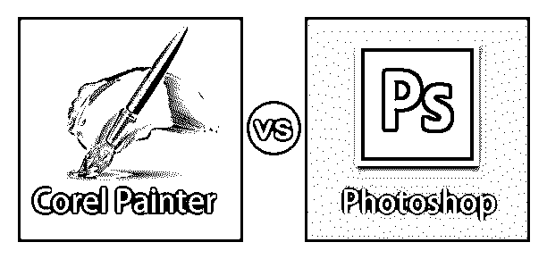
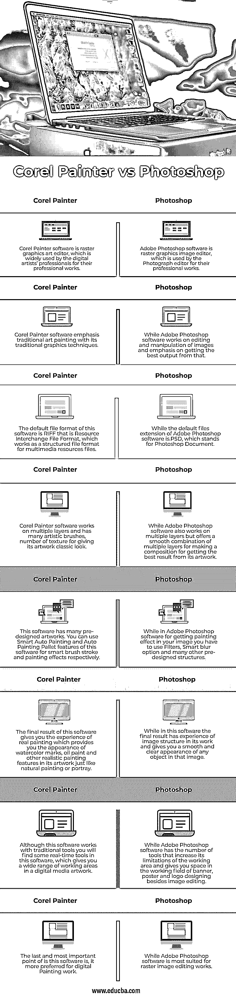

# Corel 画师 vs Photoshop

> 原文：<https://www.educba.com/corel-painter-vs-photoshop/>

## Corel Painter 和 Photoshop 的区别

Corel Painter 和 Photoshop 都是光栅图形软件，图形专业人员用来编辑他们的图形。Corel Painter 软件是用于表现不同艺术作品的传统图形以及编辑它们以用于不同目的的软件。而 Photoshop 是一款用于编辑和处理图像以获得不同类型的[图形效果](https://www.educba.com/motion-graphics-in-after-effects/)的软件。在本文中，我们将讨论该软件的一些要点，以便我们了解该软件。在我们文章的后续部分，我们将会看到一些重要的术语，它们是 [Corel Painter 软件](https://www.educba.com/corel-painter-vs-photoshop/)和 Photoshop 软件之间的主要区别，一个该软件之间的比较表，以及其他一些获取相关知识的方面。

### Corel Painter 和 Photoshop 的直接对比(信息图)

以下是 Corel Painter 与 Photoshop 之间的 8 大对比:

<small>3D 动画、建模、仿真、游戏开发&其他</small>

### Corel Painter 和 Photoshop 的主要区别

关键区别是指使这个软件彼此不同的主要方面是什么。让我们来谈谈 Corel Painter 软件和 Photoshop 软件之间的区别，这样我们就可以了解这个软件了。让我们讨论一下 Corel Painter 和 Photoshop 之间的一些主要区别。

#### Corel Painter 软件

Corel Painter 软件的原作者是 Mark Zimmer 和 Tom Hedges，但后来被 Corel Corporation 接管。该软件兼容 Mac OS 和 Microsoft Windows 等不同的操作软件。这款光栅图形软件的最新版本于 2018 年 6 月推出，命名为 Corel Painter 2019。如果你想在你的个人电脑上安装这个软件，只要去名为[www.painterartist.com](https://www.painterartist.com/en/)的网站，就可以享受这个软件为你的图形编辑作品。我们有该软件的不同版本，由 Corel 公司不时推出，其中一些是分形设计画家 1.2 (1991 年至 1992 年)，元创作画家 5.5 (1990 年至 1998 年)，Corel 画家经典(2000 年)，Corel 画家 X3 (2013 年)，Corel 画家 2019 年(2018 年)，Corel 画家 2020 年(2019 年)等。

#### Photoshop 软件

Photoshop 软件也是 Adobe systems 向用户提供的重要软件之一。它最初由 Adobe Inc .于 1990 年作为光栅图形软件发布，与 Windows 10 及其更高版本、Mac OS 和更高版本兼容。这个光栅编辑器的最新版本将于 2019 年 12 月推出，它命名为 adobe Photoshop 2020，你可以拥有不同语言的 Photoshop 软件。其中一些是英语、汉语、法语、日语、俄语等等。如果你想在你的电脑上安装这个软件，只需点击下面的 Adobe Systems 官方网站的链接。

链接是[www.adobe.com/products/photoshop/html](https://www.adobe.com/products/photoshop.html)。现在下载该软件的免费试用版，或者您可以通过支付一些产品许可费来获得该软件的完整版。

虽然 Corel Painter 软件和 adobe Photoshop 软件都是为了某种目的而使用的，但是如果我们用不同的术语来比较它们的一些特性，我们会对这个软件有一个更清晰的认识。那么让我们做一个这个软件的对比表:

### Corel Painter 与 Photoshop 对比表

让我们来看看排名靠前的比较:

对于 Corel Painter 软件和 adobe Photoshop 软件的比较，我们有一些要点，我们将在比较表中一步步地看到。这些要点如下:

| **Corel Painter** | **Photoshop** |
| Corel Painter 软件是光栅图形艺术编辑器，被数字艺术家的专业人士广泛用于他们的专业作品。 | Adobe Photoshop 软件是光栅图形图像编辑器，照片编辑人员使用它来编辑他们的专业作品。 |
| Corel 画师软件强调传统的艺术绘画与传统的图形技术。 | 而 Adobe Photoshop 软件致力于编辑和处理图像，并强调从中获得最佳输出。 |
| 该软件的默认文件格式是 RIFF，即资源交换文件格式，这是一种用于多媒体资源文件的结构化文件格式。 | 而 Adobe Photoshop 软件的默认文件扩展名是。PSD，代表 Photoshop 文档。 |
| Corel Painter 软件在多个图层上工作，有许多艺术笔刷和纹理，使其作品具有经典的外观。 | 虽然 Adobe Photoshop 软件也可以在多个图层上工作，但它提供了多个图层的平滑组合来制作构图，以便从其艺术作品中获得最佳效果。 |
| 这个软件有很多预先设计好的艺术品。您可以使用该软件的智能自动绘画和自动绘画托盘功能，分别用于智能笔刷笔划和绘画效果。 | 而在 Adobe Photoshop 软件中，为了在图像中获得绘画效果，你必须使用滤镜、智能模糊选项和许多其他预先设计的结构。 |
| 该软件的最终结果给你真实绘画的体验，它为你提供了其艺术品中水彩痕迹、油画颜料和其他写实绘画特征的外观，就像自然绘画或描绘一样。 | 而在这个软件中，最终的结果在其工作中有图像结构的经验，并给你一个平滑和清晰的图像中任何物体的外观。 |
| 虽然该软件与传统工具一起工作，但您会在该软件中找到一些实时工具，这为您在数字媒体艺术品中提供了广泛的工作区域。 | 而 [Adobe Photoshop 软件](https://www.educba.com/adobe-photoshop-alternatives/)有许多工具，增加了其工作区域的限制，并在图像编辑之外的横幅、海报和标志设计工作领域给你空间。 |
| 最后也是最重要的一点是，这款软件更适合数码绘画工作。 | 而 Adobe Photoshop 软件最适合光栅图像编辑工作。 |

这是 Corel Painter 和 Adobe Photoshop 的对比表，分析完这个表，你会对这个软件有很大的了解。

### 结论

现在，您可以区分 Corel Painter 和 adobe Photoshop，并通过利用该软件的重要功能在工作中获益。在这篇文章之后，您可以选择 Corel Painter 和 Photoshop 中的任何一个软件来进行图形编辑或设计工作，并使用该软件令人兴奋的工具在工作中获得越来越多的准确性。

### 推荐文章

这是 Corel 画师 vs Photoshop 的指南。这里我们讨论信息图和比较表的主要区别。您也可以浏览我们的其他相关文章，了解更多信息——

1.  [Photoshop Vs Photoshop CC |主要区别](https://www.educba.com/photoshop-vs-photoshop-cc/)
2.  [Photoshop vs Photoshop Elements |哪个好？](https://www.educba.com/photoshop-vs-photoshop-elements/)
3.  [Photoshop vs Sketch |最有用的区别](https://www.educba.com/photoshop-vs-sketch/)
4.  [找到 Photoshop 和 Paint 的对比](https://www.educba.com/photoshop-vs-paint/)
5.  [CorelDRAW Logo 设计|如何创作？](https://www.educba.com/coreldraw-logo-design/)

