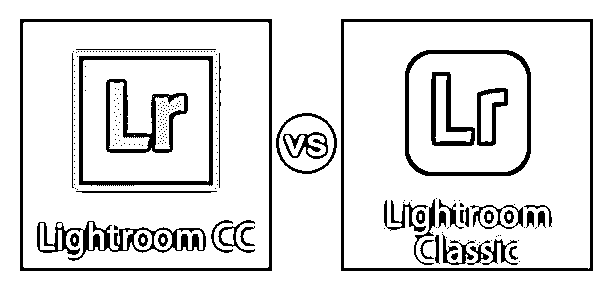
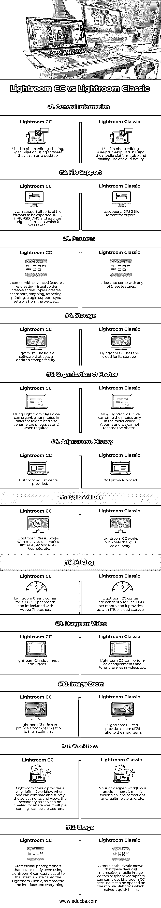

# Lightroom CC 与 Lightroom Classic

> 原文：<https://www.educba.com/lightroom-cc-vs-lightroom-classic/>

## Lightroom CC 和 Lightroom Classic 之间的区别

Lightroom Classic 和 Lightroom CC 软件为摄影师、业余爱好者、业余爱好者或专业人士提供了一个共享、编辑、操作和分享大量照片的平台。尽管由于一些突出的特点，它们有着相同的名字，但它们被用于完全不同的摄影领域。最初，Lightroom 6 传统上是一个独立的产品，具有一致的功能。但是最新的更新显示，Adobe 已经将它变成了 Lightroom Classic。所以基本上是 Lightroom 6 的延续。另一方面，Lightroom CC 是一个新软件，在文件存储、应用程序状态、搜索关键字等方面有一些不同的功能。

### Lightroom CC 和 Lightroom Classic 之间的直接比较(信息图表)

以下是 Lightroom CC 与 Lightroom Classic 之间的主要比较:

<small>3D 动画、建模、仿真、游戏开发&其他</small>

### Lightroom CC 和 Lightroom Classic 之间的主要区别

让我们讨论一下 Lightroom CC 与 Lightroom Classic 之间的一些主要区别:

#### 软件使用

*   由于几乎相似的名称，人们可能会认为市场会发生冲突，但如果我们做一些研究，了解每个软件的确切功能，以及在我们可能喜欢与这两个软件一起工作时应该使用哪个软件。
*   已经在使用 Lightroom 6 的专业摄影师可以很容易地适应名为 Lightroom Classic 的最新更新，因为它有相同的界面和一切。
*   如今，一群自称为移动图像编辑器或 iPhone 的热情人群可以轻松使用 Lightroom CC，因为它可以在移动平台上打开，使用起来很快。它还带有像相册这样的存储名称和像 Autokeyword 工具这样的功能。

#### 基本差异

*   这两个软件有一些基本的区别；让我们一个一个来看。
*   首先，Lightroom Classic 是使用桌面存储设备的软件。Lightroom CC 使用云进行存储。
*   Lightroom Classic 无法在移动平台上打开。Lightroom CC 可以在移动平台上打开。
*   使用 Lightroom Classic，我们可以在不同的文件夹中组织我们的照片，还可以根据需要重命名照片。Lightroom CC 软件中缺少这些非常基本的功能。
*   Lightroom Classic 和 Lightroom CC 都带有基本的调整功能，如笔刷、渐变、径向工具，这些功能在它们中很常见。但是只有 Lightroom Classic 具有调整历史记录功能，以便将来进行更改。

#### 特征的差异

*   Lightroom Classic 附带了所有这些对专业摄影师有用的高级功能，如创建虚拟副本、映射、共享、打印、插件支持、从 web 同步设置等。
*   由于业余或业余摄影爱好者可能不需要所有这些来快速编辑以在社交媒体上共享，这些功能在 Lightroom CC 中是缺失的。

#### 文件支持

*   Lightroom Classic 可以支持各种文件格式 exported.JPEG，TIFF，PSD，DNG 和原始格式，它是采取的。
*   lightroom CC supports.JPEG 导出文件格式。

#### 定价

*   就价格而言，它们是一样的，只是有一点点不同。
*   Lightroom Classic 每月收费 9.99 美元，包含在 Adobe Photoshop 中。
*   Lightroom CC 每月独立收费 9.99 美元，它为我们提供了 1TB 的云存储空间。

### Lightroom CC 与 Lightroom Classic 的比较表

让我们来看看 Lightroom CC 与 Lightroom Classic 之间的顶级比较。

| **比较的基础** | **Lightroom CC** | **Lightroom Classic** |
| **一般信息** | 用于使用在桌面上运行的软件进行照片编辑、共享和操作。 | 用于照片编辑、共享、使用移动平台的操作以及利用云设施。 |
| **文件支持** | 它可以支持各种文件格式，如 exported.JPEG，TIFF，PSD，DNG，也可以是它拍摄时的原始格式。 | 它的支架。用于导出的 JPEG 文件格式。 |
| **特性** | 它具有高级功能，如创建虚拟副本、创建实际副本、创建快照、映射、共享、打印、插件支持、从 web 同步设置等。 | 它不具备上述任何功能。 |
| **存储** | Lightroom Classic 是使用桌面存储设备的软件。 | Lightroom CC 使用云进行存储。 |
| **照片的组织** | 使用 Lightroom Classic，我们可以在不同的文件夹中组织我们的照片，还可以根据需要重命名照片。 | 使用 Lightroom CC，我们只能将照片存储在名为“相册”的文件夹中，并且不能重命名照片。 |
| **调整历史** | 提供了调整历史记录。 | 未提供历史记录。 |
| **颜色值** | Lightroom Classic 适用于许多颜色库，如 RGB、Adobe RGB、Prophoto 等。 | Lightroom CC 仅适用于 RGB 颜色库。 |
| **定价** | Lightroom Classic 每月收费 9.99 美元，包含在 Adobe Photoshop 中。 | Lightroom CC 每月独立收费 9.99 美元，它为我们提供了 1TB 的云存储空间。 |
| **在视频上的使用** | Lightroom Classic 无法编辑视频。 | Lightroom CC 也可以在视频中执行颜色调整和色调更改。 |
| **图像缩放** | Lightroom Classic 可以提供最大 11: 1 的缩放比例。 | Lightroom CC 可以提供最大 2:1 的缩放比例。 |
| **工作流程** | Lightroom Classic 提供了一个非常明确的工作流程，用户可以在其中比较和调查调整和视图；可以创建辅助屏幕用于参考，可以创建多个目录，等等。 | 这里没有提供这样定义的工作流；主要集中在镜头校正和实时存储等方面。 |
| **用途** | 已经在使用 Lightroom 6 的专业摄影师可以很容易地适应名为 Lightroom Classic 的最新更新，因为它有相同的界面和一切。 | 如今，自称为移动图像编辑器或 iphone 程序员的更热情的人群可以轻松使用 Lightroom CC，因为它可以在移动平台上打开，使用起来很快。 |

### 结论

对于照片编辑，Lightroom Classic 和 Lightroom CC 提供的功能；差异如此明显，我想市场不会像预期的那样发生冲突。这两个软件都是以用户为中心的，这是非常罕见的。Lightroom CC 非常适合社交媒体术语，休闲摄影师和寻找快速编辑解决方案的人会选择它。需要他们的功能和设置调整的专业摄影师；可能总是倾向于 Lightroom Classic。

### 推荐文章

这是 Lightroom CC vs Lightroom Classic 的指南。这里我们讨论信息图和比较表的主要区别。您也可以浏览我们的其他相关文章，了解更多信息——

1.  [Camera Raw vs Lightroom](https://www.educba.com/camera-raw-vs-lightroom/)
2.  [捕捉一个 vs Lightroom](https://www.educba.com/contour-plot-in-matlab/)
3.  [Photoshop vs Illustrator](https://www.educba.com/photoshop-vs-illustrator/)
4.  [亲和力 vs Lightroom](https://www.educba.com/affinity-vs-lightroom/)

