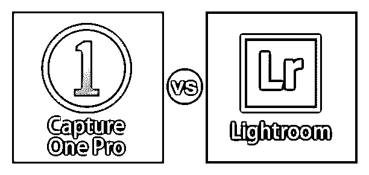

# 捕捉一个 Pro vs Lightroom

> 原文：<https://www.educba.com/capture-one-pro-vs-lightroom/>

## Capture One Pro 和 Lightroom 之间的区别

Capture One Pro 和 Lightroom 软件都与图像编辑和操作作品相关，但都有自己的图像处理技术。通读这篇文章后，你可以很容易地发现这两个软件之间的区别。我们将通过讨论一些重要的点来分析这个软件的所有可能的方面，比如关键的差异。它们的重要特征的比较表等。如果你想了解这个软件的每一个方面，从头到尾看完这篇文章，在文章的最后，你会对这个软件有一个很好的了解。

### Capture One Pro 和 Lightroom 之间的直接比较(信息图表)

以下是 Capture One Pro 与 Lightroom 之间的 15 大对比:

<small>3D 动画、建模、仿真、游戏开发&其他</small>

### Capture One Pro 和 Lightroom 之间的主要区别

在这里，我们将介绍这两种技术的主要区别，并了解它们的主要用途。因此，让我们来看看主要的区别。

#### 捕获一个专业软件

我们也可以将这个软件称为 Capture One，它是由 Phase One 开发的照片编辑软件。它不是用于照片编辑，而是用于其他目的，如处理原始图像、图像编目和管理摄影。它与 Windows 和 Mac OS 软件都兼容。处理这个软件不是一个很大的任务，因为它提供了一个非常用户友好的环境和功能。

#### Lightroom 软件

Lightroom 软件是 adobe 系列 Creative Cloud 应用程序的一部分，由 Adobe Systems 开发。它被用作图像组织和图像处理软件，通过保留原始图像实现非破坏性工作。您可以在 Windows、Mac OS、Android、IOS 和 tvOS 上上传此软件。您可以享受这个软件为您的图像组织和操纵工作，因为它为您提供了有益的工作技术。

现在，让我们找出主要的比较点，以便更好地理解这两个软件，并了解该软件的主要功能。

### Capture One Pro 与 Lightroom 的对比表

让我们来看看 Capture One Pro 与 Lightroom 之间的主要比较。

| **抓一个亲** | **灯箱** |
| 捕捉一亲软件是图像编辑和原始图像处理软件。 | Lightroom 软件是图像组织和操作软件。 |
| 捕捉一个亲允许图像编目和摄影的系绳。 | 就像 Photoshop 一样，Lightroom 也允许导入和保存图像，查看和组织图像，还可以共享大量数字图像。 |
| 它可以处理不同类型的数码相机的原始文件，TIFF(标记图像文件格式)和 JPEG(联合图像专家组)图像格式。 | 您可以在 Lightroom 软件中根据非破坏性原则工作，该软件允许您单独保存您的工作，而不会干扰特定图像的原始文件。 |
| Capture One Pro 能够直接打印。 | 它不能操作图像文件，除非您将该图像文件导入 Lightroom 软件的数据库中。 |
| 你可以在 www.captureone.com 的网站上找到这个软件，并在你的个人电脑上享受它。 | 你可以从 adobe systems 的官方网站找到这个软件是[www.adobe.com](https://www.adobe.com/)，并在你的个人电脑上欣赏它。 |
| 当任何文件导入到这个软件，它看起来更明亮和充满活力，没有任何编辑和调整。 | 而在这个软件中，当你导入任何文件时，它在起点看起来是中性的。在对其进行一些调整后，您可以获得与采集一个相同的结果。 |
| 该软件几乎与相机的数量兼容，但不能在新的相机上快速显示结果。 | 在这个软件中，你必须首先使用新相机的 raw 文件的支持系统以获得更好的效果。 |
| Capture One Pro 软件允许您一次在多个层上使用局部调整选项。 | 在这个软件中，你必须从 Lightroom 切换到 Photoshop，才能一次对多个图层进行调整。 |
| 您可以一次在其中组织一个会议的照片，并将其分离为单个会议。 | Lightroom 软件一次可以打开一个目录，但该目录中有多个收藏集和集。 |
| 当与相机连接时，Capture One Pro 可提供更可靠、更快速的连接体验。 | 与 Capture one Pro 软件相比，Lightroom 软件的连接能力较弱。 |
| 你可以以每月 20 美元或每年 180 美元的价格订阅这个软件。 | 对于 Lightroom 软件，你必须支付 10 美元作为订阅费用。 |
| Capture One Pro 是一款流行的软件，具有颜色调整功能、多层编目以及网络共享技术。 | Lightroom 软件很受欢迎，因为它有更多可用的预设、插件，而且你还可以切换到 Photoshop 或任何其他特定的工作。 |
| 你可以在这个软件中有一个很好的定制设置；也就是说，您可以调整或调整图标大小，隐藏或取消隐藏工具面板，并管理许多其他自定义参数。 | 在 Lightroom 软件中，用于调整该软件工作环境的设置有限。 |
| 你可以在这个软件中很好的控制高光和阴影滑块。 | 而在 Lightroom 软件中，您控制软件这些功能的自由较少。 |
| 这个软件的一个问题是缺少一个库。 | 在 Lightroom 软件中，图像会自行组织。 |

以上是这两款软件的主要特点，有助于你在个人层面比较这款软件，让你对这款软件的一些重要方面有所了解。在看完这两个软件的对比表后，你可以开始在它们上面练习，并分析它们的关键特性，以便更好地了解它们。

### 结论

现在看完这篇文章，你就能明白什么是 Lightroom 和 Capture One Pro 软件了吧？您还可以分析该软件的主要功能，并了解哪些功能更适合您的图形编辑和操作工作。一旦你对这个软件有了很好的了解，处理它们对你来说就变得很容易了。

### 推荐文章

这是捕获 One Pro vs Lightroom 的指南。在这里，我们将讨论信息图的主要区别以及 Capture One Pro 与 Lightroom 的对比表。您也可以浏览我们的其他相关文章，了解更多信息——

1.  [Adobe Premiere Pro vs After Effects](https://www.educba.com/adobe-premiere-pro-vs-after-effects/)
2.  [ACDSee vs Lightroom](https://www.educba.com/acdsee-vs-lightroom/)
3.  [Photoshop Elements vs Lightroom](https://www.educba.com/photoshop-elements-vs-lightroom/)
4.  [Lightroom CC vs Lightroom Classic](https://www.educba.com/lightroom-cc-vs-lightroom-classic/)

