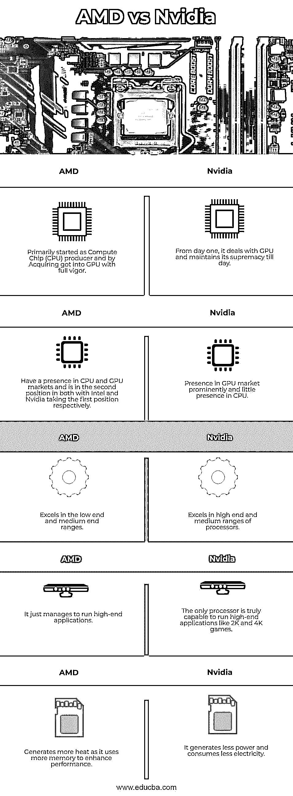

# AMD vs 英伟达

> 原文：<https://www.educba.com/amd-vs-nvidia/>

## AMD 与 Nvidia 的区别

CPU 管理计算机的一般操作，例如从内存中读取指令，按照程序逻辑处理指令，以及存储内存结果。图形处理单元(GPU)管理 3D 图形图像在屏幕上的渲染。如果说 CPU 是计算机的大脑，那么 GPU 就是在屏幕上提供更快移动的迷人图像的革新者。

根据设计，CPU 处理最少的显示和视频活动，密集的图形活动，如计算机辅助设计中的 3D 建模，以及游戏软件的丰富视频渲染，都需要包含在显卡中的 GPU 服务。GPU 在多核的帮助下管理复杂的显示活动，以并行处理模式同时进行数千次操作，并利用其高吞吐量能力。

<small>3D 动画、建模、仿真、游戏开发&其他</small>

GPU 用于工程设计中的 3D 建模平台，通过切片/切块/旋转查看零件的真实尺寸视图，并查看截面。它用于高分辨率视频操作 4K 和 360 度视频。GPU 在机器学习、计算机视觉、游戏和超级计算中是最受欢迎的，因为它必须在任何给定的时间处理大量的数据和更多的函数。

AMD 和 Nvidia 专注于 GPU 处理器，让我们在本文中详细比较它们的优势和能力。

### AMD 与 Nvidia 的直接对比(信息图)

以下是 AMD 与 Nvidia 之间的主要比较:

### AMD vs 英伟达是什么？

在进入 AMD 和 Nvidia 谁的显卡更胜一筹，买哪个显卡的对比之前，我们先来研究一下他们的轨迹。

#### 超微半导体公司

它于 20 世纪 60 年代末在美国加利福尼亚州开始运营，当时是一家二级芯片生产商，生产 Ram 和寄存器。1975 年设计了第一款产品 Am9080，与英特尔 8080 展开竞争，后来在 1980 年与英特尔达成协议，成为第二家供应商。20 世纪 90 年代，它生产了 Am386 与英特尔竞争。

AMD 在 2006 年取得了重大突破，收购了图形处理器公司 ATI technologies，这给了他们一个 GPU 芯片品牌身份，后来在 2008 年，一家制造公司 Global foundries 从制造业中剥离出来。这两大活动帮助 AMD 确立了芯片制造商的地位。然后，它开始专注于图形和计算芯片。

#### 英伟达

始于 20 世纪 90 年代中期的美国加州，从第一天起就专注于下一代计算，尤其是图形。1998 年，他们的第一款产品丽娃 TNT 使他们成为图形芯片制造商。GeForce 256 于 1999 年开发，成为他们的旗舰产品，并帮助他们进入微软的产品，如 Xbox。多次收购帮助他们成长为图形处理器领域的强大玩家。

Titan V、Quadro GV100 和 RTX2080GPUs 是他们在 2017-18 年发布的。Nvidia 在高端工作站和笔记本电脑领域也占有一席之地。

### AMD 与 Nvidia 的主要区别

让我们讨论一下 AMD 和 Nvidia 之间的一些主要区别:

*   **性能:**镭龙是 ATI (Array Technology Inc)最初的产品，ATI 曾经是 Nvidia 的主要对手。AMD 收购 ATI 后，它已经成为 NVIDIA 和 AMD 的两大 GPU 市场。镭龙·布兰德与 GeForce 正面交锋，成为他们的竞争对手。AMD 在 GPU 市场的市场份额较低，类似于它在与英特尔完成交易后在 CPU 市场的份额。比较 GPU 处理器性能的基准可以是在给定时间内处理的帧数以及运行 Crysis 等游戏的速度。在这两种情况下，该品牌的表现不会在所有车型中保持一致，而是有所不同。
*   **低配范围(预算机型):**AMD 的 RX590 在这个范围的机型中称王。轻松运行 AAA 级游戏，并设法运行 4K 游戏。GTX 1050 Ti，GTX 1650 是英伟达在这个范围内的产品。尽管如此，AMD 在这一系列中脱颖而出。
*   **中端:** RX5700 配备 8GB 显存，速度为 60-90 帧/秒，是 AMD 的主要型号。GeForce GTX 1660 Ti 是 nVIDIA 在这一领域的竞争对手。这些产品提供了同样好的性能，AMD 和 Nvidia 都成为赢家。
*   **高端:**Nvidia 的 GeForce RTX 2060 super 是这一领域的明显赢家，AMD 的 RX 5700 XT 几乎无法与其竞争对手匹敌。
*   **超级范围:** nVIDIA 成为明显的赢家，因为 AMD 在这个范围内几乎没有什么可提供的。
*   **硬件:** Nvidia 采用了先进的技术，它体现在性能上的优越。产生的热量较少，因此功耗也较少。AMD 通过使用更多的内存和消耗更多的功率，用其处理能力来弥补这些缺陷。这是 AMD 在其新产品中填补的空白。
*   **技术:** Nvidia 使用 CUDA(计算联合设备架构)核心，AMD 使用流处理器。这两个内核之间没有明显的性能差异。
*   **软件:**微调软件在性能上有所作为，弥补硬件差距。双方都频繁更新驱动程序，nVIDIA 在一致性和稳定性方面略有得分。除了这些差异，我们是平等的。
*   **流媒体&录制:**要不是 Nvidia 在流媒体和录制过程中提高了视频质量，两个播放器都在同一水平上。
*   **垂直同步替代:**通过同步显示器的刷新率和帧速率来避免屏幕撕裂。AMD 的 Freesync 和 Nvidia 的 Gsync 提供了解决方案，它们在性能上不相上下。Freesync 在成本方面是更好的解决方案，Gsync 在整体性能方面胜出，

### AMD 与 Nvidia 对比表

让我们看看 AMD 和 Nvidia 之间的顶级对比。

| **AMD** | **英伟达** |
| 最初是作为计算芯片(CPU)生产商起步的，通过收购进入了 GPU，并充满活力。 | 从第一天起，它就与 GPU 打交道，并一直保持其至高无上的地位。 |
| 在 CPU 和 GPU 市场占有一席之地，在英特尔和英伟达都处于第二位，占据第一位。 | 在 GPU 市场上占有突出地位，在 CPU 市场上很少占有一席之地 |
| 在低端和中端领域表现出色。 | 在高端和中端处理器领域表现出色。 |
| 它只能运行高端应用程序。 | 唯一真正能够运行 2K 和 4K 游戏等高端应用的处理器。 |
| 由于使用更多内存来提高性能，因此会产生更多热量 | 它产生的能量更少，消耗的电能也更少。 |

**结论:**人们将不得不选择 Nvidia 以获得高帧率和丰富的 3D 体验。AMD 符合预算，Nvidia 符合愿望。

### 推荐文章

这是 AMD vs Nvidia 的指南。在这里，我们讨论了信息图表和 AMD 与 Nvidia 的比较表的主要差异。您也可以浏览我们的其他相关文章，了解更多信息——

1.  [ON1 Vs Lightroom](https://www.educba.com/on1-vs-lightroom/?source=leftnav)
2.  [ACDSee Vs Lightroom](https://www.educba.com/acdsee-vs-lightroom/?source=leftnav)
3.  [暗台 Vs 灯箱](https://www.educba.com/darktable-vs-lightroom/?source=leftnav)
4.  [ON1 Vs Lightroom](https://www.educba.com/on1-vs-lightroom/?source=leftnav)

