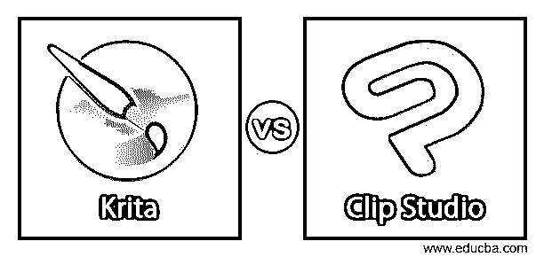
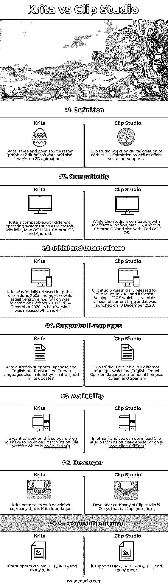

# 克里塔 vs 剪辑工作室

> 原文：<https://www.educba.com/krita-vs-clip-studio/>

## Krita vs Clip Studio 简介

Krita 是一款光栅图形编辑软件，是一款免费的开源软件。作为光栅图形编辑软件，它主要用于数字绘画和 2D 动画，并具有许多不同的功能，如颜色管理，提供非破坏性的遮罩和图层，以及许多其他重要的功能。剪辑工作室通常用于漫画的对象和角色的数字创作，用于 2D 动画，也用于某些类型的插图工作。在日本，它被非正式地称为 Kurisuta，是 Celsys 公司开发的一些应用程序的集合。今天，在这篇文章中，我们将讨论这两个软件的所有重要事实，以比较它们的特性，这将使我们对它们有一个清晰的认识。

现在，在 eduCBA 文章的下一个动作中，我们将首先比较 Krita 和 Clip studio，并了解使它们在工作环境中有效的主要术语。

<small>3D 动画、建模、仿真、游戏开发&其他</small>

### Zendesk 与 Salesforce 的直接对比(信息图)

以下是 Krita 与 Clip Studio 的 7 大区别:

### Krita 与 Clip Studio 对比表

我们将根据系统要求、支持的文件格式、可用性以及下表中的更多内容来比较 Krita 和 Clip studio:

| **特性** | **粉笔** | **剪辑工作室** |
| 这个表的第一点就是软件的定义。 | Krita 是免费的开源光栅图形编辑软件，也可以用于 2D 动画。 | Clip studio works on the digital creation of comics, 2D animation as well as offers vector art supports. |
| 该表的第二点是哪个操作系统需要安装该软件。 | Krita is compatible with different operating systems such as Microsoft Windows, Mac OS, Linux, Chrome OS, and Android. | While Clip studio is compatible with Microsoft Windows, Mac OS, Android, Chrome OS, and also with iPad OS, iOS. |
| 第三点是两个软件何时发布，它们的最新版本是什么。 | Krita was initially released for public use in June 2005 and right now its latest version is 4.4.1 which was released in October 2020\. On 24 December 2020 its beta version was released which is 4.4.2. | Clip studio was initially released for public use in 2001 and its latest version is 1.10.5 which is its stable version of the current time and it was launched on 10 December 2020. |
| 这个列表的第四点是这个软件支持的语言。 | Krita 目前支持日语和英语，但俄语和法语也在它的列表中，它将在更新中添加。 | Clip Studio is available in 7 different languages which are English, French, German, Japanese, traditional Chinese, Korean and Spanish. |
| 下一点是，在哪里可以找到这个软件。 | If u want to work on this software then you have to download it from its official website which is [www.krita.org](https://krita.org/en/) | On another hand, you can download Clip studio from its official website is [www.clipstudio.net](https://www.clipstudio.net/) |
| 这张表的下一点就是这个软件的开发。 | Krita 也有自己的开发公司，即 Krita 基金会。 | Developer company of Clip studio is Celsys that is a Japanese firm. |
| 下一点是支持的文件格式。 | Krita 支持 kra、ora、TIFF、JPEG 等等。 | 它支持 BMP、JPEG、PNG、TIFF 等等。 |

现在，在浏览了这篇文章的良好且信息丰富的比较表之后，我认为我们还应该分析 Krita 和 Clip studio 之间的差异，因此让我们在本文的下一步中向它前进，这是关键的差异。

### **Krita 与 Clip Studio 的主要区别**

我们今天将讨论 Krita 和 Clip studio 之间的微小差异，以便您可以对该软件的功能有一个大致的了解。所以区别如下:

*   这两个软件的第一个区别是，Clip studio 是一个日本软件，它在用户界面上向您提供该软件的所有内容，您可以在工作后关闭它的任何面板。你会在里面找到不同工具的小按钮。简而言之，它有一个适中的用户界面，很容易与用户互动。

虽然 Krita 有一个组织良好的用户界面，你可以根据自己的需要进行安排，但与 Clip studio 相比，你将面临一个问题，即 Krita 界面的元素太大，无法快速安排它们，它正在悄悄地努力。

*   两个软件之间的第二个区别是剪辑工作室有一个非常平滑和连续的画笔笔划，因为它避免了画笔污点的困难，而且它还可以自动控制画笔，而不是手动控制。你可能会在从图像制作笔刷的过程中遇到问题，因为 Clip studio 只在单层上提供这种功能，但相反，Krita 为多层图像做了这种功能，没有任何困难，因为这对它来说是小菜一碟。
*   该软件的另一个不同之处是，在 Krita 和 Clip studio 软件中都有效果层，但 Clip studio 通过使剪辑和蒙版过程平滑来使其更容易，而 Krita 通过为相同的效果制作白色蒙版来提高其工作流程速度。你可以通过从 Krita 软件**的滤镜菜单中创建一个动作按钮(它将在键盘的一个按钮中合并创建白色遮罩的所有步骤)来调整这个添加白色遮罩以在 Krita 中实现相同效果的不方便的步骤。**

这些是这篇文章的关键差异副标题的重要点，它帮助我们正确分析主要差异，现在我们可以通过自己的观点轻松区分这两个软件。

### 结论

这是我们为您提供尽可能多的关于 Krita 和 Clip studio 软件的信息的良好而有效的方法，现在您可以逐一浏览这两个软件，以便很好地掌握它们，这将为您提供光栅图形编辑以及 2D 动画创作的有效结果。

### 推荐文章

这是 Krita vs Clip 工作室的指南。在这里，我们将讨论简介、与信息图的直接比较、主要差异和比较表。您也可以看看以下文章，了解更多信息–

1.  [微软团队 vs Slack](https://www.educba.com/microsoft-teams-vs-slack/)
2.  [SharePoint vs OneDrive](https://www.educba.com/sharepoint-vs-onedrive/)
3.  [Couchbase vs CouchDB](https://www.educba.com/couchbase-vs-couchdb/)
4.  [Shopify vs Squarespace](https://www.educba.com/shopify-vs-squarespace/)

