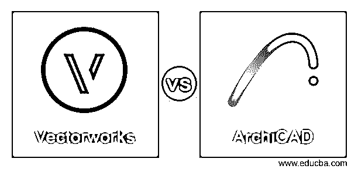
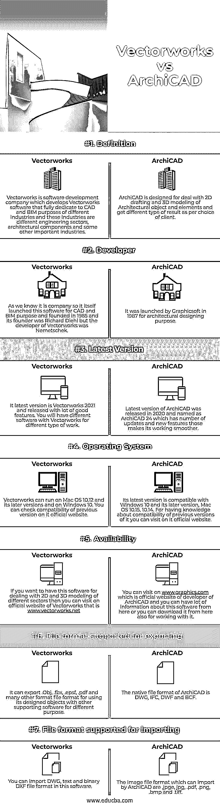

# Vectorworks vs ArchiCAD

> 原文：<https://www.educba.com/vectorworks-vs-archicad/>

## Vectorworks vs ArchiCAD 简介

Vectorworks 是一家开发公司，开发并专注于 CAD(计算机辅助设计)和 BIM(建筑信息建模)软件，该软件参与 2D 制图以及不同行业(如不同工程流、建筑、施工(AEC)、景观和娱乐行业)的评论和元素的 3D 建模。ArchiCAD，我们可以从它的名字“Archi”来理解，这意味着它用于设计 2D 和由 Gaphicsoft 开发的建筑领域的不同元素和组件的 3D 模型，以处理这些类型的目的。

在这篇文章中，你将收集关于矢量工程不同方面的知识，以及用不同方式分析它们的 ArchiCAD 软件。你还在等什么？让我们开始这场精彩的讨论。

<small>3D 动画、建模、仿真、游戏开发&其他</small>

### Vectorworks 与 ArchiCAD 的面对面比较(信息图表)

以下是 Vectorworks 与 ArchiCAD 的 7 大对比:

### Vectorworks 与 ArchiCAD 的比较

这两种软件的工作目的相同，但它们有不同的要求和能力，现在我要告诉你这些事情。

|  | **矢量工程** | archicad |
| **定义** | Vectorworks 是一家软件开发公司，开发完全致力于不同行业的 CAD 和 BIM 目的的 Vectorworks 软件，这些行业是不同的工程部门、建筑构件和一些其他重要行业。 | ArchiCAD 旨在处理建筑对象和元素的 2D 制图和 3D 建模，并根据客户的选择获得不同类型的结果。 |
| **开发商** | 我们知道它是一家公司，所以它自己推出了这款用于 CAD 和 BIM 目的的软件，并于 1985 年成立，其创始人是 Richard Diehl，但 Vectorworks 的开发者是 Nemetschek。 | 它由 Graphicsoft 于 1987 年推出，用于建筑设计目的。 |
| **最新版本** | 它的最新版本是 Vectorworks 2021，发布时有很多好的特性。对于不同类型的工作，您将拥有不同的软件和 Vectorworks。 | ArchiCAD 的最新版本于 2020 年发布，命名为 ArchiCAD 24，它有许多更新和新功能，使其工作更加流畅。 |
| **操作系统** | Vectorworks 可以在 Mac OS 10.12 及其更高版本以及 Windows 10 上运行。可以在其官网上查看之前版本的兼容性。 | 其最新版本兼容 Windows 10 及其更高版本 Mac OS 10.15、10.14。要了解它以前版本的兼容性，您可以访问它的官方网站。 |
| **可用性** | 如果你想用这个软件来处理不同部门的 2D 和三维建模，那么你可以访问 Vectorworks 的官方网站是[www.vectorworks.net](https://www.vectorworks.net/en-US) | 你可以访问 ArchiCAD 开发商的官方网站[www.graphics.com](http://www.graphics.com),你可以从这里获得很多关于这个软件的信息，或者你也可以从这里下载来使用它。 |
| **支持导出的文件格式** | 它可以出口。Obj，。fbx，。epsf，。pdf 和许多其他格式文件格式，以便将其设计的对象与其他支持软件一起用于不同目的。 | ArchiCAD 的原生文件格式为 DWG、IFC、DWF 和 BCF。 |
| **支持导入的文件格式。** | 你可以在这个软件中导入 DWG、文本和二进制 DXF 文件格式。 | ArchiCAD 可以导入的图像文件格式有，jpge，jpg，.pdf，。png，。bmp 和. tiff。 |

这些是一些要点，通过它们你可以得到关于基本要求、支持文件格式、分析它们所必需的两个软件的能力的信息。现在，我将带您了解该软件的一些其他功能和事实，这将让您了解该软件的专业知识。

### Vectorworks 和 ArchiCAD 的主要区别

在这里，我们将找出使这两个软件彼此不同的事实，它们的开发者创造了一些使它们工作流畅的特性。这些事实如下:

你发现的第一件事就是这个软件的不同价格格式。Vectorworks 的定价从 3045 美元起，这是每个用户的一次性付款。它不提供免费版本，但你可以免费试用，以了解该软件的用户界面和工作能力。您还可以制定一个培训计划来轻松处理它，它提供四种类型的培训计划，分别是面对面、在线直播、网络研讨会、文档。不仅是培训，您还将有一个针对工作时间的支持计划，也可以通过在线系统。

ArchiCAD 有一种不同类型的付费版本，即每月支付，为此，你必须每月支付 196 美元，支付 2352 美元，对于 staring edition 版本，你必须一次性支付 2045 美元，它为学生版本提供 30%的折扣，也可以用于商业目的。这个版本的价格是 2780 美元，而对于一个完整的商业版本，你需要一次性支付 3971 美元，为期一年。

ArchiCAD 允许用户使用智能对象的参数化元素和数据，还提供了许多绘图和 3D 建模工具来处理大量的设计功能。你也将有这个软件集成渲染能力，提供准确和照片逼真的结果。

Vectorworks 为其用户提供不同类型的包，用于多种作品，如 Architect Vectorworks landmark、Vectorworks Fundamentals、Vectorworks Entertainment 和 Vectorworks Designer。这些不同的软件包在其用户界面中具有更多或更少的功能，这些功能处理任何类型的功能以获得其指定领域的解决方案工作。

在这里，我已经告诉你这个软件的一些事实，这样你就可以了解那些使这些软件在他们的领域和工作中特别的术语。

### 结论

毫无疑问，我尽力向你解释 Vectorworks 和 ArchiCAD 的所有特征和事实。现在你知道了它们，以及它们如何用于不同的 2D 和 3D 建模目的。我会建议你尝试这两个软件，然后决定哪一个适合你，并在你的项目工作中给出最好的结果。

### 推荐文章

这是一个关于 Vectorworks vs ArchiCAD 的指南。这里我们讨论信息图和比较表的主要区别。您也可以看看以下文章，了解更多信息–

1.  [网页 vs 网站](https://www.educba.com/webpage-vs-website/)
2.  [PhoneGap vs Ionic](https://www.educba.com/phonegap-vs-ionic/)
3.  [Docker 容器 vs 图片](https://www.educba.com/docker-containers-vs-images/)
4.  [Korn Shell vs Bash](https://www.educba.com/korn-shell-vs-bash/)

