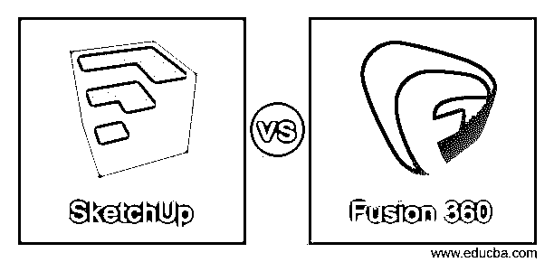
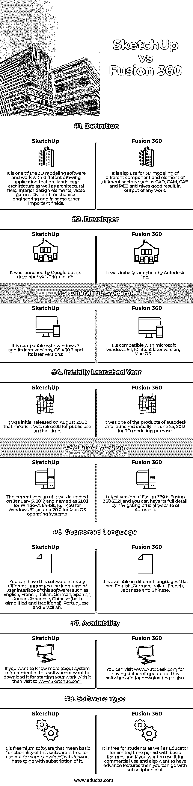

# SketchUp vs Fusion 360

> 原文：<https://www.educba.com/sketchup-vs-fusion-360/>

## SketchUp 与 Fusion 360 的区别

以下文章提供了 SketchUp vs Fusion 360 的概要。SketchUp 用于 3D 对象的建模，并处理不同领域的广泛绘图，如建筑 3D 建模、室内设计建模、机械以及土木工程组件。不仅在这些领域，它在电影和视频游戏领域也有一席之地。Fusion 360 也是一款 3D 建模软件，通过使用其众多良好的功能，可用于 CAD(计算机辅助设计)、CAM(计算机辅助制造)、CAE(计算机辅助工程)以及 PCB(印刷电路板)。它是 Autodesk 的三维建模程序之一。在这里，我们将看到两个软件的主要功能和事实，以便您可以分析它们，开始使用其中一个。

### SketchUp 与 Fusion 360 的正面比较(信息图表)

以下是 SketchUp 与 Fusion 360 之间的 8 大差异:

<small>3D 动画、建模、仿真、游戏开发&其他</small>

### SketchUp 与 Fusion 360 的主要区别

让我们讨论一下 SketchUp 与 Fusion 360 之间的一些主要差异:

*   正如我们所知，这两个软件是由不同的组织开发的相同类型的工作，但有一些功能，使他们的工作特别。
*   SketchUp 是免费增值软件，因此它可以免费用于商业用途，具有基本功能，但对于高级功能软件，您必须每年支付 119 美元(SketchUp 商店)，229 美元(SketchUp Pro)，575 美元(SketchUp Pro Classic)和 1199 美元(SketchUp Studio)。Fusion 仅在有限时间内免费用于教育目的，如果将其用于商业用途，您必须支付 395 美元的一个月订阅费，2，590 美元(每月 215.83 美元)的一年订阅费，以及 6995 美元(每月 194.31 美元)的三年订阅费。这两个软件的共同点是你可以免费试用，了解他们的用户界面和功能。
*   SketchUp 基于多边形建模，这意味着它通过从边到边的线连接顶点，从表面连接边到边。在使用该软件的过程中，您不会发现任何真实的曲线，这简化了我们的工作，而 Fusion 360 使用基于曲线的建模，或者可以理解为基于 NURBS，其中 NURBS 代表非均匀有理 B 样条，但如果我们从技术角度考虑，那么它实际上不是基于 NURBS 的，它使用 T 样条。
*   SketchUp 致力于表面建模，这意味着它是表面建模器，因为所有的对象都是由无限薄的表面组成的，我们在这个软件中称之为面，而 Fusion 360 致力于实体建模，我们称之为实体建模器。例如，如果你创建一个像球体这样的形状，那么它将是实心的，如果你从中心切开它并把它们分开，那么在球体的分开的部分上将有两个表面。
*   Fusion 360 具有比 SketchUp 更多的内置功能，当你进行 3D 打印时，你会发现这两个软件都很好，但 Fusion 360 可以导出。STL 有助于将命令直接发送到 3D 打印机进行打印，而无需使用任何其他软件。

### SketchUp 与 Fusion 360 对比表

我们来讨论一下 SketchUp 与 Fusion 360 的顶级对比:

|  | **SketchUp** | **融合 360** |
| **定义** | 这是一个三维建模软件和工作与不同的绘图应用，这是景观建筑以及建筑领域，室内设计元素，视频游戏，土木和机械工程和其他一些重要领域。 | 它还用于不同部门不同组件和元件的 3D 建模，例如 CAD、CAM、CAE 和 PCB，并在任何工作的输出中给出良好的结果。 |
| **开发商** | 它是由谷歌推出的，但它的开发者是 Trimble 公司。 | 它最初是由 Autodesk 公司推出的。 |
| **操作系统** | 它与 windows 7 及其更高版本、OS X 10.9 及其更高版本兼容。 | 它与微软 windows 8.1、10 及其更高版本的 Mac OS 兼容。 |
| **Initially Launched Year** | 它最初发布于 2000 年 8 月，这意味着当时它是公开发布供公众使用的。 | 它是 autodesk 的产品之一，最初于 2013 年 6 月 25 日推出，用于 3D 建模。 |
| **最新版本** | 它的当前版本于 2019 年 1 月 5 日推出，并命名为 Windows 64 位的 21.0.1、Windows 32 位的 16.1.1450 和 Mac OS 操作系统的 20.0。 | Fusion 360 的最新版本是 Fusion 360 2021，您可以通过浏览 Autodesk 的官方网站了解其全部详细信息。 |
| **支持的语言** | 您可以使用多种不同语言(本软件的用户界面语言)安装本软件，例如英语、法语、意大利语、德语、西班牙语、韩语、日语、中文(简体和繁体)、葡萄牙语和巴西语。 | 它有不同的语言版本，包括英语、德语、意大利语、法语、日语和中文。 |
| **可用性** | 如果你想了解更多关于这个软件的系统要求，或者想下载它开始你的工作，那么请访问[www.Sketchup.com。](https://www.sketchup.com/) | 您可以访问[www.Autodesk.com](https://www.Autodesk.com)获取该软件的不同更新，也可以下载该软件。 |
| **软件类型** | 它是免费增值软件，这意味着该软件的基本功能是免费使用的，但对于一些高级功能，你必须订阅它。 | 它对学生和教育工作者是免费的，在有限的时间内提供基本功能，如果你想把它用于商业用途，也想拥有高级功能，那么你可以订阅它。 |

### 结论

现在，阅读完本文后，您可以了解 SketchUp 和 Fusion 360，您可以使用这些信息来决定哪一个更适合您，或者建议您首先尝试免费试用这两个软件，以建立您自己对这些软件的看法。

### 推荐文章

这是 SketchUp vs Fusion 360 的指南。在这里，我们讨论 SketchUp 与 Fusion 360 的主要差异，并提供信息图表和比较表。您也可以看看以下文章，了解更多信息–

1.  [3ds Max vs Sketchup](https://www.educba.com/3ds-max-vs-sketchup/)
2.  [AutoCAD vs SketchUp](https://www.educba.com/autocad-vs-sketchup/)
3.  [Autocad vs Inventor](https://www.educba.com/autocad-vs-inventor/)
4.  [Autocad vs Archicad](https://www.educba.com/autocad-vs-archicad/)

