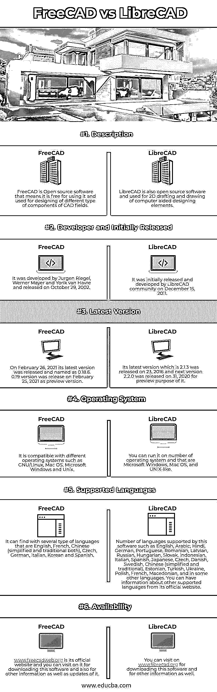

# FreeCAD vs LibreCAD

> 原文：<https://www.educba.com/freecad-vs-librecad/>

## FreeCAD 和 LibreCAD 的区别

以下文章提供了 FreeCAD 与 LibreCAD 的概要。FreeCAD 是 LGPLv2 +许可下的免费开源程序，专注于参数化 3D CAD 模型的设计以及 BIM(建筑信息建模)目的的工作。它是专门为机械工程的部件设计而设计的，但对工程的其他重要分支也有影响。LibreCAD 也是用于 CAD(计算机辅助设计)目的的免费开源软件，是作为 QCAD 社区版的分支开发的。你可以在许多平台上运行它，因为它的图形用户界面基于 Qt5 库系统。它具有许多处理 CAD 领域相关问题的良好特性。

### FreeCAD 与 LibreCAD 的直接对比(信息图表)

以下是 FreeCAD 与 LibreCAD 之间的 6 大区别:

<small>3D 动画、建模、仿真、游戏开发&其他</small>

### FreeCAD 与 LibreCAD 的主要区别

让我们讨论一下 FreeCAD 和 LibreCAD 之间的一些主要区别:

在这里，我们将看到一些事实，通过这些事实，您可以找出这些软件的关键点，并利用这些要点来决定哪个软件更适合您。

*   如果我们谈论这两种软件的价格，然后开始开源和免费软件，这些都是免费使用的，你不用担心这些软件的时间订阅、年度或月度计划、支付和更新。你将拥有这两个软件免费版本的所有优秀特性。
*   使用 LibreCAD，您可以使用一些高级功能和工具进行 2D 绘图和制图，这些工具使其工作更流畅，但注释以及数据导入和导出功能在其中不可用，这可能会给您的工作带来问题。它也不是建筑师和他们的组件设计，制造和模拟工作。然而，如果我们告诉你关于 FreeCAD，然后是的注释和数据导入，导出是可能的，所以你可以导入数据，以及导出不同类型的目的与此软件，但 2D 起草和绘图是不可能的。它可以很容易地为建筑师，模拟目的和制造商工作。
*   现在，我们将看到两种软件都没有的一些功能，但您必须了解它们，因为这些是这类软件最常用的功能。这些功能包括缺乏 3D 或实体建模功能，缺乏向后兼容性，缺乏协作，缺乏自定义命令，不支持自定义界面，文本编辑工具也不可用，以及许多其他软件不支持的功能，但您可以在其他附加软件的帮助下处理这些功能。
*   FreeCAD 提供了简单的处理工具，通过它你可以进行推拉建模，如果你将项目组合在一起，你可以得到非常好的复杂的三维物体。LibreCAD 为您提供多层设计管理，通过它，2D 设计在该软件中变得容易。
*   你可能会在使用 LibreCAD 打印时遇到困难，这个软件最大的缺点是它不支持最常见的文件格式。dwg，但它支持。dxf 并且可以导出。png，。jpg，。pdf，。svg 和许多其他的。您可以使用 FreeCAD 导出和导入许多文件格式，如 DXF、STEP、IGES、SVG、OBJ(波前)、SCAD、IFC、IV (Inventor)和 DAE (Collada)。

### FreeCAD 与 LibreCAD 对照表

我们来讨论一下 FreeCAD 和 LibreCAD 之间的顶级对比:

虽然两者都是免费开源软件，用于不同部门的 CAD 目的，但我们会看到它们的基本要求和功能

|  | **FreeCAD** | **图书馆卡片** |
| **定义** | FreeCAD 是开源软件，这意味着它可以免费使用，并用于设计 CAD 领域的不同类型的组件。 | LibreCAD 也是开源软件，用于 2D 起草和绘制计算机辅助设计元素。 |
| **开发者和最初发布者** | 它是由 Jurgen Riegel，Werner Mayer 和 Yorik van Havre 开发的，并于 2002 年 10 月 29 日发布。 | 它最初由 LibreCAD 社区于 2011 年 12 月 15 日发布和开发。 |
| **最新版本** | 2021 年 2 月 26 日，其最新版本发布，命名为 0.18.6。0.19 版本于 2021 年 2 月 25 日发布，为预览版。 | 其最新版本 2.1.3 于 2016 年 23 日发布，下一个版本 2.2.0 于 2020 年 31 日发布，用于预览。 |
| **操作系统** | 兼容 GNU/Linux、Mac OS、微软 Windows、Unix 等不同操作系统。 | 你可以在许多操作系统上运行它，比如微软视窗、苹果操作系统和类 UNIX 操作系统。 |
| **支持的语言** | 它可以查找英语、法语、中文(简体和繁体)、捷克语、德语、意大利语、韩语和西班牙语等几种语言。 | 本软件支持多种语言，如英语、阿拉伯语、印地语、德语、葡萄牙语、罗马尼亚语、拉脱维亚语、俄语、匈牙利语、斯洛伐克语、印度尼西亚语、意大利语、西班牙语、日语、捷克语、丹麦语、瑞典语、中文(简体和繁体)、爱沙尼亚语、土耳其语、乌克兰语、波兰语、法语、马其顿语和其他一些语言。你可以从它的官方网站获得其他支持语言的信息。 |
| **可用性** | www.freecadweb.org 是它的官方网站，你可以在上面下载这个软件，也可以获得其他信息和更新。 | 您可以访问[www.librecad.org](https://www.librecad.org/)下载该软件以及获取其他信息。 |

### 结论

FreeCAD 和 LibreCAD 都用于我们所看到的相同的工作目的，但它们有自己的方法在工作中给出最佳结果。现在，您可以自由选择更好的软件，并在您的 CAD 工作中享受更好的软件，以获得有效和最佳的项目工作结果。

### 推荐文章

这是 FreeCAD vs LibreCAD 的指南。这里我们分别用信息图和比较表来讨论 FreeCAD 和 LibreCAD 的主要区别。您也可以看看以下文章，了解更多信息–

1.  [AutoCAD vs SolidWorks](https://www.educba.com/autocad-vs-solidworks/)
2.  [AutoCAD vs FreeCAD](https://www.educba.com/autocad-vs-freecad/)
3.  [Autocad vs Archicad](https://www.educba.com/autocad-vs-archicad/)
4.  [Autocad vs Inventor](https://www.educba.com/autocad-vs-inventor/)

