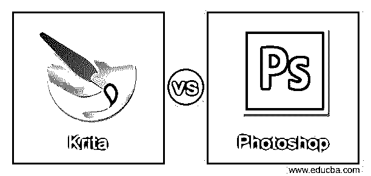
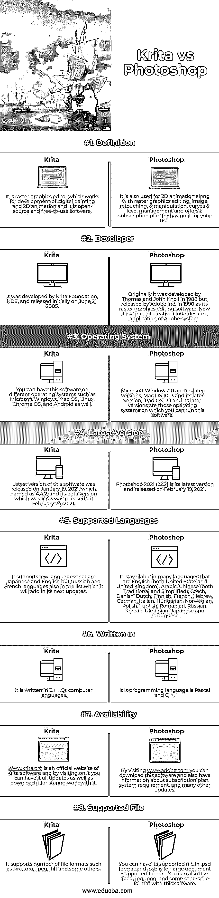

# Krita 和 Photoshop

> 原文：<https://www.educba.com/krita-vs-photoshop/>

## Krita vs Photoshop 简介

Krita 是一个免费的开源光栅图形编辑器，用于数字绘画、2D 动画，为此，它处理非破坏性的遮罩和图层管理、着色以及其他许多与光栅图形相关的功能。Photoshop 也是光栅图形编辑软件，通过使用许多处理光栅图形的编辑功能来处理和编辑图像，但它不是自由软件。你必须付费才能使用它的高级功能订阅和更新计划。

这两个软件都是用于光栅图形编辑的目的，他们通过使用自己的特殊功能和工具来完成这项工作。所以让我告诉你这两个软件的一些重要事实，以便向你解释。

<small>3D 动画、建模、仿真、游戏开发&其他</small>

### Krita 与 Photoshop 的直接对比(信息图)

以下是 Krita 与 Photoshop 之间的 8 大区别:

### Krita 和 Photoshop 的比较

|  | **粉笔** | **Photoshop** |
| 定义 | 这是一个光栅图形编辑器，用于开发数字绘画和 2D 动画，是一个开源的免费软件。 | 它还用于 2D 动画以及光栅图形编辑，图像润饰和操纵，曲线和水平管理，并提供了一个订阅计划，让您使用它。 |
| 开发者 | 它由 KDE Krita 基金会开发，并于 2005 年 6 月 21 日首次发布。 | 最初它是由托马斯和约翰·诺尔在 1988 年开发的，但在 1990 年由 Adobe 公司作为其光栅图形编辑软件发布。现在是 Adobe 系统的 creative cloud 桌面应用的一部分。 |
| 操作系统 | 您可以在不同的操作系统上安装该软件，如微软 Windows、Mac OS、Linux、Chrome OS 和 Android。 | Microsoft Windows 10 及其更高版本、Mac OS 10.13 及其更高版本、iPad OS 13.1 及其更高版本是您可以运行该软件的操作系统。 |
| 最新版本 | 该软件的最新版本于 2021 年 1 月 19 日发布，命名为 4.4.2，其测试版为 4.4.3，于 2021 年 2 月 24 日发布。 | Photoshop 2021 (22.2)是其最新版本，于 2021 年 2 月 19 日发布。 |
| 支持的语言 | 它支持日语和英语，但俄语和法语也在列表中，它将在下一次更新中添加。 | 它有多种语言版本，包括英语(美国和英国)、阿拉伯语、中文(繁体和简体)、捷克语、丹麦语、荷兰语、芬兰语、法语、希伯来语、德语、意大利语、匈牙利语、挪威语、波兰语、土耳其语、罗马尼亚语、俄语、韩语、乌克兰语、日语和葡萄牙语。 |
| 写于 | 它是用 C++，Qt 计算机语言编写的。 | 它是一种编程语言，是 Pascal 和 C++。 |
| 有效性 | [www.krita.org](https://krita.org/en/)是 Krita software 的官方网站，通过访问它，你可以更新所有内容，也可以下载开始工作。 | 通过访问[www.adobe.com](https://www.adobe.com/)，你可以下载该软件，还可以获得关于订阅计划、系统要求和许多其他更新的信息。 |
| 支持的文件 | 它支持多种文件格式，如。克拉，。奥拉，。jpeg，。tiff 和其他一些。 | 您可以在中找到它支持的文件。psd 格式和。psb 是支持大文档的格式。也可以用。jpeg，jpg，。png 和其他一些文件格式 |

我告诉你这些要点是为了让你对 Krita 和 Photoshop 软件有基本的了解，以便根据它们的系统要求和处理任何工作的能力进行分析。现在让我们转到本文的另一部分，我将告诉你一些关于这两个软件的其他事实，以便你对它们有更多的了解。

### Krita 和 Photoshop 的主要区别

你一定在想，如果两个软件用于相同类型的工作，那么我们如何区分它们呢？所以答案是我们可以，因为两者都有不同的开发者，他们的软件包含了许多特殊的功能。所以让我告诉你关于他们的事情。

作为开源软件，Krita 可以免费使用，它的开发者开发了它，以便它可以作为一种艺术工具供用户使用。你可以从它的官方网站下载，无需支付任何订阅费用，也不需要担心任何其他额外的费用。有了这个版本，你可以享受它所有的好的和先进的功能。它还提供完全免费的试用版。

而 Photoshop 是付费软件，但它提供免费试用版，这样你就可以理解它，并与其功能和工作环境互动。它的订阅计划从每月 19.99 美元开始。您可以访问 adobe 的官方网站，了解有关其他计划的更多信息以及高级功能和工具的详细信息。

作为一名光栅图形编辑，Krita 与 Photoshop 有很大不同，因为它专注于动画和数字绘画的开发，你可能不认为 Krita 是 Photoshop 的替代品。为此，您可以使用 Krita 软件的许多类型的功能，例如您可以使用画笔引擎、HDR 支持、图层支持、绘图助手、资源管理器以及 OpenGL。而在 Photoshop 中，我们可以平滑笔触，访问 Lightroom 的照片，我们有快速共享菜单，360 全景工作流，许多不同字体风格的良好字体，您可以应用过滤器进行图像处理，还可以使用照片修饰工具等等。

我们做这个讨论是为了指出一些关于 Krita 和 Photoshop 的必要信息，我想你已经找到了关于它们的更深入的知识。

### 结论

Krita 和 Photoshop 现在都是你很熟悉的词，你可以很容易地用它们中的任何一个光栅图形编辑器开始工作。你可以在两个软件中选择一个，因为 Krita 是完全免费的，在 Photoshop 中你可以免费试用。

### 推荐文章

这是一个指南 Krita vs Photoshop。这里我们分别用信息图和比较表来讨论 Krita 和 Photoshop 的主要区别。您也可以看看以下文章，了解更多信息–

1.  [Photoshop vs Illustrator](https://www.educba.com/photoshop-vs-illustrator/)
2.  [DirectX vs Vulkan](https://www.educba.com/directx-vs-vulkan/)
3.  [Vaporwave Photoshop](https://www.educba.com/vaporwave-photoshop/)
4.  [AutoCAD vs FreeCAD](https://www.educba.com/autocad-vs-freecad/)

