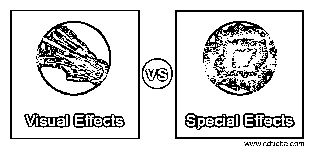
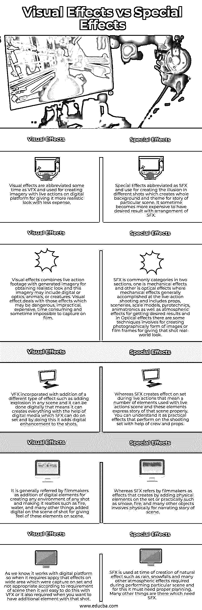

# 视觉效果与特效

> 原文：<https://www.educba.com/visual-effects-vs-special-effects/>

## 视觉效果与特效简介

VFX 这个名字很受视觉效果的欢迎，电影制作人和视频制作人将它融入到他们的现场拍摄中，以创造图像或操纵动作，使他们更有趣和更现实。换句话说，结合真人镜头和 CG 元素，创造出真实的影像，这就是 VFX。在拍摄过程中，通过应用不同类型的技巧对任何特定的屏幕、物体或场景效果产生错觉而产生的特殊效果，它被电影制作人用于电视、戏剧、视频游戏和一些其他相关行业。

视觉效果和特殊效果都被用于在多媒体领域、电影、视频游戏以及其他一些与之结合的行业中添加效果。因此，让我们来看看他们的特点，为他们建立基础知识。

<small>3D 动画、建模、仿真、游戏开发&其他</small>

### 视觉效果与特效的直接对比(信息图)

以下是视觉效果和特效的五大对比:

### 视觉效果和特效的比较

这个表格包含了许多解释使用这两种方法的目的的要点。你还在等什么？我们开始吧。

| **视觉效果** | **特效** |
| 视觉效果有时缩写为 VFX，用于在数字平台上创建带有现场动作的图像，以使其看起来更真实，花费更少。 | 特效缩写为 SFX，用于在不同的镜头中创造幻觉，为特定场景的故事创造整个背景和主题。有时，使用 SFX 的配置来获得期望的结果会变得更加昂贵。 |
| 视觉效果将真人镜头与生成的图像相结合，以获得逼真的外观，这些图像可能包括数字或光学、动物或生物。视觉效果处理那些危险的、不切实际的、昂贵的、费时的、有时不可能在电影中捕捉到的效果。 | SFX 通常分为两个部分，一个是机械效果，另一个是光学效果，其中机械效果通常在实景拍摄时完成，包括道具、场景、比例模型、烟火、电子动画以及大气效果。为了获得所需的效果，在光学效果中，有一些技术涉及到创建图像或电影帧的摄影形式，以使拍摄看起来真实。 |
| VFX 加入了不同类型的效果，如在任何场景中添加爆炸，这可以通过数字方式完成，这意味着它可以在数字媒体的帮助下创造一切，SFX 可以做一套，通过这样做，它可以为镜头添加数字增强。 | 而 SFX 在实景拍摄中对场景产生了影响，这意味着大量的元素与实景场景一起使用，这些元素恰当地表达了那个场景的故事。你可以理解为在剧组和道具的帮助下，在拍摄现场表演的实际效果。 |
| 电影制作人通常倾向于添加数字元素来创建任何镜头的环境，并使其真实，例如火、水和许多其他以数字方式添加到镜头场景中的东西，以提供这些元素在场景中的感觉。 | SFX 认为电影制作人是通过在场景中添加物理元素或实践(如烟、火和许多其他物体)来创造效果，以物理方式讲述场景故事。 |
| 正如我们所知，它与数字平台一起工作，所以当它需要将在场景中捕捉的效果应用到大面积区域时，根据场景的要求，这是不合适的，那么用 VFX 就很容易做到这一点，或者当你想在那个镜头中加入额外的元素时，也需要这样做。 | SFX 用于创建自然效果，如雨、雪，以及在执行特定场景时需要的许多其他大气效果，为此，它必须需要适当的规划。还有许多其他需要 SFX 的东西。 |

### 视觉效果和特效的主要区别

视觉效果和特效是相互平行的，当电影制作人或导演及其团队在片场没有得到他们想要的效果时，他们就和 VFX 和 VFX 一起去 SFX。让我给你解释一下，例如，有一个动作场景，布景人员在布景上制造烟雾以产生烟雾效果，但由于风的流动，它以相反的方向流动，而不是期望的方向，这就是设计师使用 VFX 的烟雾来保持它在他们期望的方向上产生期望的影响的时候。

视觉特效可以创造出比特效更危险的效果，即使花费很多也不行，例如在 VFX，我们可以创造出高度爆炸的效果，而不会伤害演员、特技人员以及在现场工作的团队成员，而如果你去片场，那么创造这种类型的效果会有很多风险和更多的费用。

你一定会想，VFX 会取代 SFX 吗？所以让我解释一下，SFX 和 VFX 是互补的，因为有时电影制作人可能没有足够的预算用 SFX 创造火、烟和雪这样的厚重的宽屏效果，然后他们用 VFX 的预算来增加这种效果。

这是 VFX 和 SFX 在做多媒体平台任务时添加效果元素的讨论。现在你可以在自己的基础上分析这两种效应在他们的工作领域中的重要性。

### 结论

在这篇文章中，我们告诉你视觉效果和特效的所有主要方面，这对于理解它们的特性、用途和工作能力是必要的。现在，您可以了解在制作不同类型的数字媒体工作人员时，在创建效果时使用它们的好处和损失。

### 推荐文章

这是一个视觉效果和特效的指南。这里我们讨论信息图和比较表的主要区别。您也可以看看以下文章，了解更多信息–

1.  [网页 vs 网站](https://www.educba.com/webpage-vs-website/)
2.  [PhoneGap vs Ionic](https://www.educba.com/phonegap-vs-ionic/)
3.  [Docker 容器 vs 图片](https://www.educba.com/docker-containers-vs-images/)
4.  [Korn Shell vs Bash](https://www.educba.com/korn-shell-vs-bash/)

