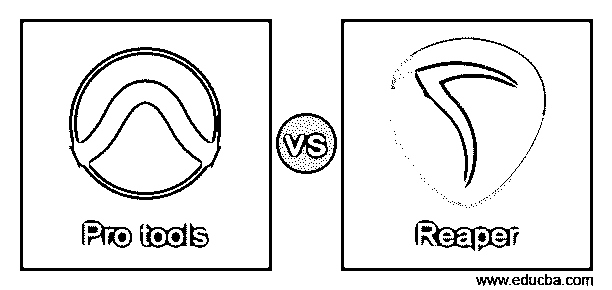
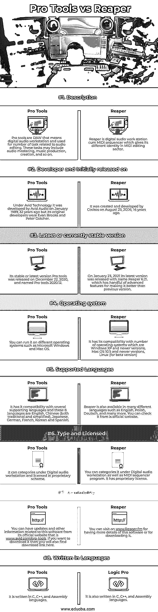

# 专业工具 vs 收割者

> 原文：<https://www.educba.com/pro-tools-vs-reaper/>

## Pro Tools vs Reaper 简介

Pro tools 是一个音频工作站，它在音频的数字平台上工作，处理不同类型音轨的编辑和控制。它还从事制作、录音以及创作音乐和声音，其中包括几个音轨，为此，它向其用户提供高水平的音频编辑工具。Reaper 也是音频工作站，在数字平台上工作，进行音频编辑和操作。它不仅是一个音频工作站，也是一个 MIDI 音序器软件，可以导入几乎所有常用的媒体格式。那么你愿意多了解一下这个软件吗？

这两个软件都通过使用它们的标准功能，以自己的方式编辑、操作和控制音频。所以让我们先讨论一下它们的基本特征。

<small>3D 动画、建模、仿真、游戏开发&其他</small>

### Pro Tools 与 Reaper 的面对面比较(信息图)

以下是 Pro Tools 与 Reaper 之间的 8 大对比:

### Pro Tools 与 Reaper 的比较

本节将带您浏览这些数据和事实，这些数据和事实对您分析这两种软件非常有帮助。

|  | **专业工具** | **死神** |
| **定义** | Pro tools 是 DAW，意思是数字音频工作站，用于许多与音频编辑相关的任务。这些任务可能包括音频控制、音乐制作、创作等等。 | Reaper 是一个数字音频工作站兼 MIDI 音序器，它在 MIDI 编辑领域有着不同的身份。 |
| **开发者，最初发布于** | 32 年前，Avid Audio 于 1989 年 1 月在 Avid Technology 的支持下开发了该软件，但其最初的开发者是 Evan Brooks 和 Peter Gotcher。 | 它是 14 年前的 2006 年 8 月 23 日由 Cockos 创造开发的。 |
| **最新或当前稳定的版本** | 其稳定或最新版本 Pro tools 于 2020 年 12 月 22 日发布，命名为 Pro tools 2020.12。 | 2021 年 1 月 23 日，其最新版本发布，命名为 Reaper 6.21。它有一些比以前版本更好的高级特性。 |
| **操作系统** | 您可以在不同的操作系统上运行它，如 Microsoft Windows 和 Mac OS。 | 它与许多操作系统兼容，包括 Windows XP 和更新版本、Mac OS 10.5 和更新版本、Linux(测试版) |
| **支持的语言** | 它与多种支持语言兼容，这 8 种语言是英语、中文(繁体和简体)、日语、德语、法语、韩语和西班牙语。 | Reaper 也有许多不同的语言版本，比如英语、波兰语、德语等等。你可以从官方网站上查到。 |
| **类型和许可** | 它可以在数字音频工作站下分类，并在专有方案中获得许可。 | 你可以把它归类到数字音频工作站和 MIDI 音序器程序下。它拥有专有许可证。 |
| **可用性** | 您可以从该软件的官方网站[www.avid.com/pro-tools](https://www.avid.com/pro-tools)获得与该软件相关的更新和其他信息。如果你想下载它，你也可以在这里找到下载链接。 | 可以访问 [www。Reaper.fm](https://www.reaper.fm/) 获得该软件的更多详细信息或下载该软件。 |
| **用语言写的** | 它是用 C、C++和汇编语言编写的。 | 它也是用 C、C++和汇编语言编写的。 |

这些是与两个软件的基本需求、要求和功能相关的一些重要事实和特性。现在让您了解一下这两个软件的一些高级特性。

### Pro Tools 和 Studio One 的主要区别

作为不同的开发者，这两种软件都有其特殊的用途，以使它们优于其他数字音频工作站软件。那么你也准备好讨论这些问题了吗？让我们开始吧。

在我们讨论其他问题之前，我认为价格是你应该知道的第一件事。因此，要获得 Pro tools，你必须一次性支付 299 美元的年费。这个包包括免费的用户支持以及更新。随着您向套餐中添加更多功能，价格也会相应上涨。它为这种软件的永久许可提供了不同的价格，每年订阅 899 美元，提供所有免费的用户支持和更新。如果你只是想了解它的用户界面和工作原理，那么你应该先用免费试用包，这个试用是有时间限制的。

如果我告诉你关于收割者，那么有两种类型的许可计划，第一种，你必须支付 60 美元的折扣价，第二种，你必须支付 225 美元，这是用于商业目的。只有当您打算将它用于个人或个人商业用途(其年总收入不超过 20，000 美元)或者如果您是一名教育工作者或非营利公司，您才可以拥有第一个。

在 Reaper 中，每个轨道支持多达 64 个单独可路由的通道，您可以插入几乎任何第三方 MIDI 插件或音频，如 VST，VSTi，VST3，LV2，LV2i，DX/DXi(它支持微软 Windows)，AU/AUi(它只支持 Mac OS)，JSFX。您可以实时应用 FX，这为您提供了非破坏性的 FX 渲染输出。

Pro tools 可以导出和导入 MOV 视频文件，ADM BWF 文件(你可以理解为一个带有杜比全景声元数据的音频文件)不仅是这个文件，它还可以导入酸，MXF，雷克斯文件和有损格式，AAC，MP3，M4A。其他文件是(音频从视频)MOV，MP4，M4V。它告诉你 Pro Tools 和 Reaper 的高级事实和功能，以便你可以更好地分析它们，决定哪一个更适合你的音频编辑和母带制作工作。

### 结论

现在你可以说你有足够的知识和信息这两个数字音频工作站软件。现在你可以从这篇文章中找到有用的数据，这将是决定哪种软件更适合音频编辑和处理工作的因素？你可以在使用任何一款软件之前，先试用这两款软件，对它们有一个基本的了解。

### 推荐文章

这是一个专业工具与死神的指南。这里我们讨论信息图和比较表的主要区别。您也可以看看以下文章，了解更多信息–

1.  [捕捉一个 Pro vs Lightroom](https://www.educba.com/capture-one-pro-vs-lightroom/)
2.  [索尼维加斯专业版 vs Adobe Premiere](https://www.educba.com/sony-vegas-pro-vs-adobe-premiere/)
3.  [jQuery 属性对属性](https://www.educba.com/jquery-prop-vs-attr/)
4.  [索尼维加斯专业版 vs Adobe Premiere](https://www.educba.com/sony-vegas-pro-vs-adobe-premiere/)

