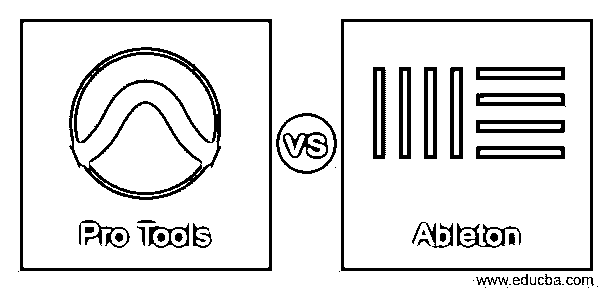
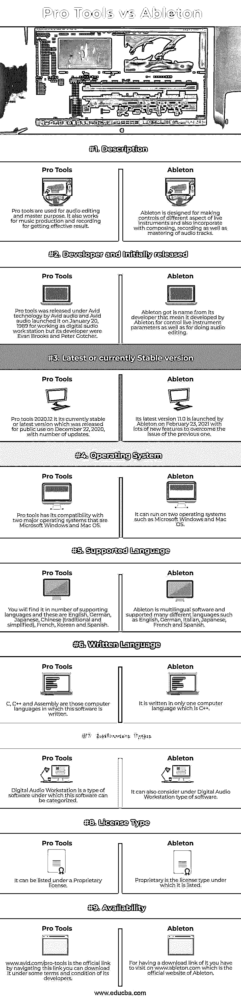

# 专业工具 vs Ableton

> 原文：<https://www.educba.com/pro-tools-vs-ableton/>

## Pro Tools 与 Ableton 的区别

Pro tools 是一个数字音频工作站，用于音频轨道的编辑和母带制作过程，在此过程中，它提供了许多可调参数。它还涉及声音和音乐的制作、录制和创作，以便为它们添加一些效果。Ableton 也是一个数字音频工作站，通常设计用于现场表演的乐器，也可以作为作曲、编曲、录音、混音和控制音乐和声音的软件。DJ 也使用它，因为它为节拍匹配、交叉渐变和添加许多不同类型的效果提供了广泛的控制。

今天，我将向您介绍这两款数字音频工作站软件的方方面面，以便您可以开始使用它们进行音频编辑和母带制作工作。

<small>3D 动画、建模、仿真、游戏开发&其他</small>

### Pro Tools 与 Ableton 的面对面比较(信息图)

以下是 Pro Tools 与 Ableton 的 9 大区别:

### Pro Tools 与 Ableton 的主要区别

Pro Tools 与 Ableton 之间的一些主要差异如下:

虽然这两个软件都用于相同类型的音频编辑工作，但它们的开发者内置了不同的功能来实现工作中的最佳效果。因此，现在让我们来讨论这些使它们彼此不同的内在特征。

*   拥有专有许可证，你必须为拥有这两个软件付费。Pro tools 根据用户的需求为他们提供不同类型的软件包，例如，您必须支付 299 美元的年费，这不是一个固定的价格，它可以根据其他功能和要求而变化。
*   Pro tools 提供的第二个包是一个永久许可，你必须支付 899 美元。它还为你提供了一个有限时期的免费试用版本。这使得不用支付任何费用就可以开始工作。
*   根据版本、功能等不同，价格也会有所不同。对于 Ableton Live 10，它的价格为 99 美元(Live Intro)，499 美元(Live Standard)，749 美元(Live Suite)。
*   对于 Ableton Live 10 box 版本，您必须支付 99 美元(Live Intro)、499 美元(Live Standard)和 799 美元(Live Suite)。您可以访问其官方网站，了解不同版本的包装计划的更多细节。
*   如果我说的是 Pro tools，那么它非常适合跟踪乐队，处理音频，编辑和掌握音频，音乐或声音的过程，而 Ableton 是一个稍微有点创意的工具，有很多插件和工具，可以做这种类型的创意工作，有很多趋势效果。
*   对于实时用户，Ableton 的界面分为两个视图，第一个是排列视图，第二个是会话视图。两种视图都用于管理不同的参数。使用 AbletonLive 可以利用音频样本或 MIDI 序列，用作安排现场播放的剪辑。这是 Ableton 的一个非常好的特点。
*   您可以单独操作 Pro 工具，也可以与各种模数转换器以及带有数字信号处理器的 PCIe 卡配合使用。

现在，通过上面讨论的要点，您可以提取一些标准细节来深入分析这两个软件。

### Pro Tools 与 Ableton 对比表

通过比较这两个软件，你会对它们的音频编辑能力有所了解，并知道你需要什么样的附件。

| **基础** | **专业工具** | 阿尔伯特 |
| **定义** | 专业工具用于音频编辑和母版制作。它也适用于音乐制作和录音，以获得有效的效果。 | Ableton 设计用于控制现场乐器的不同方面，还集成了作曲、录音以及音轨控制。 |
| **开发者和最初发布者** | Pro tools 由 Avid audio 以 Avid 技术发布，Avid audio 于 1989 年 1 月 20 日推出，作为数字音频工作站使用，但其开发者是 Evan Brooks 和 Peter Gotcher。 | Ableton 的名字来自它的开发者，这意味着它是由 Ableton 开发的，用于控制现场乐器参数以及进行音频编辑 |
| **最新或当前稳定的版本** | Pro tools 2020.12 是目前稳定的版本，也是 2020 年 12 月 22 日发布供公众使用的最新版本，有许多更新。 | 它的最新版本 11.0 由 Ableton 于 2021 年 2 月 23 日推出，有许多新功能来克服上一个版本的问题。 |
| **操作系统** | Pro tools 兼容微软 Windows 和 Mac OS 两大操作系统。 | 它可以在微软 Windows 和 Mac OS 等两种操作系统上运行。 |
| **支持的语言** | 你会发现它支持多种语言，包括英语、德语、日语、中文(繁体和简体)、法语、韩语和西班牙语。 | Ableton 是多语言软件，支持许多不同的语言，如英语、德语、意大利语、日语、法语和西班牙语。 |
| **书面语言** | C、C++和汇编是编写这种软件的计算机语言。 | 它只用一种计算机语言 C++编写。 |
| **软件类型** | 数字音频工作站是软件的一种类型，该软件可以被分类到该类型下。 | 它还可以考虑数字音频工作站下的软件类型。 |
| **许可证类型** | 它可以在专有许可证下列出。 | 专有是其所列的许可证类型。 |
| **可用性** | www.avid.com/pro-tools 是官方链接，通过导航这个链接，你可以根据开发者的一些条款和条件下载它。 | 要获得下载链接，你必须访问 www.ableton.com，这是阿尔伯特的官方网站。 |

我认为这些足以解释 Pro Tools 和 Ableton 的基本特性，你可以利用这些信息从你的角度理解这个软件。现在，我们将讨论使用 Pro Tools 和 Ableton 进行钻研的一些其他事实和特性。

### 结论

毫无疑问，Pro Tools 和 Abletonare 对您来说都不是新软件，因为在本文中，我们对这两个软件的不同方面进行了很好的讨论，以便更好地理解它们。你可以用这两个软件来做音频编辑工作，因为这两个软件在这方面都做得很好。

### 推荐文章

这是 Pro Tools vs Ableton 的指南。在这里，我们还讨论了 Pro Tools 与 Ableton 的主要区别，包括信息图表和比较表。您也可以看看以下文章，了解更多信息–

1.  [熊猫 vs NumPy](https://www.educba.com/pandas-vs-numpy/)
2.  [网页 vs 网站](https://www.educba.com/webpage-vs-website/)
3.  [PhoneGap vs Ionic](https://www.educba.com/phonegap-vs-ionic/)
4.  [Docker 容器 vs 图片](https://www.educba.com/docker-containers-vs-images/)

