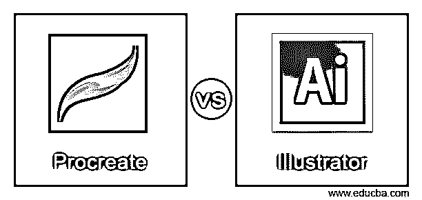
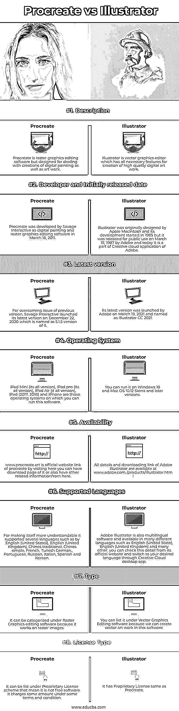

# 生育与插画

> 原文：<https://www.educba.com/procreate-vs-illustrator/>

## 生殖与插画的区别

Procreate 是一个光栅图形编辑器，但它也适用于直观的数字插图，并专注于数字绘画，以使插图或绘画生动。它是为 iOS 和 iPad 操作系统设计的，并提供了一些设计，以更好、更流畅的方式进行插图工作，而 Illustrator 是矢量图形编辑工具，用于由专业矢量图形编辑器设计高水平的插图工作。它也有几个设计工具以及功能，可以很容易地与向量设计参数。因此，让我们深入研究这两个软件。

### Procreate 与 Illustrator 的直接对比(信息图)

以下是 Procreate 和 Illustrator 之间的 8 大区别:

<small>3D 动画、建模、仿真、游戏开发&其他</small>

### 生殖与插画的主要区别

这两种软件都有自己的工作方法，并且它们以非常有效的方式完成工作，所以让我们讨论一下这种软件的特殊功能，以便收集更多关于它们的信息。

*   有一个关于生育的好处是，你可以通过一次性付款购买它，然后没有额外的费用为先进的功能和该软件的其他附件。您只需支付 9.99 美元就可以拥有它，在这个包中，您将拥有所有的工具和高级功能。
*   如果你想购买 Illustrator 的单个应用程序，那么你可以支付 239.88 美元作为年度订阅计划，并在此包中拥有所有高级功能和支持，或者如果你想购买整个 creative cloud 应用程序，那么你必须支付 599.88 美元作为年度计划，在此订阅后，你将拥有 Creative cloud 桌面应用程序的所有更新和其他附加功能。Adobe 为他们的用户提供免费试用期，以便他们可以首先了解他们的软件，与 illustrator 的情况相同，您将在有限的时间内免费试用。
*   Procreatesuch 支持许多文件格式，例如。psd，。png，。jpeg，。tiff，。gif，. mp4，.pdf，。hevc 和。Procreate(Procreate 的本地文件格式，这意味着它将使用这个扩展名作为默认文件格式来保存在其中设计的任何工作。).Illustrator 还支持多种文件格式，这使得它可以与其他软件兼容，例如。png，。jpeg，。jpg，。pdf，。svg，。eps，。ai(其原生文件格式)。您可以将 Ilustrator 文件导出到。dwg，。dxf，。bmp，。css，。tiff 和许多其他文件格式。
*   在制作过程中，你将拥有近 190 支画笔来创建有效的数字插图，这些画笔为你提供了一个可调的数据面板，可以根据你的工作要求对它们进行更改。
*   在 Illustrator 中，您还会发现一些带有可调参数面板的画笔设计，以及该软件的其他功能，如果您可以使用 Pathfinder 和其他技术以不同的方式组合形状，这些功能会使它更加有效。它还结合了排版设计，不仅排版，而且有三维效果，使一些三维形状。

这些都是两个软件的主要区别，足以让你更深刻地理解 produce 和 illustrator。

### Procreate 与 Illustrator 对比表

有了这两个软件，你可以做高水平的插图，但他们提供了自己的功能，为您提供一个用户友好的环境。所以我们先来讨论一下他们的特点。

| **基础** | **生育** | **插画师** |
| **定义** | Procreate 是一款光栅图形编辑软件，但它是为处理数字绘画和艺术品的创作而设计的。 | Illustrator 是一个矢量图形编辑器，具有创建高质量数字作品的所有必要功能。 |
| **开发者和最初发布日期** | Procreate 是由 Savage Interactive 于 2011 年 3 月 16 日开发的数字绘画和光栅图形编辑软件。 | Illustrator 最初由 Apple Macintosh 设计，其开发始于 1985 年，但它于 1987 年 3 月 19 日由 Adobe 发布供公众使用，今天它是 Adobe Creative cloud 应用程序的一部分。 |
| **最新版本** | 为了克服上一版本的问题，萨维奇互动于 2020 年 12 月 22 日推出了最新版本，命名为 5.1.5 版本 it。 | 其最新版本由 Adobe 于 2021 年 3 月 19 日推出，命名为 Illustrator CC 2021。 |
| **操作系统** | iPad Mini(其所有版本)、iPad Pro(其所有版本)、iPad Air(其所有版本)、iPad (2017、2018)和 iPhone 是那些可以运行该软件的操作系统。 | 可以在 Windows 10 和 Mac OS 10.12 Sierra 及更高版本上运行。 |
| **可用性** | www.procreate.art 是 procreate 的官方网站链接，通过访问这里，你可以有它的下载页面，也可以从这里获得其他相关信息。 | 有关 Adobe illustrator 的所有详细信息和下载链接，请访问 www . Adobe . com ./products/illustrator . html |
| **支持的语言** | 为了让自己更容易理解，它支持多种语言，如英语(美国)、英语(英国)、繁体中文、简体中文、法语、土耳其语、德语、葡萄牙语、俄语、意大利语、西班牙语和韩语。 | Adobe Illustrator 也是多语言软件，有许多不同的语言版本，如英语(美国)、英语(英国)和许多其他语言。你可以从它的官网查看这个细节，通过 Creative Cloud desktop app 切换到你想要的语言。 |
| **类型** | 它可以归类在光栅图形编辑软件下，因为它对光栅图像起作用。 | 你可以把它列在矢量图形编辑软件下，因为我们可以在这个软件中创建矢量艺术品。 |
| **许可证类型** | 它可以被列在专有许可计划下，这意味着它不是自由软件。它在某些条款和条件下收取一定的费用。 | 它拥有与生殖相同的专有许可。 |

我们讨论了许多关于 Procreate 和 Illustrator 的事实，所以我可以向你解释这两个软件的基本需求和功能。现在我将告诉你一些你应该知道的其他事实来理解这两个软件。

### 结论

现在你可以理解 Procreate 和 Illustrator 了，因为我向你解释了这两个软件所有可能的事实和特性。你可以分析这些事实来决定哪一个对你有好处。我建议你先试试这两款软件，这样你就能了解它们的用户界面以及它们的流畅程度？

### 推荐文章

这是一个指南生育与插画。在这里，我们还讨论了 Procreate 和 Illustrator 的关键区别，包括信息图表和比较表。您也可以看看以下文章，了解更多信息–

1.  [熊猫 vs NumPy](https://www.educba.com/pandas-vs-numpy/)
2.  [网页 vs 网站](https://www.educba.com/webpage-vs-website/)
3.  [PhoneGap vs Ionic](https://www.educba.com/phonegap-vs-ionic/)
4.  [Docker 容器 vs 图片](https://www.educba.com/docker-containers-vs-images/)

