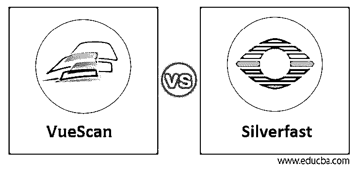
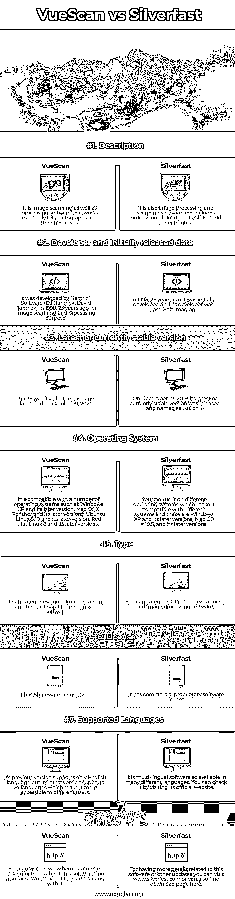

# VueScan vs Silverfast

> 原文：<https://www.educba.com/vuescan-vs-silverfast/>

## VueScan vs Silverfast 简介

VueScan 是一种处理图像扫描的计算机程序，特别适用于照片及其底片。它还可以对文本文件进行光学字符识别。你可以免费使用它，但它会在扫描图像上添加水印，直到你购买了它的许可证。而 SliverFast 是一组扫描和处理图像(包括文档、幻灯片和照片)的软件的名称。因此，这两种软件都用于扫描和处理图像和文本文件，但都有自己的方式，我们将在本文中讨论该软件的一些内容，以对它们进行分析。

VueScan 和 Silverfast 具有不同的参数和功能，用于以有效的方式执行工作，因此让我们看看这两个软件的基本特征，以便了解它们的基本信息。

<small>3D 动画、建模、仿真、游戏开发&其他</small>

### VueScan 与 Silverfast 的面对面比较(信息图)

以下是 VueScan 与 Silverfast 的 8 大区别:

### VueScan 和 Silverfast 的比较

|  | vuescan | **银固体** |
| **定义** | 图像扫描和处理软件特别适用于照片及其底片。 | 它也是图像处理和扫描软件，包括文档、幻灯片和其他照片的处理。 |
| **开发者和最初发布日期** | 它是由汉姆瑞克软件公司(Ed Hamrick，David Hamrick)于 23 年前的 1998 年开发的，用于图像扫描和处理目的。 | 26 年前的 1995 年，它被首次开发出来，它的开发者是 LaserSoft Imaging。 |
| **最新或当前稳定的版本** | 9.7.36 是它的最新版本，于 2020 年 10 月 31 日推出。 | 2019 年 12 月 23 日，其最新或当前稳定版本发布，命名为 8.8。或者 18 岁 |
| **操作系统** | 它与许多操作系统兼容，例如 Windows XP 及其更高版本、Mac OS X Panther 及其更高版本、Ubuntu Linux 8.10 及其更高版本、Red Hat Linux 9 及其更高版本。 | 你可以在不同的操作系统上运行它，这使得它与不同的系统兼容，这些系统包括 Windows XP 及其更高版本，Mac OS X 10.5 及其更高版本。 |
| **类型** | 它可以在图像扫描和光学字符识别软件下分类。 | 可以在图像扫描和图像处理软件中进行分类。 |
| **执照** | 它具有共享软件许可类型。 | 它拥有商业专有软件许可证 |
| **支持的语言** | 它以前的版本只支持英语，但它的最新版本支持 24 种语言，这使得它更容易被不同的用户使用。 | 它是多语言软件，有许多不同的语言版本。你可以通过访问它的官方网站来查看。 |
| **可用性** | 您可以访问[www.hamrick.com](https://www.hamrick.com/)获取该软件的更新，也可以下载该软件并开始使用。 | 想了解更多关于这个软件或其他更新的细节，你可以访问[www.sliverfast.com](https://www.silverfast.com/silverfast9/)或者在这里找到下载页面。 |

这些事实将非常有助于你对这两个软件的分析，你可以更好地理解它们。现在让我告诉你关于 VueScan 和 Silverfast 的其他重要事实和细节。

### VueScan 和 Silverfast 的主要区别

文章的这一部分将会涵盖很多关于这个软件的信息，比如它们的价格或者你如何订阅它？它们是如何工作的？在本节中，您将了解更多内容。

这两个软件的价格是我们首先关注的，所以要让 VueScan 开始使用它，你可以使用它提供的两个不同的软件包。第一个是标准版包，你可以支付 39.95 美元，第二个是专业版，你可以支付 79.95 美元。在专业版，你将有无限的免费升级，支持原始扫描文件，先进的 IT8 色彩校准。它还向用户提供所有高级功能的免费试用，以便用户在开始使用它之前可以先了解它的界面。

然而，如果我们谈论 Silverfast，那么它会提供不同类型的包，例如从 SilverFast HDR 到 HDR 工作室的升级，您必须支付 199 美元，从 SilverFast HDR 到 HDR 工作室的防光支付 679 美元，从 SilverFast Ai 6.x 到 HDR 工作室(升级)的支付 399 美元，完整版支付 499 美元。

SliverFast 是一种昂贵的软件，它可以为您提供良好的扫描图像颜色，并为其用户提供流畅的工作环境，而 VueScan 是一种廉价的图像扫描和处理软件，可以提供最佳的高质量原始扫描，但颜色不如 SliverFast。您可以通过将它与 ColorPerfect 配对来提高其色彩质量。

SliverFast 可以扫描 23 . 5 秒(预扫描)和 3 分 20 秒。(使用 IR)从银色快速 Tiff 进行 NLP 转换需要 9 . 5 秒。VueScan 可以进行 15 秒(预览)和 2 分 4 秒的扫描。(带 IR)。对于 DNG vue scan 的 NLP 转换，需要 10 . 5 秒。(这是一次照片扫描的时间)

VueScan 可以制作 16 位文件，而 SilverFast 只能制作 8 位文件，VueScan 文件是每张照片 108 MB，而 SilverFast 只能提供 54 MB。

VueScan 创建 DNG raw 文件，SilverFast 创建 Tiff 文件。如果你想调整任何图像的高光和阴影，那么在 SilverFast 中，你可以通过使用直方图特征来实现，而在 VueScan 中，这需要更多的步骤。

我们认为这些信息足以理解 VueScan 和 SilverFast 是什么，以及它们如何在工作中提供最佳结果。

### 结论

现在，您可以说 VueScan 和 SilverFast 是您熟悉的两个软件，您手中有许多关于它们的信息，这些信息将帮助您决定哪一个软件更适合您，以便在图像扫描和处理中获得有效的结果。

### 推荐文章

这是一个关于 VueScan vs Silverfast 的指南。在这里，我们讨论简介、VueScan 与 Silverfast 之间的比较以及主要差异。您也可以看看以下文章，了解更多信息–

1.  [Vectorworks vs ArchiCAD](https://www.educba.com/vectorworks-vs-archicad/)
2.  [卢邦图诉徐本图](https://www.educba.com/lubuntu-vs-xubuntu/)
3.  [MyBatis vs Hibernate](https://www.educba.com/mybatis-vs-hibernate/)
4.  [Minitab vs SPSS](https://www.educba.com/minitab-vs-spss/)

