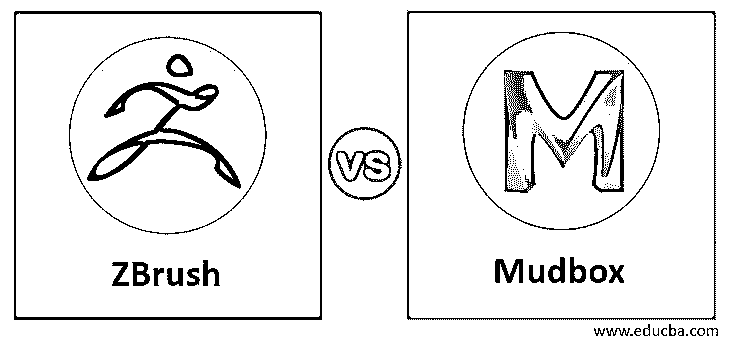
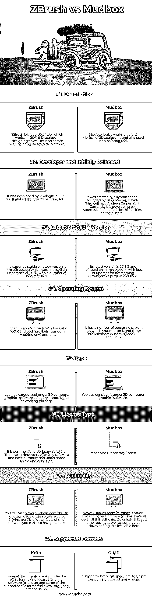

# ZBrush vs Mudbox

> 原文：<https://www.educba.com/zbrush-vs-mudbox/>

## ZBrush vs Mudbox 简介

ZBrush 是一个雕刻工具，它在一个数字平台上工作，为该雕塑提供 3D/2.5D 建模、绘画和纹理。它拥有专有的 pixol 技术，可以存储照明、材质、颜色、方向和深度信息，这些信息将与使所有对象出现在屏幕上的点结合在一起。Mudbox 是基于计算机的专有 3D 雕刻和绘画工具。该软件的一个主要应用是创建高分辨率的数字雕刻、绘画、纹理、位移，以及创建法线贴图。它使用这些特征作为雕塑设计工具。简而言之，两者都是为了获得高水平的雕塑设计。

ZBrush 和 Mudbox 有它们不同需求和功能，所以你可以很容易地处理它们，而且在开始使用任何一个软件之前了解它们是必要的。

<small>3D 动画、建模、仿真、游戏开发&其他</small>

### ZBrush 与 Mudbox 的直接对比(信息图)

以下是 ZBrush 与 Mudbox 之间的 8 大区别:

### ZBrush 与 Mudbox 的比较

现在，我们将告诉你什么是你知道的基本要求，使这个软件成为你的数字雕刻和绘画工作的宠物软件。

|  | **ZBrush** | **泥箱** |
| **定义** | ZBrush 是一种用于 3D/2.5 D 雕塑设计以及在数字平台上绘画的工具。 | Mudbox 还致力于 3D 雕塑的数字设计，也用作绘画工具。 |
| **开发者和最初发布者** | 它是由 Pixologic 在 1999 年开发的数字雕刻和绘画工具。 | 它由 Skymatter 创建，由 Tibor Madjar、David Cardwell 和 Andrew Camenisch 创办。目前，它正由 Autodesk 开发，并为其用户提供了许多设施。 |
| **最新或稳定版本** | 它目前稳定或最新的版本是 ZBrush 2021.5.1，于 2020 年 12 月 21 日发布，具有许多新功能。 | 它的最新版本是 2018.2，于 2018 年 3 月 14 日发布，为克服以前版本的缺点进行了大量更新。 |
| **操作系统** | 它可以在微软视窗和 OS X 上运行，两者都为它提供了一个流畅的工作环境。 | 它有许多操作系统，你可以在这些系统上运行，包括微软视窗、Mac OS 和 Linux。 |
| **类型** | 根据其工作目的，它可以被归入 3D 计算机图形软件类别。 | 可以考虑在 3D 电脑绘图软件下。 |
| **许可证类型** | 它是商业专有软件。这意味着它不提供自由软件，并且在某些条款和条件下有授权。 | 它还有一个专有许可证。 |
| **可用性** | 你可以访问[www.pixologic.com/zbrush](http://pixologic.com/zbrush/features/overview/)下载这个软件或者了解这个软件的其他细节，你也可以在这里浏览。 | www.Autodesk.com/mudbox 是官方链接，访问这里你可以了解这个软件的所有细节。下载链接和其他条款，以及下载的条件，可在这里 |

我们告诉了你所有关于 ZBrush 和 Mudbox 的重要信息，这样你就可以在心里建立一个关于它们的良好基础，并从上面讨论的要点中提取必要的细节。现在我们将讨论 ZBrush 和 Mudbox 的高级特性和事实，这样我们可以对这两个软件有更多的了解。

### ZBrush 和 Mudbox 的主要区别

在本节中，您将了解两种软件的一些高级特征，通过分析它们，您可以非常容易地区分这两种软件。所以让我们来讨论一下。

首先，我们将告诉你购买软件的计划，ZBrush 提供不同类型的软件包，对于单个用户，你必须每月支付 35.95 美元。您还将拥有该软件包中的所有高级功能。

第二个是 6 个月的单用户订阅，对于 ZBrush 的这个包，你必须支付 179.95 美元。你将会在每月计划中找到所有这些特点。

对于单个用户，ZBrush 的永久许可需要支付 895 美元，并且是一年的一次性支付。所有将自动重新计费每月或每年，你可以随时取消。

现在，如果我们告诉你关于 Mudbox，那么它也为你提供三种类型的包，这些是你必须支付 90 美元的年度订阅，每月订阅你应该支付 10 美元，第三种是 3 年订阅包。您可以支付 245 美元购买它，并可以从 Autodesk 的官方网站上查看其他相关信息。

你可以选择免费试用 ZBrush，但是在 Mudbox 中，没有提供任何类型的服务。

如果你使用 ZBrush，那么它使用 ZRemesher 工具来创建拓扑，而 Mudbox 使用 Retopologize 来创建相同类型的拓扑。这样，两个软件做相同类型的工作，但有自己的技术。

贴图烘焙是雕刻过程的一个步骤，ZBrush 有一点点不同的方法。它需要细分多边形网格，并将细节投影到细分的几何体中。之后，它会计算法线，并在最终几何体上绘制置换贴图。

同样，Mudbox 更容易操作，使用起来也更灵活。在 Mudbox 中，您可以选择相同类型的几何体，然后在不同的级别或全新的几何体上工作。

Mudbox 有一个非常简单的用户界面，可以非常流畅地处理，但在高多边形数的情况下，笔刷会变得笨拙，如果你在非常低的多边形数上工作，那么它会破坏两边不在完全相同位置的顶点的对称性。另一方面，如果你尽全力去学习，你会发现 ZBrush 很容易掌握。

这些是 ZBrush 和 Mudbox 的一些特殊事实和特性，现在您可以从这里找到与您的需求相关的细节。

### 结论

阅读完这篇文章后，你已经收集了许多关于 Zbrush 和 Mudbox 的有用信息和数据。这些细节将帮助你很好地分析这个软件，并帮助你作出决定，哪个软件将有利于你做雕塑和绘画的数字设计？

### 推荐文章

这是一个 ZBrush vs Mudbox 的指南。这里我们讨论一下入门，ZBrush 和 Mudbox 的比较。您也可以看看以下文章，了解更多信息–

1.  [Vectorworks vs ArchiCAD](https://www.educba.com/vectorworks-vs-archicad/)
2.  [NativeScript vs Ionick](https://www.educba.com/nativescript-vs-ionic/)
3.  [MyBatis vs Hibernate](https://www.educba.com/mybatis-vs-hibernate/)
4.  [OpenGL vs DirectX](https://www.educba.com/opengl-vs-directx/)

