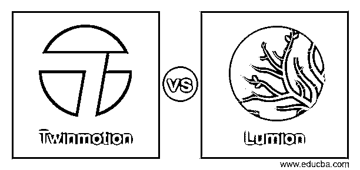
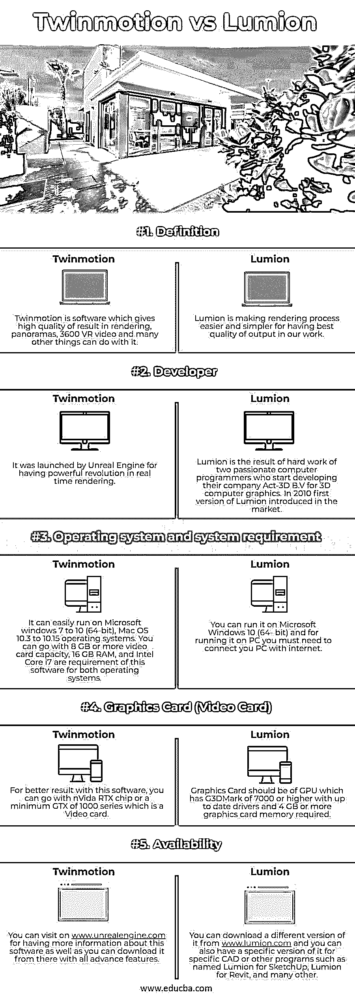

# Twinmotion vs Lumion

> 原文：<https://www.educba.com/twinmotion-vs-lumion/>

## Twinmotion vs Lumion 简介

Twinmotion 是一种实时 3D 渲染软件，它可以在几秒钟内生成高质量的图像、全景图、360 0 VR 或标准质量的视频。它涉及许多部门和领域，如建筑，施工，园林专业人士，城市规划，也有直观的图标驱动的界面，具有史诗游戏的虚幻引擎的力量。Lumion 也是实时 3D 软件，这意味着当我们将模型导入其中以获得美丽的结果、360 0 全景图或模型视频时，它使渲染过程变得简单易行。

我将告诉你这两个软件和它们的功能，以便向你解释它们，这样你就可以获得关于这两个软件的良好信息。

<small>3D 动画、建模、仿真、游戏开发&其他</small>

### Twinmotion 与 Lumion 的面对面比较(信息图)

以下是 Twinmotion 与 Lumion 之间的 5 大区别:

### Twinmotion 与 Lumion 的比较

你认为这个软件是用于相同类型的工作，那么他们的不同方面是什么？你可以在这篇文章中找到答案。

|  | **双动** | 卢米恩 |
| 定义 | Twinmotion 是一款在渲染、全景、360 度虚拟现实视频和许多其他事情上提供高质量结果的软件。 | Lumion 正在使渲染过程变得更容易和简单，以便在我们的工作中获得最佳质量的输出。 |
| 开发者 | 它是由虚幻引擎推出的，因为它在实时渲染方面带来了强大的变革。 | Lumion 是两位充满激情的计算机程序员努力工作的结果，他们开始为 3D 计算机图形开发他们的公司 Act-3D B.V。2010 年，Lumion 的第一个版本上市。 |
| 操作系统和系统要求 | 它可以在 Microsoft windows 7 到 10 (64 位)、Mac OS 10.3 到 10.15 操作系统上轻松运行。您可以选择 8 GB 或更大的显卡容量、16 GB RAM 和英特尔酷睿 i7，这是这两种操作系统对该软件的要求。 | 您可以在 Microsoft Windows 10 (64 位)上运行它，要在 PC 上运行它，您必须将 PC 连接到互联网。 |
| 图形卡(显卡) | 为了更好地使用这个软件，你可以使用英伟达 RTX 芯片或最低 GTX 1000 系列的显卡。 | 图形卡应为 GPU，其 G3DMark 为 7000 或更高，需要最新的驱动程序和 4 GB 或更多的图形卡内存。 |
| 有效性 | 你可以访问 www.unrealengine.com，了解更多关于这款软件的信息，也可以从那里下载所有高级功能。 | 你可以从[www.lumion.com](https://lumion.com/)下载它的不同版本，你也可以为特定的 CAD 或其他程序提供它的特定版本，如 SketchUp 的 Lumion、Revit 的 Lumion 和许多其他程序。 |

我试图向您解释 Twinmotion 和 Lumion 软件的基本功能和要求，以便您能够从最基本的层面理解它们，并与它们进行交互。现在，您将浏览这些软件的一些高级功能和事实，以便根据它们的特殊事实进行分析。

### Twinmotion 和 Lumion 的主要区别

我想在我们讨论这些软件的其他事实之前，你必须知道它们的价格。不同版本的 Twinmotion 有不同类型的价目表。Twimotion 向用户提供两种类型的设施，其中一种用于商业目的，另一种用于教育目的。出于商业目的，2020 版的 Twinmotion 必须支付 499 美元，而且是永久许可。此价格可能因地区而异，可能包括必要的税费，但 Epic Engine 提供 25%的折扣，并提供免费升级选项，但此优惠仅截止到 2021 年 12 月 31 日。如果你是教育工作者或学生，那么你可以使用它的教育版，Epic engine 不会为此收取任何费用。你将有一些先进的功能，这个软件在 EDU 版本也。

Lumion 也有不同的版本和不同的价格，例如 Lumion 你必须支付不同的费用，Lumion Pro 8 你必须支付 249 美元。因此它根据版本以及该包的特性而变化。你可以从它的官方网站上了解它的全部细节。与 Twinmotion 一样，出于教育目的，您也可以免费获得 Lumion 的学生或教师版本。在渲染中只会有 Lumion 的小水印，它在这个免费版本中也提供了 Lumion 11 pro 的功能。您不能将已保存的教育版项目打开为商业版，因为教育版用于非商业目的。

如果你认为 Lumion 是建模软件，那么它不是。您可以在其中导入不同软件的模型资源，或者使用库资源，但它也提供了各种对象，如树木、动物、道具、人物、灯光和家具。您可以对这些对象进行一些更改，例如它们的方向和颜色，但不能更改该对象中的任何内容。它还为您提供了广泛的材料，您可以在模型设计的内部或外部部分的对象上使用这些材料。

Twinmotion 引入了一些不同的功能，可以提供尽可能高质量的渲染结果，即使任何组件的最小细节都可以在其渲染中看到。它还具有全局照明功能，在光照环境下，给太阳和天空更真实的外观。

难道你不认为这是 Twinmotion 和 Lumion 的一些信息，用于在这些软件中实时渲染和编辑我们导入的作品。

### 结论

如果你想开始使用我们上面讨论过的任何一个软件，并且想先了解它们的工作原理，那么你可以使用它们的教育版，一旦你对它们的方法和输出满意，那么你可以尝试商业版本用于商业目的，并且可以使用它们进行高水平的专业工作。

### 推荐文章

这是 Twinmotion vs Lumion 的指南。在这里，我们分别通过信息图和比较表来讨论 Twinmotion 和 Lumion 的主要区别。您也可以看看以下文章，了解更多信息–

1.  [WebGL vs OpenGL](https://www.educba.com/webgl-vs-opengl/)
2.  [DirectX vs Vulkan](https://www.educba.com/directx-vs-vulkan/)
3.  [AutoCAD vs SolidWorks](https://www.educba.com/autocad-vs-solidworks/)
4.  [AutoCAD vs FreeCAD](https://www.educba.com/autocad-vs-freecad/)

