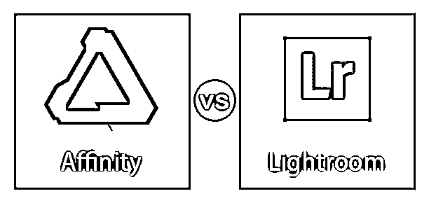
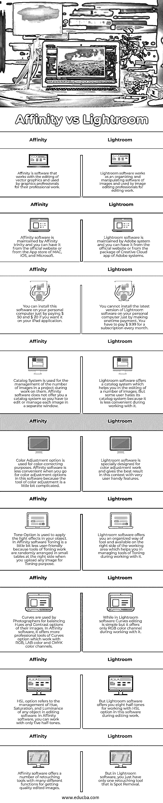

# 亲和力与 Lightroom

> 原文：<https://www.educba.com/affinity-vs-lightroom/>

## Affinity 和 Lightroom 之间的区别

Serif 开发了 affinity 软件作为矢量图形编辑软件，但 Adobe Inc .开发了 lightroom 作为图像组织和处理软件。这两种软件的工作方式相同，但它们有自己的技术来使自己的工作不同于其他软件。您可以让这两个软件与 Windows、MAC OS、IOS 兼容，并在您的专业工作中享受它们。在本文中，我们将讨论这两个软件的一些标准，以便理解这两个软件。在这些标准中，我们将包括两个软件的“比较表”，它们的“关键差异”点和一些其他重要方面，以便我们能够彻底理解它们。

让我们先看一下这两个软件的比较表，这样我们就可以对这个软件的重要特性做出判断，并利用它们来进行图形编辑。

<small>3D 动画、建模、仿真、游戏开发&其他</small>

### Affinity 和 Lightroom 之间的直接比较(信息图表)

以下是 Affinity 与 Lightroom 之间的十大比较:

现在，让我们来了解一下这款软件的主要区别，以便更好地了解这两款软件的基本特性。

### Affinity 和 Lightroom 之间的主要区别

让我们讨论一下 Affinity 和 Lightroom 之间的一些主要区别:

#### 亲和软件

Serif 开发了这个软件作为矢量图形的编辑器，并兼容微软 Windows，MAC OS，iOS。它最初于 2014 年 10 月发布，提供英语、西班牙语、法语、意大利语等约 9 种语言版本。你可以从[www.affinity.serif.com](https://affinity.serif.com/en-us/)链接获得这个软件，并在你的个人电脑上毫无困难地享受它。

#### Lightroom 软件

它是 Adobe Systems 开发的图像组织和处理软件。现在它是 Adobe system 的 Creative Cloud 应用程序家族的一部分。该软件与 Microsoft Windows、MAC OS、iOS、Android 和 tvOS 兼容。这个软件的工作原理是图像编辑的非破坏性方法，就像 Photoshop 软件一样。非破坏性意味着它不会损害你的原始文件格式的任何图像在编辑工作。你可以通过[www.adobe.com](https://www.adobe.com/)链接下载这个软件，并在你的个人电脑上享受它的一些令人兴奋的功能。

### Affinity 与 Lightroom 的比较表

让我们来看看 Affinity 和 Lightroom 之间的主要比较。

| **亲和力** | **灯箱** |
| affinity 是一款用于编辑矢量图形的软件，由图形专业人员用于他们的专业工作。 | Lightroom 软件是一种组织和操作图像的软件，供图像编辑专业人员用于编辑工作。 |
| Affinity 软件由 Affinity trinity 维护，你可以从官网安装，也可以从 MAC、iOS、微软的 App store 安装。 | Lightroom 软件由 Adobe system 维护，你可以从官网安装，也可以从 Adobe systems 的 Creative Cloud app 的包中安装。 |
| 你可以在你的个人电脑上安装这个软件，只要支付 50 美元和 20 美元，如果你想在你的 iPad 应用程序上安装的话。 | 您不能仅通过一次性付款在您的个人计算机上安装最新版本的 Lightroom 软件。你必须每月支付 9.99 美元的订阅费。 |
| 目录系统用于在处理图像时管理项目中的图像数量。Affinity 软件没有为您提供目录系统，因此您必须在单独的窗口中编辑或管理每个图像。 | Lightroom 软件提供了一个目录系统，可以帮助您编辑大量图像。但是一些用户讨厌它的目录系统，因为它在使用时不太方便。 |
| 色彩调整选项用于色彩校正。当你在 Affinity 软件中选择颜色调整选项时，它不太方便，因为颜色调整工具有点复杂。 | Lightroom 软件是专为色彩调整工作而设计的，它提供了非常方便用户的功能，可以在这种情况下获得最佳效果。 |
| 色调选项用于将灯光效果应用到您的对象。在 Affinity 软件中，调色有点不太用户友好，因为当你上传任何图像进行调色时，调色工作的工具随机排列在右侧的小表格中。 | Lightroom 软件为您提供了一种有组织的工具方式，并在工作区的右侧提供，这有助于您在使用它时管理调色工具。 |
| 摄影师使用曲线来平衡图像的色调和对比度。在 Affinity 软件中，它提供了更专业的曲线选项工具，可以处理 RGB、LAB 颜色和 CMYK 颜色通道。 | 而在 Lightroom 软件中，曲线编辑很简单，但在使用它的过程中，它只提供了一个 RGB 颜色通道。 |
| HSL 选项是指在编辑软件中管理任何对象的色调、饱和度和亮度。在 Affinity 软件中，您只能使用五种半色调。 | 但是 Lightroom 软件为您提供了八种半色调，用于在编辑工作期间使用该软件中的 HSL 选项。 |
| Affinity 软件提供了许多修图工具，具有许多不同的功能，可以获得高质量的编辑图像。 | 但是在 Lightroom 软件中，你只有一个修饰工具，那就是去除污点。 |

现在看完对比表，你就很容易理解这两款软件的主要特点了，这些特点让它们有所不同。当您开始与任何人合作时，您可能已经从项目工作的环境中受益于这些功能。

### 结论

现在您必须了解“什么是 Affinity 软件和 Lightroom 软件？”以及‘这两款软件的主要比较点是什么？’分析完这几点，你就能明白这个软件在图形编辑工作中的用途了。您还可以提高您的矢量图形编辑工作技能，并利用您的技能获得高水平的专业工作。

### 推荐文章

这是 Affinity vs Lightroom 的指南。我们讨论信息图和比较表的主要区别。您也可以浏览我们的其他相关文章，了解更多信息——

1.  [ACDSee 与 Lightroom |主要区别](https://www.educba.com/acdsee-vs-lightroom/)
2.  [暗台 vs 灯箱综合指南](https://www.educba.com/darktable-vs-lightroom/)
3.  [Maya vs Blender |详细对比](https://www.educba.com/maya-vs-blender/)
4.  [Photoshop Elements vs Lightroom](https://www.educba.com/photoshop-elements-vs-lightroom/)

