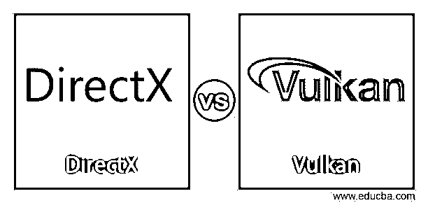
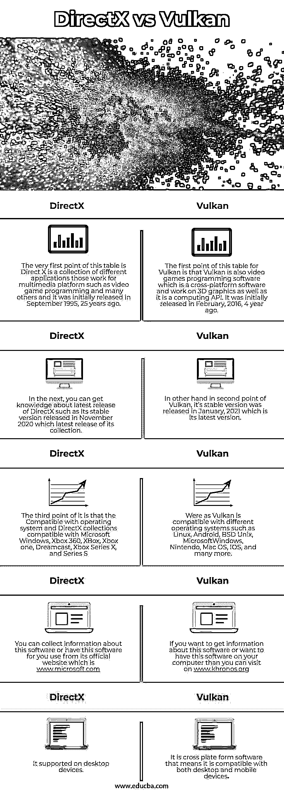

# DirectX vs Vulkan

> 原文：<https://www.educba.com/directx-vs-vulkan/>

## DirectX vs Vulkan 简介

DirectX 是由微软开发的不同应用程序的集合，该集合特别包含与多媒体平台相关的程序，例如游戏编程和其他媒体领域。DirectX 的集合以 Direct3D、DirectDraw、DirectPlay 等直接词开头。另一方面，Vulkan 是一个跨平台的 3D 图形和计算软件。它还可以轻松地执行游戏编程以及多媒体相关任务。今天，在这篇文章中，我们将讨论这两个软件，通过不同的要点来比较它们。那么让我们看看这些点是什么？

在本文中，我们将首先讨论比较表，这样我们就可以了解这两种软件的重要特性、系统需求、支持的文件格式以及许多其他信息。

<small>3D 动画、建模、仿真、游戏开发&其他</small>

### DirectX 与 Vulkan 的面对面比较(信息图表)

以下是 DirectX 与 Vulkan 之间的 5 大区别:

### DirectX 与 Vulkan 对比表

下面是 DirectX 和 Vulkan 的比较表，其中有许多点为我们提供了有关这两个软件的主要功能和行为的信息。所以让我们逐一讨论。

| **DirectX** | Vulkan |
| 此表的第一点是 Direct X 是一个不同应用程序的集合，这些应用程序用于多媒体平台，如视频游戏编程和许多其他应用程序，它最初于 25 年前的 1995 年 9 月发布。 | Vulkan 的这个表格的第一点是，Vulkan 也是视频游戏编程软件，它是一个跨平台软件，在 3D 图形上工作，也是一个计算 API。4 年前的 2016 年 2 月首次发布。 |
| 接下来，您可以了解 DirectX 的最新版本，例如 2020 年 11 月发布的稳定版本，以及它的最新版本。 | 另一方面，在 Vulkan 的第二点中，其稳定版本于 2021 年 1 月发布，这是其最新版本。 |
| 它的第三点是与操作系统兼容，DirectX 系列兼容微软 Windows、Xbox 360、Xbox、Xbox one、Dreamcast、Xbox X 系列和 S 系列 | Were as Vulkan 兼容不同的操作系统，如 Linux、Android、BSD Unix、MicrosoftWindows、Nintendo、Mac OS、IOS 等等。 |
| 您可以从该软件的官方网站[www.microsoft.com](https://www.microsoft.com/)收集关于该软件的信息或让您使用该软件 | 如果你想获得关于这个软件的信息或者想在你的电脑上安装这个软件，你可以访问 www.khronos.org |
| 它支持桌面设备。 | 这是一个跨平台的软件，这意味着它可以兼容桌面和移动设备。 |

现在，在浏览了本文中两个软件的比较表之后，我认为您已经对该软件有了基本的了解，并且非常清楚这两个软件各自的系统要求以及可以从哪里获得它们。现在让我们来讨论一下 DirectX 和 Vulkan 之间的区别，以便我们对它们有一个更清楚的认识。

### DirectX 与 Vulkan 的主要区别

在 eduCBA 文章的这一部分中，我们将根据该软件的特性和基本参数，从不同的角度讨论该软件的不同之处。所以这些区别如下:

*   DirectX 的最新版本是 DirectX11，它是一个低级的 API(应用程序编程接口),不同于经典的 API。DirectX 的现代版本是高效的，因为它是单线程 API，可以轻松地与多线程一起工作。另一方面，Vulkan 的最新版本没有添加 API 开销测试的最新功能。
*   如果两个软件的硬件设置相同，那么与 DirectX 相比，windows 7 上的 Vulkan 提供 303.4 fps，而 Windows 7 上的 DirectX 提供 270.6 fps，这意味着在这种情况下 Vulkan 优于 Direct X。
*   DirectX 是 APl 集合，这意味着它是应用编程接口，而 Vulkan 是 OpenGL 软件，这意味着它是开放图形库应用软件。
*   与 DirectX 集合(如 Direct3D 11、Direct3D 12 等)相比，Vulkan 的性能以及 CPU/GPU 的使用更加均衡。
*   Vulkan 具有相对于 DirectX 11 的较低级别的 API，并且它以高质量的结果呈现 2D 图形，因为它以更好的方式在 CPU 核心之间分配工作。
*   API 自开发以来有着巨大的历史，因此它有着广泛的支持者，每个游戏开发者都将其视为其程序的首选，如果我们着眼于 Vulkan，那么它也有很多支持者，但他们现在很有限，因为它的开发晚于 DirectX，但它正在以一种渐进的方式不断明确其道路。
*   所有大多数游戏都建立了与 DirectX 和 Vulkan 兼容的功能，但 Vulkan 对 Android 平台和模拟器有广泛的影响，而 Direct X 与 Windows 平台兼容，这是它的地盘。
*   DirectX 完全由微软设计和开发，而 Vulkan(即 OpenGL)由 Khronos 维护，其底层驱动程序由 Nvidia 等独立供应商开发。
*   Vulkan 的开发者 Khronos 是一家非盈利公司，因为它提供开源程序，而微软是一家盈利公司。
*   Vulkan OpenGL 有其子类别 OpenGL ES，其中 ES 代表嵌入式设备，该类别广泛用于维护嵌入式设备中的图形标准。这个东西让 Vulkan 比 DirectX 好。
*   DirectX 要求 Microsoft Windows 作为操作系统，而它是独立于操作系统的。

这些是使两个软件彼此不同的一些具体点。

### 结论

我想现在你可以很容易地理解哪些软件具有什么样的品质，使它们在自己的领域中与众不同，现在你可以根据我们上面讨论的特性来分析 DirectX 和 Vulkan。我建议你必须一个接一个地尝试这两个软件，这样你就可以在不同的环境中为它们发展你自己的观点。

### 推荐文章

这是 DirectX vs Vulkan 的指南。在这里，我们将讨论简介、与信息图的直接比较、主要差异和比较表。您也可以看看以下文章，了解更多信息–

1.  [Arduino Nano vs Mini](https://www.educba.com/arduino-nano-vs-mini/)
2.  [IaaS vs PaaS vs SaaS](https://www.educba.com/iaas-vs-paas-vs-saas/)
3.  [微软团队 vs Slack](https://www.educba.com/microsoft-teams-vs-slack/)
4.  [内部与外部](https://www.educba.com/on-premise-vs-off-premise/)

