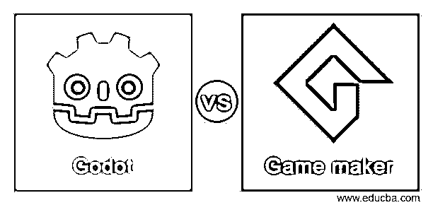
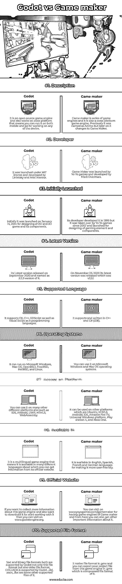

# 戈多 vs 游戏制作人

> 原文：<https://www.educba.com/godot-vs-game-maker/>

## Godot 和游戏制作者的区别

Godot 是由麻省理工学院授权发布的跨平台游戏引擎，致力于创造和设计不同类型的视频游戏。它是由 Linietsky 和 Ariel Manzur 为几家公司开发的，但后来它被推出供公众使用。您可以玩节点，并对其参数进行不同类型的更改，以便用该软件在游戏设计中获得良好的效果。Game Maker 不是一个游戏引擎，但它是一系列游戏引擎，由余淼游戏公司开发，但它的创始人是马克·奥维马斯，拥有许多 2D 和 3d 游戏的优秀功能。在这个主题中，我们将学习 Godot vs Game maker。

现在让我告诉你更多关于这两个软件的信息，以吸引你对其他事实的注意，以及这些软件的重要功能，这样我们可以更好地向你解释它们。

<small>3D 动画、建模、仿真、游戏开发&其他</small>

### Godot 和 Game maker 之间的正面比较(信息图)

以下是 Godot 和 Game maker 之间的主要区别

### Godot 和 Game Maker 的主要区别

正如我们上面告诉你的，这两个软件是由不同的开发者在不同的年份开发的，所以它们包含了这些软件的一些特殊功能。现在让我们也来讨论一下。

Godot 是一个开源程序，在麻省理工学院的许可下，这意味着它可以完全免费使用，并提供许多好的功能，由于麻省理工学院的许可，开发者必须在其项目中提及麻省理工学院的版权。如果我们告诉你关于 Game Maker，那么你可以有 30 天的免费试用，与它的用户界面互动，并了解它的工作。它在付费版本中提供了三种类型变化，这意味着创建者必须支付 3 美元，开发人员支付 99 美元，控制台支付 99 美元。

如果你开始与 Godot 合作，那么你会有创新的设计，高度特色的 3d 图形，也有良好的 2D 游戏设计环境，而与 Game Maker 你会有 YoYo 帐户，向后兼容，还有笔记本电脑模式。

Game Maker 还支持 3D 游戏，您可能会面临 3D 设计性能方面的困难，以及 Godot 中缺乏自动 LODs。游戏制造商对 OOP 的支持有限，而且你必须为每个出口平台购买它。还有一件事我们会告诉你，游戏制造商没有最好的脚本语言，而在 godot 中有这样的问题，你会发现在 Godot 中基于 Python 的 GDScript。

现在你已经了解了 Godot 和 Game Maker 的其他重要方面，这是决定你必须选择哪一个来开始你的 2D 和 3D 游戏设计所必需的。

### Godot 与 Game Maker 的比较:

通过这些要点，你可以找到一些关于这些软件的重要术语，这些术语在你的头脑中建立了良好的基础知识，使你能够使用正确的术语。

|  | **戈多** | **游戏制作者** |
| **定义** | 它是一个开源游戏引擎，也可以在跨平台上运行，这意味着你可以在任何设备上运行它。 | Game maker 是一系列游戏引擎，也是一个跨平台的游戏引擎。以前它被命名为 Animo，但后来它改变了游戏制造商。 |
| **开发者** | 它是在麻省理工学院的许可下推出的，由 Linietsky 和 Ariel Manzur 开发。 | Game Maker 由余淼游戏公司推出，由马克·奥维马斯开发。 |
| **最初推出** | 最初，它于 2014 年 1 月 14 日推出，用于设计 2D 和 3D 游戏及其组件。 | 它的开发商在 1999 年开发了它，但自 2007 年以来，它被余淼游戏公司接管，并开始设计游戏元素和组件。 |
| **最新版本** | 其最新版本于 2020 年 9 月发布，命名为 3.2.3 版本。 | 2020 年 11 月 23 日，其最新版本 v2.3.1 发布 |
| **支持的语言** | 它支持 C#，C++。GDScript 以及可视化脚本作为 it 编程语言。 | 它支持用 C++和 C# (IDE)编写。 |
| **操作系统** | 它可以在 Microsoft Windows、Mac OS、OpenBSD、FreeBSD、NetBSD 和 Linux 上运行。 | 您可以在 Microsoft Windows 和 Mac OS 操作系统上使用它。 |
| **进入平台** | 你也可以在许多其他不同的平台上使用它，如 iOS，Android，UWP，HTML5，WebAssemby。 | It can be used on other platforms which are Ubuntu, HTML5,

安卓、iOS、亚马逊 Fire TV、通用 Windows 平台、Play station 4、Xbox One。

 |
| **在**中可用 | 这是一个多语言游戏引擎，这意味着它可以在许多不同的语言，你可以从它的官方网站上获得信息。 | 它有英文、西班牙文、法文和德文版本，以便于用户使用。 |
| **官网** | 如果你想收集更多关于这个游戏引擎的信息，也想下载开始使用它，那么你可以访问 www.godotengine.org。 | 你可以访问 www.yoyogames.com/gamemaker 的游戏引擎，从这里你还可以得到其他重要的信息。 |
| **支持的文件格式** | Godot 不仅支持文本和二进制文件格式，还支持旧的文件格式，Godot 支持 COLLADA。.obj，。escn，。fbx 是其他一些支持它的文件。 | 它的原生文件格式是。gmx，你可以从这个游戏引擎中导出你的项目文件。gmz 这是它的压缩文件格式。 |

在基本要求以及使用这些软件的不同设备的能力方面，这是一次很好的讨论。现在让你给你两个软件的特殊功能，使他们彼此不同的信息。

### 结论

我们确信，从这篇文章中获得关于 Godot 和 Game Maker 游戏引擎的信息是你的美好经历，现在你可以自由决定哪个引擎对你有利，或者你可以做一件事，去尝试两个软件，因为 Godot 是绝对免费的，游戏制造商提供免费试用，所以很容易与他们互动。

### 推荐文章

这是一个指南戈多 vs 游戏制造商。在这里，我们讨论了 Godot 与 Game maker 的关键区别，并提供了信息图表和对比表格。您也可以看看以下文章，了解更多信息–

1.  [哈斯克尔 vs 鲁斯特](https://www.educba.com/haskell-vs-rust/)
2.  [Korn Shell vs Bash](https://www.educba.com/korn-shell-vs-bash/)
3.  [曼杰罗 vs 费多拉](https://www.educba.com/manjero-vs-fedora/)
4.  [DirectX vs Vulkan](https://www.educba.com/directx-vs-vulkan/)

