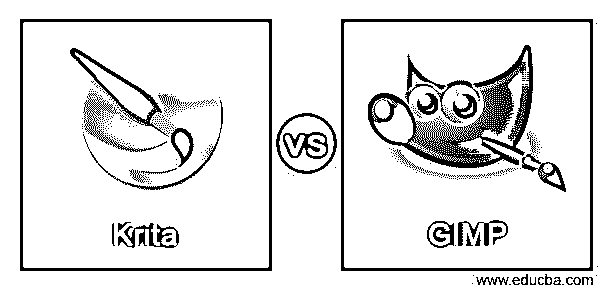
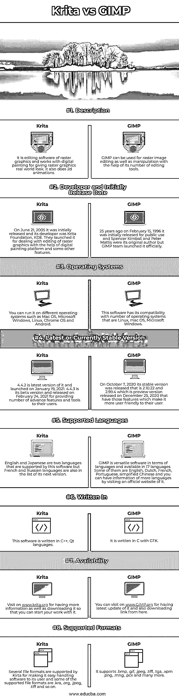

# Krita 对 GIMP

> [https://www . educba . com/krita-vs gimp/](https://www.educba.com/krita-vs-gimp/)

## Krita 和 GIMP 的区别

下面的文章提供了 Krita 和 GIMP 的概要。Krita 是一种处理光栅图形编辑的免费开源软件，它专注于数字绘画和 2D 动画。它与图层面板一起工作，为非破坏性图层创建一个遮罩，进行着色和许多其他编辑，以及与光栅图形相关的操作工作。GIMP 也是免费和开源的光栅图形编辑软件，用户可以在修饰、增强颜色属性、曲线管理等方面编辑或操作图像。这两个软件通过使用许多标准工具和特性来有效地工作。要使用 Krita 或 GIMP 作为光栅图形编辑器，您必须了解它们的更多信息，例如它们的基本要求、支持特性、工作能力等等。

### Krita 与 GIMP 的面对面比较(信息图表)

以下是 Krita 与 GIMP 之间的 8 大区别:

### Krita 与 GIMP 的主要区别

这两个软件都用于光栅图形编辑目的，但是它们以不同的方式工作，并且使用不同类型的工具来执行不同的任务。让我们讨论一下 Krita 和 GIMP 之间的一些主要区别:

*   正如我们在上面告诉你的，这两个软件都是免费和开源的，所以你可以免费使用它们，但它们都为你提供了不同类型的工具，它们的可调参数可以用来执行相同类型的任务。你可以通过一个一个地使用他们两个来了解他们的工作。
*   如果它告诉你两个软件的许可，那么 Krita 只有 GPLv3 许可，而 GIMP 有 GPLv3+许可。
*   Krita 是为概念艺术家、纹理和哑光艺术家、插画师和 VFX 工业设计的。它的用户喜欢它更突出的特点是 UX 设计与图形输入板。GIMP 完全专注于图像编辑，使用工具面板的工具，菜单栏菜单的选项，使用滤镜，画笔，进行变换，并使用图层面板功能的遮罩进行编辑工作。
*   在脚本语言的帮助下，GIMP 的操作可以自动化。Script-Fu 是一种通过使用 TinyScheme 解释器实现的基于 scheme 的语言。可以通过改变 GIMP (GIMP 核心)的程序代码，但通过创建插件来添加新功能。MathMap 就是它的插件的一个例子，是用 C 语言写的。
*   Krita 为您提供了许多用于数字绘画的绘画工具，用于设计光栅图像动画的动画工具，这些工具使用逐帧的概念。它还有一个时间线控制面板，通过实时动画播放控制来正确管理动画，这是它在动画制作过程中的一个亮点。它不限制自己在这里，因为它也提供了矢量工具的矢量艺术，如路径工具，矢量艺术工具和许多其他功能，你会发现在这个软件。

### Krita 与 GIMP 对比表

我们来讨论一下 Krita 和 GIMP 的顶级对比:

|  | **粉笔** | **GIMP** |
| **定义** | 它是光栅图形的编辑软件，与数字绘画一起工作，使光栅图形具有真实世界的外观。它也做 2d 动画。 | GIMP 可以用于光栅图像编辑，也可以借助它的一些编辑工具进行操作。 |
| **开发者和最初发布日期** | 2005 年 6 月 21 日，它首次发布，它的开发者是 KDE 的克里塔基金会。他们推出它是为了在数字绘画平台和其他一些功能的帮助下处理光栅图形的编辑。 | 25 年前，1996 年 2 月 15 日，它首次发布供公众使用，斯潘塞·金博尔和彼得·马蒂斯是它的原作者，但 GIMP 团队正式推出了它。 |
| **操作系统** | 可以在 Mac OS、微软 Windows、Linux、Chrome OS、Android 等不同操作系统上运行。 | 该软件与 Linux、Mac OS、Microsoft Windows 等多种操作系统兼容。 |
| **最新或当前稳定的版本** | 4.4.2 是它的最新版本，于 2021 年 1 月 19 日推出。4.4.3 是其测试版，于 2021 年 2 月 24 日发布，为其用户提供了许多高级功能和工具。 | 2020 年 10 月 7 日，它发布了稳定版 2.10.22 和 2.99.4，这是 2020 年 12 月 25 日发布的预览版，这些功能使其对用户更加友好。 |
| **支持的语言** | 英语和日语是该软件支持的两种语言，但法语和俄语也在下一版本的列表中。 | GIMP 在语言方面是通用的软件，有 17 种语言。其中一些是英语，荷兰语，法语，葡萄牙语，简体中文，你可以通过访问它的官方网站了解更多语言的信息。 |
| **写于** | 这个软件是用 C++，Qt 语言编写的。 | 它是用 C 语言和 GTK 一起写的。 |
| **可用性** | 请访问[www.krita.org](http://www.krita.org)了解更多信息并下载，以便您可以开始工作。 | 你可以访问 www.GIMP.org 网站获得它的最新更新，并从这里下载链接。 |
| **支持的格式** | Kirta 支持多种文件格式，以方便用户操作软件，其中一些支持的文件格式是。克拉，。组织，。jpeg，。tiff 等等。 | 它支持。bmp，。gif，。jpeg，。tiff，。tga，。xpm。png，。mng，。pcx 等等。 |

### 结论

你现在可以开始使用这个软件从不同的角度去了解他们，比如他们的工作方法，用户界面等等。

### 推荐文章

这是一个 Krita vs GIMP 的指南。这里我们分别用信息图和比较表来讨论 Krita 和 GIMP 的主要区别。您也可以看看以下文章，了解更多信息–

1.  [Krita vs Clip Studio](https://www.educba.com/krita-vs-clip-studio/)
2.  [Tekla vs Revit](https://www.educba.com/tekla-vs-revit/)
3.  [Photoshop vs Illustrator](https://www.educba.com/photoshop-vs-illustrator/)
4.  [Inkscape vs Illustrator](https://www.educba.com/inkscape-vs-illustrator/)

