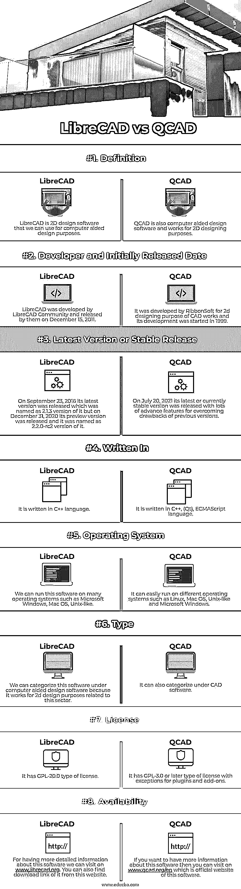

# LibreCAD 与 QCAD

> 原文：<https://www.educba.com/librecad-vs-qcad-2/>

## LibreCAD 与 QCAD 的区别

以下文章提供了 LibreCAD 与 QCAD 的概要。LibreCAD 是 2D 设计公司的一个应用程序，属于免费的计算机辅助设计(CAD)软件，是作为 QCAD 社区版的一个分支开发的。它的图形用户界面(GUI)基于 QT5 库，这就是为什么它可以以同样的方式在几个平台上运行。QCAD 也理解为计算机辅助设计软件，被认为是 2D 设计和绘图应用软件。它的图形用户界面(GUI)是基于 Qt 框架的，它的一部分是在 GNU 通用公共许可证下发布的。所以两个软件有不同的特点。

### LibreCAD 与 QCAD 的直接比较(信息图表)

以下是 LibreCAD 与 QCAD 之间的 8 大区别:

<small>3D 动画、建模、仿真、游戏开发&其他</small>

### LibreCAD 与 QCAD 的主要区别

让我们讨论一下 LibreCAD 与 QCAD 之间的一些主要区别:

这两个软件之间有许多不同之处，因为它们都是由不同的开发人员开发的，并且它们都包含了使它们在工作环境中独一无二的特殊功能。

*   LibreCAD 是基于 Qt5 库的 GUI，因此它很容易在许多不同的平台上运行，并且它的大部分用户界面以及处理概念都类似于 AutoCAD。这使得 CAD 应用程序的用户更容易使用。而 QCAD 部分是在 GNU 通用公共许可证下发布的，其预编译包可用于不同的操作系统。它的 QCAD 3 版本是在 2021 年 8 月与 ECMAScript 一起发布的，ECMAScript 是 JavaScript，这是其用户界面的一个重大变化。因此，你可以发现它的用户友好的工作过程中。
*   LibreCAD 在内部使用 AutoCAD 的 DXF 文件格式来导入和保存文件。不仅如此，它还允许导出许多其他类型的文件格式。QCAD 也使用 DXF 文件格式保存和内部导入文件。它也支持流行的文件格式，这是 DWG 作为一个商业插件，这是基于开放设计联盟 DWG 图书馆。
*   GNU LibreDWG 库是以不同的许可类型 GPLv3 发布的，所以它不能被 GPLv2 许可类型使用。主要原因是他们的许可证与它不兼容，但这个问题通过编写新的 GPLv2 许可库解决了，我们称之为 libxfrw，它完全支持 GPL v2。而 QCAD 的源代码来自 GPL-3.0 或更高版本的此类许可证，在自由软件许可证下不可用。
*   如果你想在你的计算机系统中安装任何软件，那么你必须通过他们的订阅，QCAD 价格从 39.92 美元起，作为一种支付方式。QCAD 还向其用户提供免费试用版和免费版本，因此您可以在有限的时间内享受免费试用版。现在，如果 LibreCAD，那么你不必担心它的价格，因为它是开源和 GPLv2 软件，这意味着它是免费使用的，所以你可以享受这个软件的 CAD 目的，无需支付任何订阅费用。

### LibreCAD 与 QCAD 对照表

让我们来讨论 LibreCAD 与 QCAD 之间的主要比较:

|  | **图书馆卡片** | **QCAD** |
| **定义** | LibreCAD 是 2D 设计软件，我们可以使用计算机辅助设计的目的。 | QCAD 也是计算机辅助设计软件，用于 2D 的设计目的。 |
| **开发者和最初发布日期** | LibreCAD 由 LibreCAD 社区开发，并于 2011 年 12 月 15 日发布。 | 它是由 RibbonSoft 开发的，用于 CAD 作品的 2d 设计，其开发始于 1999 年。 |
| **最新版本或稳定版本** | 2016 年 9 月 23 日，其最新版本发布，命名为 2.1.3 版本，但 2020 年 12 月 31 日，其预览版发布，命名为 2.2.0-rc2 版本。 | 2021 年 7 月 20 日，它的最新或当前稳定版本发布，为克服以前版本的缺点提供了许多高级功能。 |
| **写于** | 它是用 C++语言写的。 | 是用 C++，(Qt)，ECMAScript 语言写的。 |
| **操作系统** | 我们可以在许多操作系统上运行这个软件，比如微软的 Windows，Mac OS，Unix-like。 | 它可以轻松运行在不同的操作系统上，如 Linux、Mac OS、类 Unix 和 Microsoft Windows。 |
| **类型** | 我们可以将该软件归类为计算机辅助设计软件，因为它适用于与该领域相关的 2d 设计目的。 | 也可以在 CAD 软件下分类。 |
| **执照** | 它有一个 GPL-20.0 类型的许可证。 | 它有 GPL-3.0 或更高类型的许可证，但插件和附加组件除外。 |
| **可用性** | 想了解更多关于这个软件的详细信息，我们可以访问 www.librecad.org。您也可以从该网站找到的下载链接。 | 如果你想了解更多关于这个软件的信息，你可以访问这个软件的官方网站[www.qcad.org/en](http://www.qcad.org/en)。 |

### 结论

你可以一个接一个地使用这两个软件，因为这两个软件对用户来说都是免费的。

### 推荐文章

这是 LibreCAD vs QCAD 的指南。这里我们分别用信息图和比较表来讨论 LibreCAD 和 QCAD 的主要区别。您也可以看看以下文章，了解更多信息–

1.  [FreeCAD vs LibreCAD](https://www.educba.com/freecad-vs-librecad/)
2.  [LibreCAD vs AutoCAD](https://www.educba.com/librecad-vs-autocad/)
3.  [AUTOCAD vs CATIA](https://www.educba.com/autocad-vs-catia/)
4.  [Autocad vs Inventor](https://www.educba.com/autocad-vs-inventor/)

