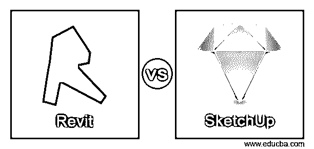
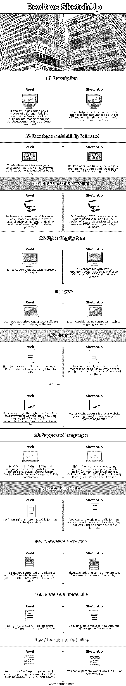

# Revit 与 SketchUp

> 原文：<https://www.educba.com/revit-vs-sketchup/>

## Revit 与 SketchUp 的区别

以下文章提供了 Revit 与 SketchUp 的概要。Revit 是 BIM(建筑信息建模)软件，用于不同设计领域的 2D 和 3D 对象的建模，如建筑师、景观设计师、结构工程师、机械、管道和电气工程师以及承包商所使用的。

它具有 2D 和 3D 绘图的许多高级功能；通过使用它们，我们可以在相关工作中获得高质量的结果。SketchUp 也是一款基于网络的 3D 建模软件，处理不同的 3D 建模领域，如室内设计、土木和机械工程组件设计以及电影和视频行业元素设计。一般来说，使用软件是免费的，但是你可以使用付费版本来获得一些高级功能。

<small>3D 动画、建模、仿真、游戏开发&其他</small>

### Revit 与 SketchUp 的直接对比(信息图)

以下是 Revit 与 SketchUp 之间的 12 大差异:

### Revit 与 SketchUp 的主要区别

让我们讨论一下 Revit 与 SketchUp 之间的一些主要差异:

虽然这两个软件用于相同的目的，但它们在工作技术和可用性方面有所不同。

*   Revit 为我们提供了不同类型的订阅计划，具有相同类型的功能，例如每月订阅我们必须支付 290 美元，每年订阅我们必须支付 2.310 美元(您可以每月支付 193 美元来支付这笔金额)，对于 AEC collection，您必须每年支付 2，825 美元(每月 235 美元)。还有 3 年订阅计划，为此，你必须支付 6235 美元(每月 173 美元)。
*   SketchUp 是免费软件，所以可以免费使用，但如果你想拥有它的其他高级功能，那么你必须每年为 SketchUp 商店支付 119 美元，为 SketchUp Pro 支付 229 美元，为 SketchUp Pro Classic 支付 575 美元，为 SketchUp Studio 支付 1199 美元。
*   Revit 专注于更复杂的基础设施设计项目，并有一个高度精确的工具来处理这一目的。SketchUp 也用于此目的，但对室内设计有积极影响，并使用 3D 可视化工具来获得您想要的结果。
*   正如我们上面所讨论的，与 Revit 相比，SketchUp 是免费软件，但 Revit 向其用户提供 30 天的免费试用，并且出于教育目的，它是完全免费的，您可以从 Autodesk 网站下载。

### Revit 与 SketchUp 比较表

我们来讨论一下 Revit 与 SketchUp 之间的顶级对比:

|  | **Revit** | **SketchUp** |
| **定义** | 它处理不同建模部门的 3D 模型的设计，这些建模部门专注于建筑信息建模目的。目前，它是 Autodesk 的产品。 | SketchUp 致力于创建建筑领域以及不同工程部门、游戏和媒体行业的 3D 模型。 |
| **开发者和最初发布者** | Charles River 是它的开发者，并在 1997 年将其开发为 BIM 软件，但在 2000 年发布供公众使用。 | 它的开发者是 Trimble 公司，但它由谷歌管理，并于 2000 年 8 月由谷歌发布供公众使用。 |
| **最新或稳定版本** | 其最新且目前稳定的版本于 2020 年 4 月发布，提供了几个高级功能来处理 3D 建模的需求。 | 2019 年 1 月 5 日，其最新版本发布。它的 21.0.1 和 16.1.1450 版本是为 Windows 用户发布的，20.0 版本是为 Mac OS 用户发布的。 |
| **操作系统** | 它与微软视窗系统兼容。 | 它兼容多种操作系统，如 Microsoft Windows、OS x 1.09 及其更高版本。 |
| **类型** | 可以归入 CAD 建筑信息建模软件。 | 它可以看作是三维计算机图形设计软件。 |
| **执照** | 专有是 Revit 工作的一种许可类型，这意味着它不能自由使用。 | 它有一个免费增值类型的许可证，这意味着它可以免费使用，但你必须购买该软件的高级功能的许可证。 |
| **网站** | 如果你想了解这个软件的其他细节，或者想知道如何下载，请访问:[www.autodesk.com/products/revit/overview](http://www.autodesk.com/products/revit/overview) | [www.Sketchup.com](http://www.Sketchup.com)是其官网；通过参观这里，你可以获得关于它的良好信息。 |
| **支持的语言** | Revit 提供多种语言版本，包括英语、德语、法语、葡萄牙语、意大利语、俄语、捷克语、西班牙语、中文、日语、波兰语和韩语。 | 该软件有多种语言版本，如英语、法语、意大利语、德语、西班牙语、日语、中文(简体和繁体)、葡萄牙语、韩语和巴西语。 |
| **原生文件格式** | RVT、RTE、RFA、RFT 是 Revit 软件的原生文件格式。 | 你也可以在这个软件中保存 CAD 文件格式的工作，它已经。dae，。dem，。ddf，。fbx，。kmz 和其他一些文件格式。 |
| **支持的 CAD 文件** | 该软件还支持 CAD 文件，它支持的 CAD 文件有 DGN、DXF、DWG、DWF、国际金融公司、沙特和 SKP。 | .dwg，。dxf、. 3ds 和其他一些 CAD 文件格式是它所支持的。 |
| **支持的图像文件** | BMP、PNG、JPG、JPEG、TIF 是 Revit 支持的一些图像文件格式。 | .jpg，。png，。tif，。bmp，。psd，。tga，。eps，还有。pdf 是图像文件格式。 |
| **其他支持的文件** | 其他一些文件格式在 Revit 的支持文件格式列表中，如 ODBC、HTML、TXT 和 gbXML。 | 你也可以导出任何 ESP 或 PDF 格式的作品。 |

### 结论

通读这篇内容丰富的文章后，您是否了解 Revit 和 SketchUp 软件的用途以及它们如何在工作中达到最佳效果？然后，我们建议试用这两个软件的免费版本，以获得关于它们的工作方法的更多信息，并决定哪一个更好。

### 推荐文章

这是 Revit vs SketchUp 的指南。在这里，我们分别讨论 Revit 与 SketchUp 在信息图和比较表方面的主要差异。您也可以看看以下文章，了解更多信息–

1.  [AutoCAD vs SketchUp](https://www.educba.com/autocad-vs-sketchup/)
2.  [SketchUp vs Fusion 360](https://www.educba.com/sketchup-vs-fusion-360/)
3.  [3ds Max vs Sketchup](https://www.educba.com/3ds-max-vs-sketchup/)
4.  [Photoshop vs 素描](https://www.educba.com/photoshop-vs-sketch/)

