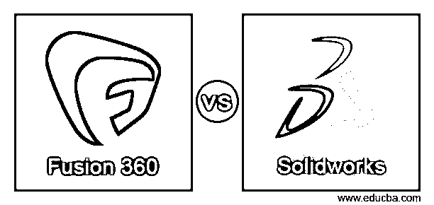
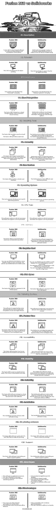

# Fusion 360 与 Solidworks

> 原文：<https://www.educba.com/fusion-360-vs-solidworks/>

## Fusion 360 与 Solidworks 的区别

*   fusion 360 和 Solidworks 是 2D 3D 建模软件，用于根据要求设计对象。
*   Fusion 360 和 Solidworks 是为元素的生产创建对象并制作动画的软件。
*   fusion 360 和 Solidworks 是计算机辅助绘图(CAD)工具，可对任何设备或工具进行可视化。
*   fusion 360 是计算机辅助绘图(CAD)工具的新版本，用于制作设备的 2D 和 3D 高级模型。
*   Solidworks 是计算机辅助绘图(CAD)的流行版本，可以轻松制作 2D 和 3D 设备模型。
*   fusion 360 是一种基于云的软件，用于对设备进行动画设计和可视化。
*   Solidworks 是制作和导出 3D 打印模型的在线或离线软件。

### Fusion 360 与 Solidworks 的直接对比(信息图)

以下是 Fusion 360 与 Solidworks 之间的主要差异

<small>3D 动画、建模、仿真、游戏开发&其他</small>

### Fusion 360 与 Solidworks 的主要区别

让我们讨论一下 Fusion 360 与 Solidworks 之间的一些主要差异:

*   fusion 360 基于云存储，Solidworks 有云存储的选择。
*   Solidworks 软件支持在线和离线功能，但 fusion 360 需要良好的互联网连接。
*   Solidworks 软件在 windows 操作系统上运行。fusion 360 支持 Windows 和 macOS 操作系统。
*   Solidworks 软件提供了键盘功能的快捷方式，而 fusion 360 不提供此功能。
*   fusion 360 软件提供了比 Solidworks 软件更简单的用户界面。
*   fusion 360 软件为学生和教师提供免费许可证，但 Solidworks 没有免费许可证。

### Fusion 360 与 Solidworks 的对比表

*   fusion 360 和 Solidworks 软件是用于动画、建模、设计和制作的流行且有用的软件。
*   fusion 360 和 Solidworks 工具的使用基于舒适性、可用性和功能。
*   根据功能和产品要求使用 Solidworks 和 fusion 360 工具。
*   Solidworks 和 fusion 360 对比表如下所示。

| **特性** | **融合 360** | **Solidworks** |
| **定义** | Fusion 360 是一种基于云的软件，用于对设备进行动画设计和可视化。 | Solidworks 是计算机辅助绘图(CAD)的流行版本，可以轻松制作 2D 和 3D 设备模型。 |
| **功能** | 这个 CAD 工具允许 3D 对象打印。 | 此 CAD 工具有助于导出用于 3D 对象打印的文件。 |
| **开发者** | 该系统由“Autodesk”公司开发。 | 这个系统是由“达索系统”公司开发的。 |
| **云整合** | fusion 360 基于云存储系统。数据存储在云内存中。 | Solidworks 提供基于云的存储或计算机存储。开发者选择数据存储系统。 |
| **建模工具** | The fusion 360 provides a push and pull tool.fusion 360 提供雕刻工具。 | The Solidworks provides functional tools but does not provides sculpt tools.Solidworks 支持模拟和分析功能。 |
| **组装** | fusion 360 有助于将不同的文件组合成一个文件。fusion 360 不容易支持大型和组件。 | 基于装配驱动软件的 Solidworks。该软件允许引用多个文件并制作大型组件。 |
| **用户界面** | fusion 360 提供了简单的用户界面。 | Solidworks 是一个更困难的用户界面过程。 |
| **操作系统** | 该工具支持 Windows 和 macOS 操作系统。 | 该工具支持 windows 操作系统。 |
| **CPU 类型** | 该软件可在 64 位处理器上运行，但不支持 32 位处理器。 | 该软件可在 64 位处理器上运行，但不支持 32 位处理器。 |
| **内存** | fusion 360 支持最少 3GB 和更多内存。 | Solidworks 软件支持至少 4GB 和更多 RAM。这取决于计算机功能和软件版本。 |
| **显卡** | 您可以在电脑上使用 512MB GDDR 内存或更多显卡。您不能使用 512MB 英特尔 GMA X3100 卡。 | You can use NVIDIA Quadro P600 or AMD Radeon Pro WX 3100 graphics card for entry-level.该软件适用于中级用户的 P1000/2000 或 WX 4100。您可以使用 P4000 或 WX 5100 图形护理的高水平。 |
| **磁盘空间** | fusion 360 软件需要 2.5 GB 的磁盘空间。 | fusion 360 软件需要 2 GB 的可用磁盘空间。 |
| **指点设备** | This software is supported by some pointing devices such as Microsoft-compliant mouse and Apple Mouse. | 该软件支持微软兼容鼠标的单指点设备。 |
| **特征树** | fusion 360 工具为特征树占用更多空间。您必须滚动才能在工作区中找到要素。 | Solidworks 工具为特征树占用更少的空间。它被分配并容易地出现在工作区中。 |
| **可访问性** | fusion 360 为学生和教师提供免费许可软件。 | 坚实的工作没有自由软件版本。您在试用期内免费使用软件。 |
| **可用性** | fusion 360 可轻松用于小型设备。此外，UI 和定制也很容易。 | The Solidworks software needs improvements to become user-friendly.UI 和定制很难处理，也过时了。 |
| **可靠性** | fusion 360 软件基于云存储。因此，你必须需要互联网来使用和操作软件。 | Solidworks 软件将数据存储在本地文件或使用云中。互联网不需要 Solidworks。你可以在线或离线工作。 |
| **安装** | fusion 360 软件的安装过程很简单。 | Solidworks 软件的安装过程很简单。 |
| **3D 打印软件** | fusion 360 软件使用 STL 和 OBJ 文件进行 3D 打印。 | fusion 360 软件使用 STL 文件进行 3D 打印。 |
| **支持** | fusion 360 软件提供了一个专家支持系统。 | Solidworks 软件提供了一个专家支持系统。 |
| **优势** | ·         The software is updated and secure.用户界面非常简单。它可以在 Windows 和 macOS 操作系统上运行。 | ·         It is provided straightforward 3D designs.这是一个基于特征的模型。

该软件提供了各种模拟选择。

你离线和在线工作。

 |
| **缺点** | ·         You must use a fast internet connection to handle data.该软件不提供离线功能。 | ·         Only compatible with windows operating system.用户界面很难处理。 |

### 结论

*   fusion 360 和 Solidworks 软件支持打印和设计产品模型。
*   该软件有助于获得关键元素和对象的可视化。
*   该软件减少了实际制造工作，避免了生产错误。

### 推荐文章

这是一个关于 Fusion 360 vs Solidworks 的指南。在这里，我们通过信息图表和比较表来讨论 Fusion 360 与 Solidworks 的主要区别。您也可以看看以下文章，了解更多信息–

1.  [点击与概念](https://www.educba.com/clickup-vs-notion/)
2.  [Pro tools vs Cubase](https://www.educba.com/pro-tools-vs-cubase/)
3.  [Dropbox vs OneDrive](https://www.educba.com/dropbox-vs-onedrive/)
4.  [生育 vs 插画](https://www.educba.com/procreate-vs-illustrator/)

