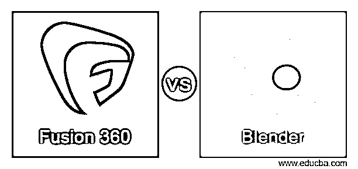
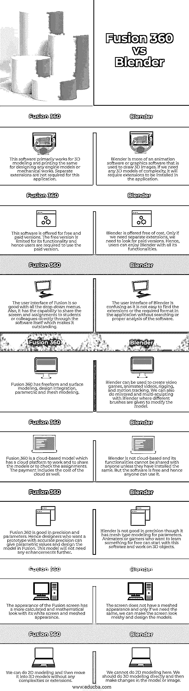

# Fusion 360 与 Blender

> 原文：<https://www.educba.com/fusion-360-vs-blender/>

## Fusion 360 与 Blender 的区别

Fusion 360 是一款 Autodesk 工具，有助于云平台的产品开发流程。学生或专业人士可以通过一个支持远程协作的工具学习 CAD/CAM 设计。学生可以通过 Fusion 360 extension 在线学习。学生的作业可以通过工具本身看到。Blender 是一款用于图形和视觉效果的 3D 动画软件。使用该工具可以创建任何三维图像，其中网格被操纵，并且通过连接网格来绘制 3D 图像。整个 3D 创作可以用这个软件完成。这个软件的所有功能都可以免费使用。在本主题中，我们将了解 Fusion 360 vs Blender。

### Fusion 360 与 Blender 的面对面比较(信息图)

以下是 Fusion 360 与 Blender 之间的主要差异

<small>3D 动画、建模、仿真、游戏开发&其他</small>

### 主要差异

Fusion 360 与 Blender 之间的一些主要差异如下:

*   Fusion 360 于 2013 年推出，Autodesk 自己维护其文档。因此，支持是从其文档本身完成的。另一方面，blender 于 1998 年推出，用户已经形成了一个社区来解决用户的问题。与社区一起，网站中的帮助文档帮助用户解决他们的疑问。因此，与 Fusion 360 相比，对 Blender 的支持更多。
*   搅拌机是一个伟大的工具，动画，视频创作，游戏和动画所需的图像模拟。然而，我们不能在 Blender 中进行机械制图或设计。同样，Fusion 也是机械制图、设计和模拟的重要工具。然而，它不能做视频游戏或动画。
*   Fusion 外观更专业，按键也容易掌握。它是为学生设计的，因此界面容易掌握和学习。任何工具或功能都可以从菜单中搜索并使用。流线型界面和下拉菜单使 Fusion 成为用户友好的软件。而在 Blender 中，界面看起来更自然，因此不容易搜索和使用工具。必须经常使用快捷键来访问软件中的任何扩展或插件。Blender 必须始终使用热键或快捷键，因此它不是用户友好的软件。
*   凭借其自然的外观和风格，任何人都可以在 Blender 中进行设计，而无需太多的预先考虑。自然风格可以很容易地被建模，并且可以根据创作者的需要进行修改。在这里，精度或测量不会成为创作者的障碍，因为模型可以形成或变形为任何样子。这种情况在 Fusion 中不会发生，因为模型只能通过适当的测量和精度来创建。
*   在 Fusion 中，可以在设计下方看到历史，如果必须更改任何内容，我们可以追溯历史中的步骤，并更改维度或建模结构。这是很容易的，不会花太多时间来结合设计的模型。这在搅拌机中不容易做到。在 Blender 中没有步骤的回溯，因此如果有什么必须改变的话，我们需要改变整个模型。
*   建模需要时间来融合所有需要的计算和精度。因此，在 Fusion 中建模之前，应该了解所有的复杂性。Blender 中的插件可以帮助设计师在几分钟内制作出任何形状的模型。

如果有人需要做机械建模，如果他们知道同样的基础知识，他们可以选择 Fusion 360。但是，如果有人需要学习任何类型的建模，Blender 可以帮助他们实现同样的目标。

### Fusion 360 与 Blender 对比表

下面给出的比较表格显示了 Fusion 360 与 Blender 之间的直接比较:

| **融合 360** | **搅拌机** |
| 该软件主要用于 3D 建模和打印，同样适用于设计任何发动机模型或机械工程。这种应用不需要单独的扩展。 | Blender 更多的是一个动画软件或图形软件，用于绘制 3D 图像。如果我们需要任何复杂的 3D 模型，它将需要在应用程序中安装扩展。 |
| 该软件提供免费和付费版本。免费版本的功能有限，因此用户需要使用付费版本。 | 搅拌机免费提供。只有当我们需要单独的扩展时，我们才需要寻找付费版本。因此，用户可以享受 Blender 的所有功能。 |
| Fusion 的用户界面非常好，有很多下拉菜单。此外，它能够通过软件本身直接与学生或同事分享屏幕和作业，这使它非常出色。 | Blender 的用户界面令人困惑，因为如果不搜索或正确分析软件，就不容易在应用程序中找到扩展或所需的格式。 |
| Fusion 360 具有自由形式和曲面建模、设计集成、参数化和网格建模。 | Blender 可用于创建视频游戏、动画视频、索具和运动跟踪。我们也可以用 Blender 做镜像和多重雕刻，用不同的笔刷来修改模型。 |
| Fusion 360 是一个基于云的模型，它有一个云平台来工作和共享模型或检查任务。付款也包括云的成本。 | Blender 不是基于云的，它的功能不能与任何人共享，除非他们已经安装了相同的功能。但是软件是免费的，因此任何人都可以使用。 |
| Fusion 360 精度和参数都不错。因此，想要精确原型的设计者可以给出参数值并在 Fusion 中设计模型。这个模型不需要任何进一步的改进。 | Blender 虽然有参数的网格模型，但精度不高。想要免费学习一些东西的动画师或游戏玩家可以从这个软件开始，在 3D 对象上工作。 |
| 融合屏幕的白色屏幕和网格外观更具计算感和数学感。 | 屏幕没有网格外观，只有当我们需要时，我们才能让屏幕看起来像网格一样并设计模型。 |
| 我们可以做 2D 建模，然后将它转换成 3D 模型，没有任何复杂性或扩展。 | 我们不能在这里做 2D 模特。我们应该直接做 3D 建模，然后在模型或者图像上做改动。 |

### 推荐文章

这是一个指南融合 360 与搅拌机。在这里，我们通过信息图表和比较表来讨论 Fusion 360 与 Blender 的主要区别。您也可以看看以下文章，了解更多信息–

1.  [超级计算机 vs 大型机](https://www.educba.com/supercomputer-vs-mainframe/)
2.  [草图 vs 绘图](https://www.educba.com/sketch-vs-drawing/)
3.  [Lisp vs Haskell](https://www.educba.com/lisp-vs-haskell/)
4.  [Clojure vs Common Lisp](https://www.educba.com/clojure-vs-common-lisp/)

