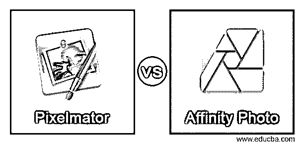
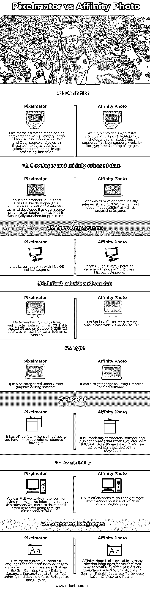

# Pixelmator vs 亲和照片

> 原文：<https://www.educba.com/pixelmator-vs-affinity-photo/>

## Pixelmator 与 Affinity Photo 的区别

Pixelmator 是一个图形编辑器，结合了 Mac OS 和开源技术，利用其高级编辑功能处理修饰、颜色校正、绘画和其他一些图像处理工作。它不仅可以对图像进行基于图层的编辑，还可以与 GPU 支持的图像处理相结合。Affinity Photo 是 Affinity trinity 以及 Affinity Designer 和 Affinity Publisher 的一部分，是光栅图形编辑软件。你可以做图像拼接，光学像差校正，阿尔法合成，以及其他许多可以被认为是非破坏性编辑的图像编辑工作。这两个软件都是光栅图形编辑，但有不同的方面。在本主题中，我们将了解 Pixelmator 和 Affinity Photo。所以我来给大家讲讲这几个方面。

### Pixelmator 与 Affinity Photo 的面对面比较(信息图)

以下是 Pixelmator 和 Affinity Photo 之间的主要区别

<small>3D 动画、建模、仿真、游戏开发&其他</small>

### Pixelmator 与 Affinity Photo 的主要区别

两个软件的一些事实使它们彼此不同，并使它们在工作方法上独一无二。那么让我们也来分析一下这两个软件的不同之处。

*   Pixelmator 不可用于多种设备，因为它只与 macOS 和 iOS 操作系统兼容，而 Affinity Photo 也可用于 Microsoft Windows 操作系统以及 macOS 和 iOS。
*   Pixelmator 使用核心图像和 Automator 技术，这些技术与基于图层的管理功能(有助于非破坏性编辑)一起工作，并影响颜色校正、修饰等。它还拥有 40 多个用于执行这些任务的工具以及 50 个过滤器(这些过滤器具有用于图像处理的预定义参数，并且这些参数也可以根据您的工作要求进行编辑)，而 Affinity Photo 在处理 raw 照片方面具有专业知识，具有色彩空间选项，提供应用效果的实时预览(以便可以轻松调整效果的参数)，ICC 色彩管理以及每通道 16 位编辑。
*   如果我们谈论 Pixelmator 的价格，那么你可以花 39.99 美元(拥有所有高级功能)购买 Pixelmator pro 版本，你可以从 Mac App Store 购买和下载。Pixelmator 团队会不时对他们的套餐提供折扣，因此根据他们的情况有所不同。您将没有该软件的免费版本，但可以在有限的时间内获得 Pixelmator 团队提供的免费试用版。
*   Affinity Photo 在 Mac App Store 和 Microsoft Store 上也有售，你只需花 49.99 美元就可以拥有它的所有高级功能。Serif 还不时为您提供 Affinity Photo 的折扣价，这样您可以在购买之前查看一下。此外，affinity 开发人员还为您提供 30 天的免费试用版(在试用版中，您将拥有完整版的所有功能)，以便您在开始使用它之前了解它。

这些都是一些重要的事实和功能，你必须知道有良好的指挥 Pixelmator 以及亲和照片。

### Pixelmator 与 Affinity Photo 的比较

要很好地理解这两个软件，你应该知道第一个的基本信息，包括操作系统，支持的语言，许可证类型，等等…所以让我们看看 Pixelmator 和 Affinity Photo 的基本特征。

|  | **像素化器** | **亲和照片** |
| **定义** | Pixelmator 是一个光栅图像编辑软件，它结合了 Mac OS 和开源两种技术，通过使用这些技术，它可以处理彩色化、修饰、图像处理等。 | Affinity Photo 处理光栅图形编辑，并开发支持无限层的原始照片。该层通过基于层的图像编辑来支持作品。 |
| **开发者和最初发布日期** | 立陶宛兄弟 Saulius 和 Aidas Dailide 为 macOS 开发了这款软件，Pixelmator team ltd 将其作为开源程序开发。2007 年 9 月 25 日，它首次推出供公众使用。 | Serif 是它的开发者，最初于 2015 年 7 月 9 日发布，具有许多良好的图像编辑和处理功能。 |
| **操作系统** | 它有它对 Mac OS 和 iOS 系统的兼容性。 | 它可以在 macOS、iOS 和 Microsoft Windows 等多种操作系统上运行。 |
| **最新发布和版本** | 2019 年 11 月 13 日，其最新版本发布为 macOS 即 macOS 3.9，2019 年 10 月 9 日，iOS 2.4.7 发布为 iOS 最新版本。 | 2021 年 4 月 13 日，其最新版本发布，命名为 1.9.3。 |
| **类型** | 可以归类到光栅图形编辑软件下。 | 它也可以归类为光栅图形编辑软件。 |
| **执照** | 它有一个专有许可证，这意味着你必须支付订阅费。 | 它是专有的商业软件，也是试用软件(这意味着你可以在有限的时间内拥有全功能的软件，这是由他们的开发者决定的) |
| **可用性** | 你可以访问[www.pixelmator.com](http://www.pixelmator.com)获得更多关于这个软件的详细信息。您也可以在浏览完订阅详情后从这里下载。 | 在它的官方网站上，你可以得到更多关于它的信息以及哪个是[www.affinity.serif.com](http://www.affinity.serif.com)。 |
| **支持的语言** | Pixelmator 目前支持 11 种语言，以便为不同的用户提供方便的软件，包括英语、德语、法语、意大利语、日语、韩语、西班牙语、简体中文、繁体中文、葡萄牙语和俄语。 | Affinity Photo 还提供多种不同的语言版本，以方便不同的用户使用，这些语言包括英语、法语、德语、西班牙语、日语、葡萄牙语、意大利语、中文和俄语。 |

这些是一些重要的细节，通过分析它们，您可以获得关于该软件特征的基本信息。现在让我们来看看 Pixelmator 和 Affinity Photo 之间有什么区别，虽然它们的用途是一样的？

### 结论

Pixelmator 和 Affinity Photo 对你来说不再是一个陌生的词，你对它们的特性有很好的了解。现在，您可以开始使用它们进行光栅图像编辑和处理工作，这样您就可以了解该软件的不同功能。在分析了这两个软件之后，你可以根据自己的选择使用任何一个软件。

### 推荐文章

这是 Pixelmator vs Affinity Photo 的指南。在这里，我们讨论 Pixelmator 与 Affinity 照片的关键差异，并提供信息图表和比较表。您也可以看看以下文章，了解更多信息–

1.  [Pixelmator vs Photoshop](https://www.educba.com/pixelmator-vs-photoshop/)
2.  [Photoshop vs 亲和照](https://www.educba.com/photoshop-vs-affinity-photo/)
3.  [亲和力 vs Lightroom](https://www.educba.com/affinity-vs-lightroom/)
4.  [Photoshop vs Reality](https://www.educba.com/photoshop-vs-reality/)

