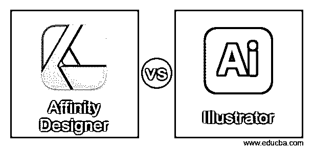
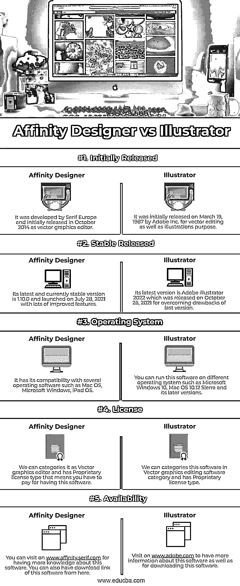

# 亲和力设计师 vs 插画师

> 原文：<https://www.educba.com/affinity-designer-vs-illustrator/>

## 亲和力设计师与插画师的区别

下面这篇文章提供了 Affinity Designer 和 Illustrator 的概要。Affinity Designer 能够理解处理矢量图形的编辑和插图软件。Serif 为 Mac OS、iPad OS 和 Microsoft Windows 等操作系统开发了它。在 Affinity Trinity 和另外两个软件:Affinity Photo 和 Affinity Publisher 的包里都可以找到。Adobe Illustrator 也是 Adobe 公司开发的矢量图形编辑软件。你可以在 adobe 的 Creative Cloud desktop app 里有这个软件。

虽然这两个软件都用于矢量图形编辑目的，但它们之间还是有一些区别:

<small>3D 动画、建模、仿真、游戏开发&其他</small>

*   Serif 开发 Affinity Designer 作为一个矢量图形编辑器，与 Mac OS、Microsoft Windows 和 iPad OS 兼容。有几个矢量编辑工具有助于编辑的目的，如矢量笔，形状绘图工具，等等。它还支持矢量和光栅画笔来创建真正的艺术品。除此之外，它还有其他的工具和特性，你很快就会知道。
*   Illustrator 是 adobe 的 Creative Cloud 应用程序的一部分，由 Adobe Inc .开发为矢量图形编辑软件。我们也有几个工具，使我们的工作变得简单，如钢笔工具，形状工具，文本工具，等等。利用这个软件的几个功能，我们可以创建高度精确的插图和艺术品。

### Affinity Designer 与 Illustrator 的直接对比(信息图)

以下是 Affinity Designer 与 Illustrator 之间的 5 大区别:

### Affinity Designer 与 Illustrator 的主要区别

我们知道 Affinity Designer 和 Adobe Illustrator 都是矢量图形编辑软件，尽管有一些您必须了解的关键区别:

*   要让 Affinity designer 在你的口袋里并开始使用它，你必须为每个功能支付 24.21 美元，而且它没有免费版本，因为 Affinity Designer 不向其用户提供免费试用。另一方面，拥有一个 adobe illustrator，你每个月要支付 20.99 美元；出于商业目的，你可以每月支付 29.99 美元。Adobe 为其用户提供有限时间的免费试用。
*   Affinity Designer 致力于无限层的非破坏性编辑功能；它可以以 60 fps 的速度平移和缩放，并且您可以在实时视图中看到几种类型的效果。此外，它支持矢量和光栅画笔，允许您使用动态符号，管理文本等。同时，Illustrator 允许我们使用不同类型的艺术插图工具来编辑和创建矢量图形。我们也有一个图层面板，这使得我们的工作更容易管理不同层的作品。
*   如果说色彩模式，那么 Affinity Designer 支持 RGB、CMYK、RGB Hex、LAB、灰度、PANTONE 等。例如，在 Adobe Illustrator 中，我们有 RGB 和 CMYK 模式，通过使用该软件的一个选项，我们可以随时在这两种模式之间切换。
*   Affinity Designer 和 Adobe Illustrator 包含许多优秀的功能和工具。最好的部分是，我们可以根据我们在两个软件中的适用性，使用它们不同的功能来设置用户界面。所以这两个软件的用户界面都很方便，而且都有自己的工作方法，一旦你开始使用它们，你就会知道。

### Affinity Designer 与 Illustrator 对比表

我们来讨论一下 Affinity 设计师与 Illustrator 的顶级对比:

|  | **亲和力设计者** | **插画师** |
| 最初发布 | 它由 Serif Europe 开发，最初于 2014 年 10 月作为矢量图形编辑器发布。 | 它最初于 1987 年 3 月 19 日由 Adobe 公司发布，用于矢量编辑和插图目的。 |
| 稳定发布 | 它的最新稳定版本是 1.10.0，于 2021 年 7 月 28 日推出，有很多改进的功能。 | 其最新版本是 2021 年 10 月 26 日发布的 Adobe illustrator 2022，克服了上一版本的弊端。 |
| 操作系统 | 它与多种操作软件兼容，如 Mac OS、Microsoft Windows 和 iPad OS。 | 您可以在不同的操作系统上运行此软件，如 Microsoft Windows 10、Mac OS 10.12 Sierra 及其更高版本。 |
| 许可证 | 我们可以把它归类为一个拥有专有许可类型的矢量图形编辑器，这意味着你必须为这个软件付费。 | 我们可以将这款软件归入矢量图形编辑软件类别，它有一个专有的许可类型。 |
| 有效性 | 你可以访问[www.affinity.serif.com](http://www.affinity.serif.com)了解更多关于这个软件的知识。你也可以在这里找到这个软件的下载链接。 | 访问[www.adobe.com](http://www.adobe.com)以获得关于该软件的更多信息以及下载该软件。 |

### 结论

现在，您可以根据自己对矢量图形编辑和创建的适应性开始使用其中的任何一种。而且两个软件都有各自的专业，可以分别尝试两个，体验更好。最后，一旦你知道他们的工作方法，你就可以使用你想要的软件。

### 推荐文章

这是一个亲和力设计师与插画师的指南。这里我们分别讨论信息图和比较表之间的主要区别。您也可以看看以下文章，了解更多信息–

1.  [UX 设计师 vs 产品设计师](https://www.educba.com/ux-designer-vs-product-designer/)
2.  [网页设计师 vs 平面设计师](https://www.educba.com/web-designer-vs-graphic-designer/)
3.  [草图 vs 绘图](https://www.educba.com/sketch-vs-drawing/)
4.  [Fusion 360 vs Blender](https://www.educba.com/fusion-360-vs-blender/)

