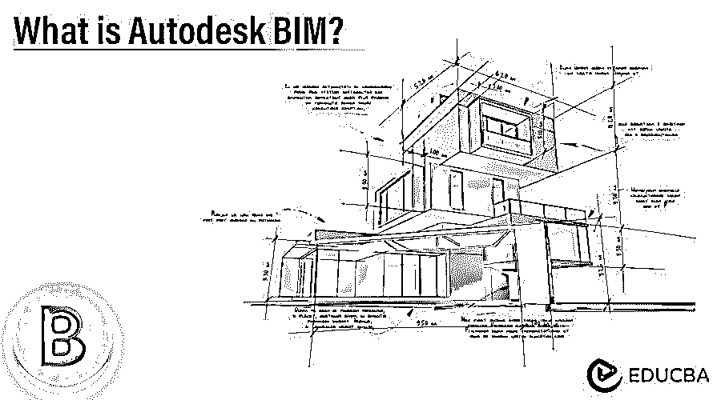

# 什么是 Autodesk BIM？

> 原文：<https://www.educba.com/what-is-autodesk-bim/>

## Autodesk BIM 简介

Autodesk BIM 代表建筑信息建模，这意味着三维模型的组件和元素的信息细节。因此，我们可以将它理解为数字化转型的基础，它融合了建筑、工程和建筑行业(AEC)。

Autodesk 设计它是为了获得更好的业务成果，在创造世界中发挥重要作用。借助 BIM，我们可以以整体的工作方式创建和管理属于已建资产的信息。它有一个由云服务器平台支持的智能模型。在这些特性的帮助下，it 可以集成多学科数据并对其进行结构化，从而在特定资产的整个生命周期中生成该资产的(数字)表示。在了解 BIM 之后，您一定想知道我们为什么在建筑和施工领域采用 BIM。

<small>3D 动画、建模、仿真、游戏开发&其他</small>

### 为什么选择 Autodesk BIM？

它是一种建筑信息建模软件，能够以数字方式转换建筑资产的信息，并通过有效的流程分析 3d 建模。

因此，开始使用 BIM 有几个原因:

*   首先，BIM 流程有助于捕捉和传达 AEC 项目图纸表示的施工和设计细节。
*   它向利益相关者解释，以了解需要构建的 3d 模型组件的不同期望，以及如何以非常准确和快速的方式构建该组件。
*   借助 BIM，施工和设计团队可以从他们的技术投资中受益，并通过分析特定元素的每个细节，在建模工作中获得精确的输出。
*   借助其标准功能，它可以在整个生命周期内创建和管理有关 AEC 项目的信息。管理流程将所有施工信息、文档和多学科设计收集在一组标准数据中。
*   它的一个最有用的特性是，通过使用 2D 和 3D 表的细节，可以以多种表示形式提取数据。

这些事实使得希望在建筑信息建模过程中获得最佳结果的用户值得一试。

### 如何使用 Autodesk BIM？

在这里，您将了解如何开始在您的项目中使用 Autodesk BIM 的详细信息。

一旦您开始使用它，您必须经历如下三个重要步骤:

*   账户管理
*   项目的创建
*   服务激活

首先，您必须完成购买过程，一旦您的订阅被激活，帐户管理员将自动在其注册的电子邮件地址上收到一封欢迎电子邮件。打开欢迎邮件，选择邮件中的“激活您的帐户”按钮。一旦您选择了它，电子邮件将启动帐户管理门户。在帐户管理门户上，您必须使用您的 Autodesk ID 登录，并登录到帐户管理。如果您没有 Autodesk Id 或尚未创建，您可以通过单击页面上的“创建帐户”按钮来创建新帐户。如果您没有收到电子邮件，并且您的帐户没有激活，您可以联系其官方网站。

让我们看看帐户管理步骤:

#### 1.账户管理

*   这是门户的一部分，通过它我们可以管理与项目、成员和公司相关的 BIM 帐户。因此，根据您的要求，您可以在其中管理细节。
*   它为您的项目提供了安全和控制功能，可以在两个管理控制级别上工作。
*   帐户管理员可以完全控制激活 BIM 360(只有帐户管理员可以激活服务)以创建新项目和分配项目管理员。
*   使用 BIM 时，您需要管理您的帐户详细信息，以便您可以通过帐户设置选项来完成此操作。

#### 2.帐户设置

您还可以通过“帐户设置”选项卡自定义您的帐户，例如上传您公司的徽标(用于正确识别)、编辑您的帐户名称、邀请帐户管理员以及定义用于报告的业务部门。

如果需要，您可以在这里添加额外的帐户管理员，因此为了添加:

*   转到帐户设置，并选择+图标。
*   请输入姓名或电子邮件地址以添加帐户管理员并保存。
*   完成这些步骤后，BIM 将向其他帐户管理员发送电子邮件邀请。

使用 BIM 的下一个重要步骤是激活项目。

#### 项目的激活

要激活项目，请转到项目菜单并创建一个项目。

创建项目后，您可以分两步激活 BIM 服务。

**1。创建一个项目**

*   转到工具栏并选择“项目”选项卡。
*   有添加按钮，所以点击它开始一个项目。
*   现在输入你想做的项目的细节。

**2。激活服务**

*   有一个激活按钮，所以点击它有你想要的 BIM 服务。
*   现在分配一个项目管理员。你不仅给一个项目，但也可以添加多个项目。
*   一旦项目管理员完成了这些步骤，它将收到一封邀请电子邮件，并需要点击电子邮件链接加入项目，它想工作。

您的项目设置已经准备好，您可以开始工作了。

### 结论

在这里，我们看到了 BIM 流程，以了解这到底是什么。使用上面讨论的关于 BIM 的信息，您可以开始使用它，并增强您在建筑和建筑部门的 3D 建模资产方面的工作成果。

### 推荐文章

这是一个什么是 Autodesk BIM 的指南？这里我们讨论一下入门以及如何使用 Autodesk BIM？为了更好的理解。您也可以看看以下文章，了解更多信息–

1.  [Autodesk Trueview](https://www.educba.com/autodesk-trueview/)
2.  [欧特克职业](https://www.educba.com/autodesk-careers/)
3.  [Autodesk Tinkercad](https://www.educba.com/autodesk-tinkercad/)
4.  [AutoCAD 命令列表](https://www.educba.com/list-of-autocad-commands/)

