# InDesign 吸管工具

> 原文：<https://www.educba.com/indesign-eyedropper-tool/>

**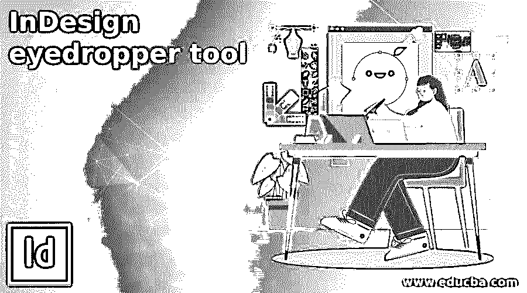

** 

## InDesign 吸管工具简介

InDesign 吸管工具用于拾取 InDesign 文档页面上任何对象或文本的属性。不仅是属性，我们还可以从 InDesign 中的任何导入图像中选择所需的颜色，以便将该颜色用于不同的目的。在这里，您可以将任何对象或文本的属性理解为参数，以及它们所应用的格式，例如对象的大小、对象的位置、字体样式和文本的大小等等。这个工具的好处是它提供了一些参数，通过处理这些参数，你可以选择你想用吸管工具从所选对象中选取的属性。所以让我们来理解一下。

### 如何在 InDesign 中使用吸管工具？

滴管是这个软件的一个有用的工具，在你的工作中使用它会非常令人兴奋。所以让我告诉你想要的东西，你可以用它来做。所以首先取一个任意大小的新文档。然后我会在这里放两张图片，向你解释如何用吸管工具从这些图片中选择颜色。

<small>3D 动画、建模、仿真、游戏开发&其他</small>

### 如何使用吸管工具从图像中挑选颜色？

对于 InDesign 中的图像，我将转到“文件”菜单下拉列表中的“置入”选项。

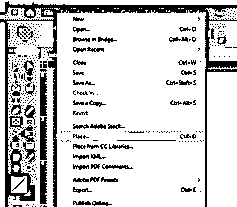

我将从打开的对话框中的保存位置选择这两幅图像，然后单击该对话框的打开按钮。

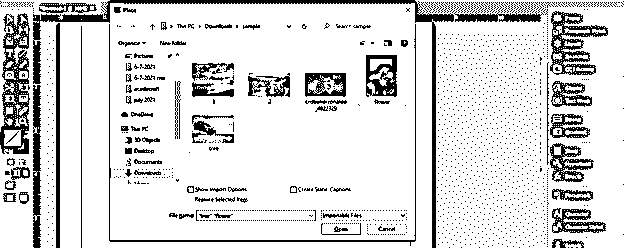

像这样一个一个地摆放。

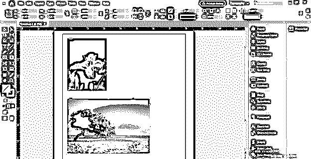

现在我将从工具面板中选择矩形工具，像这样创建这两个矩形。

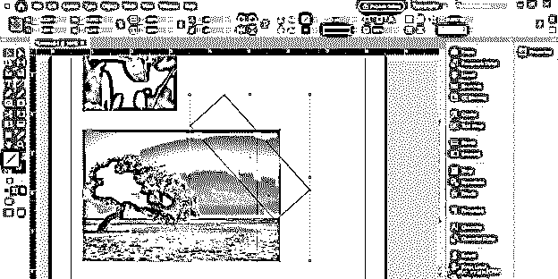

现在让我们来分析一下吸管工具。在工具面板部分，我们可以在这个列表中找到这个工具，它有一个滴管图标。

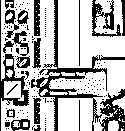

现在我将打开样本面板，这样当我用吸管工具颜色从图像中选取一种颜色时，它将出现在样本面板的颜色框中。

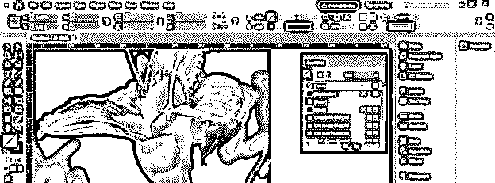

一旦你使用滴管工具，滴管图标将出现在你的鼠标光标上，当你点击图像上的任何地方时，它将从你可以在样本面板中看到的图像中选取相同的颜色。我买了这种颜色。

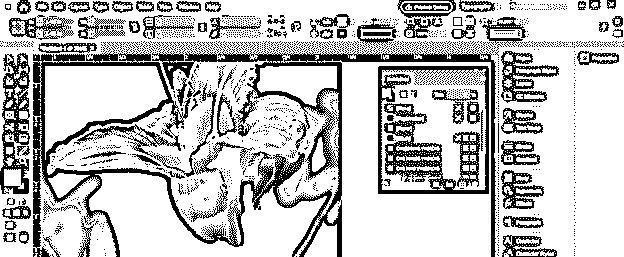

现在滴管的光标将变成滴管图标的另一边，这表明滴管已经选择了一些颜色，我们可以将它放在我们想要的对象上。因此，我将点击这个矩形和滴管工具将填补它与相同的挑选颜色。

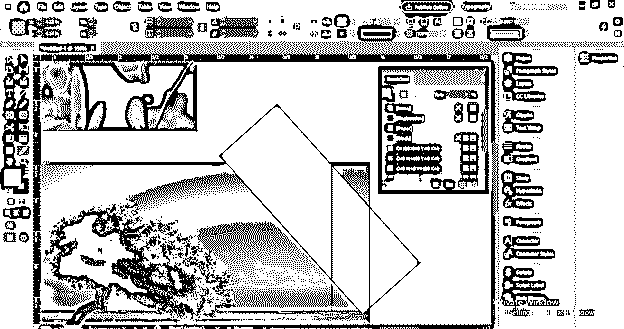

在选择另一种颜色之前，可以用相同的拾取颜色填充多个对象。

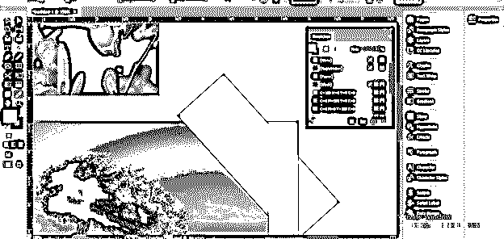

如果您愿意，可以在“色板”面板中保存您选择的颜色。

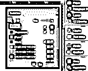

为此，请单击该对话框底部的“色板”对话框中的“新建色板”选项。

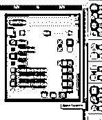

它会像这样保存你选择的颜色。

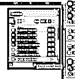

要重置吸管工具来选择新的颜色，您可以按住键盘上的 Alt 键，并通过单击您想要的图像位置来选择新的颜色。

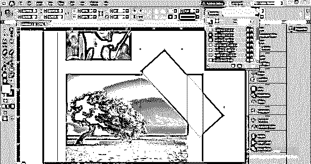

不仅仅是填充，你还可以在形状的描边上使用选取的颜色，为此你必须在工具面板的颜色框中选择描边颜色框。

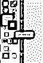

然后像我们一样用吸管工具选择填充颜色。这一次，我选择了树的颜色。

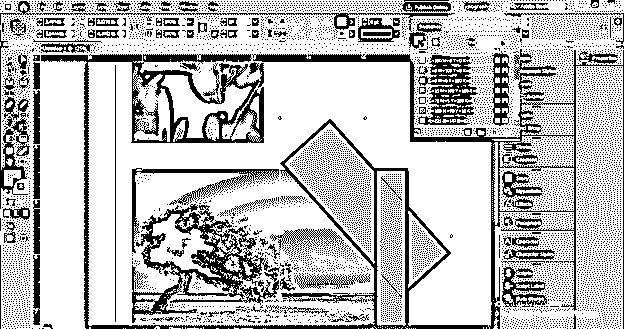

### 如何使用吸管工具复制形状的属性？

现在让我们用形状来理解眼药水。在这里，我借助工具面板的形状工具绘制了一些形状，其中一个是圆形，另一个是方形。这两种形状具有不同的属性，这意味着不同的颜色、大小和位置。

我将使用滴管工具，点击圆形属性，然后点击正方形。

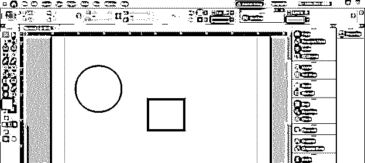

现在吸管工具将根据圆改变正方形的属性，这意味着正方形的大小根据圆改变，它的位置在圆的同一个地方。

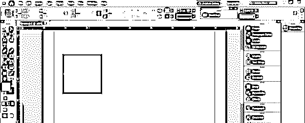

如果我把正方形移动一点点，你就能清楚地看到它。

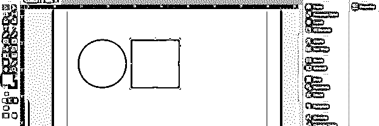

如果你不想改变正方形的位置和大小，那么你可以双击工具面板中的吸管工具图标进行一些参数设置。

现在吸管工具的一个对话框将被打开。在这个框中，我们有许多属性，您可以禁用那些不想复制的属性。在这种情况下，我将禁用变换选项，这样它就不会复制对象的大小和位置，然后单击此对话框的确定按钮。

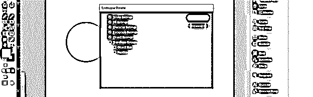

现在，如果我们做同样的事情，我们可以看到，它只会复制颜色和其他属性的圆圈除了大小和位置。

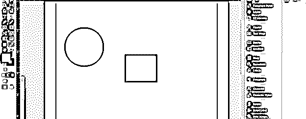

### 如何使用吸管工具复制文本的属性？

现在让我们了解如何使用滴管复制文本属性。在这里，我将从工具面板中选择文本工具，并将该文本粘贴到文本框中。

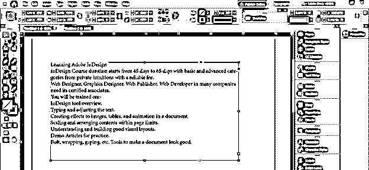

我将再次创建一个文本框，并在此粘贴另一个文本。

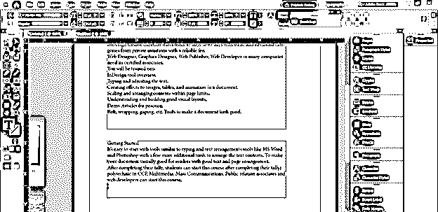

现在我将使用这个软件的字符格式面板对上面的文字进行一些格式化，比如改变字体类型、颜色等等。

现在，首先选择要应用格式化文本格式的其他文本。

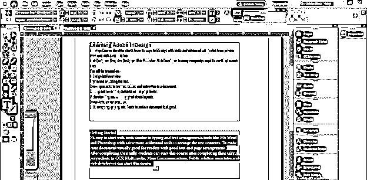

然后用吸管工具点击格式化的文本，它会把相同的格式应用到选中的文本上，就像这样。

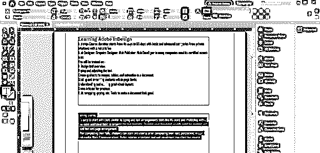

您可以看到两个文本框具有相同类型的格式。你应该注意的一件事是，它只会将选定文本段落的格式应用于其他文本。

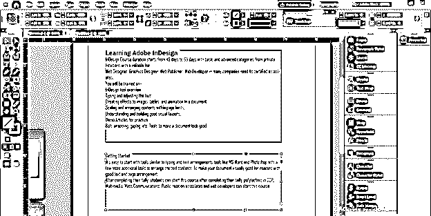

### 结论

我向您解释了吸管工具在 InDesign 中的所有可能用途，我相信您会发现它在您的 Indesign 创作工作中非常有用。您可以根据需要同时使用吸管工具列表中的其他工具。

### 推荐文章

这是 InDesign 吸管工具指南。这里我们讨论如何使用吸管工具从图像中挑选颜色。您也可以看看以下文章，了解更多信息–

1.  [Indesign 版本](https://www.educba.com/indesign-version/)
2.  [Indesign 的替代方案](https://www.educba.com/alternative-to-indesign/)
3.  [什么是 Adobe InDesign](https://www.educba.com/what-is-adobe-indesign/)
4.  [插图类型](https://www.educba.com/types-of-illustration/)

