# InDesign 脚本

> 原文：<https://www.educba.com/indesign-scripts/>

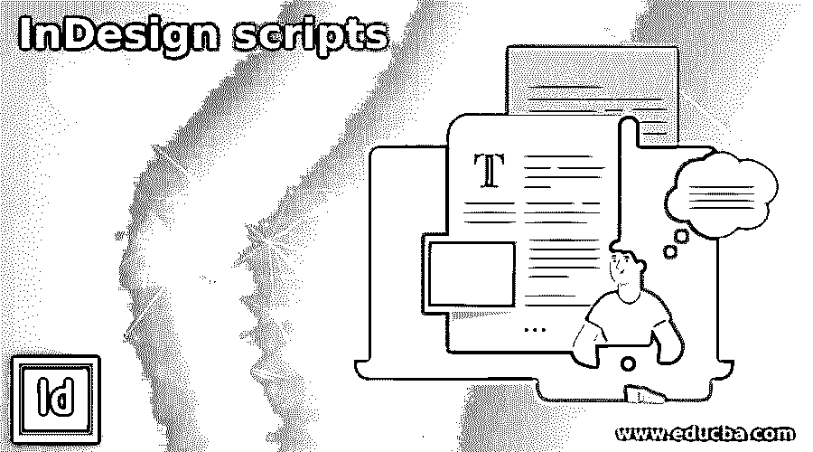

## InDesign 脚本简介

InDesign 脚本是计算机语言的代码，可以帮助我们通过简单的几个步骤执行各种任务。我们可以使用特定的脚本执行简单和复杂的任务，并且在 InDesign 的“脚本”面板下有许多内置脚本。关于这个软件的脚本最酷的事情是，你可以创建自己的脚本或运行其他人创建的脚本，以获得你想要的任务的结果。在这篇文章中，我会告诉你如何在这个软件中使用脚本面板的不同脚本，还会告诉你如何从外部资源安装任何脚本。

### 如何在 InDesign 中使用脚本？

要开始在这个软件中使用脚本，你不必担心。使用它并使用它来获得我们想要的结果是非常简单的。让我们开始讨论吧。

<small>3D 动画、建模、仿真、游戏开发&其他</small>

我将以一份新文件开始我们的讨论。我会从这个软件的新建文档对话框中选择这个 Letter 大小的文档。

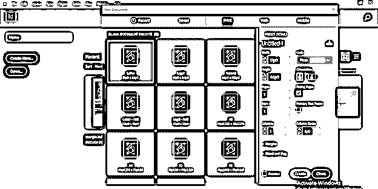

在该软件用户界面的右侧，我们有一个面板部分，在这个部分中，我们可以找到脚本面板。

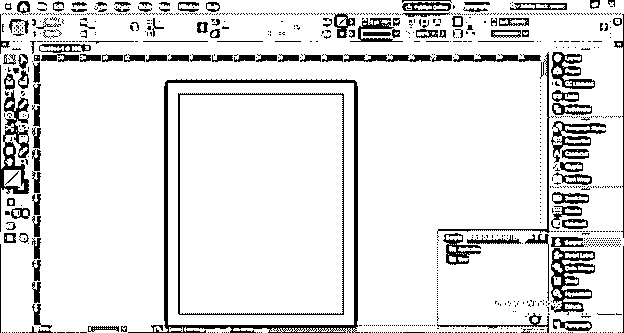

您也可以在窗口菜单中导航此面板，因此单击窗口菜单并转到下拉列表的实用程序选项。在新的工具选项下拉列表中，我们可以找到这个面板。Ctrl + Alt + F11 是在我们的工作屏幕上启用该面板的快捷键。

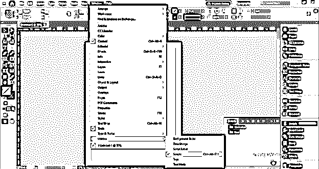

现在让我们使用矩形工具，我将创建这个矩形。我将单击脚本面板的应用程序文件夹的下拉箭头按钮，其中包含示例文件夹。

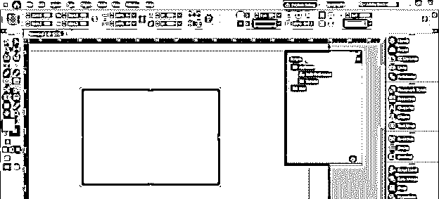

现在，单击 Samples 文件夹的下拉箭头按钮，其中有 JavaScript 和 VBScript。你可以使用其中任何一个的脚本。

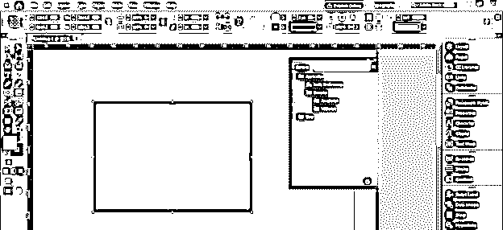

我将打开 JavaScript 文件夹，您可以看到列表中有一些脚本。

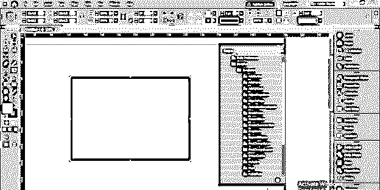

如果你想使用它们中的任何一个，你必须首先选择你想要应用所选脚本的对象，进入脚本面板，双击你想要的脚本。我将通过例子向你展示这一点。我将首先选择这个矩形，并单击 JavaScript 的 AlignToPage 脚本。

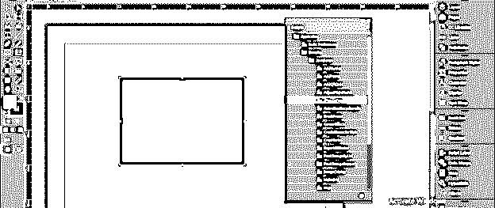

我们使用这个脚本以不同的方式对齐对象，例如；你可以看到在 AlignToPage 脚本的面板中有一些选项。但是，同样，这次我将使用默认选项；它会将我们选择的对象与页面的左上角对齐。

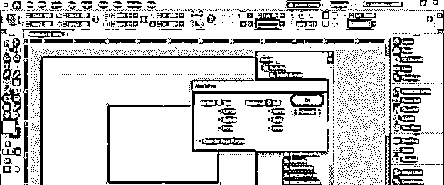

一旦我单击“确定”，它将像这样对齐，但我希望它与空白区域对齐。

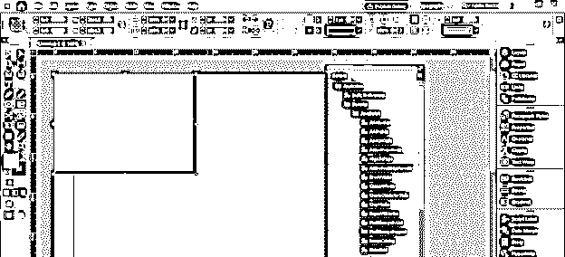

因此，我将再次打开对齐脚本面板，并启用“考虑页边距”选项。

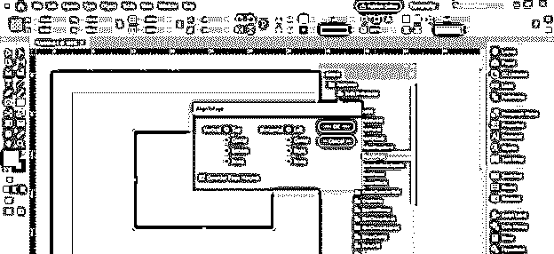

现在，如果我单击“确定”，它将与页面的左上角对齐。

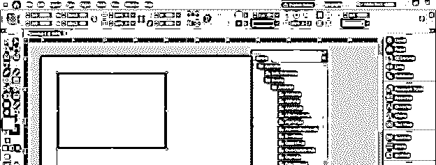

现在让我告诉你一个我们可以用来写文本的脚本。当我们将文本粘贴到客户提供的 InDesign 的文本框架中时，我们会遇到许多文本格式错误，例如可能存在不必要的空白、连字符、制表符空格等。所以通过下一个脚本，我们可以解决这个问题。

我已经把这段文字粘贴到了这个软件的文字框中，你可以看到这段文字似乎安排得很完美。

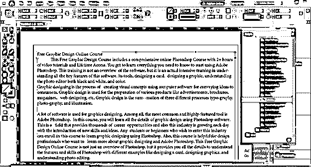

让我来启用隐藏字符，我们可以从“类型”菜单的下拉列表中的“显示隐藏字符”选项来启用它。

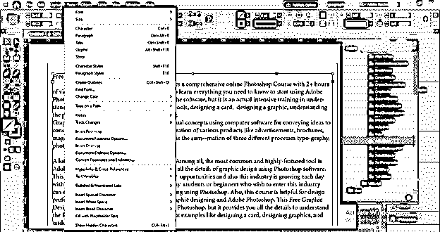

现在，您可以识别不必要的空白、连字符和制表符。要解决这个问题，我们可以双击“FindChangeByList”脚本。

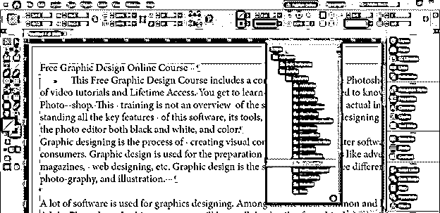

一旦我们点击，它会问，你想只应用于一个文件或选定的故事。这一次，我将使用文档选项并单击 Ok。

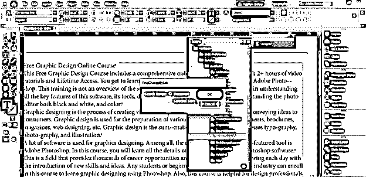

您可以看到它解决了所有格式问题，并且文本根据类型格式完美排列。

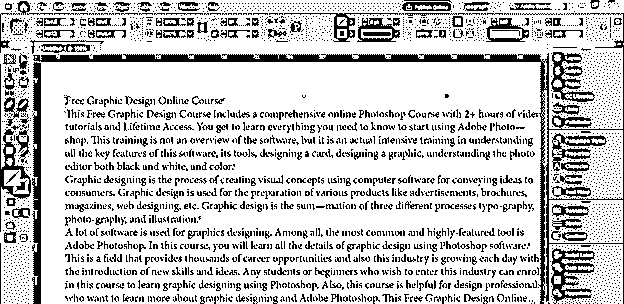

如果您想拥有自己的脚本或者想使用从外部来源下载的脚本，该怎么办？您也可以在脚本面板中使用它，它将位于该脚本面板的用户文件夹下，但是如果您没有任何外部脚本，则用户文件夹将为空。

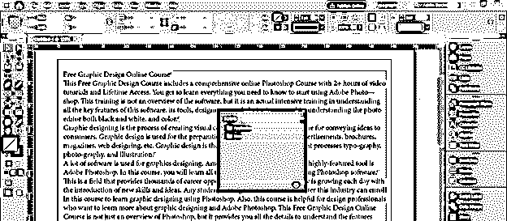

让我告诉你如何在这里得到你想要的剧本。首先，右键单击用户文件夹，然后单击“在资源管理器中显示”选项。

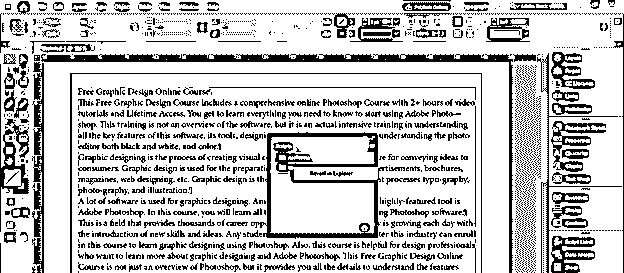

单击此选项位置后，InDesign 的脚本面板文件夹将会打开。

你可以将你想要的脚本代码粘贴到这个文件夹中。例如，我从互联网上下载了一个脚本，并将其粘贴到脚本面板文件夹中。如果您了解 Java 语言，也可以粘贴自己编写的脚本代码。

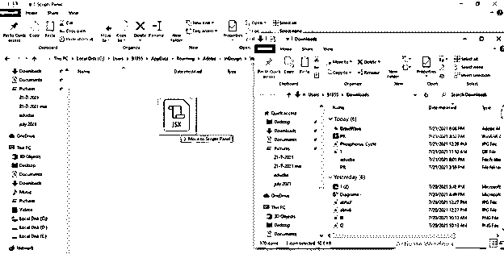

现在你可以看到在用户文件夹中有我们下载的脚本。

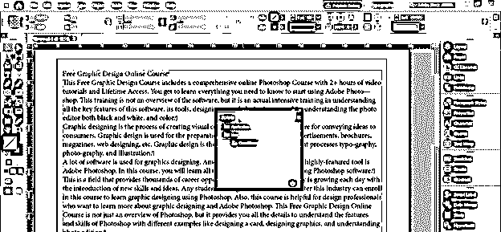

如果您为任何分析创建设计布局，此脚本用于绘制不同数据类型的波形。但是，首先，我将从工具面板中取出框架工具来解释它。

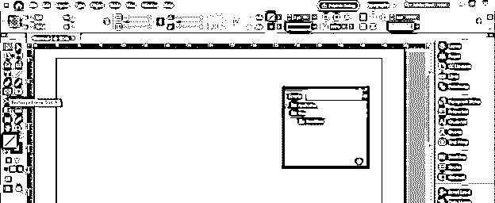

画一个像这样的框架，因为我们的波可以放在这个框架里。所以画完这一帧后，我会双击这个 DrawWave 脚本。

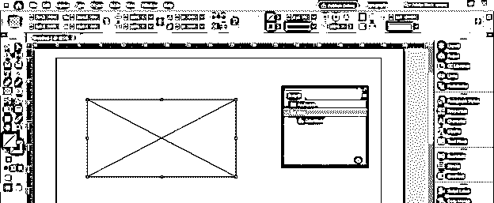

一旦我点击，这个面板将被打开。在这里，我们可以设置一些波、相位和周期。例如，我将输入波数的值为 2，其余参数保持不变，然后单击 Ok 按钮。

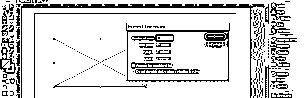

它会产生这样的波形。

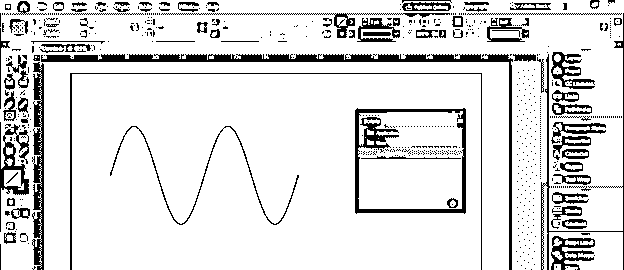

现在我会像这样对参数做一些改变。

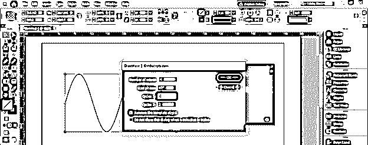

你可以根据参数看到。它给出了不同的结果。

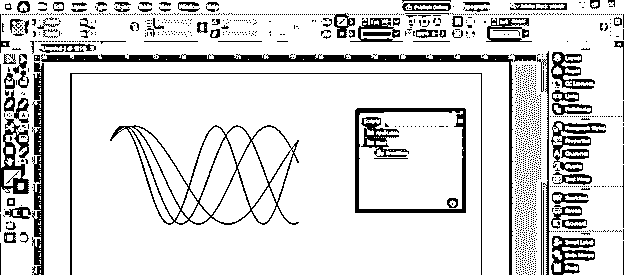

你也可以改变波浪的颜色。

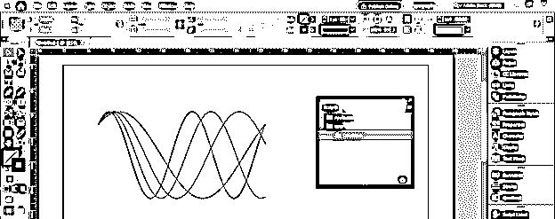

### 结论

现在，您知道如何与 InDesign 的内置脚本进行交互，并使用它们执行任何任务。此外，在本文中，您学习了如何在该软件的脚本面板中插入您自己或下载的脚本，以便在您的设计布局中使用它们。

### 推荐文章

这是 InDesign 脚本指南。在这里，我们将详细讨论如何在 InDesign 中使用脚本，并一步一步地讲解。您也可以看看以下文章，了解更多信息–

1.  [Indesign 的替代方案](https://www.educba.com/alternative-to-indesign/)
2.  [InDesign CS6](https://www.educba.com/indesign-cs6-top-ten-new-features/)
3.  [InDesign 文档设置](https://www.educba.com/indesign-document-setup/)
4.  [Indesign 版本](https://www.educba.com/indesign-version/)

