# InDesign 导出到 word

> 原文：<https://www.educba.com/indesign-export-to-word/>

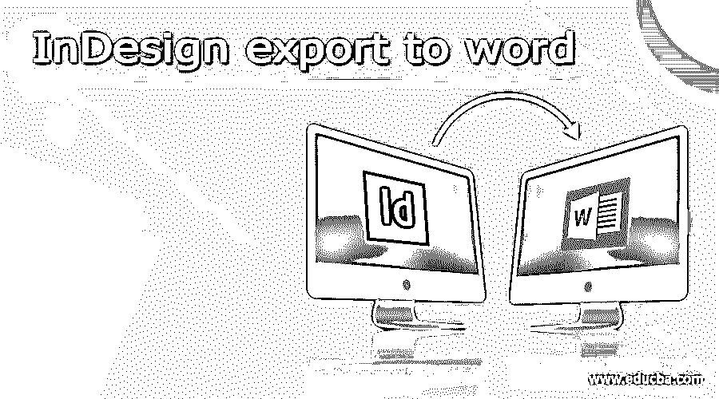

## InDesign 导出到 Word 简介

InDesign 导出到 Word 可以理解为将 InDesign 文件转换为 MS Word 文件格式。很多时候我们需要向客户提供可编辑的版面设计工作，而客户只偏好 word 编辑，所以我们将 InDesign 工作文件转换为 word 文件，但是在这个软件中，我们无法将 InDesign 文件直接导出或转换为 Word 文件。为了获得最终结果，我们必须经历一些重要的步骤。在这里，我们必须使用一个额外的软件结合这个软件来转换 word 文件，这是 Adobe Acrobat Reader，所以请确保在开始导出到 word 文件之前，您的计算机上安装了 Adobe Acrobat Reader。

### 如何在 InDesign 中执行导出到 Word？

您可以通过一些步骤将 InDesign 文件导出为 word 文件，为此，我们需要一个 InDesign 项目工作文件。这里我有一些我在这个软件中的工作，所以我将选择其中一个来解释这个话题。

<small>3D 动画、建模、仿真、游戏开发&其他</small>

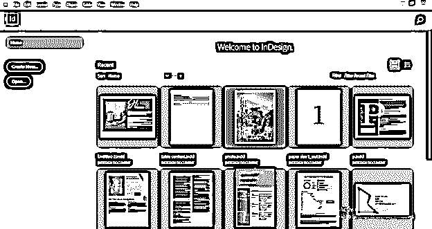

您可以通过浏览此软件的“新建文档”对话框来创建新文档，并创建自己的 InDesign 作品，或者获取任何以前的文件来了解此主题。

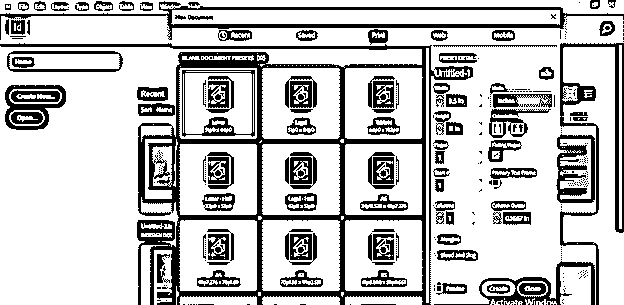

我将在 InDesign 中打开我创建的作品。但是，首先，让我给你解释一下这个布局设计。

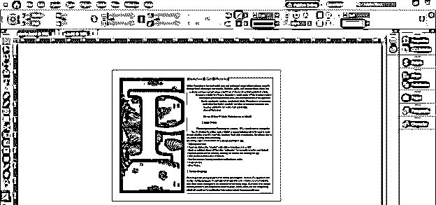

在这个设计中，我们在字母 p 后面有一个叶子的图像。

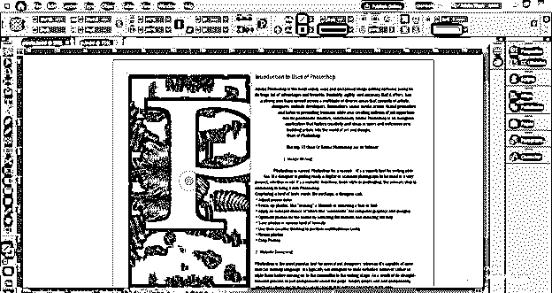

下一个是字母 P，它被转换成了形状。

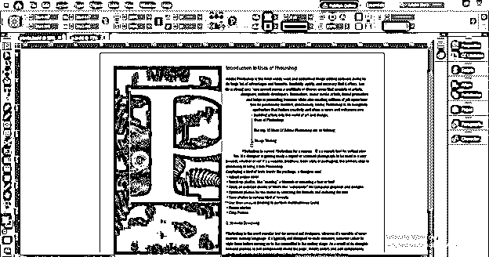

接下来是文本内容。所以我们可以把所有的版面设计转换成 word 文件格式。

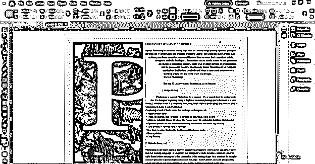

首先，我们必须将这项工作保存为 PDF 文件格式。因此，我将转到菜单栏的文件菜单，它位于工作屏幕的顶部，然后单击它。一旦我们点击它，一个向下滚动的列表将被打开，所以通过点击它来选择这个列表的导出选项，或者你可以按 Ctrl + E 作为它的快捷命令。

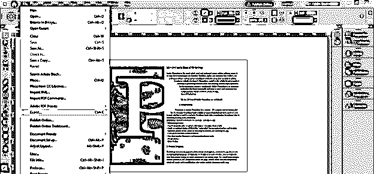

一旦我们点击这个选项，一个导出对话框就会像这样打开。在此选择您要保存该文件的计算机位置。我将其命名为 Word 模板；你可以根据你的作品来命名。

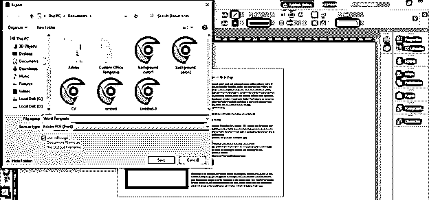

在此对话框的“保存类型”选项中，我将选择 Adobe PDF(打印)选项将其保存为 PDF。选择完毕后，点击保存按钮。

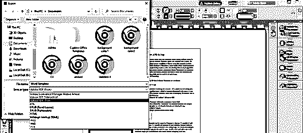

一旦我们点击保存按钮，一个导出 PDF 的对话框将被打开。在这个框中，我们有许多选项，可以根据您的要求进行操作。

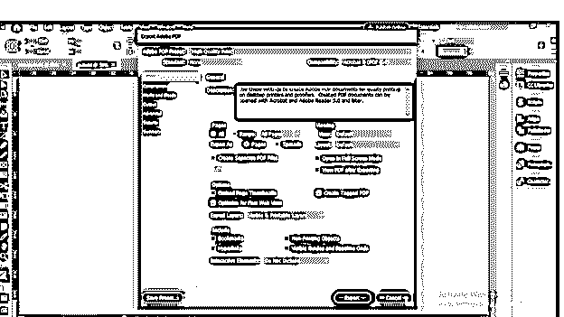

如果您进行了任何参数设置并希望保存它们以备将来使用，您可以单击此对话框的保存预设按钮。

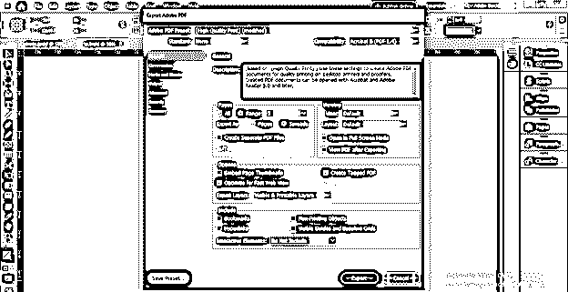

在此框中完成所需设置后，单击此对话框的导出按钮。根据 word 文件兼容性，您在此 pdf 文件中所做的设置将与 word 文件一起提供。

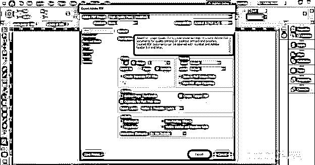

单击“导出”按钮后，如果您的设计有任何问题，那么在将您的作品保存为 pdf 之前，InDesign 会以消息框的形式向您显示该问题。如果您对该问题没有意见，请单击“确定”按钮。在我的作品中，溢出的文本向我展示了这种类型的消息框。我会同意的，所以请点击“确定”按钮。

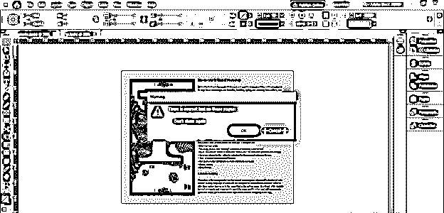

现在转到你保存你的作品的 pdf 文件的位置，右击它。例如，我的计算机中的这个位置有我的 pdf 文件，所以我将右键单击它，并使用选项打开，然后从下拉列表中选择“Adobe Acrobat Reader”软件来打开此 pdf 文件。

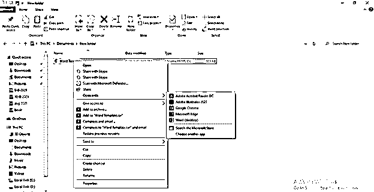

它会像这样在 Adobe Acrobat Reader 中以 pdf 格式打开。

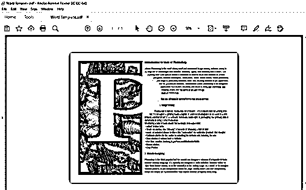

现在我们将把这个 pdf 文件保存到一个 Word 文件中，为此，我们必须进入这个软件菜单栏的文件菜单。一旦我们点击这个菜单栏，将会打开一个下拉列表。在此列表中，我们有“转换为 Word、Excel 或 Power Point”选项。为了我们的目的，我们将点击它。

一旦我们点击这个选项，这个软件的导出 PDF 面板将打开，我们选择的文件将显示在这里的选择文件选项部分。

您可以直接从该软件中打开您想要的文件，为此，您必须单击该软件的“导出 PDF”面板中的“添加要导出的文件”按钮。

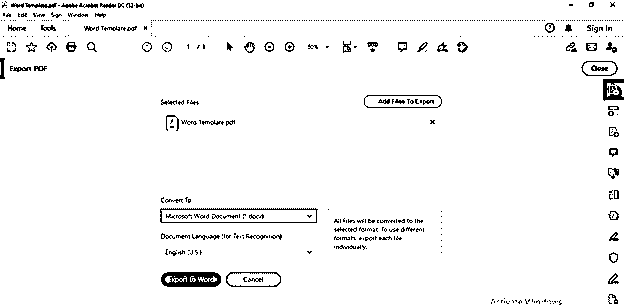

一旦我们点击它，一个选择文件的对话框将会打开，我们可以在这里选择我们的文件。

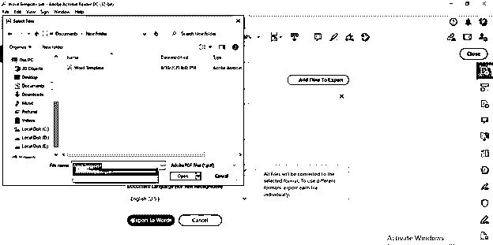

它还会出现在该软件的导出 PDF 面板的选定文件列表部分。

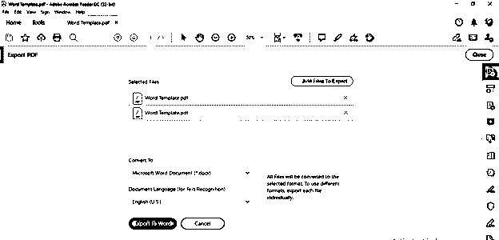

有'转换为'选项，我们有一些不同版本的不同文件格式的列表，所以你可以根据你的要求选择任何人。

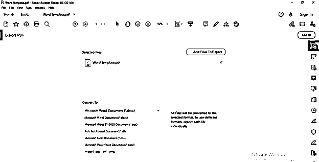

您也可以从该对话框的文档语言列表选项中选择所需的语言。

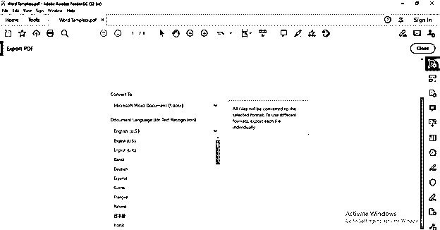

得到我想要的结果后，我将点击该软件的“导出 PDF”面板中的“导出到 Word”按钮。

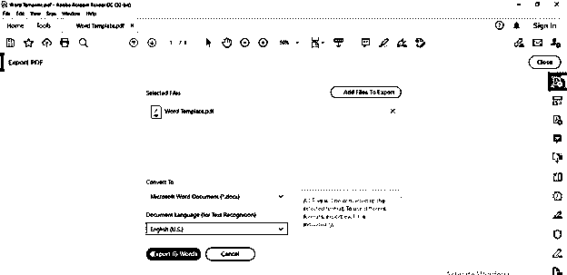

根据文件的大小，将 pdf 文件转换为 word 文件需要一些时间，所以不要担心转换是否需要时间，在此之后，您可以将您的设计作品转换为 Word 文件格式。

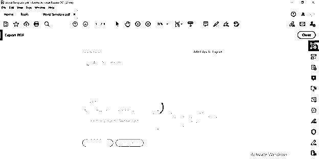

### 结论

我相信现在您已经了解了将 InDesign 作品转换为 word 文件需要经过哪些步骤。可惜这个软件没有直接把 InDesign 作品转换成 word 文件的方法，所以必须先转换成 PDF 文件格式，然后才能转换成 word 文件。

### 推荐文章

这是 InDesign 导出到 word 的指南。在这里，我们将讨论将 InDesign 作品转换为 word 文件所需的步骤类型。您也可以看看以下文章，了解更多信息–

1.  [Indesign 版本](https://www.educba.com/indesign-version/)
2.  [Indesign 的替代方案](https://www.educba.com/alternative-to-indesign/)
3.  [用户界面设计](https://www.educba.com/user-interface-design/)
4.  [什么是 Adobe InDesign](https://www.educba.com/what-is-adobe-indesign/)

