# InDesign 新闻稿模板

> 原文：<https://www.educba.com/indesign-newsletter-templates/>

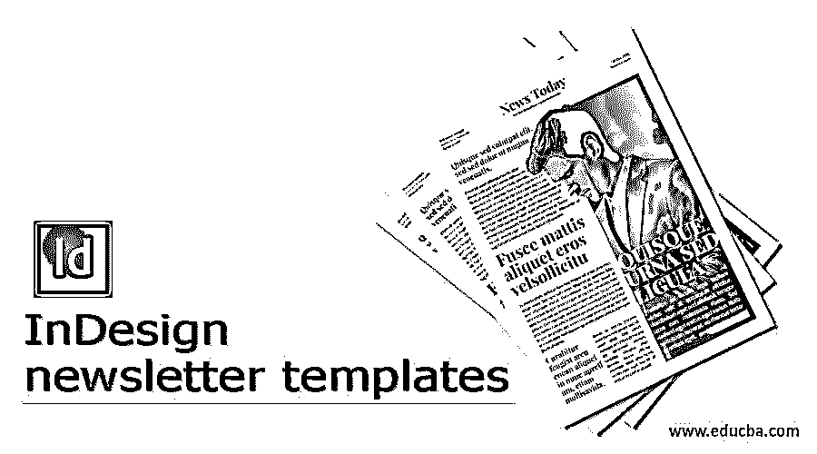

## InDesign 新闻稿模板简介

以下文章概述了 InDesign 新闻稿模板。大多数行业和组织更喜欢使用 Adobe InDesign 或 Adobe Photoshop 来创建新闻稿并相应地发布它们。然而，inDesign 作为一个出版和广播程序，是制作时事通讯、书籍、杂志和许多类似艺术品的最有效的软件。时事通讯是一种电子共享信息或新闻，由商业公司和行业创建，用于传播和宣传他们的项目、成就和未来的努力。时事通讯每月或每年发行一次。

### 如何在 Indesign 中创建和使用新闻稿模板？

在这篇文章中，我们将了解更多关于创建一个基本的新闻稿模板，以及我们如何使用同一模板的多种用途。

<small>3D 动画、建模、仿真、游戏开发&其他</small>

考虑一下，Adobe InDesign 是 Page Maker 计划的扩展。它被开发来以最小的努力和极大的准确性创造出版和印刷艺术品和利益。内容创作者和杂志或书籍设计者最喜欢 Adobe InDesign，因为它有平滑的用户界面和内置的简单而完美的工具来创作内容艺术品。

在 Adobe InDesign 中，用户可以从头开始创建自己的新闻稿模板，也可以从互联网上下载可编辑的新闻稿，并在 InDesign 上进行相应的编辑。

创建一份全面的新闻稿非常耗时，因为它取决于制作一份完整的新闻稿所需的页数、内容类型和插图。此外，许多每月或每两个月发布一次简讯的组织可能需要一个现成的模板，可以每月轻松编辑。

### 如何在 Adobe InDesign 中创建新闻稿模板

在这种方法中，我们将从创建新文档的第一步开始创建一个样本新闻稿模板。此外，我们将理解和感知各种工具和功能，用于创建一个单一的时事通讯。

以下是创建简讯的步骤

1.  启动 InDesign

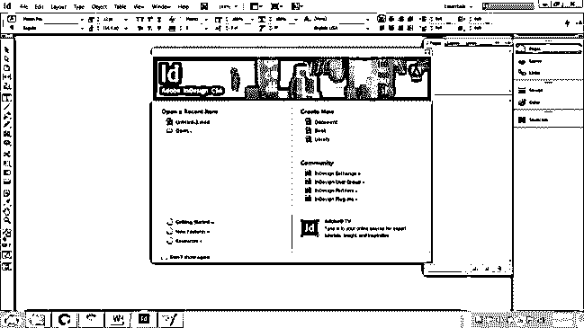

2.  创建新文档。文件的大小应为 Letter 大小，并选择要添加的页数。我们为示例添加了 4 页。此外，应该打开对页复选框。最后，确保根据文件调整所有设置，如装订线、宽度、高度和边距。

3.  接下来，我们开始使用图层。转到“窗口”>“图层”来查看“图层”面板。

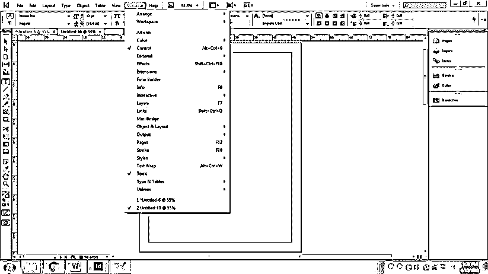

4.  创建三个新层，命名为背景，文字和图像，如下图所示

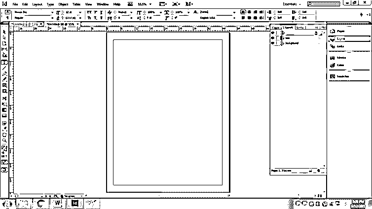

5.  锁定背景层，借助颜色工具开始；填充颜色如下所示-

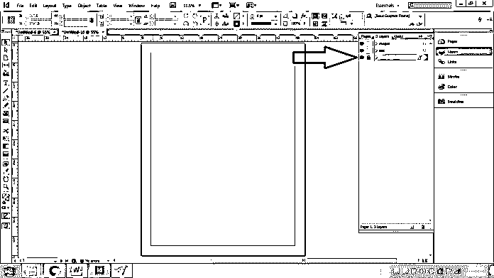

6.  现在，我们将开始工作的文字层。在这个图层上创建一个矩形，如下所示

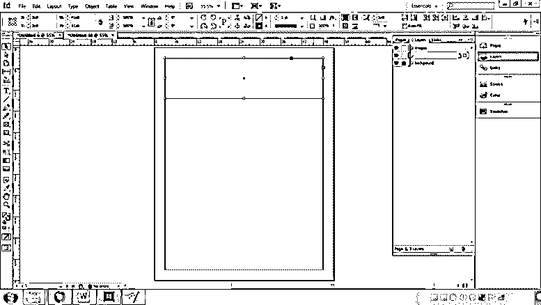

7.  借助颜色工具填充颜色。

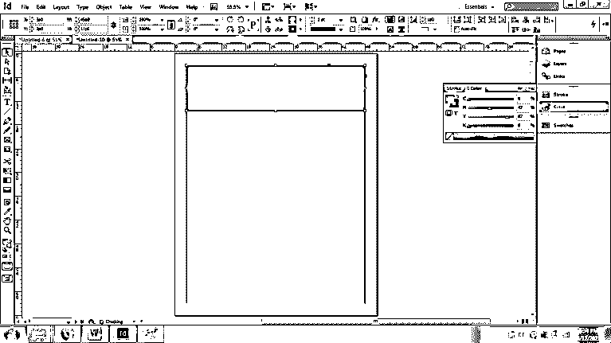

8.  转到文字工具，将文字写成 BACHPAN SCHOOL

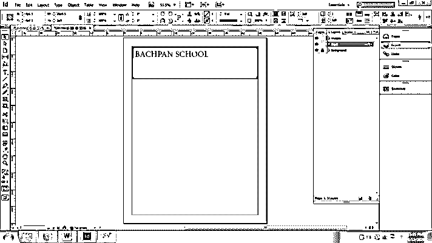

9.  转到“文字”>“字符样式”。双击字符样式 1，并为文本选择一种样式。我们也可以点击预览来同时查看编辑。创建字符样式将有助于用户保持页面上多个文本之间的相似性。

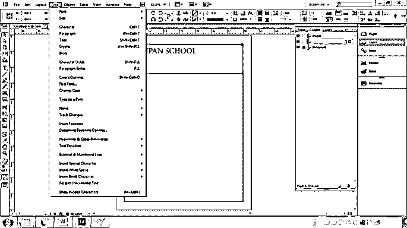

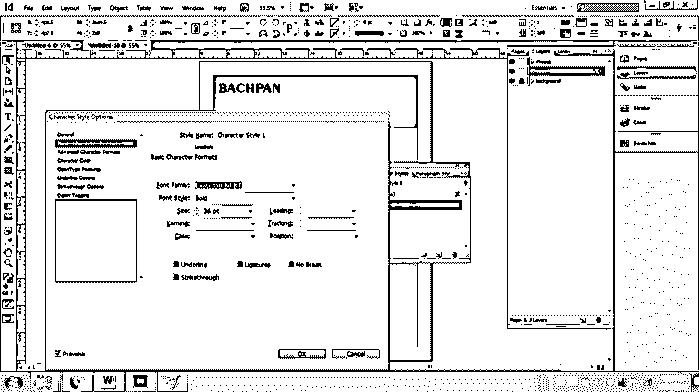

10.  现在，类似地，在上面的文本下面创建另一个文本，并在上面写一篇时事通讯。

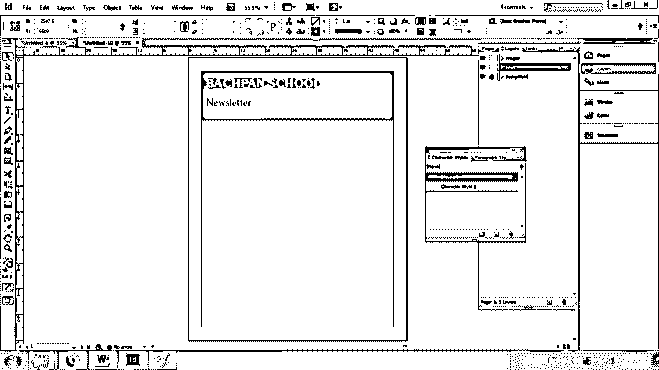

11.  为此文本创建另一种字符样式。因为它恰好是不同的字体样式和大小。

12.  此外，我们现在添加了一个可以从互联网下载的图像。
13.  如下图所示放置图像。然后，转到文件>地点，并选择图像的来源。

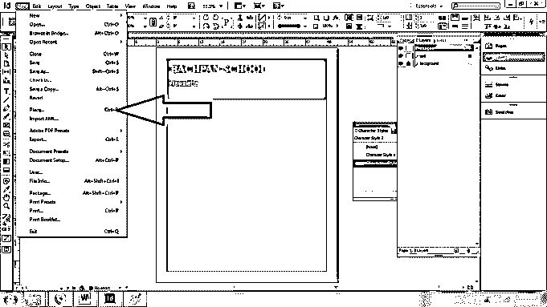

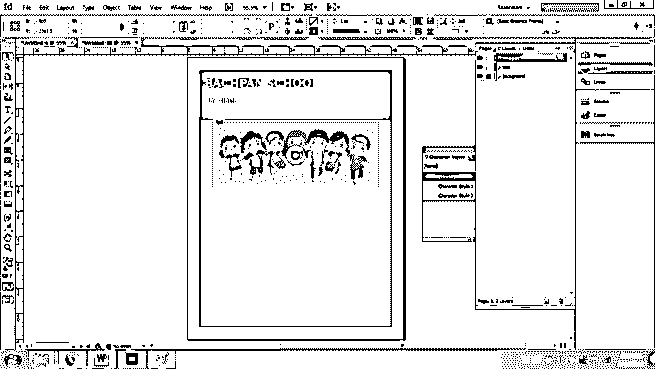

14.  现在，我们创建另一个层命名为主要内容。

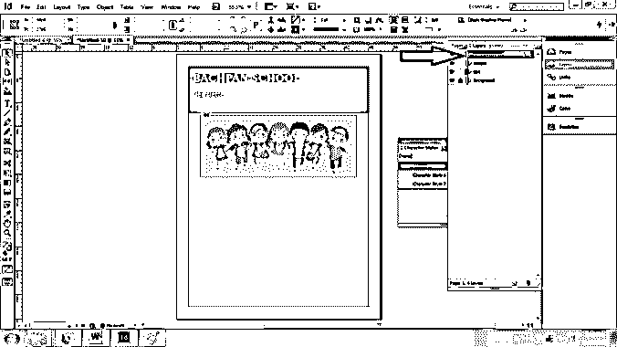

15.  在这一层，创建一个矩形，并用白色填充。

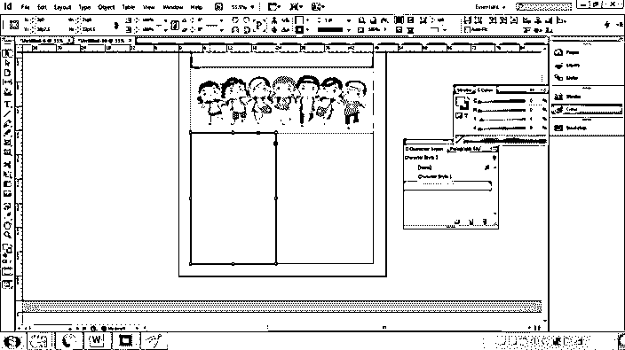

16.  现在，创建一个文本框架，并编写如下所示的文本。

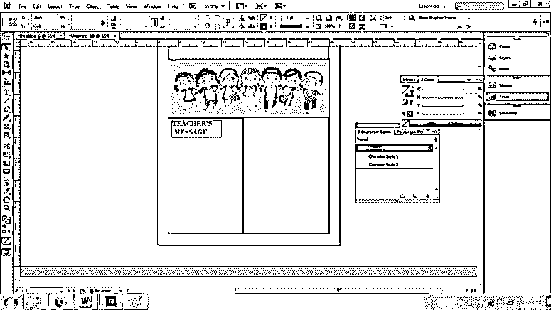

17.  同样，创建一个文本框架，并编写如下所示的示例文本

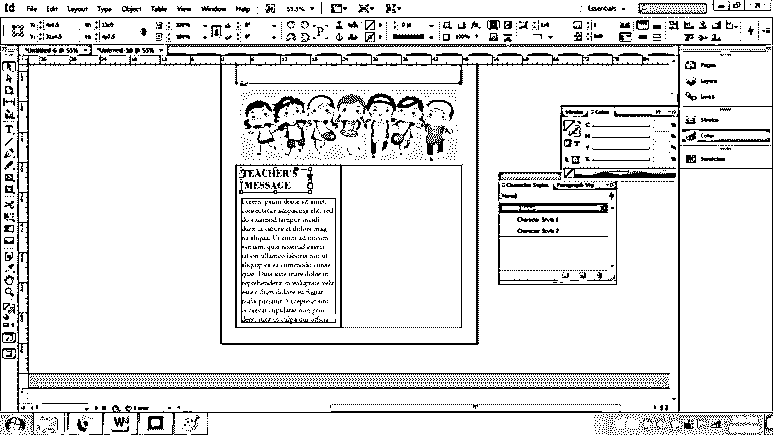

18.  现在，创建一个文本框架，右键单击文本框架以查看文本框架选项。

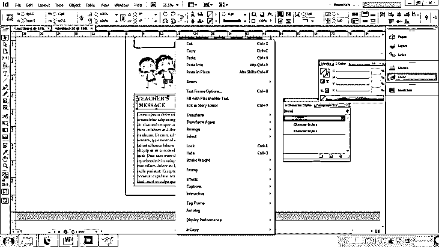

19.  类似地，我们创建一个矩形和文本框来完成新闻稿的第 1 页。

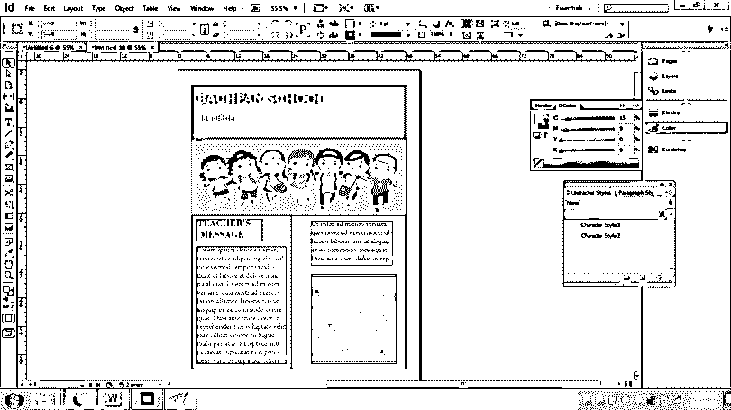

20.  最后，要保存模板，我们转到“文件”>“另存为”,并以 Adobe InDesign 模板格式保存。

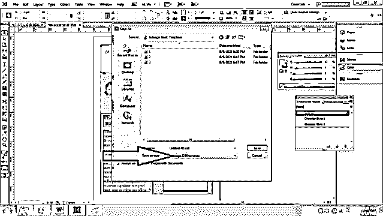

21.  此外，请记住将模板导出为 PDF 格式，以便进行高质量打印。

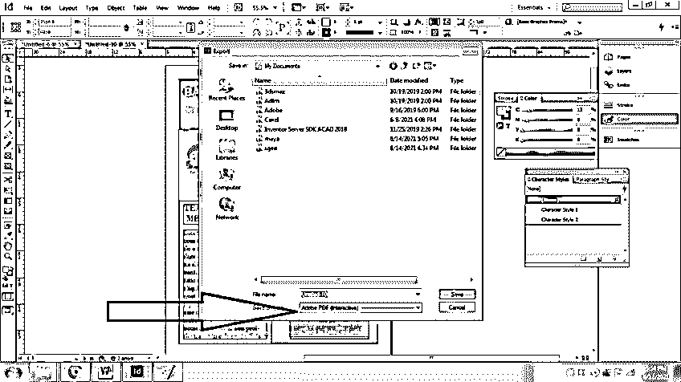

在上面的示例中，我们也可以使用分栏和装订线来代替创建矩形和文本框。装订线是一种工具，我们在两列或多列或页面之间创建一个间隙。以类似的方式，我们设计和创建新闻稿的其余页面。

同样，我们可以从互联网上下载现成的 InDesign 新闻稿模板，并按照我们的要求进行编辑。该过程类似于上面解释的例子。

### 结论

总结上述文章，我们想提一下，创建和设计简讯模板可能需要很长时间和精力。

但是，通过使用 Adobe InDesign，用户可以最大限度地减少他们的工作量，因为他们需要的一切都可以毫无阻碍地在界面上获得。

### 推荐文章

这是 InDesign 新闻稿模板指南。在这里，我们讨论如何在 Adobe InDesign 中创建新闻稿模板及其步骤。您也可以看看以下文章，了解更多信息–

1.  [Indesign 版本](https://www.educba.com/indesign-version/)
2.  [什么是 Adobe InDesign](https://www.educba.com/what-is-adobe-indesign/)
3.  [InDesign CS6](https://www.educba.com/indesign-cs6-top-ten-new-features/)
4.  [用户界面设计](https://www.educba.com/user-interface-design/)

