# InDesign 杂志

> 原文：<https://www.educba.com/indesign-magazine/>

## 什么是 InDesign 杂志？

InDesign 杂志是一种包含文本内容、图像、设计元素和其他重要内容的文档。InDesign 中有许多功能和工具可以帮助我们设计有效的专业杂志设计。你不仅可以用你自己的想法设计你的杂志版面，还可以通过 adobe 预先设计的杂志模板，用它们来设计你自己的内容和图像的杂志。今天在这篇文章中，我将告诉你在用这个软件创建杂志时，你必须记住的基本点是什么？

### 如何创作 InDesign 杂志？

您可以用自己的想法和概念设计杂志，但在此之前，您必须了解如何在 InDesign 中处理杂志的设计布局。所以我要告诉你一些基本要点。

<small>3D 动画、建模、仿真、游戏开发&其他</small>

我们来看一个新文档，单击该软件欢迎屏幕上的“新建”按钮来创建一个新文档。

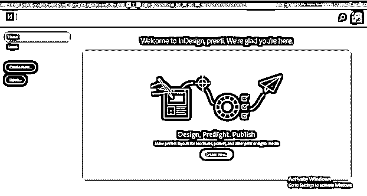

一旦你点击它，一个新的文件对话框将被打开。在这里，我将选择文档的 A4 大小预设，并选择将单位更改为厘米。

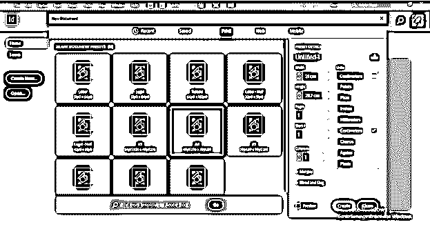

我将用 2 页的篇幅告诉你杂志设计的布局。您也可以在这个对话框中设置列数，但我会保持不变。

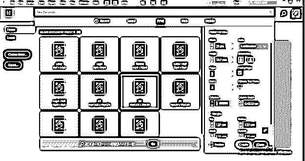

现在为你的布局设置边距。我将上下边距取 3 厘米，左右边距取 2 厘米。现在点击这个对话框的创建按钮。

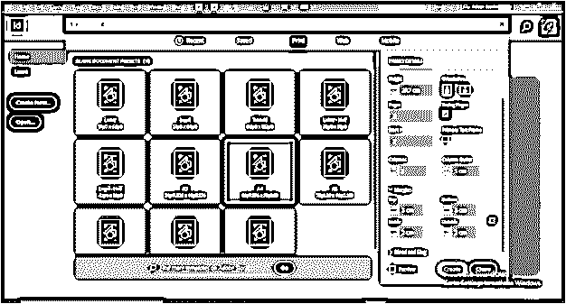

现在杂志的一个基本版面就这样做好了。

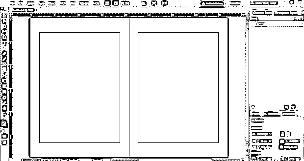

如果要更改列号，可以在“页边距和分栏”对话框中进行更改。

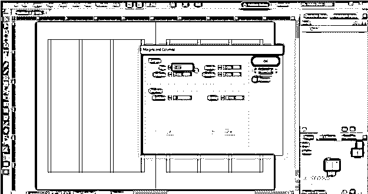

我们在文档中插入列，以便对文本内容进行适当的排版。现在在这个文档中插入文本，从工具面板中选择文本工具。

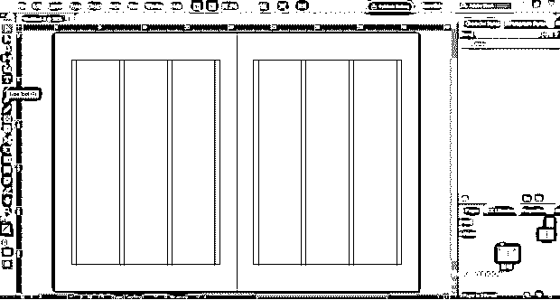

并拖动鼠标光标绘制一个文本框，如下所示。

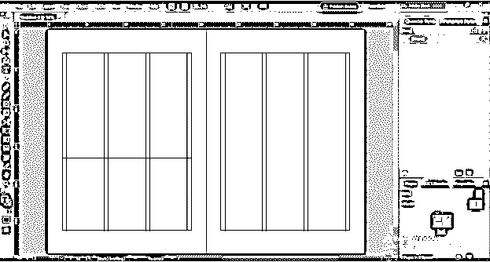

要在文本框中放置文本内容，请转到菜单栏的“文件”菜单，从下拉列表中选择“放置”选项，或者您可以按 Ctrl + D 按钮作为快捷键。一旦你选择了这个选项，你会看到一个对话框，你可以从中选择你的文本内容。

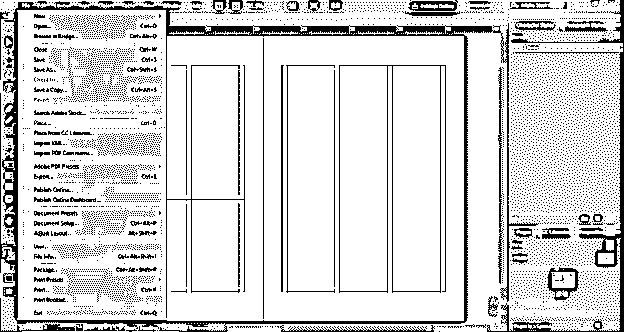

现在你需要在你的杂志版面设计中放置一些图片，为此，你必须创建一个框架。为了创建一个框架，你必须从工具面板中选择矩形框架工具。

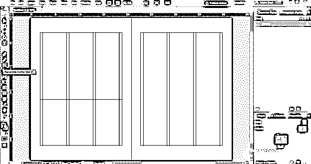

您可以使用该软件的位置选项在此放置任何图像。

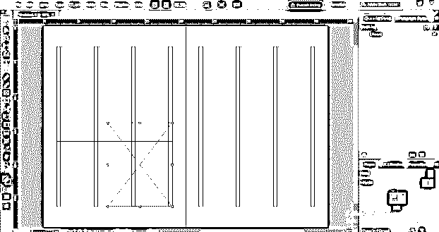

### 创建 InDesign 杂志

现在让我们在这里创建一个杂志设计，以便更好地理解它。我们将继续这个布局文档。现在转到文件菜单的位置选项，因为我想在这里放置一个图像。

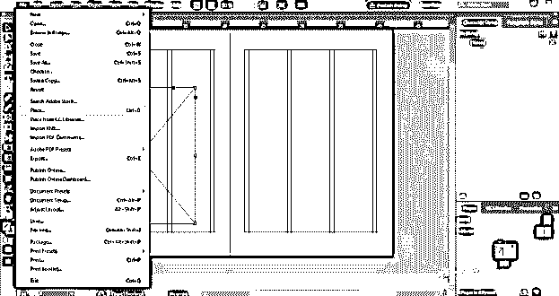

您可以从打开的对话框中选择所需的图像。我将选择这一个并且点击打开按钮。

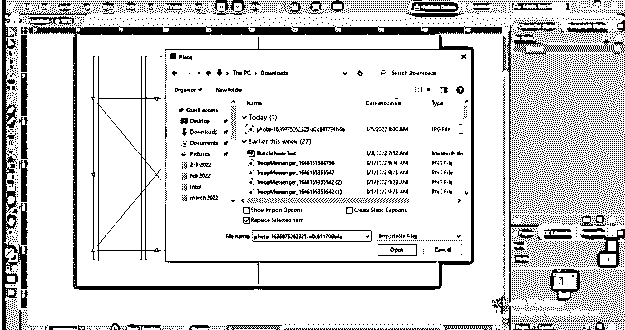

要放置图像，您可以选择要放置图像的框架，或者根据您想要的图像大小拖动它。我会像这样放置它

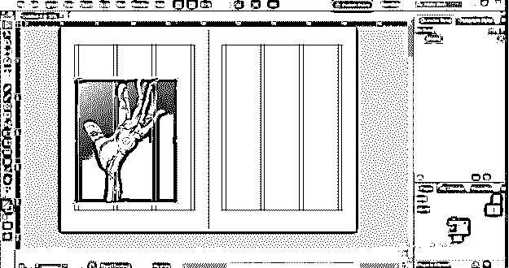

现在，我将创建一个形状作为设计元素的一部分，并从该软件的色板面板中填充一种颜色。

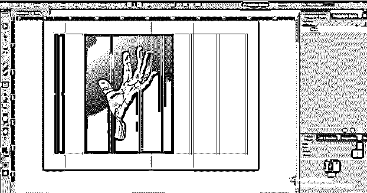

现在，我将在这里键入一个文本句子，并将其颜色改为白色。您可以从该软件的字符面板中根据您的选择更改文本字体。

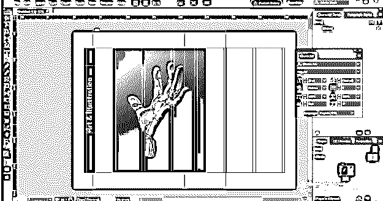

同样，你也可以在你的杂志版面设计中加入更多的设计元素。现在我会像这样在这里添加一些文本内容。您可以在“粘贴到此处”中从内容的源文件复制文本，或者使用“放置”选项粘贴所需的文本内容。

如果您已经采用了分栏指南，则可以借助鼠标光标调整分栏中的文本内容。

或者，如果没有列，则可以从“属性”面板的“文本框架”选项中向选定的文本内容添加列。您可以在工作屏幕的右侧找到属性面板。

如果你愿意，你可以在你的设计中添加背景，为此，你可以使用图像。在这里，我从网上下载了这个纹理背景。

现在把这个图像像这样发送回来

在这里我给了你一些关于杂志设计的想法。你可以用自己的想法去尝试更多的东西。

### InDesign 杂志模板

如果你愿意，你也可以使用杂志的模板来代替你自己的设计布局。Adobe 为您提供了许多设计模板，您可以根据自己的需要使用它们。

在“新建文档”对话框中，您可以在任何文档预设下找到模板。在此导航至杂志模板，或者您可以在此对话框的搜索框中进行搜索。

选择你想要的一个，然后点击所选的预览按钮。在这里你可以看到预览，一旦你对它感到满意，然后点击下载按钮的细节部分选择的模板。

下载完成后，在相同的详细信息部分，您会看到“打开”按钮。点击它

如果有一些字体丢失，那么它会显示一条关于丢失字体的消息。如果缺少的字体来自 Adobe 集合，您可以通过单击对话框中的“查找字体”按钮来激活它们。

它会像这样打开，现在你可以根据你的选择在这里做你想要的改变，也可以添加内容。

### 结论

现在，我相信你对杂志设计以及如何在 InDesign 中进行设计有很好的了解。所以你可以开始设计你自己的杂志，用很多好的设计元素和字体设置，或者你可以用这个软件预先设计的模板来节省你的设计时间。我会建议你试着自己设计一个。

### 推荐文章

这是 InDesign 杂志的指南。在这里，我们讨论什么是 InDesign 杂志，如何设计 InDesign 杂志，以及实现的例子。您也可以看看以下文章，了解更多信息–

1.  [InDesign 作品集模板](https://www.educba.com/indesign-portfolio-template/)
2.  [Adobe Indesign 使用](https://www.educba.com/adobe-indesign-uses/)
3.  [InDesign 母版页](https://www.educba.com/indesign-master-pages/)
4.  [InDesign 版面](https://www.educba.com/indesign-layout/)

