# InDesign 行距

> 原文：<https://www.educba.com/indesign-line-spacing/>

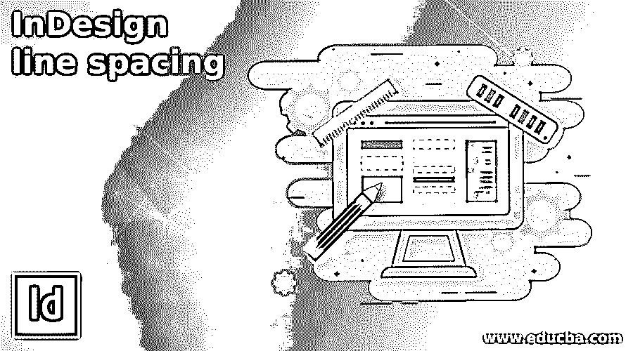

## InDesign 行距简介

InDesign 行间距是该软件的一个功能，通过它可以调整行间距，使我们的布局设计看起来令人愉快且引人注目。很多时候，我们需要调整间距，以便将任何内容覆盖到一个文档页面，因此有必要对该软件的行距功能有一个很好的了解。在设计语言中，我们称这种间距为行距，这意味着行距是一个定义任何段落两行文本之间间距的术语。我会在这篇文章中告诉你一些关于行距的事情，之后，你会对它有很好的掌握。让我们开始讨论吧。

### 如何在 InDesign 中使用行距？

在 InDesign 中使用行距并不是什么大不了的事情，但是我们必须了解如何正确地使用它，以获得有效的设计布局。

<small>3D 动画、建模、仿真、游戏开发&其他</small>

为了开始我们的讨论，我将从该软件的“欢迎”屏幕的“新建”选项卡中获取一个新文档。

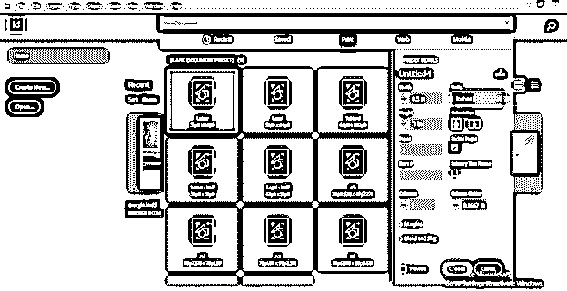

我这里有一些文本内容，我已经在标题和简单的段落分开。

您可以看到，如果我们切换到预览模式，那么看到这种类型的文本内容设置就不太好了。那么这次我们需要什么？我们需要设置文本之间的间距，使其看起来不那么拥挤。

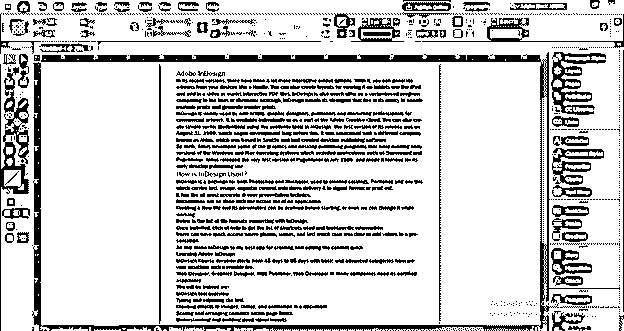

你可以按下键盘上的回车键，让标题和段落或者行之间有一些间距，但是我不想要这么大的间距，我想要比它小的间距。

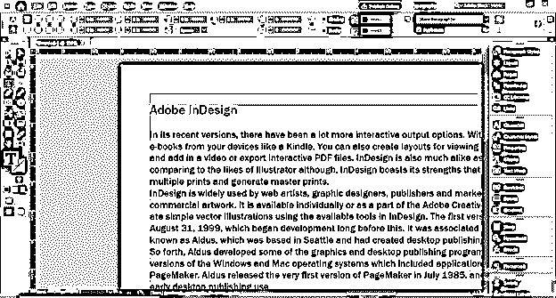

为此，我将打开这个角色面板。

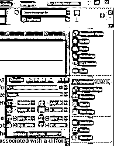

如果您找不到此面板，您可以在 Windows 菜单的下拉列表中找到它。所以转到它的类型和表格菜单选项，这里是字符选项，或者你可以按 Ctrl + T 作为快捷键。

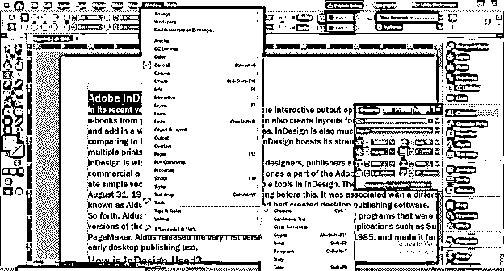

现在在这个字符面板中有一个引导选项。

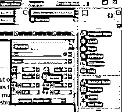

在这个行距选项框中，我们有自动选项，这意味着 InDesign 会根据字体大小自行设置行距。

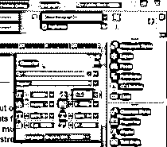

我将选择这一段的标题和行，当我可以单击前导框的向下箭头键时，我就可以选择任何点大小的行间距。

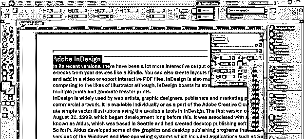

例如，如果我选择 18 磅，那么这两条线的间距将是 18 磅。

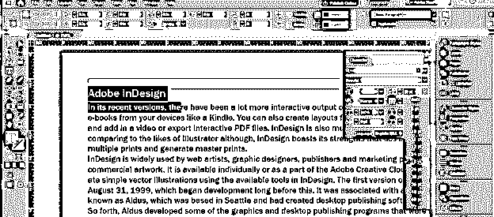

您也可以手动输入您想要的值。

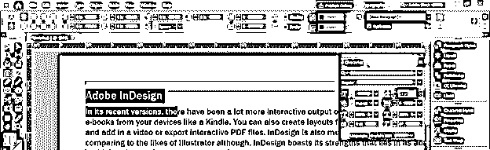

你可以看到在这个面板的字体大小框中没有显示字体大小。这是因为我们选择了两个不同大小的文本。

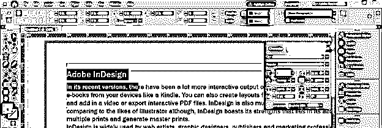

现在让我们选择相同字体大小的文本行，现在在字符面板中字体大小是 12 磅。

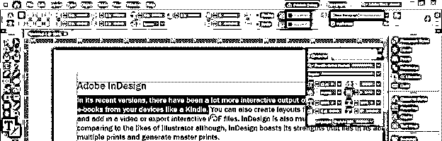

这次我会选择自动引导选项，当你点击它时，它会显示一个特定的点值。该值是字体大小的 120%。

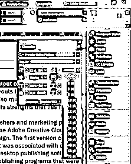

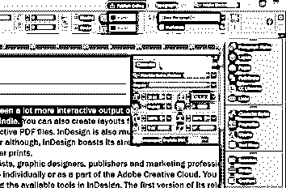

如果我们将字体大小更改为 10，那么您可以看到行距将更改为 12，是 10 的 120%。因此，自动间距将是文本字体大小的 120%。

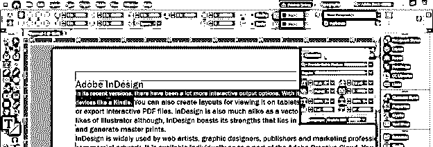

您也可以在工作屏幕右侧的面板部分的属性面板中找到相同的引导选项。所有的引导选项都和我们上面讨论的一样。

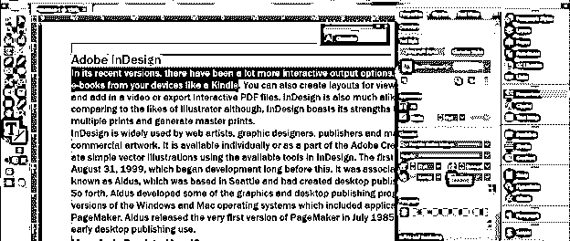

如果没有这样的面板，您可以在窗口菜单的下拉列表中找到它。只需转到该列表，并通过单击它来启用它。

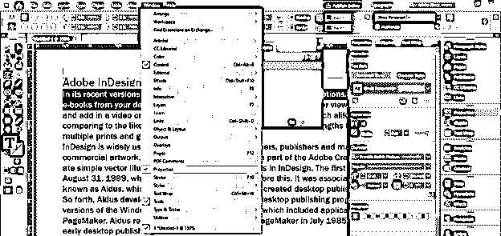

还有一个地方，你可以找到同样的领先选项是字符格式面板。您可以在工作屏幕的顶部找到此面板。

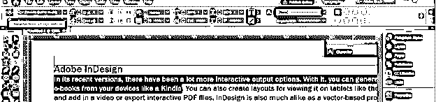

您可以在带有名称控件的 Widnow 菜单的同一下拉列表中找到此面板，或者您可以按键盘的 Ctrl + Alt + 6 按钮作为其快捷键。

这是该面板中的主要选项。

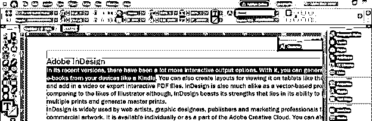

让我们把这一段中选定的这一行的字体大小改为 10 磅。

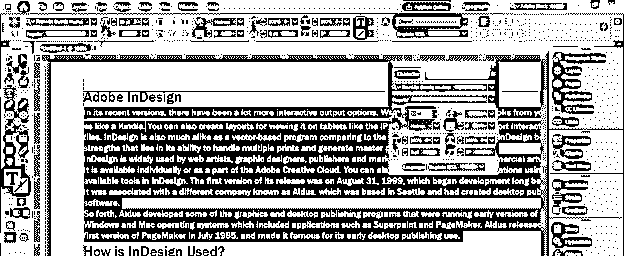

如果我将此字体大小乘以行距值，InDesign 将自动设置行距值。例如，字体大小是 10，行距是 1.5，所以我将在行距框中输入 10*1.5，然后点击键盘上的 tab 键。

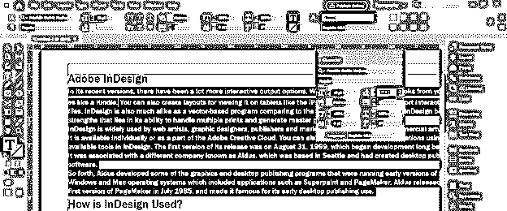

你可以看到它自动设置行距为 15 磅。因此，InDesign 本身会根据给定值计算间距。

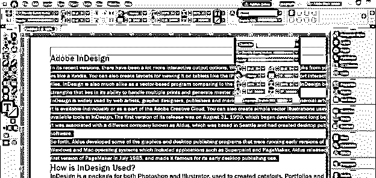

有一种无需手动更改行距的快捷方式，即按住键盘上的 Alt 键，按键盘上的向上箭头键增加数值，或按键盘上的向下箭头键减少数值。

这里你可以看到，如果我们这样做，间距在 2 点的间隙处跳跃。

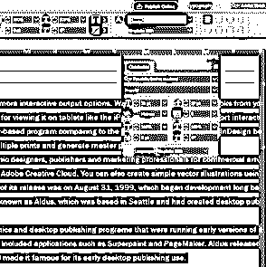

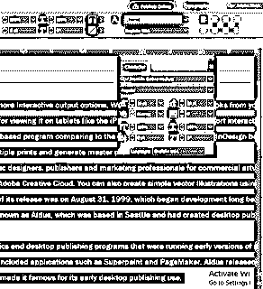

但是，如果你想你可以设置这个差距，你可以去编辑菜单的首选项选项，在新的下拉列表中点击单位和增量选项。

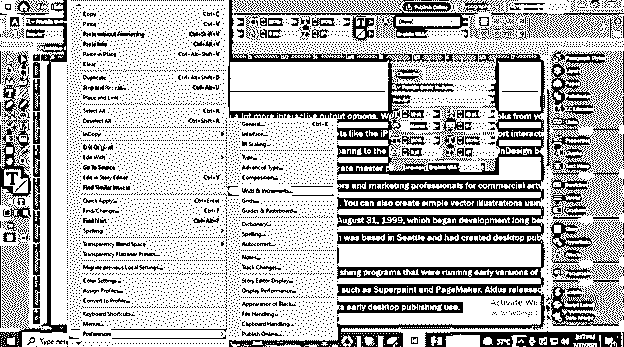

在首选项对话框中，我们可以更改键盘增量的大小/行距选项的值。

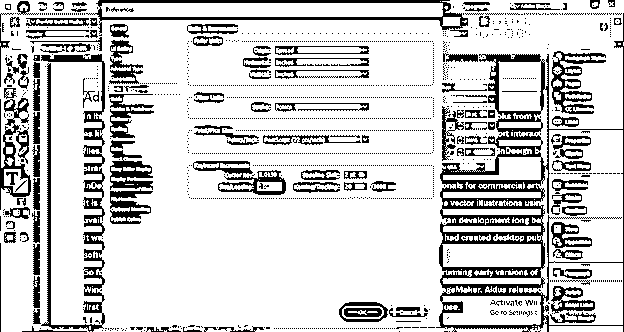

现在，当我们用同样的方法改变间距时，它只会改变一个间隙。

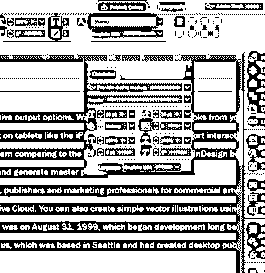

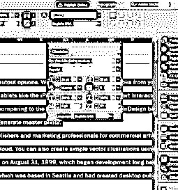

我们在上面讨论过，自动行距值大约是字体大小的 120%,你也可以根据自己的需要来设置。

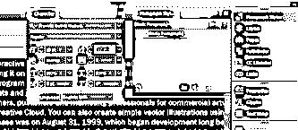

为此，打开段落样式面板，点击右上角的按钮。在打开的列表中选择新的段落样式选项。

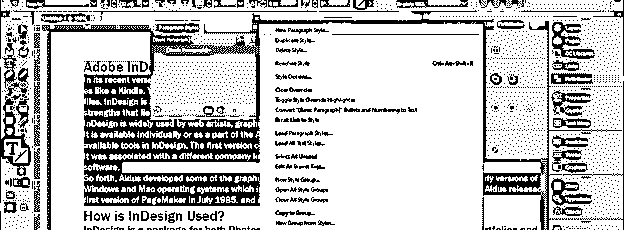

在新的段落样式框中，我们有自动行距选项，在这里我们可以设置行距百分比。

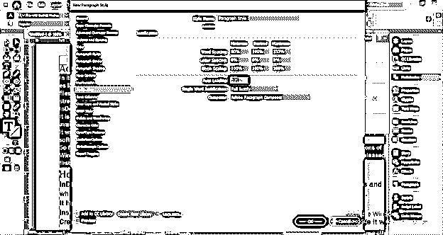

### 结论

我相信行距对你来说将不再是一个陌生的词，你也可以知道我们在设计语言中叫它什么。在这里，我告诉你这个功能的所有可能的方面，你可以根据你的工作要求来处理，并可以创建一个非常有效的布局设计与大量的文本内容。

### 推荐文章

这是 InDesign 行距指南。在这里，我们将逐步详细讨论如何在 InDesign 中使用行距。您也可以看看以下文章，了解更多信息–

1.  [Indesign 版本](https://www.educba.com/indesign-version/)
2.  [Indesign 的替代方案](https://www.educba.com/alternative-to-indesign/)
3.  [什么是 Adobe InDesign](https://www.educba.com/what-is-adobe-indesign/)
4.  [InDesign CS6](https://www.educba.com/indesign-cs6-top-ten-new-features/)

