# InDesign Fonts

> 原文：<https://www.educba.com/indesign-fonts/>

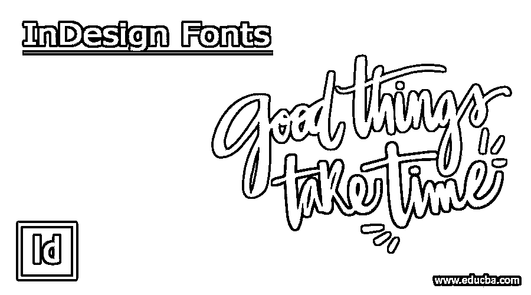

## InDesign 字体介绍

InDesign 字体可以理解为我们用来使文本内容具有可读性和表现力的文本内容的字体。在 InDesign 中，Adobe 提供了多种字体样式的多种字体。有些已经安装在您的 Adobe 软件中，有些可以通过 Adobe InDesign 的云服务器启用。除了 Adobe 字体，您还可以在本软件中安装和使用外部字体。今天在这篇文章中，我将告诉你 InDesign 字体的所有可能的方面，以及你如何添加外部字体，并开始使用它们来积极地影响你设计的文档。

### InDesign 字体概述

现在，让我们大致了解一下 InDesign 字体，以便您可以轻松地与该软件的其他方面进行交互。为了解释这一点，我将创建一个新文档，因此请单击该软件欢迎屏幕上的“新建”按钮。

<small>3D 动画、建模、仿真、游戏开发&其他</small>

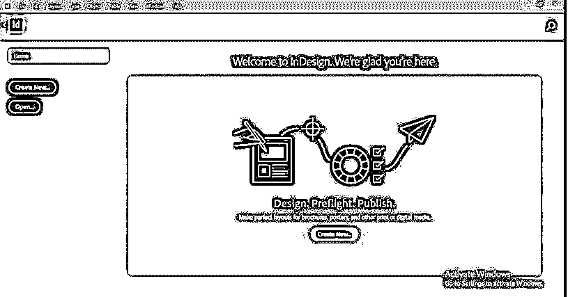

单击后，您将看到“新建文档”对话框。这一次，我将保留此对话框的设置，并单击“创建”按钮。

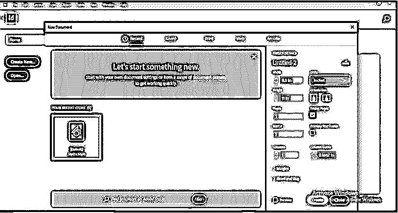

现在在文档窗口，我会进入工作屏幕左侧的工具面板，选择；这种文字工具或者你可以按下键盘上的 T 键作为它的快捷键。

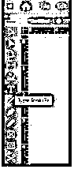

现在拖动鼠标光标创建一个这样的文本框架。

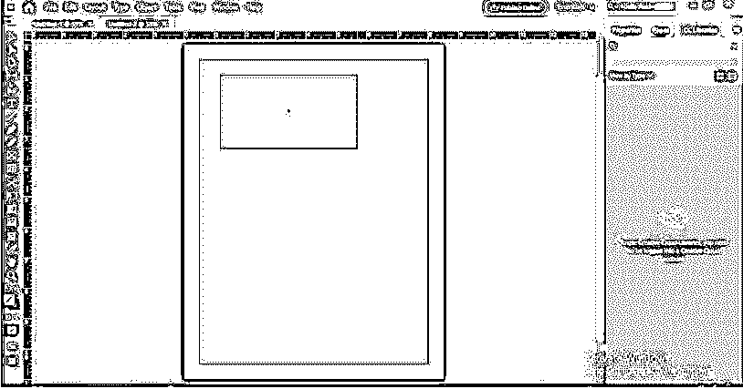

在文字工具的帮助下，我将在这里输入一些文字。

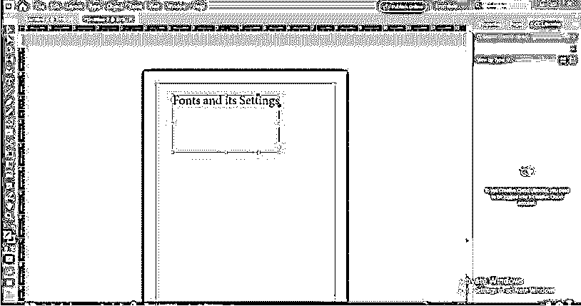

现在在文字工具上，选择你输入的文本内容，你可以在这个软件的属性面板中看到它的参数。

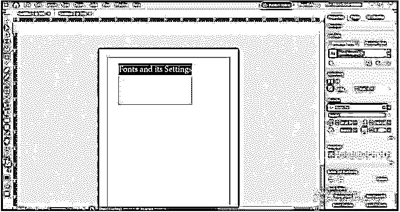

通过从窗口菜单的菜单栏下拉列表中启用控制选项，可以启用文本内容的属性选项。

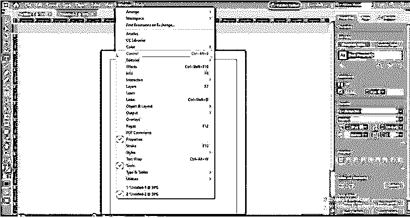

您将在工作区的顶部看到一个包含选定文本内容的控制面板。

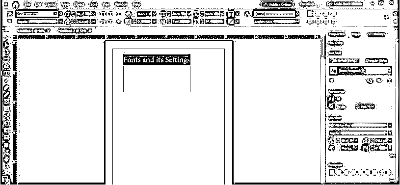

您也可以从“字符”面板将所选文本内容的字样更改为您想要的字体样式。在字体前面的字符面板中，您会看到一个“显示相似字体”的图标。如果你点击它，你会看到一个与所选字体相似的字体列表。

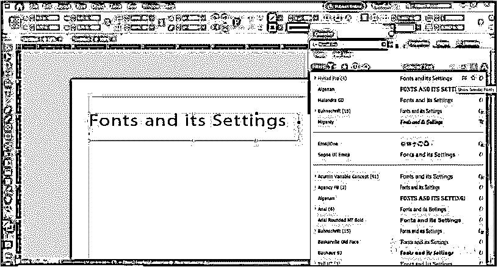

你可以在这里看到我们有所有相似字体的无数字体列表。

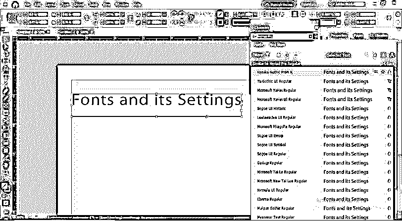

现在下一个选项是“添加到收藏夹”，点击它，你可以把你经常使用的字体保存在你的收藏夹列表中。

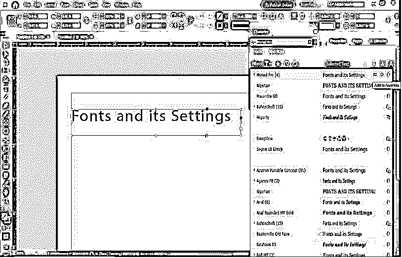

通过字体列表右上角给出的选项，我们可以增大或减小字符列表面板中显示的字体大小。

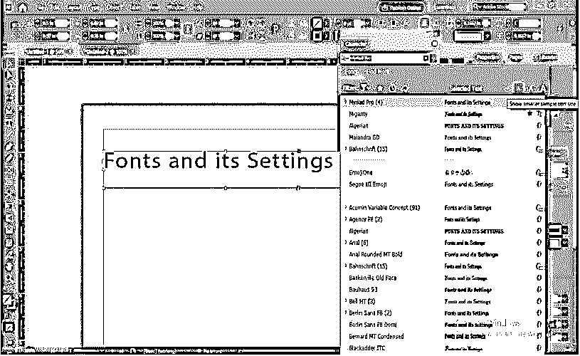

### 如何添加 InDesign 字体？

如果你愿意，你可以从这个软件的字符面板访问 Adobe 字体，但现在我将告诉你，除了 Adobe 字体，你如何在这个软件中拥有外部字体。

首先，你必须浏览任何提供图形字体的网站。我发现这个网站在这种情况下非常有用。根据你的选择，你可以和任何人一起去。在这里，你可以选择免费的商业字体，也可以选择付费字体。

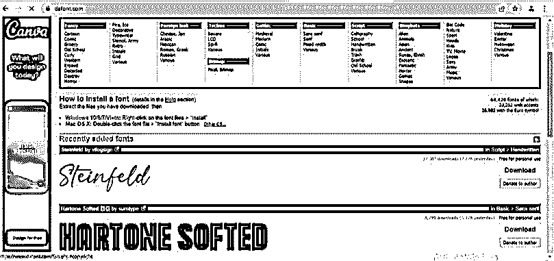

我已经下载了这是一个免费的字体。一旦你下载了任何字体，你都会有一个 zip 文件，所以解压它。

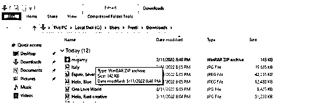

并从其保存位置打开其文件夹。

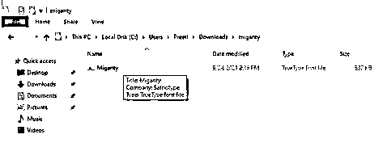

然后安装它，双击它的文件，然后在打开的文件的安装按钮。

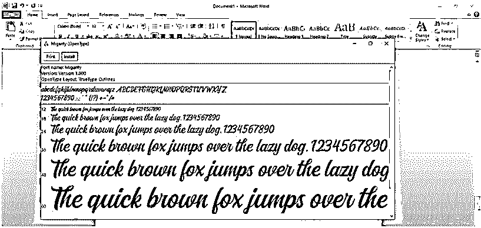

现在跳转到 InDesign，进入 Windows 菜单，使用字符面板。在此菜单的下拉列表中，您会看到“类型和表格”选项在新的下拉列表中，有字符选项，或者可以按 Ctrl + T 作为其快捷键。

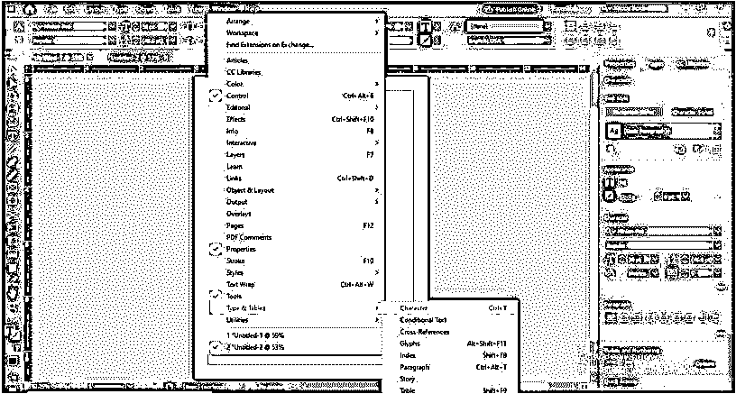

在此面板的搜索框中，您可以键入下载字体的名称，或者键入下载字体名称的几个首字母，您将在字符面板的字体列表中找到它。您可以使用类似这样的文字工具来选择文本内容，以便将您想要的文本应用到其中。

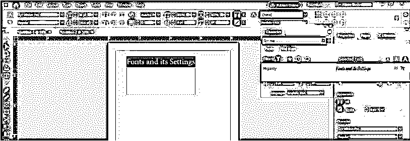

或者像这样用选择工具选择它

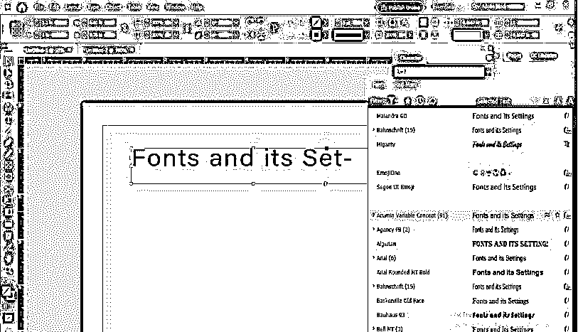

### 新增 InDesign 字体

我将告诉您如何在 InDesign 中使用新添加的字体。使用新添加的字体没有特殊说明。您可以像使用 InDesign 的内置字体一样使用这些字体。现在我们来讨论一下。

我已经选择了这个文本内容，并再次进入字符面板。我们可以根据自己的要求，在这个选项中更改字体大小。

此面板的下一个选项将保持任何段落的行间距。

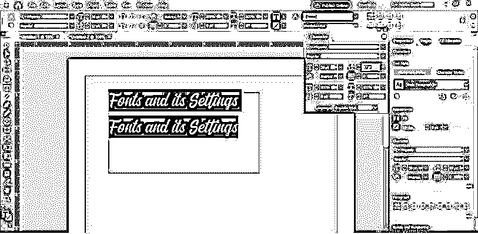

我们可以使用跟踪选项来增加或减少文本内容之间的间距。它将保持文本字符之间的间距相等。

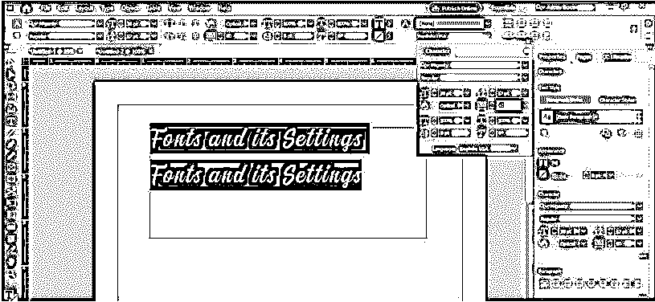

在下一个选项的帮助下，我们可以增加或减少所选文本内容的高度。

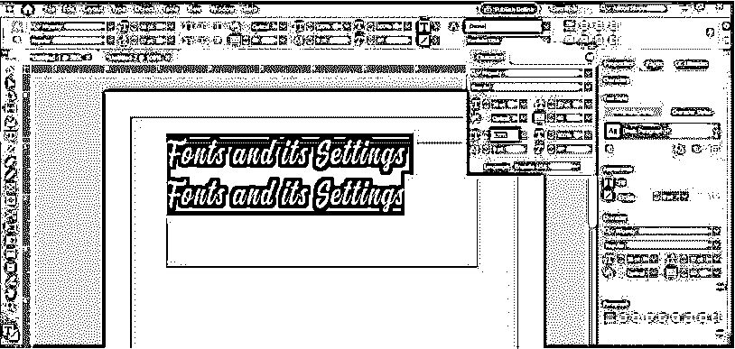

选择所需文本后，双击文本颜色框可以更改字体颜色。您可以在工具面板中找到此框。

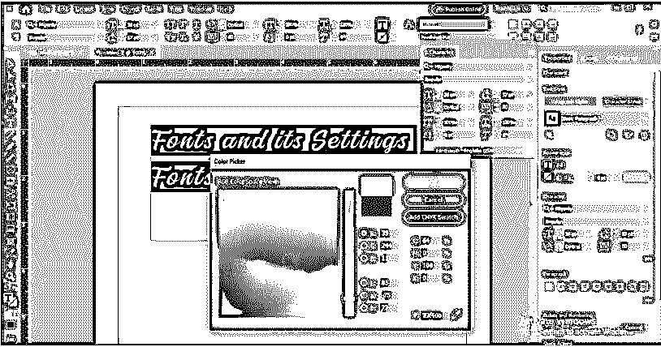

颜色会变成这样。

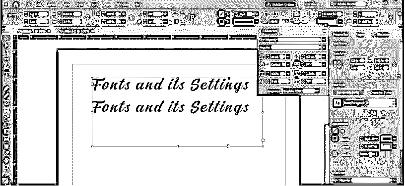

当我们将任何字体添加到我们保存的字体列表中时，您可以将这个新安装的字体添加到您的收藏夹列表中。

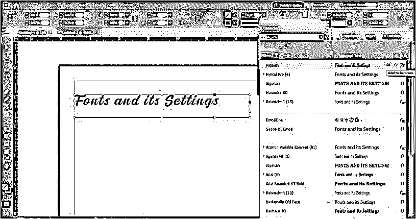

您可以点击此按钮查看您保存的列表。

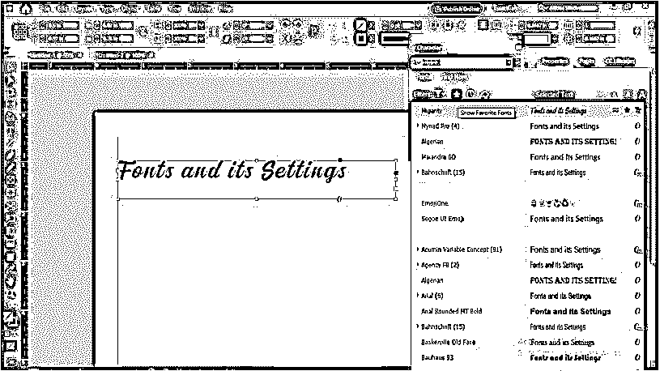

它会将所有保存的字体显示为您最喜欢的字体。不幸的是，我目前只保存了这种字体，所以只有一种。

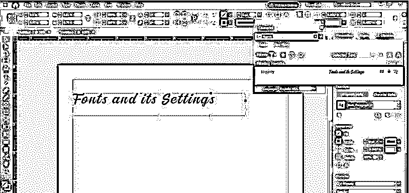

这样，您可以在 InDesign 中使用外部安装的字体。

### 结论

现在你几乎知道了 InDesign 软件字体的每一个重要事实，在通读这篇文章后，你会在作品中更漂亮地使用字体。因此，我建议你开始玩字体的每个参数，这样你就可以理解它们，并在工作中获得最佳效果。

### 推荐文章

这是 InDesign 字体指南。在这里，我们将讨论简介、概述以及如何添加 InDesign 字体，并给出详细的解释。您也可以看看以下文章，了解更多信息–

1.  [Adobe Indesign 使用](https://www.educba.com/adobe-indesign-uses/)
2.  [InDesign 垂直文本](https://www.educba.com/indesign-vertical-text/)
3.  [InDesign 书籍模板](https://www.educba.com/indesign-book-templates/)
4.  [InDesign 垂直居中文本](https://www.educba.com/indesign-center-text-vertically/)

