# InDesign 预览快捷方式

> 原文：<https://www.educba.com/indesign-preview-shortcut/>

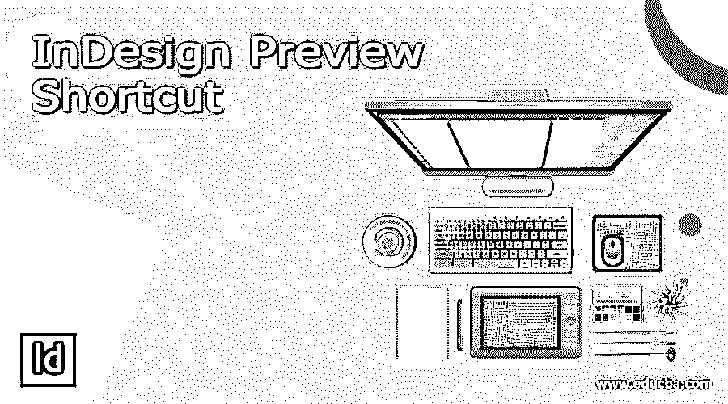

## InDesign 预览快捷方式简介

InDesign 预览快捷方式可以理解为使用键盘组合键来快速访问预览命令。我们使用 InDesign 软件的预览模式来了解我们的最终设计外观。在这个软件中，我们在预览模式中有一些不同的选项，所以我们根据我们的工作要求选择其中一个选项。在这篇文章中，我将告诉你如何使用不同关注点的预览快捷方式，并用你想要的组合键创建一个新的快捷方式。所以让我们以一种有趣的学习方式开始我们的讨论。

### 所有 InDesign 预览快捷方式

在我解释如何使用 InDesign 预览快捷方式之前，让我先介绍一下这些预览以及它们在该软件用户界面中的位置。一旦你把它放在文档区域，在这个工作窗口的左侧会有一个工具面板。在这个工具面板的底部，我们有这些带有图标的预览模式。如果看不到选项，可以从工具面板的位置选取它，因为它是可停靠的面板。

<small>3D 动画、建模、仿真、游戏开发&其他</small>

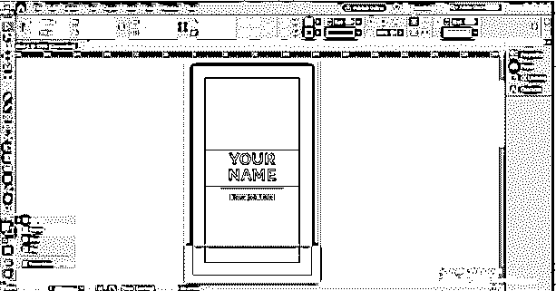

默认情况下，我们的工作模式是标准用户界面，我们称之为正常模式。在这种模式下，我们的工作窗口上有所有的东西和元素，如指南、出血区域、边距等。

使用标准模式选项的弹出面板，我们有其他预览选项，如预览、出血、嵌条和演示。

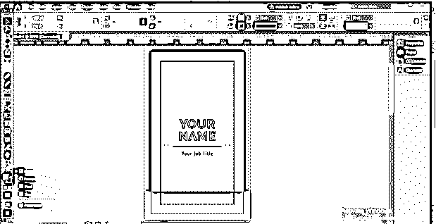

我们可以通过多一个选项来访问这些选项。在菜单栏的视图菜单中，下拉列表中有一个屏幕模式选项。我们在这个选项的新下拉列表中有预览模式选项。

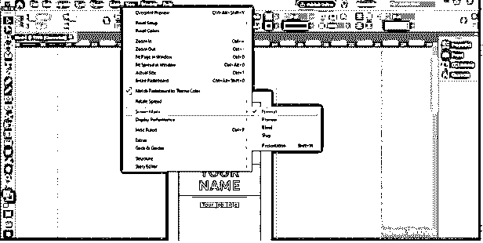

### 如何使用 InDesign 预览快捷方式？

现在让我们讨论一下如何使用预览模式及其快捷方式。我将首先进入菜单栏的文件菜单，打开文档设置对话框，并为当前文档设置出血和辅助信息区。在文件菜单的下拉列表中，我们有文档设置选项，或者你可以按 Ctrl +Alt + P 作为它的快捷键。

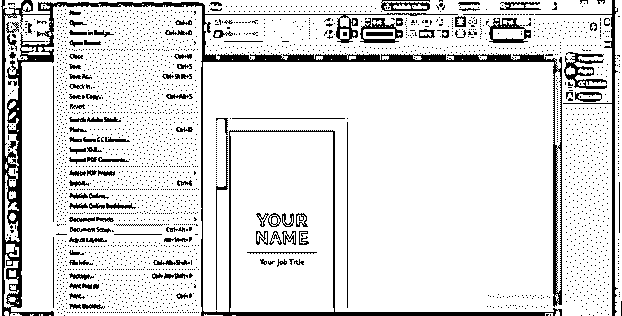

选择此选项后，您将看到此文档设置框。这里我已经有了出血值。所以我将只在这里设置 Slug 值。在这里，您可以看到“链接”按钮被禁用，因此您可以为文档的所有四边设置不同的值。

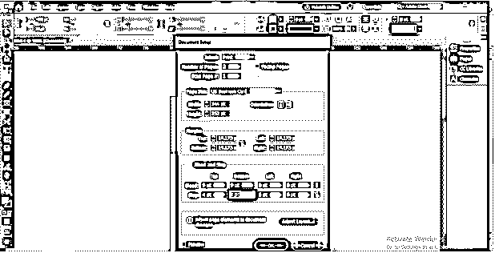

如果您想要设置所有边都相等，请启用此链链接。

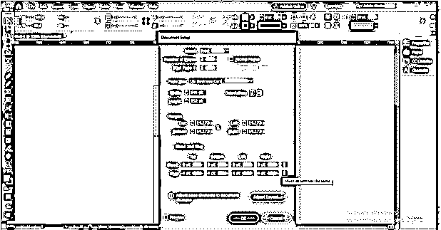

如果启用了对话框的预览按钮，您可以看到这些更改。

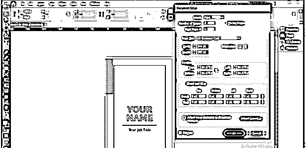

这是这个文档的正常模式，其中，我们有一个红色线条的出血区域，一个青色线条的空白区域，一个紫色条纹的空白区域。

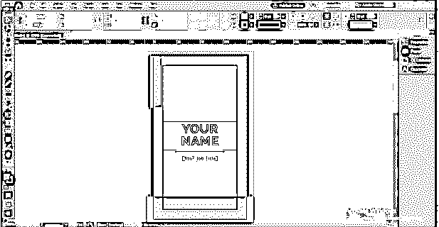

现在让我们改变到一个预览模式，所以去预览面板，并选择 Slug 选项。一旦你选择了这个选项，它会根据你喜欢的模式给你显示一个预览，比如在 slug 预览中；我们还可以看到文档周围的辅助信息区。

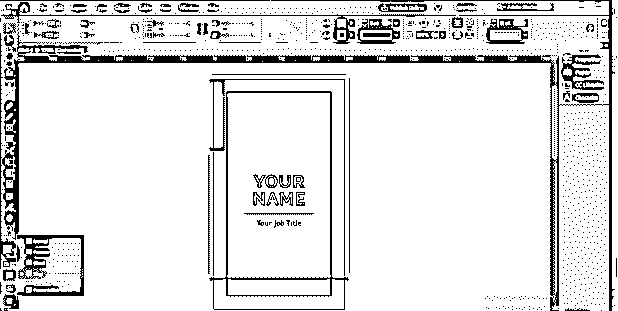

在正常模式和预览模式之间切换有一个快捷键是 W。当您按下键盘上的 W 键时，它将切换到当前选择的预览选项，按下同一键，您可以返回到正常模式。

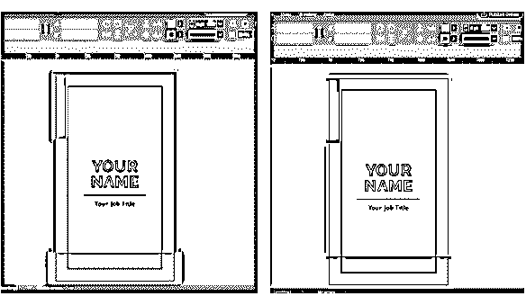

在这个预览模式列表的底部还有一个预览选项:Presentation，只需按下键盘上的 Shift + W 键就可以切换到该模式。

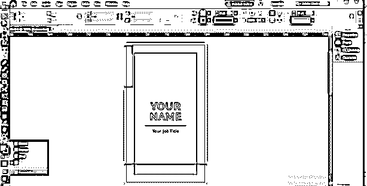

在演示模式下，屏幕上只有文档。您可以按键盘上的 Esc 键返回正常模式。

### 创建预览快捷方式

这个软件的一个好处是你可以为这些预览模式创建快捷方式。所以我要告诉你如何做到这一点。

在编辑菜单的下拉列表中，我们有键盘快捷键选项，所以选择它。

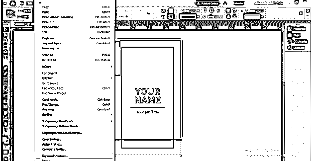

一旦你选择了它，你就会看到这个对话框。我们在菜单栏的“视图”菜单中有预览选项，因此在此对话框的“产品区域”选项中，选择“视图菜单”。

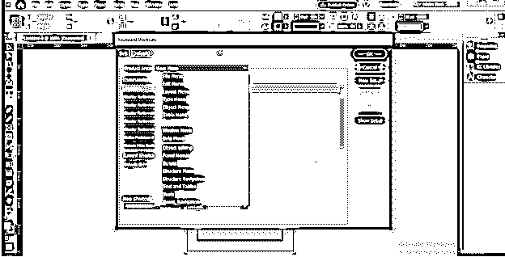

现在在视图菜单中，搜索屏幕模式；有了这个选项，我们就有了所有的预览模式。选择任何人。

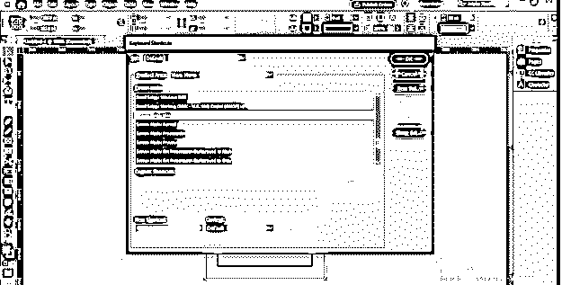

现在，在这个对话框的底部，我们有一个文本框，我们可以在其中指定键盘的键或组合键作为所选命令的快捷键。如果分配的键已经在该软件中用作快捷键，则该文本框下方会出现一条消息，提示所选键已经被使用。

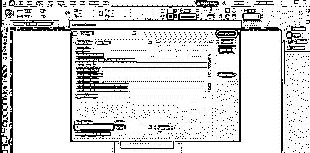

让我们在这里赋值 Shift+B；你可以看到它以前没有被使用过。现在单击这个框旁边的 Assign 按钮。

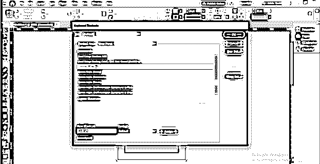

一旦你分配，它会显示你不能在默认设置中发布新的快捷方式。

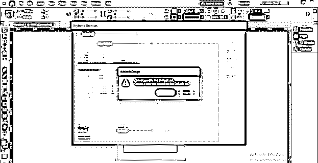

因此，我们将单击“新建设置”按钮。

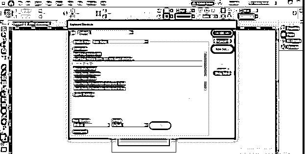

并创建一个新的集合。您可以根据自己的意愿命名，然后单击“确定”按钮。

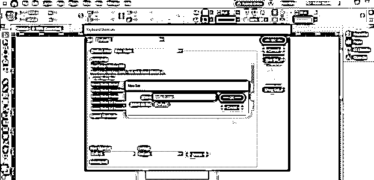

在这里您可以选择您创建的集合。

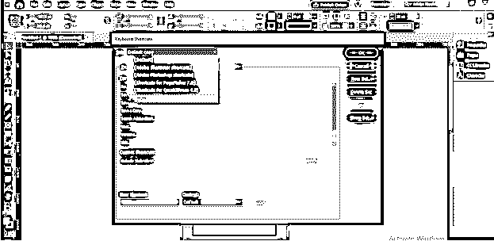

现在点击这个对话框的分配按钮。

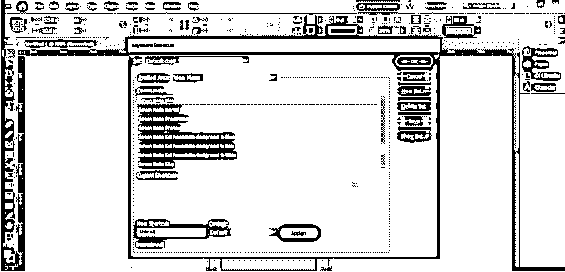

我们选择的键将作为快捷键分配给选定的命令。

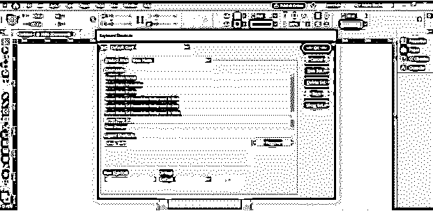

您可以根据自己的选择创建多个快捷键。如果你想删除你指定的关键点，你可以在选择它们后删除它们。

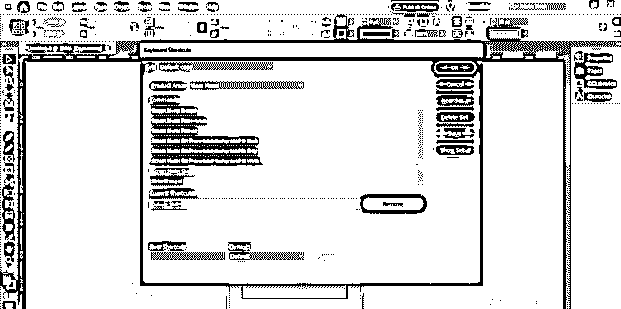

如果您想查看分配给您的快捷键，请单击此对话框中的“显示设置”按钮。

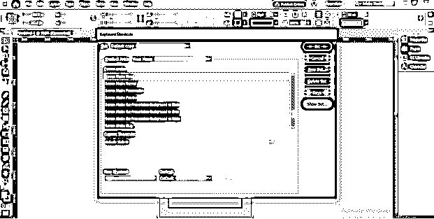

一旦你点击这个选项，你将有一个记事本文件，你可以找到你的命令与你分配的快捷键。

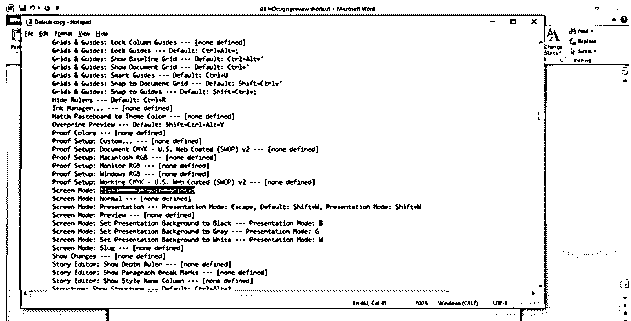

### 结论

现在我可以说你知道 InDesign 软件的预览快捷方式，你可以使用它们使你的工作更方便。如果需要，您还可以为每种模式创建新的快捷键。所以我建议你创建并使用这些键来加速你的工作。

### 推荐文章

这是 InDesign 预览快捷方式指南。在这里，我们将介绍如何使用 InDesign 预览快捷方式。您也可以看看以下文章，了解更多信息–

1.  [InDesign 母版页](https://www.educba.com/indesign-master-pages/)
2.  [InDesign 版面](https://www.educba.com/indesign-layout/)
3.  [InDesign 发票模板](https://www.educba.com/indesign-invoice-template/)
4.  [InDesign 垂直居中文本](https://www.educba.com/indesign-center-text-vertically/)

