# InDesign 扩展

> 原文：<https://www.educba.com/indesign-extension/>

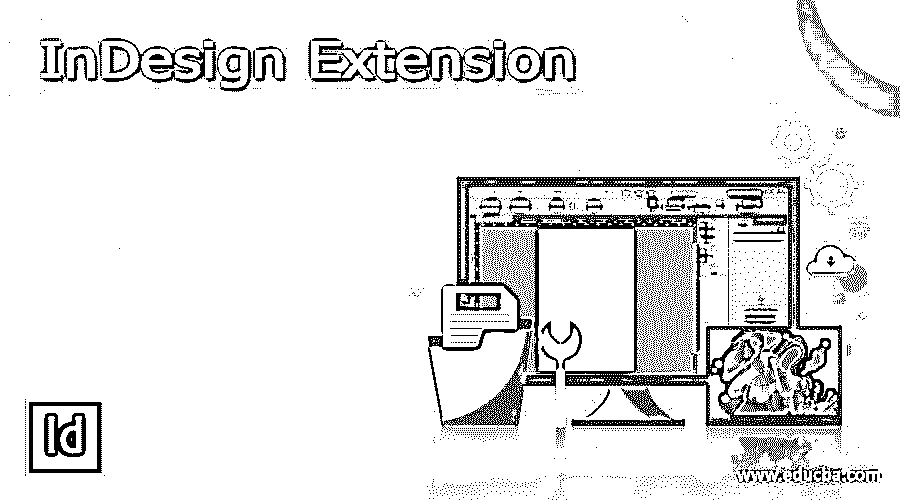

## 什么是 InDesign Extension？

InDesign extension 可以理解为帮助我们增强 InDesign 功能的编程软件。在任何特定依恋的帮助下，我们可以比传统上花费更多时间更直接地完成特定任务。在该软件中，您可以从 Adobe 网站下载 Adobe 扩展来使用它们。我们在 Adobe Photoshop 和 Adobe Illustrator 中使用的几乎每个扩展都可以与 Adobe InDesign 一起工作。今天在这篇文章中，我将告诉你如何安装它们，如果你不想使用它们，你可以删除或卸载它们。

### 何时使用 InDesign 文件扩展名？

在了解了 InDesign 扩展之后，您现在想知道我们为什么在这个软件中使用该扩展。原因是在开发的时候，特定软件的开发者将所有的特性都嵌入到当时最好的软件中。尽管如此，经过一段时间后，我们需要改进它们来快速有效地完成特定的任务，所以使用扩展。

<small>3D 动画、建模、仿真、游戏开发&其他</small>

为了满足 InDesign 的这些要求，我们也需要这些类型的改进。因此，我们对该软件进行了扩展，并安装了它们，以便在我们的工作中发挥它们的优势。现在，我将告诉您如何在 InDesign 中安装所需的扩展并开始使用它们。

### 如何安装 InDesign Extension？

我们可以出于多种目的在 InDesign 中安装扩展，要安装您想要的扩展类型，您需要访问 adobe 的官方网站。在这里你必须和 exchange.adobe.com 一起去。

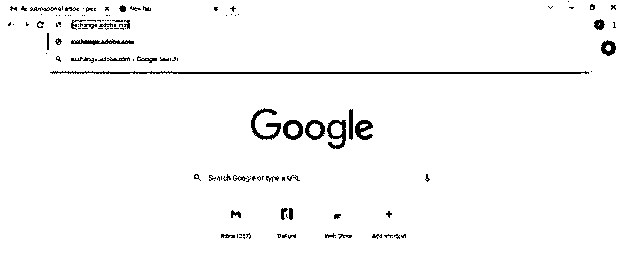

一旦你搜索它，你就会看到这个 Adobe 页面。转到本页的“创意云”标签。

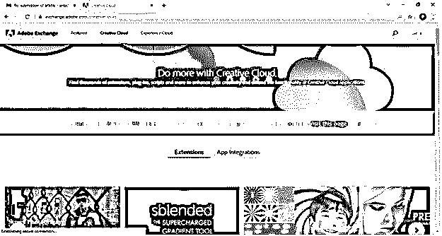

现在向下滚动到此页面，并从产品列表中选择 InDesign 选项。一旦您决定使用 InDesign，它会向您显示所有与其兼容的扩展。

或者，您可以打开 InDesign 软件，转到“窗口”菜单。您可以在下拉列表中找到“在 Exchange 上查找扩展名”选项，所以请单击它。

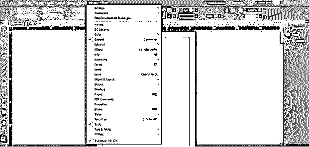

单击该选项后，InDesign 会自动将您带到 Adobe for InDesign 的扩展页面。

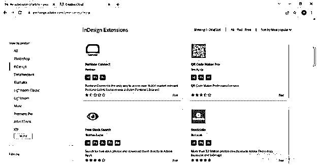

这里从列表中选择您想要的扩展名。我会选择这个。你可以看到它是免费的。所以有很多免费的扩展，也有根据你是否适合和任何人去而付费的。

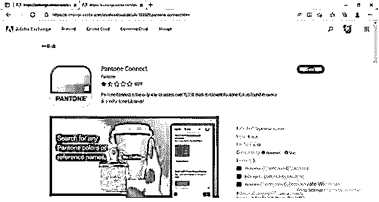

如果您没有登录，它会要求您登录。

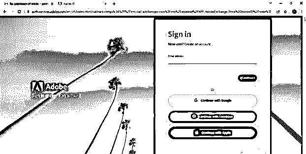

之后，点击免费按钮，使其可以安装。它让你接受条款和条件，所以接受它。

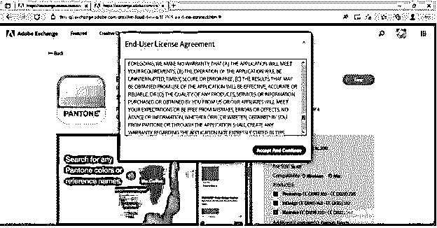

你会看到一个安装按钮，所以点击它。

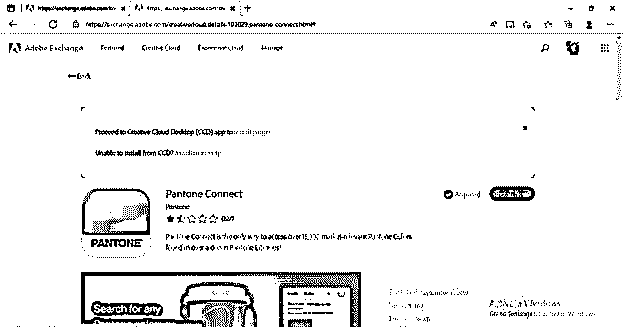

如果您遇到任何问题，请单击此页面上的安装帮助选项。

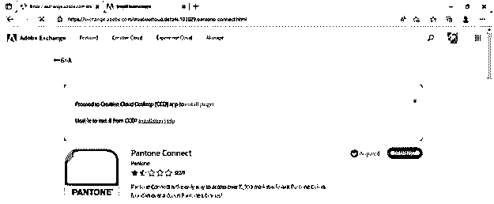

一旦点击帮助选项，它会带你到这个页面。在这里你可以直接下载选择的扩展。因此，通过点击下载按钮，你会有一个安装文件。然后，您可以按照下面的说明正确安装您想要的扩展。

有了所选扩展名的 raw 文件后，借助 adobe 的 Creative Cloud 桌面 app 进行安装。

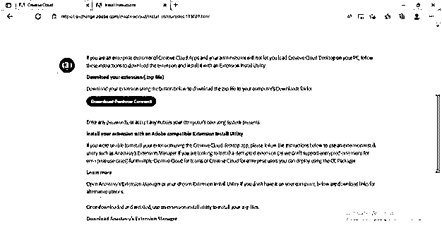

如果你在安装中仍然遇到问题，你可以向下滚动这个下载页面，你会看到 Anastasiy 的扩展管理器的下载链接。所以下载吧。

现在它将带你到这个扩展管理器的下载页面。点击下载按钮。

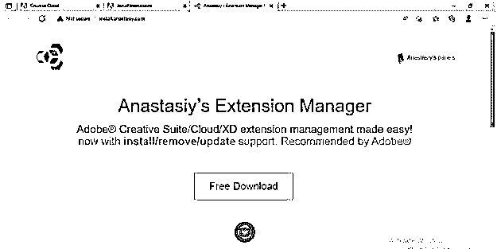

下载完成后，安装它。

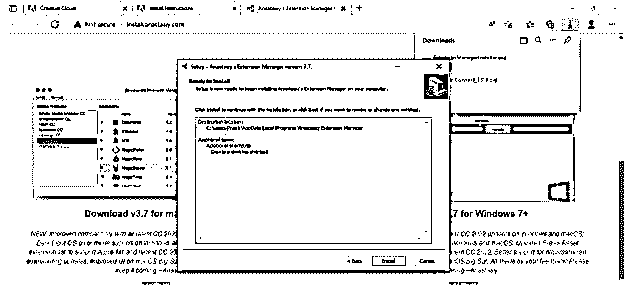

一旦你安装了它，它就会像这样打开。在这个对话框的左上角有一个安装标签，所以点击它。

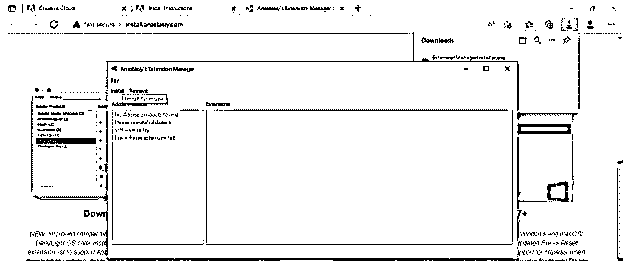

一旦你点击安装按钮，一个对话框将再次打开，选择你想要的扩展名的安装文件。我将选择这个文件。

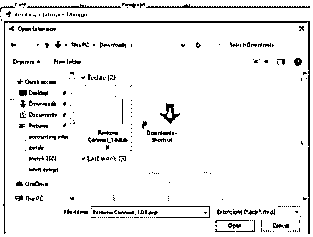

一旦扩展管理器完成安装，它将向您显示安装成功的消息。

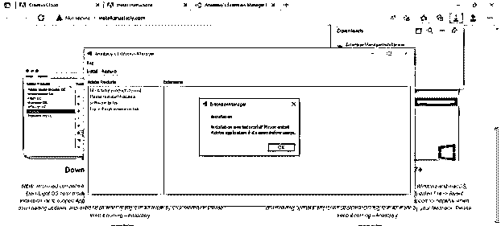

您安装的扩展可能位于 InDesign 软件中的不同位置，因此请返回所选扩展的安装页面。向下滚动时，您会发现一个标题“在哪里可以找到它”,单击它可以阅读其内容，在这里您可以阅读该扩展在 InDesign 软件中的位置。

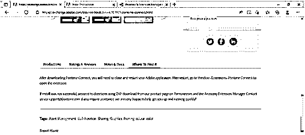

如果您已经打开了 InDesign 软件，请重新启动它以查看更改并转到“窗口”菜单。在它的下拉列表中，我们有扩展选项。在它的子下拉列表中，你会找到你安装的扩展。

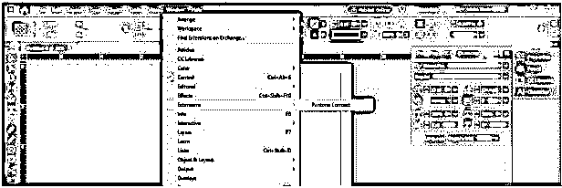

### InDesign 扩展移除

有些扩展对我们来说已经过时了，或者出于其他原因，我们需要卸载它们或者从软件中删除它们。所以我要告诉你如何做到这一点。

如果通过 InDesign creative cloud 应用程序安装了扩展，请打开该应用程序，或者打开扩展管理器。一旦你打开它们中的任何一个，你就会看到一个已安装的扩展列表。选择要删除的内容。例如，在这里，我目前只安装了一个扩展。因此，我将通过单击来选择它。

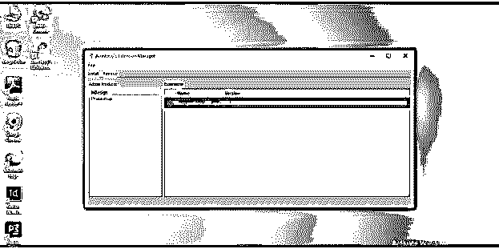

选择所需的选项后，单击此对话框中的“删除”按钮。

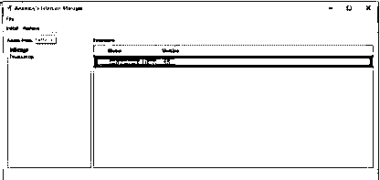

卸载您选择的扩展需要一些时间。

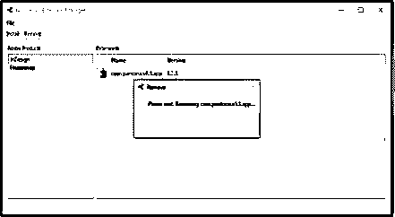

一旦完成，它会向您显示这样的确认消息。

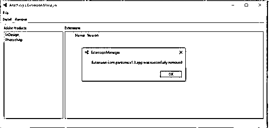

如果您在 InDesign 软件中重新检查它，它可能仍会显示已删除的扩展在已安装的扩展列表中。这是因为您必须重启软件才能看到更改。

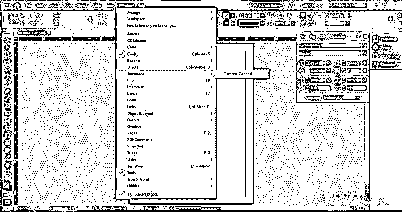

现在，重启我的软件后，没有安装扩展。

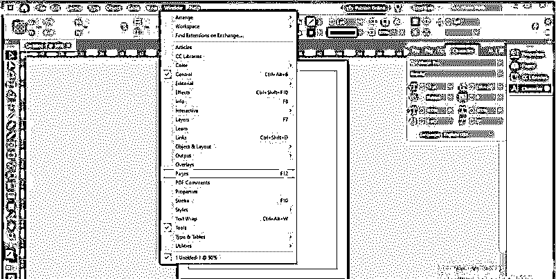

### 结论

我相信现在您已经收集了足够多的关于 InDesign extensions 的信息，并且可以轻松地在您的软件中使用它们。您还知道如何解决安装错误问题。我建议您浏览 Adobe 扩展链接，找到您想要的扩展。

### 推荐文章

这是 InDesign Extension 的指南。在这里，我们讨论了 InDesign Extension 的定义、安装方法以及详细的解释。您也可以看看以下文章，了解更多信息–

1.  [Adobe Indesign 使用](https://www.educba.com/adobe-indesign-uses/)
2.  [InDesign 垂直文本](https://www.educba.com/indesign-vertical-text/)
3.  [InDesign 书籍模板](https://www.educba.com/indesign-book-templates/)
4.  [InDesign 垂直居中文本](https://www.educba.com/indesign-center-text-vertically/)

