# InDesign 栏

> 原文：<https://www.educba.com/indesign-columns/>

## InDesign 栏简介

InDesign Column 是该软件的一个非常有用的功能，通过它我们可以将任何设计布局的文本内容排列成列，为它们提供有效的外观，并将其管理到给定的空间中。在这个软件中，我们可以通过一些技巧或者使用菜单栏的选项来实现。您可以创建多个栏，以便更好地排列文本内容。我将告诉您柱选项的所有重要参数，以便您可以顺利地处理它们，获得您想要的结果。在 InDesign 的最新版本中，我们多了一个选项，通过它我们可以添加规则(分隔线)作为列的设计元素。所以让我告诉你所有这些功能。

### 如何在 InDesign 中创建和使用分栏？

我们可以通过几个简单的步骤在 InDesign 中创建分栏，然后开始使用分栏以易读的方式排列文本。

<small>3D 动画、建模、仿真、游戏开发&其他</small>

因此，让我们首先通过单击该软件欢迎屏幕上的“创建新文档”按钮来创建一个新文档。在“新建文档”对话框中，您可以看到有一个列选项，但这次我将使用默认设置。

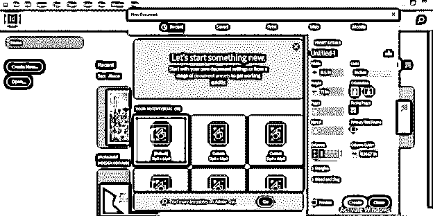

您可以看到我们的文档页面区域没有列。它只有边缘。

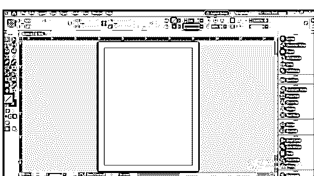

现在，我将再次通过单击“文件”菜单的“新建”选项中的“文档”选项来获取文档。

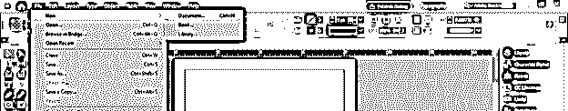

这一次，我将在此对话框的列选项中输入 2 作为列号，因为我希望文本内容有两列。

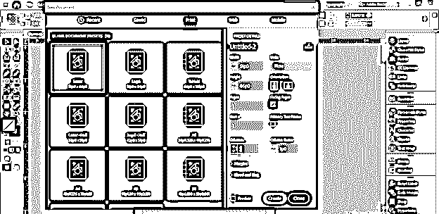

现在，我们将文档分成两列。

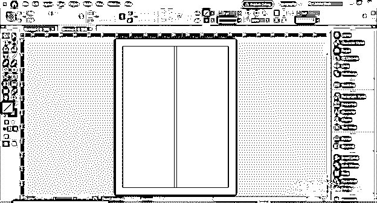

现在，我将使用工具面板中的文字工具，在空白区域内绘制一个覆盖整个文档页面的文本框架。

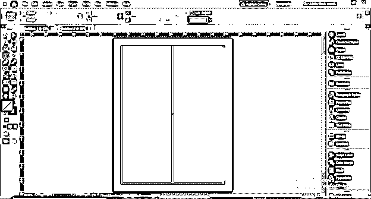

我将此文本内容粘贴到这里，但是您可以看到它并没有排列到这两列中。

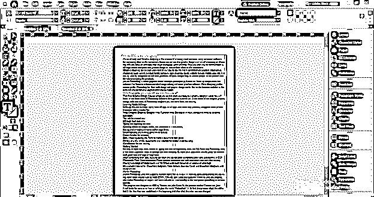

因此，我们可以根据列设置文本框。

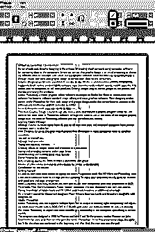

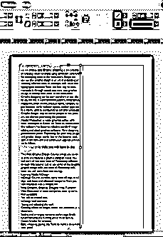

您可以看到文本处于溢出状态。

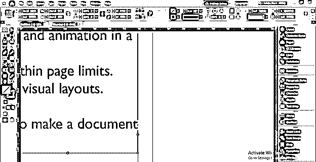

为此，我将创建一个新的文本框，并单击这个红色的加号按钮。

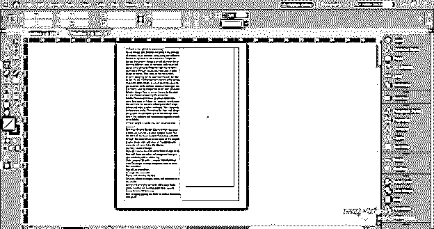

一旦我们点击这个按钮，溢出的文本就会出现在鼠标的光标上。

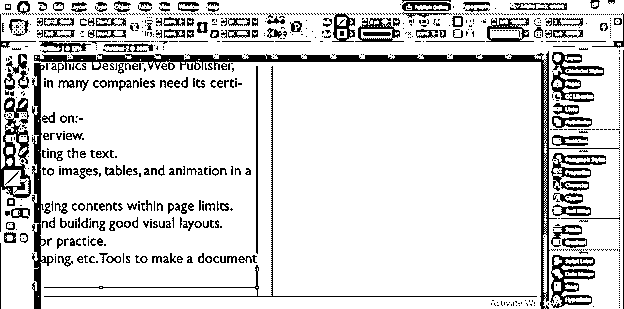

我将单击下一个文本框来调整其中的额外文本。这种方式可以将文本设置成列，但这是一种传统的方式，需要大量的调整。

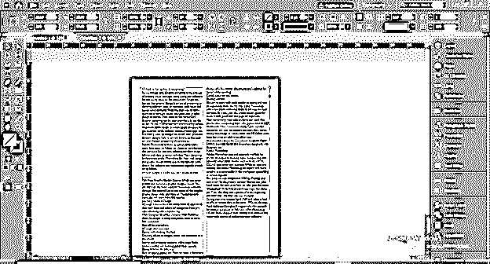

因此，让我们转向智能的方式，让设计自动地为我们服务。这里我有一个新文档的文本内容，没有任何列部分。

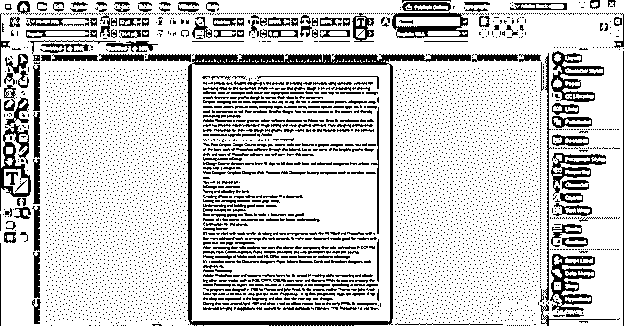

现在选择这个文本框，在这个软件的属性栏的右上角，我们有“列数”选项。

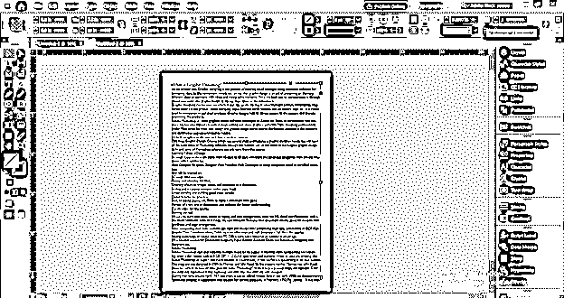

如果我们增加这个数字，InDesign 会自动在文本内容中添加列，并根据列设置进行排列。

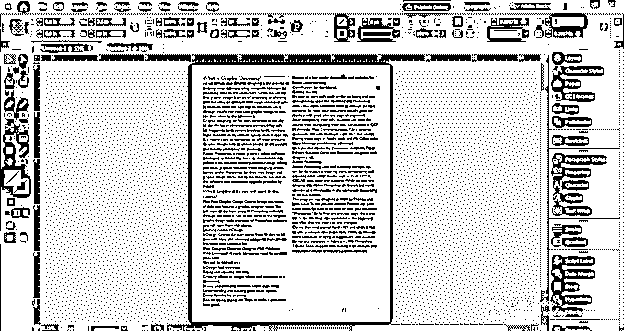

您可以通过菜单栏对象菜单的“文本框选项”对列设置进行更多控制。从该菜单启用该选项，或者您可以按 Ctrl + B 作为快捷键。

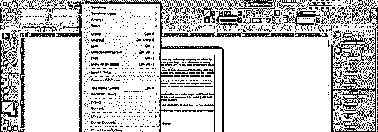

一旦你点击它，这个选项的对话框将被打开，在常规选项中，我们有参数栏。您可以看到，我增加了列号的值，但是文档区域的文本内容没有变化。原因是我的文字内容这次没有入选。所以要小心这些愚蠢的错误。

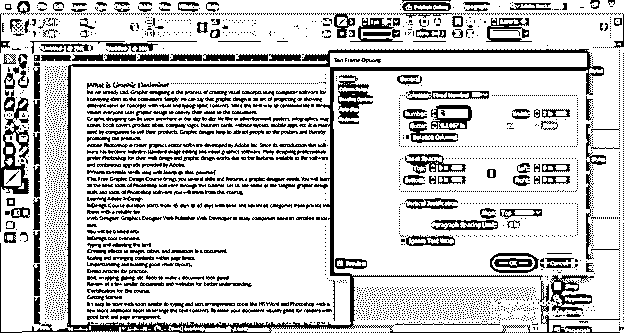

现在，我将选择文本内容并增加列数，您可以看到 InDesign 会自动将列添加到该文本内容中。

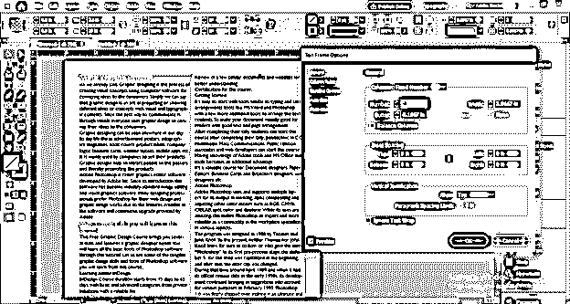

您可以根据自己的选择增加列数，它会自动调整给定列数中的文本。

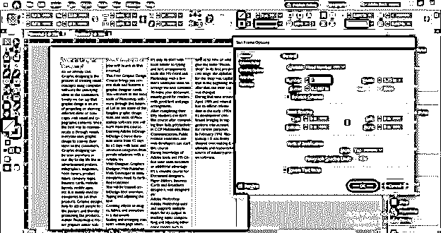

本栏目的下一个选项是装订线。装订线是两列之间的间隙区域，因此您也可以通过此对话框的装订线选项对其进行调整。

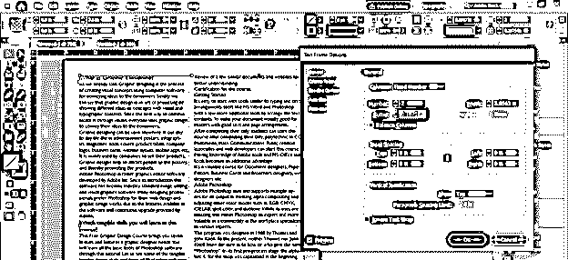

这完全取决于你的设计布局，你希望在你安排文本内容的栏之间有多大的间距。

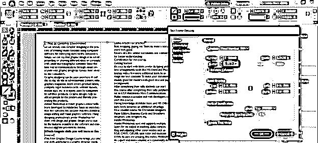

此对话框中有一个平衡列选项。

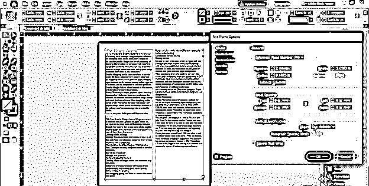

如果我们通过点击它的复选框来启用它，那么它将平衡所有列中的文本内容，使它们的高度在末尾相等。

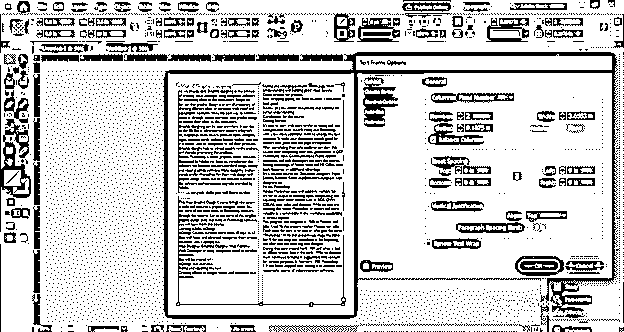

这里还有一个与专栏相关的令人兴奋的特性。这是文本框选项的同一个对话框中的列规则选项。所以点击它就可以得到它的参数。

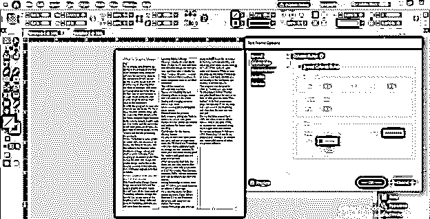

现在通过点击它的复选框来启用插入列规则选项。您可以看到，一旦我们启用它，一条基准线将出现在列的装订线区域。

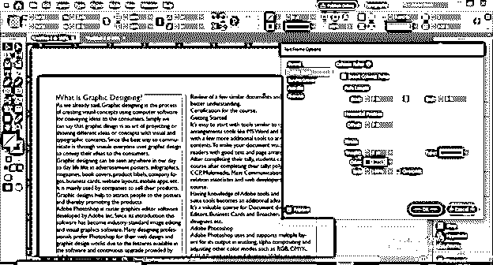

我们可以从起点调整这条线的长度，也可以从嵌线长度的起点和终点选项调整它的终点。

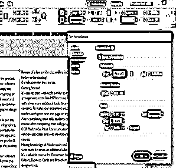

这两个选项都有一个链接选项，所以我们可以根据需要分别从起点或终点改变嵌线长度。

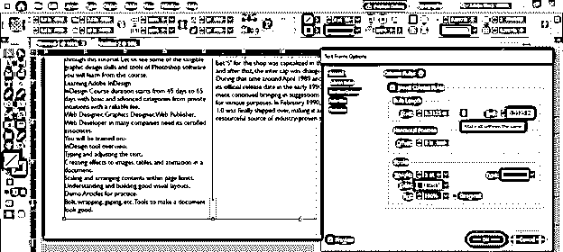

我们可以设置嵌线与所在列之间的偏移距离。

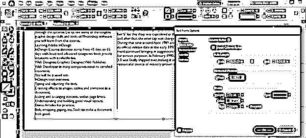

通过更改此对话框的宽度选项值，我们可以更改基准线的粗细。

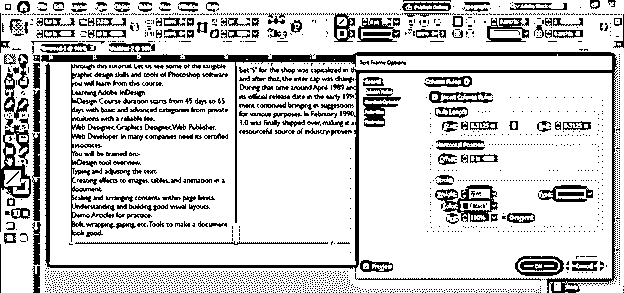

如果需要，我们也可以从颜色选项中更改基准线的颜色。

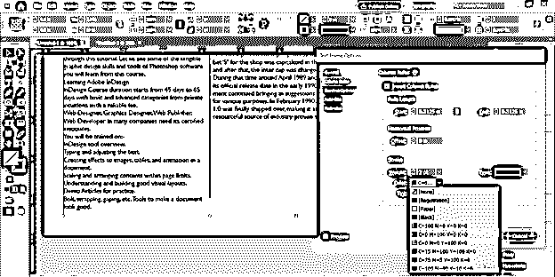

这条规则线的笔画有几种样式，所以我们可以根据自己的选择从中选择任何人。

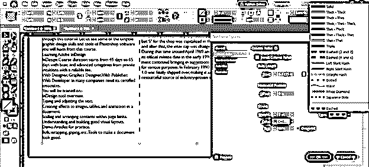

现在让我们通过点击这个预览按钮切换到预览模式，或者你可以简单地按 W 作为它的快捷键。

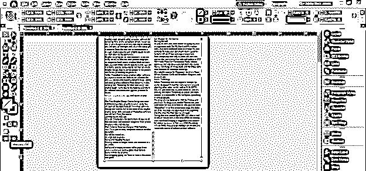

你可以看到我们的文本被漂亮地排列成列。

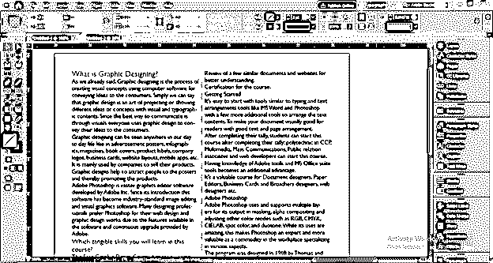

### 结论–InDesign 专栏

现在，您已经很好地理解了 InDesign 的列及其用途。阅读完本文后，您可以在使用该软件的任何项目时，轻松地在设计布局中创建和使用列。你要把这个特性的每个参数都练出来，这样才能深入分析。

### 推荐文章

这是 InDesign 栏的指南。在这里，我们将逐步讨论如何在 InDesign 中创建和使用分栏。您也可以看看以下文章，了解更多信息–

1.  [Indesign 版本](https://www.educba.com/indesign-version/)
2.  [什么是 Adobe InDesign](https://www.educba.com/what-is-adobe-indesign/)
3.  [InDesign CS6](https://www.educba.com/indesign-cs6-top-ten-new-features/)
4.  [Indesign 的替代方案](https://www.educba.com/alternative-to-indesign/)

