# InDesign 溢出文本

> 原文：<https://www.educba.com/indesign-overset-text/>

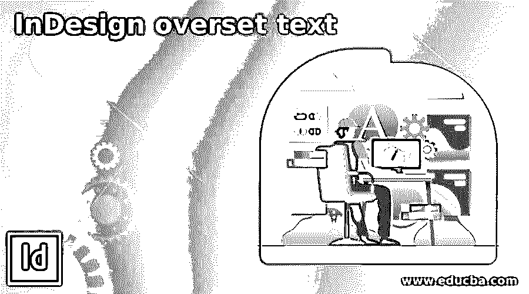

## InDesign 溢出文本简介

InDesign 溢出文本可以解释为通过使用一些技巧并在 InDesign 中进行一些参数调整，在文本框中设置溢出的文本内容。然而，很多时候，当我们在绘制的文本框中放置文本时，在处理较大内容的文本项目时，更有可能发生的情况是，文本无法放入绘制的文本框中，这时我们需要通过不同的文本排列来适应它。有许多方法可以做到这一点，但有些方法对于大文本内容有局限性。所以在这篇文章中，我们将看看每一种方式。

### 如何在 InDesign 中处理溢出文本？

这篇文章将对您非常有帮助，通过这篇文章，您将对 InDesign 的溢出文本功能有一个很好的了解。因此，让我们先创建一个新文档，您可以通过单击 InDesign 欢迎屏幕上的“新建”按钮来创建新文档，或者按键盘上的 Ctrl + N 按钮来创建新文档。

<small>3D 动画、建模、仿真、游戏开发&其他</small>

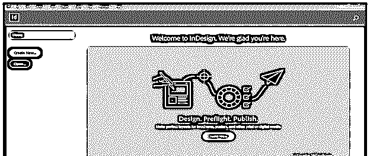

在“文档设置”对话框中，我将选择一个默认尺寸为 8.5 英寸 x 11 英寸的文档页面，然后单击键盘上的“创建”按钮。

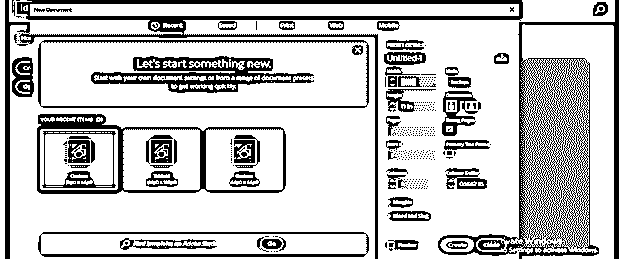

现在我将从工具面板中选择文字工具。

并将其拖动到文档页面区域以创建文本框。所以我将创建这个小尺寸的文本框。

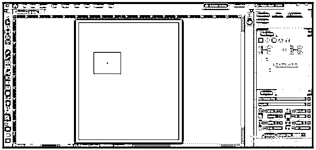

现在我将像这样在这里粘贴一些文本，你可以看到这些文本并不完全适合这个框。因此，如果文本框的末尾有一个红色方框，您就可以识别出这一点，这意味着如果文本框的末尾有一个红色方框，则粘贴的文本没有完全适合框架，这被称为超字号文本。

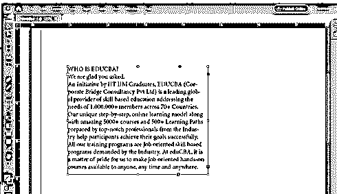

因此，我们可以通过不同的方式将它设置在文本框中的文本上，在这种情况下，当文本不多时，我们可以增加文本框的大小。要增加文本框的大小，只需使用选择工具选择文本框的锚点，并拖动它以增加大小。您可以在水平方向增加文本框的大小。

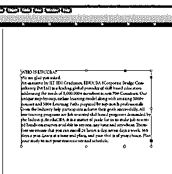

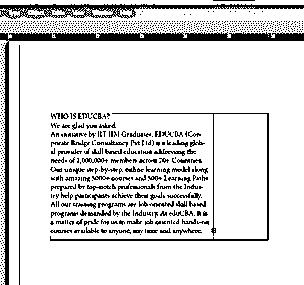

或者在垂直方向，你可以这样选择。

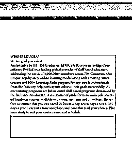

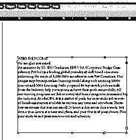

现在让我们学习其他的技术，通过这些技术我们可以做到这一点。这次点击这个文本框的红色方块。

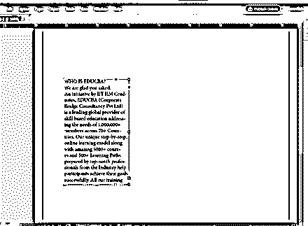

红色方块会变成一个箭头框，我们的鼠标光标上面会有一个文字符号。

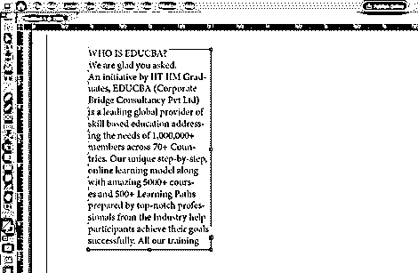

现在将文本框拖动到下一个文本框或文档区域中您想要的位置。

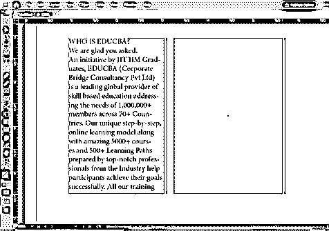

一旦释放鼠标光标，第一个文本框中不适合的文本将出现在这个新的文本框中。

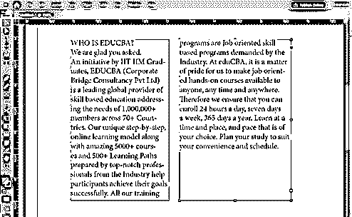

这个新文本框也有与第一个文本框相同的箭头框符号。这个箭头符号表示两个文本框的文本内容相互连接。

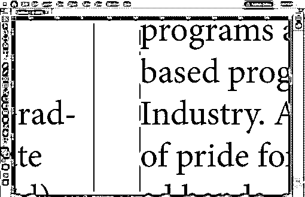

现在，如果我们对第一个文本框的文本内容进行更改，那么它将影响其他连接的文本框的内容。例如，我将选择第一个文本框中这些行。

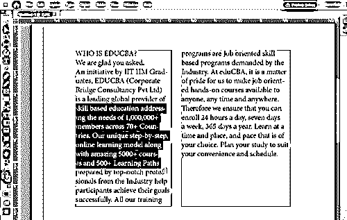

然后删除它们，您可以看到其他文本框由于在第一个文本框中进行了更改而减少了文本行。

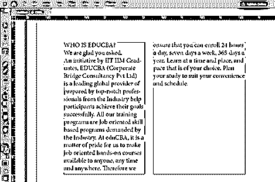

还有一种方法可以做到这一点，在这种方法中，您可以使用文本工具，并绘制所需大小的文本框。

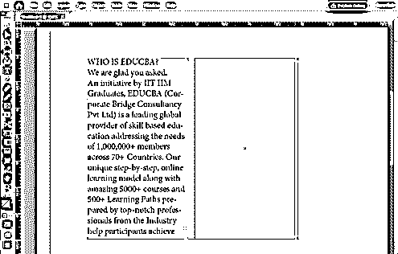

然后单击第一个文本框的红色方块，这样鼠标光标上就有了额外的文本。

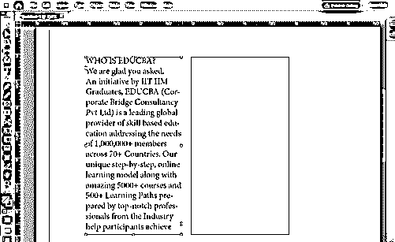

并用同一光标点击新绘制的文本框，然后它会将您的额外文本粘贴到此框中。

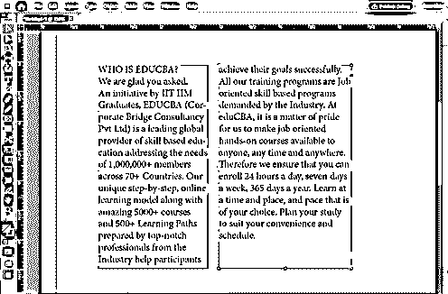

如果我们有像任何一本书一样的大量文本内容，我们会做什么。这也有一个解决方案。转到菜单栏的编辑菜单，然后选择首选项。在这个首选项中，我们将找到类型选项，因此单击它。

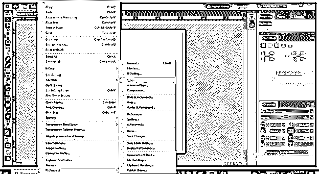

在首选项对话框中，启用智能文本重排选项。

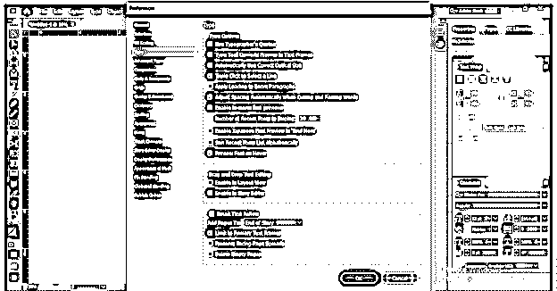

启用“限制到主要文本框架”和“删除空白页面”选项，这也是智能文本重排的子选项，然后单击此对话框的“确定”按钮。

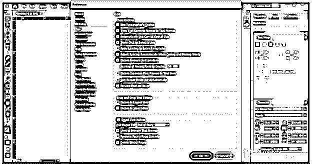

现在转到页面面板。

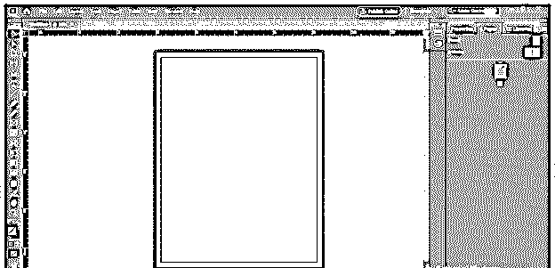

如果您的工作屏幕上没有页面面板，那么您可以在窗口菜单的下拉列表中找到它。

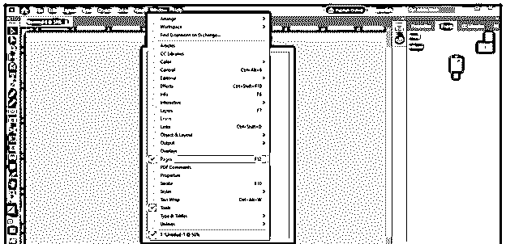

我将通过双击页面面板中的主页来选择它。

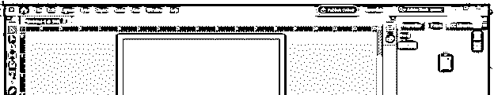

现在，再次使用文字工具在文档区域拖动一个文本框。

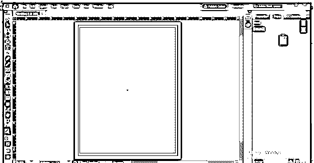

我们将有这个主要的文本流按钮在绘制文本框，所以点击它。

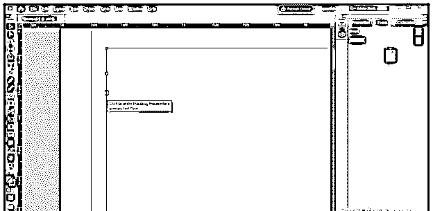

选择它后，它会变成不同的图标。

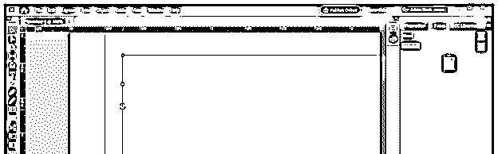

现在通过双击页面面板中的普通页面来选择它。

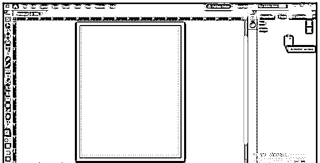

现在，我将在绘制的文本框中放置大文本，为此，我将转到“文件”菜单，然后单击下拉列表中的“放置”选项，或者您可以按 Ctrl + D 作为快捷键。

我将从保存的位置选择我想要的文本，然后单击此对话框的打开按钮。

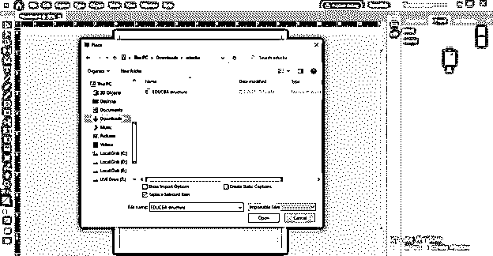

您选择的文本内容将出现在鼠标光标上，当您在绘制的文本框中单击时，InDesign 会根据文本内容的长度自动将整个文本内容调整为若干页。

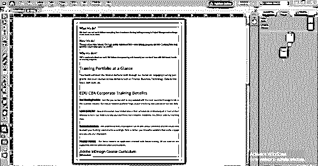

您可以通过再次访问“页面”面板中的主页来随时更改文本框的大小，此更改将应用于所有具有连接内容的页面。

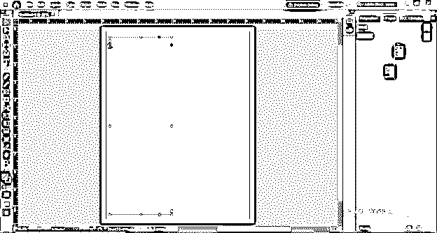

### 结论

这样，您可以根据自己的选择在文本框的区域中设置文本，在本文中，您可以很容易地调整内容较少的文本，对于内容较多的文本，您必须先进行一些参数设置，然后，您可以通过适当的文本设置来享受您的工作。

### 推荐文章

这是 InDesign 溢出文本指南。在这里，我们将一步一步地详细讨论如何在 InDesign 中处理溢出文本。您也可以看看以下文章，了解更多信息–

1.  [Indesign 版本](https://www.educba.com/indesign-version/)
2.  [InDesign 文档设置](https://www.educba.com/indesign-document-setup/)
3.  [什么是 Adobe InDesign](https://www.educba.com/what-is-adobe-indesign/)
4.  [插图类型](https://www.educba.com/types-of-illustration/)

