# InDesign 数据合并

> 原文：<https://www.educba.com/indesign-data-merge/>

## InDesign 数据合并简介

InDesign 数据合并是该软件的一个非常好的功能，它帮助我们创建文本数据的多种变体，每个条目都有独特的数据集。你可以把它理解为微软 word 的邮件合并，因为它为我们的创意版面执行相同类型的工作。通过数据合并功能，我们可以轻松地用每个不同的条目创建设计布局的多个副本。在这个软件中，我们有一个带有几个参数的完整的数据面板，我们将根据我们的要求对其进行操作。关于使用数据合并，您还需要了解一些事情。所以让我们开始吧。

### 如何在 InDesign 中使用数据合并？

为了开始我们的学习，我将通过单击 InDesign 欢迎屏幕上的“新建”按钮来创建一个新的文档页面。

<small>3D 动画、建模、仿真、游戏开发&其他</small>

我将使用该软件的数据合并功能创建名片的多个副本，因此我将使用名片模板并单击创建按钮。

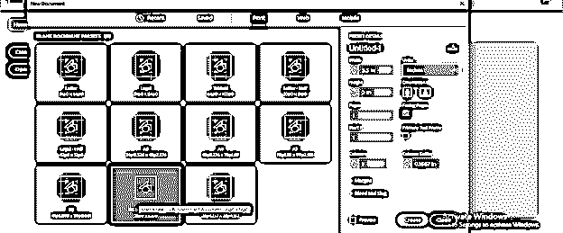

现在我将在这里放置一个插画文件，这是我为名片设计的。为此，我将转到“文件”菜单，单击“放置”选项，或者按键盘上的 Ctrl + D 键。

我从这里选择我想要的文件。您可以在 InDesign 中置入此列表中的任何文件格式。

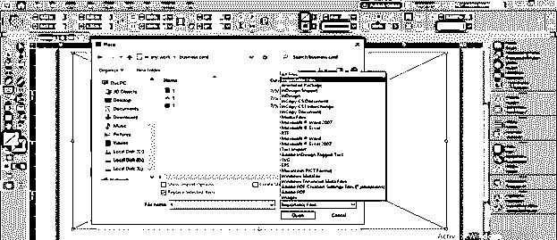

这是一个中心有 EDUCBA 标志的设计，我将把它用作名片设计。

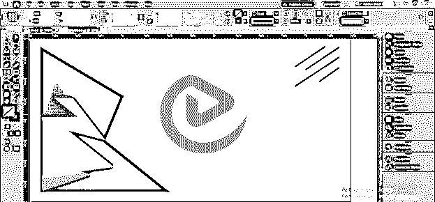

现在，我将从工具面板中选择文字工具，绘制一个文本框。

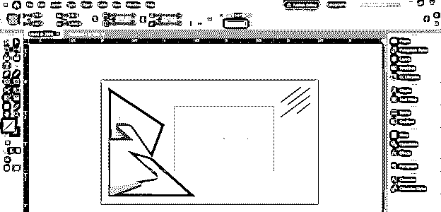

现在我们将打开数据合并面板，为此，请转到菜单栏的窗口菜单，转到下拉列表的实用程序选项，然后选择数据合并选项。

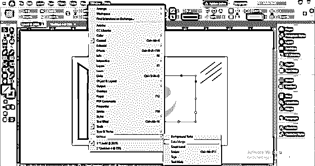

在开始使用这个面板之前，我将向您展示我将在这里用作名片条目的数据。我在记事本里有我的数据。你可以使用 Excel 表，谷歌表，文本编辑器数据，也根据你的选择。

你要记住的一件事是，你要在名片上分别输入的每一个数据都要用逗号书写，第一行应该是条目的标题，名片上会有雇员的名字，然后是职务，然后是电话号码等等。所以我在我的第一线有这些东西。

然后根据标题用逗号输入员工的详细信息，我这里有四个条目。

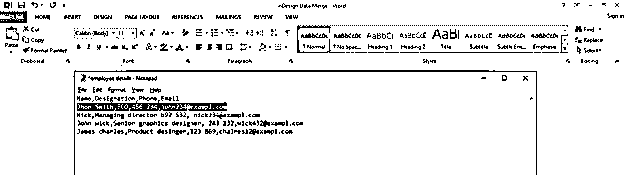

现在进入 InDesign，单击“数据合并”面板右上方的选项卡，然后单击下拉列表中的“选择数据源”选项。

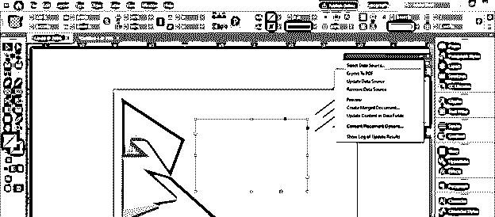

从打开的对话框中的保存位置选择数据文件。你可以选择。txt 或者。csv 文件格式。我这里有一个. txt 数据文件。

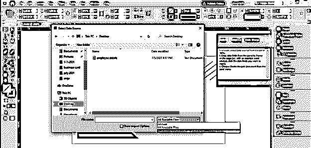

现在，数据合并会自动将数据文本文件的第一行理解为主条目，并像这样显示在它的面板中。这些条目将是源条目，或者您可以将它们称为主条目。

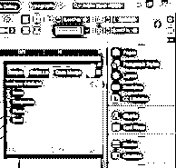

现在来到我们之前画的文本框，点击这里，然后在数据合并面板上点击名称层，这样它将作为条目的源文本进入文本框。

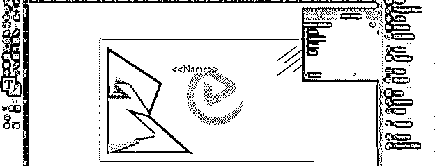

我将按下回车键，然后点击指定层，因为我想在下一行。

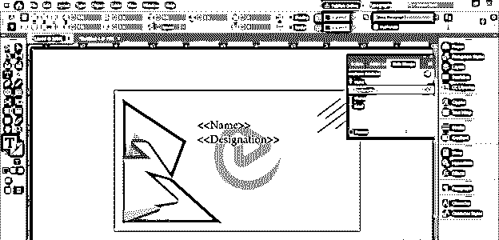

我将对剩余的条目进行同样的操作。

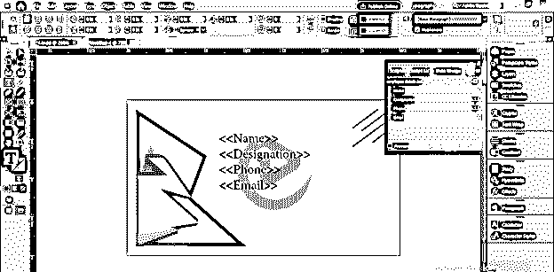

您可以通过点击数据合并面板的预览按钮的复选框来查看预览。在文本框的右边缘，您可以看到一个红色的加号，表示我们的文本不完全适合此文本框。

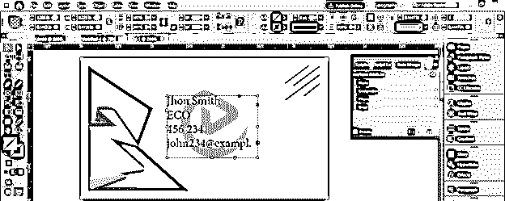

因此，我们可以改变文本框的大小，以适应它；它不会影响条目。

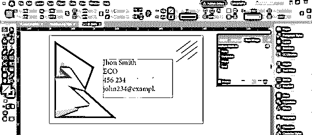

您可以通过单击数据合并面板的“下一步”按钮来查看下一个条目。

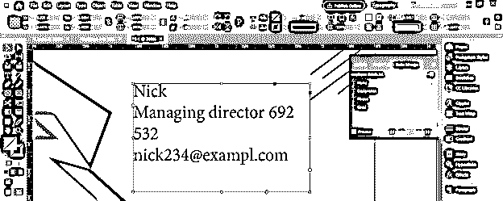

现在，我将更改这个名称条目的字体样式和颜色。

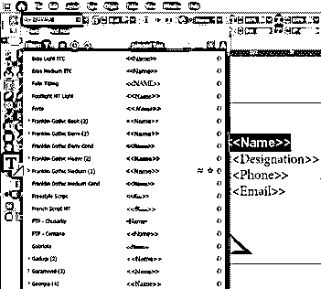

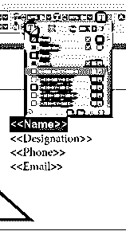

并且在其他文本条目中的段落样式绘画也是如此。

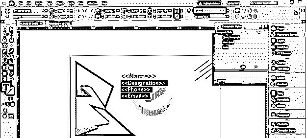

现在，您可以再次看到预览。如果你在数据中犯了什么错误，比如约翰的拼写错误。因此，您无需再次经历所有步骤。

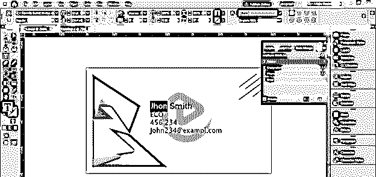

只需在数据表中进行修改并保存更改。

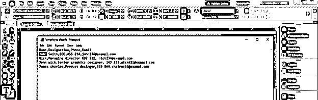

然后点击数据合并面板右上角的按钮，然后点击更新数据源。

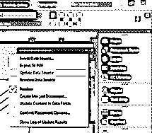

您所做的修改将在此自动更新。同样的，你可以增加条目的数量。只需添加其他员工数据，并从数据合并面板中进行更新。

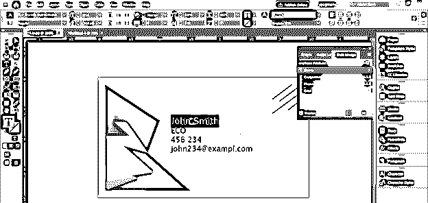

现在禁用预览模式，并点击数据合并面板的创建合并文档按钮。

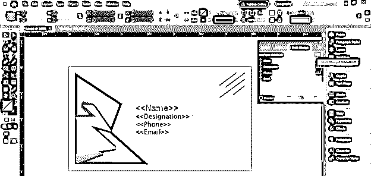

此选项的对话框将会打开。在这个框中，您可以选择要创建多少个数据条目。因此，举例来说，您可以通过此选项仅为单个条目创建一个合并文档。

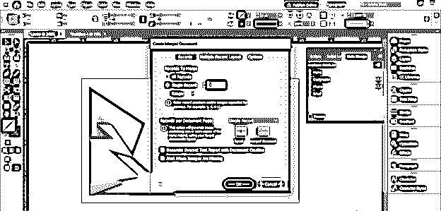

或者从范围选项中决定它们的范围。

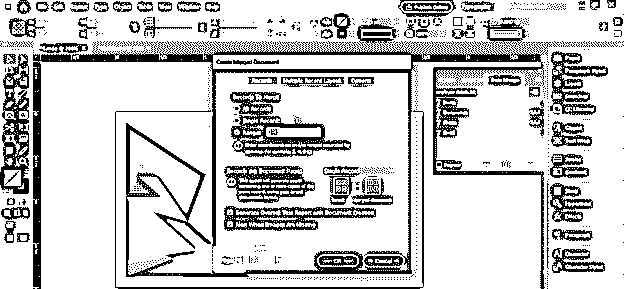

我将选择“全部”,然后单击该对话框的“确定”按钮，当我单击“确定”按钮时，如果没有溢出文本，则会显示一条消息，这意味着我可以创建一个合并文档，而不会出现任何问题。如果你想了解溢出文本，你可以去看看我在 InDesign 的文章“溢出文本”。

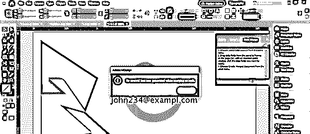

一旦我点击“确定”按钮，它将在每个单独的页面上创建所有条目的名片。所以现在我们可以把它保存为。pdf 并直接拿去打印。

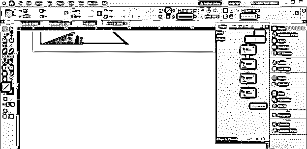

### 结论

我希望你发现数据合并是这个软件的一个非常好和有效的功能，它节省了你为不同的布局设计制作这些类型的条目的大量时间。你可以用。psd 文件设计也在 InDesign 中，数据合并功能也将与。psd 设计。

### 推荐文章

这是 InDesign 数据合并指南。在这里，我们将一步一步地详细讨论如何在 InDesign 中使用数据合并。您也可以看看以下文章，了解更多信息–

1.  [Indesign 的替代方案](https://www.educba.com/alternative-to-indesign/)
2.  [什么是 Adobe InDesign](https://www.educba.com/what-is-adobe-indesign/)
3.  [InDesign CS6](https://www.educba.com/indesign-cs6-top-ten-new-features/)
4.  [InDesign 文档设置](https://www.educba.com/indesign-document-setup/)

