# InDesign 网格模板

> 原文：<https://www.educba.com/indesign-grid-template/>

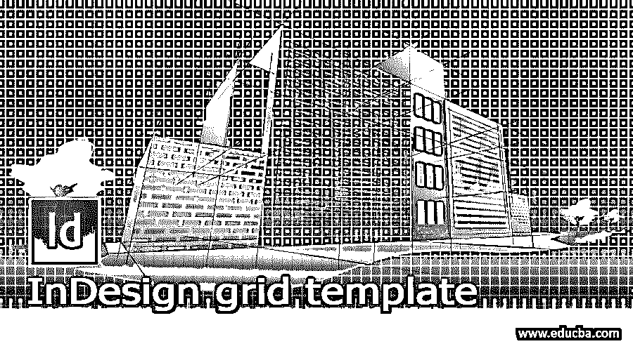

## InDesign 网格模板简介

以下文章提供了 InDesign 网格模板的概述。Adobe InDesign 中的网格模板通常用于创建书籍、海报、小册子、印刷品和杂志设计。网格是在 InDesign 上创建平衡一致的布局的基本先决条件。网格和指引线用于稳定和平衡在特定页面上创建的文本、图像、符号、形状和其他艺术品的排列。对于初学者来说，使用网格和尺子是非常重要和基本的技术，可以准确和精确地设计出创造性的艺术品。

### 如何创建和使用网格模板？

网格用于管理内容的过程，这有助于给作品评分，为作品提供自然的外观，整体上更容易识别和理解。

<small>3D 动画、建模、仿真、游戏开发&其他</small>

网格模板只不过是在适当的系统中制作和构建了现成的网格和指南的模板，可以在任何需要的时候使用。要创建网格模板，用户可以将 InDesign 文件保存为 InDesign 模板格式，以备将来使用。

在 InDesign 上创建网格是最简单的操作过程。用户可以手动创建网格，也可以使用程序中的工具。然而，用户应始终记住，这些网格、指南和标尺都是不可打印的线条，仅用于创建正确和精确的设计。

### 如何在 InDesign 上手动创建网格和参考线？

在 Adobe InDesign 中，用户可以创建不可打印线条的基线和文档网格。基线网格用于文本，仅出现在画布上。而文档网格出现在整个文档上。我们可以改变网格的颜色，也可以根据我们的要求显示/隐藏它们。

以下是在 InDesign 上创建网格的步骤:-

1.  启动 InDesign

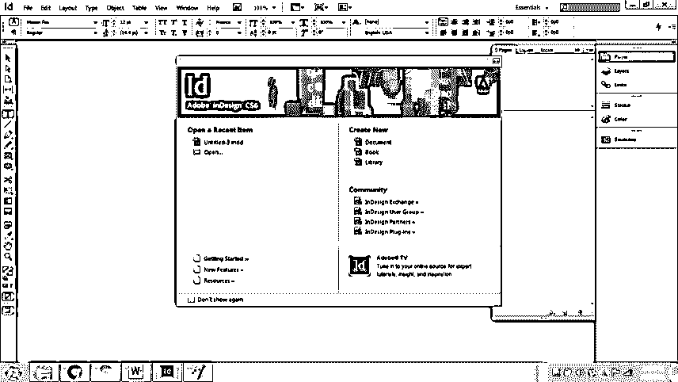

2.  创建一个没有分栏或页边距的对开文档。

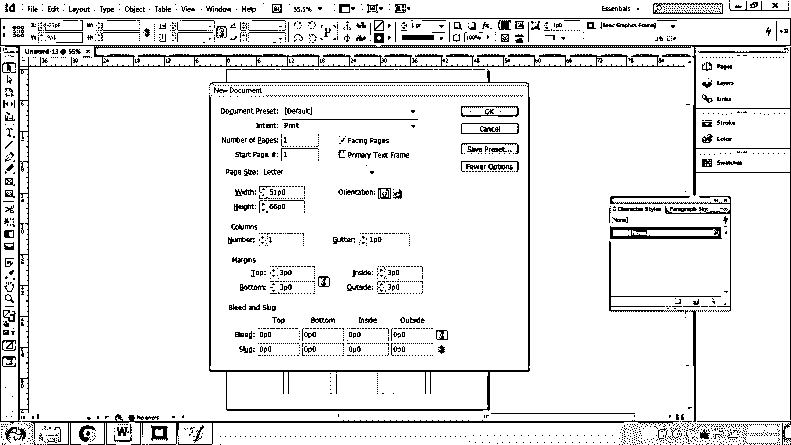

3.  现在，转到编辑>首选项>网格

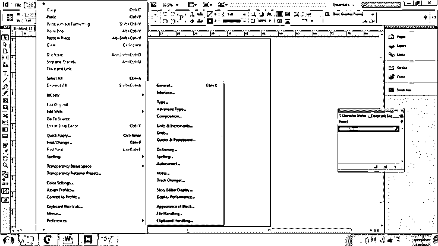

4.  将出现一个对话框。

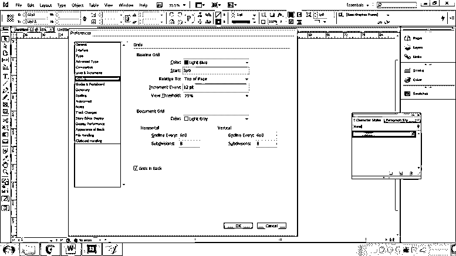

5.  在这种情况下，我们可以调整基线以及文档网格设置。
6.  在 1 st 我们可以编辑两个网格的颜色。

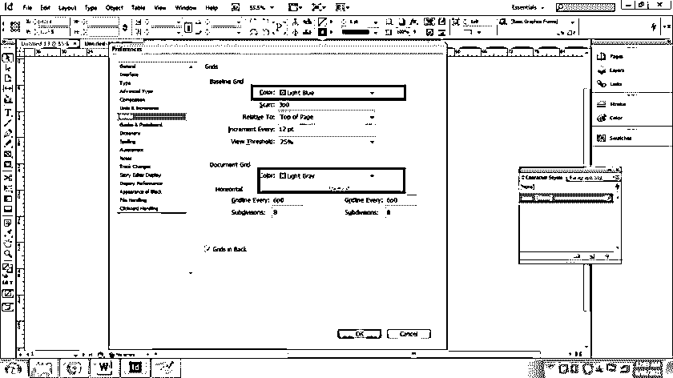

7.  基线网格主要用于文本书写，因此，在相对于选项中，选择网格的原点；页面顶部或上边距。

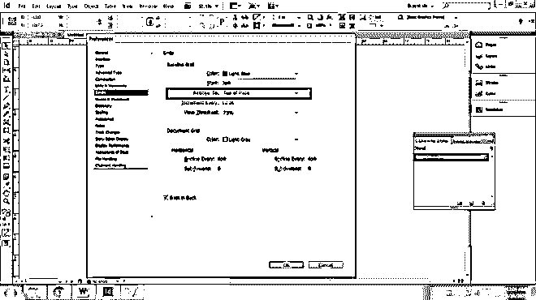

8.  在“增量间隔”选项中，我们键入一个值，该值是在每隔一定时间后创建格网所必需的。例如，我们键入 5pt，因此，在每 5pt 之后，将创建网格。

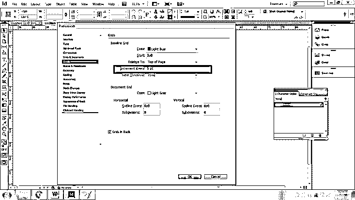

9.  视图阈值选项用于缩放放大设置。它用于查看特定缩放值后的指引线。

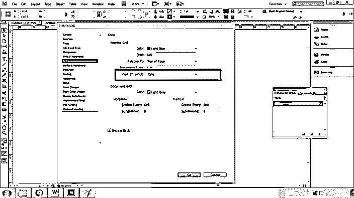

10.  接下来，我们创建文档网格。
11.  我们有单独的水平和垂直网格选项，以及所需的细分数量。

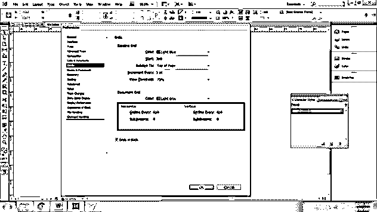

12.  最后，在最后一步中，我们在黑色选项中有网格，当取消选择此选项时，它用于将所有的艺术品保留在网格后面。如果选中，所有的作品都会放在网格的前面。

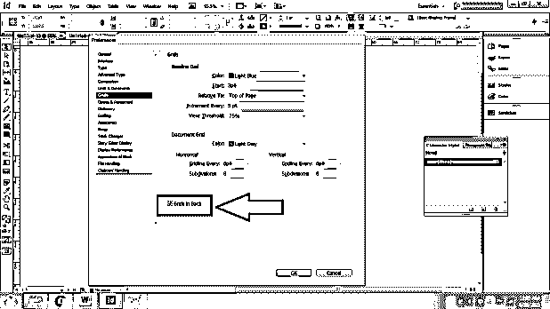

### 如何显示/隐藏网格/参考线？

继续上面的过程，我们可以在用户需要时显示或隐藏网格。为此，请转到“视图”>“网格和参考线”>“显示/隐藏网格”。

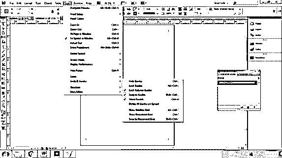

我们也可以使用相同的过程锁定导轨。有一个单独的选项来显示/隐藏文档和基线网格。

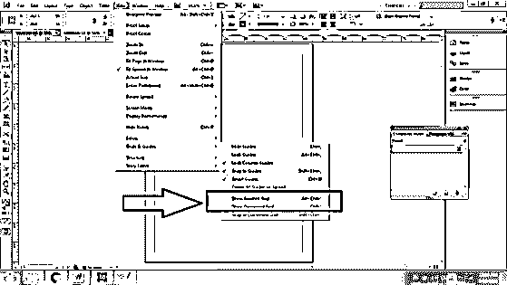

### 如何将对象与参考线/网格对齐并进行修改？

除此之外，用户还可以使用捕捉工具，这些工具在用户移动或缩放特定对象时使用，它会根据向导创建的捕捉区域进行捕捉。对齐有助于对象的正确移动，而不会损害文档的显示和排列。

为此，请转到“视图”>“网格和参考线”，并使用“对齐参考线”或“对齐文档网格”选项。在这些文档中，网格也用于基线网格捕捉。

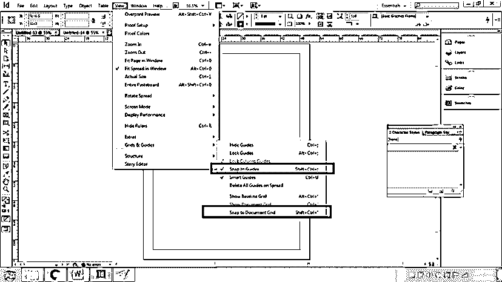

要更改或修改对齐区域、参考线对齐方式。转到编辑>首选项>参考线和粘贴板，并在这里修改设置。

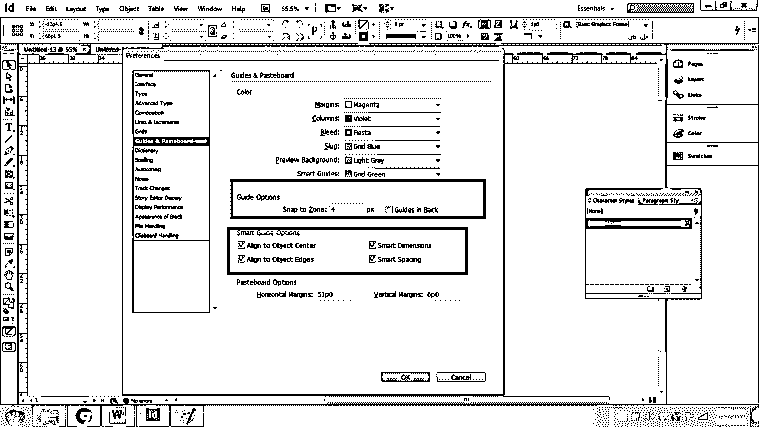

### 如何使用 Adobe InDesign 中的工具创建网格并进行相应的编辑？

在此过程中，用户为他们的项目创建边距和分栏、标尺参考线和通用参考线。

以下是程序:-

1.  我们启动 InDesign 并创建一个新文档。

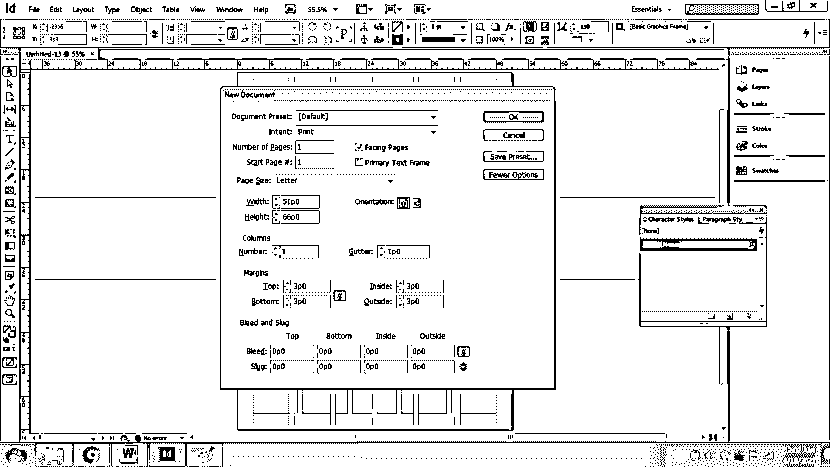

2.  接下来，进入布局>页边距和分栏。

3.  要创建边距并从外部或内部增加区域，请使用“边距”选项。

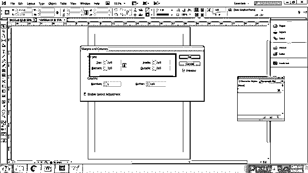

4.  要创建参考线，请增加栏数和装订线(栏间距)

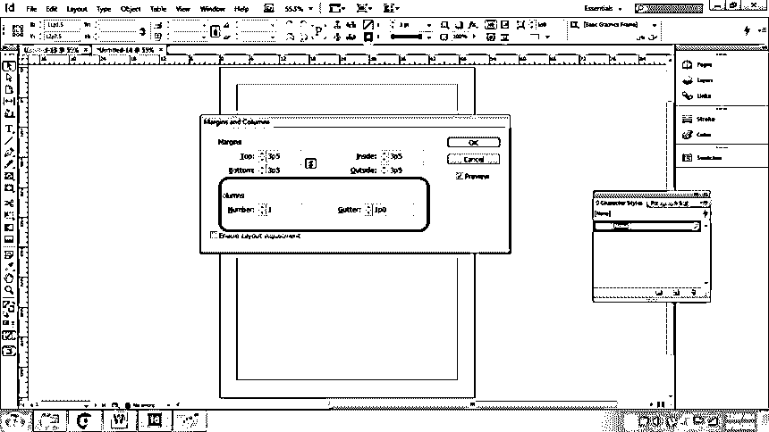

5.  若要创建标尺参考线，请前往“布局”>“标尺参考线”。在这里，我们可以编辑标尺参考线的颜色和阈值，然后相应地创建标尺。

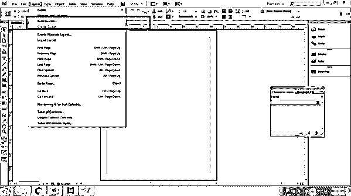

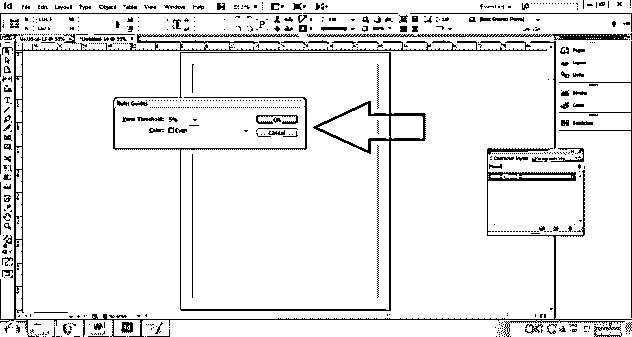

6.  接下来，我们可以通过以下方式手动创建指南:前往布局>创建参考线。

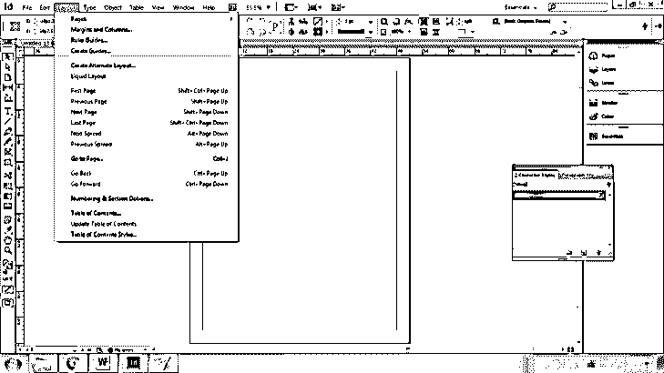

7.  将出现一个对话框；我们可以修改所需的行数和列数。它还有单独的装订线设置。

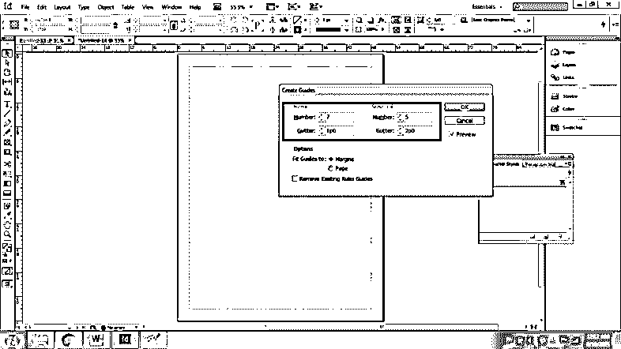

8.  我们还可以更改参考线与页面或页边距的匹配程度。单击确定成功保存设置。

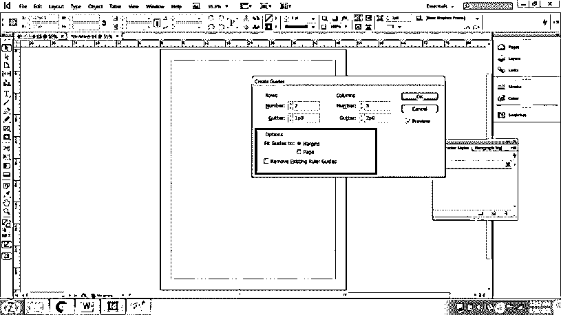

最后，一旦创建了网格和参考线，用户就可以将文件保存为 InDesign 模板格式，以便用户可以根据需要使用该模板。

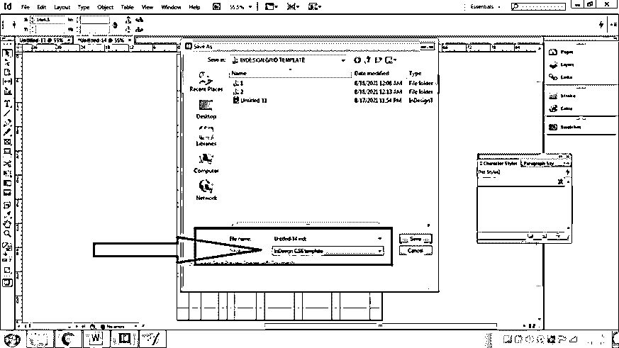

### 结论–InDesign 网格模板

总结上述文章，我们在本课程中了解到:对网格和指导方针有正确的了解将有助于用户创建正确和准确的结构，并鼓励他们练习和提高这些技术功能的技能。

Adobe InDesign 是一个庞大的程序，用于多个项目和目的，只有当用户掌握了创建艺术品的基本技术时才有用。

### 推荐文章

这是 InDesign 网格模板指南。在这里，我们详细讨论了网格和指南的正确知识，这将帮助用户创建一个正确和准确的结构。您也可以看看以下文章，了解更多信息–

1.  [InDesign 网格](https://www.educba.com/indesign-grid/)
2.  [Indesign 版本](https://www.educba.com/indesign-version/)
3.  [InDesign 快捷键](https://www.educba.com/indesign-shortcuts/)
4.  [什么是 Adobe InDesign](https://www.educba.com/what-is-adobe-indesign/)

