# InDesign 图层

> 原文：<https://www.educba.com/indesign-layers/>

## InDesign 图层简介

Adobe InDesign 中的图层有助于用户对特定页面或文档进行分类和布局。Adobe InDesign 中的图层功能对于创意设计师和艺术家来说是有建设性的。它有助于设计师系统、全面地摆放每一件艺术品。将每幅作品放在适当的图层下，可以帮助用户快速编辑设计。

### 如何在 Indesign 中创建和使用图层？

与任何其他图形程序一样，Adobe InDesign 中的图层是简单的外观表，由用户用符号、文本、设计和艺术作品填充。没有填充的内容，层只是一个空白的画布。位于图层面板顶部的图层对跟随相应图层的用户来说最可见。InDesign 中的图层功能是一种挖空功能，用于锁定、编辑、移动和隐藏图层上的对象。

<small>3D 动画、建模、仿真、游戏开发&其他</small>

#### 如何创建一个新层？

在 Adobe InDesign 中创建新图层既简单又容易。该程序有一个特殊的功能，允许用户改变特定层的指示性颜色，这有助于用户区分其他几个层。InDesign 还提供了其他体贴的图层选项，可用于快速任务和分配。

**以下是创建新层的步骤:-**

1.  在 InDesign 中创建新文档，如下所示。

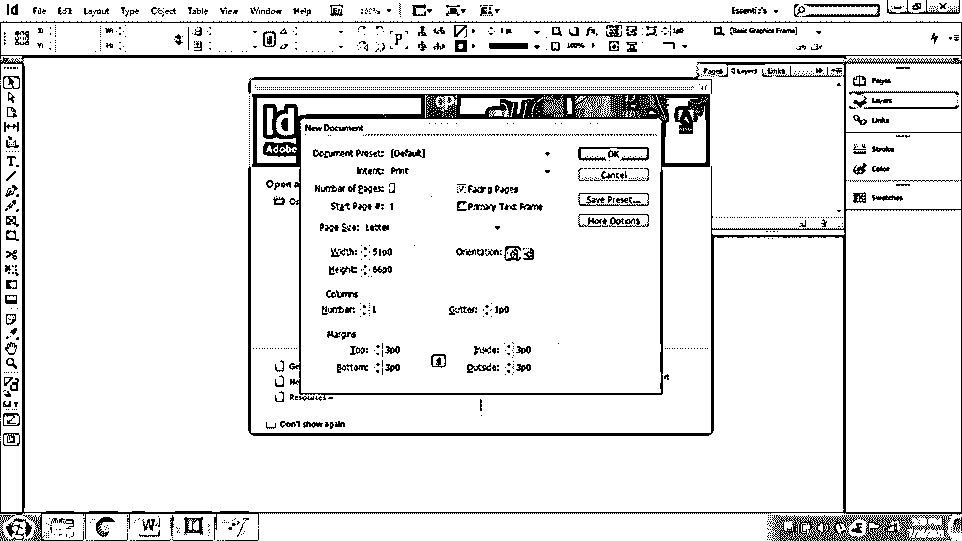

2.  转到“窗口”面板，选择“图层”以查看“图层”面板。

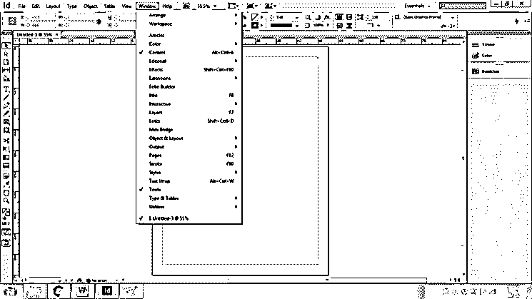

3.  要在现有图层下创建一个新图层，请按住 Ctrl 键并单击创建新图层选项。

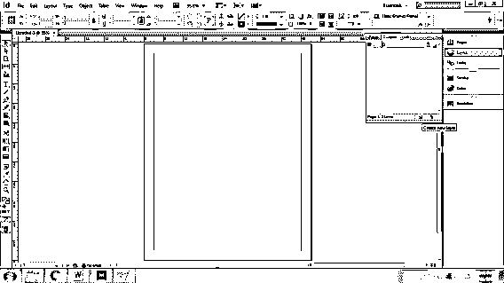

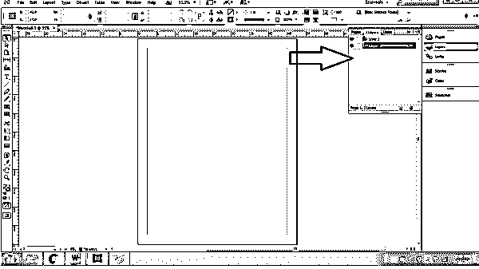

4.  类似地，要在现有层上创建一个新层，请按住 Shift 键并单击创建新层选项。

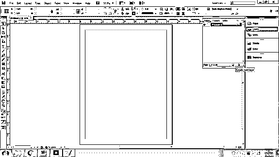

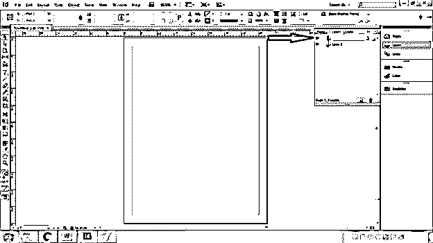

5.  要编辑或查看图层选项，双击所选图层，如下所示。

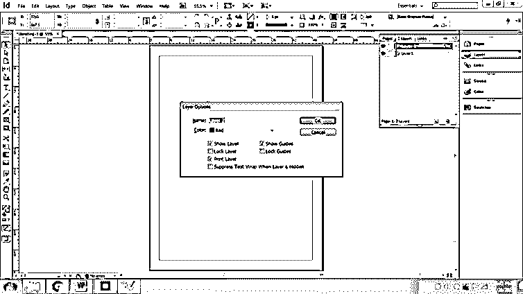

6.  您将看到几个选项，例如:

*   颜色–更改层的描述颜色。我们可以点击下拉菜单来改变层的颜色。

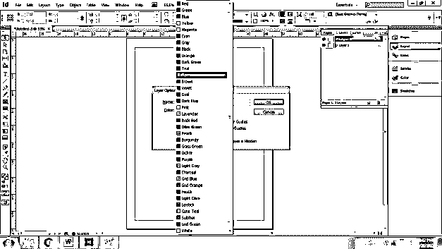

*   展示指南-指南是有用的行，帮助用户在整个文档中正确安排艺术品。要查看这些指南，请选中特定图层的复选框。

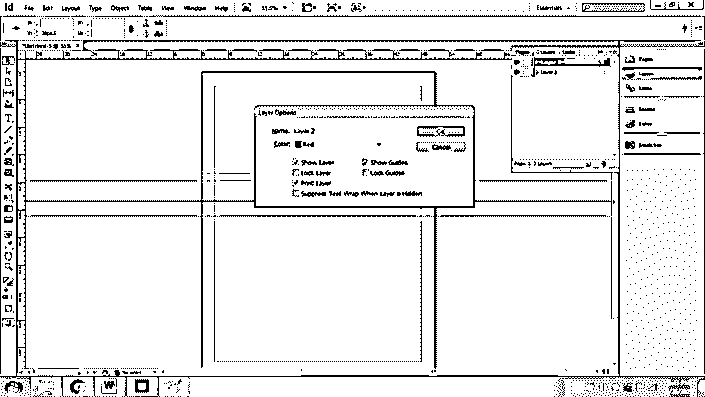

*   显示层-这个选项将有助于隐藏或显示特定的层。几乎类似于有助于类似功能的眼睛按钮。
*   锁定层-在开始时锁定层本身。我们可以使用锁定按钮来锁定/解锁层
*   锁定参考线:锁定参考线，这样用户就不必不断修改标尺的设置。
*   打印图层-该选项将帮助用户选择和取消选择哪些图层要打印，哪些不要打印。
*   隐藏图层时抑制文本换行-当用户需要在其他图层上显示普通文本，而选定的隐藏图层在文本上有文本换行时，此功能很有用。

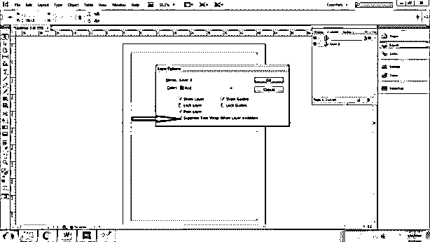

### 如何在 InDesign 中使用图层

以下是将对象从一层添加、选择、移动和复制到另一层的步骤。

1.  在 InDesign 中创建新文档，如下所示。

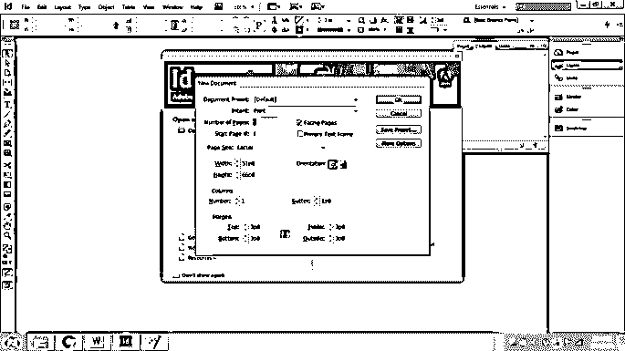

2.  创建一个新层作为文本层。在这一层写一个样本文本。

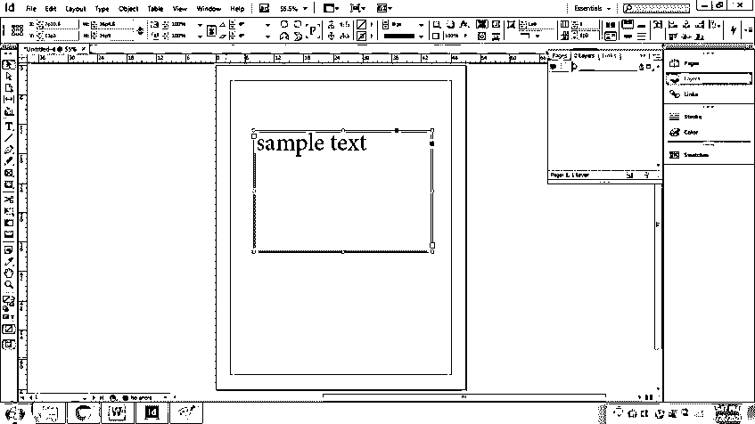

3.  创建另一个新层为“层 2 ”,并使用绘图工具在层上绘制一个简单的艺术作品。确保所选图层已解锁并可见。用户无法在锁定的图层或不可见的图层上创建对象。

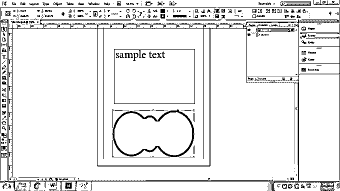

4.  要将文本层的内容复制到第 2 层，请将文本层的小方框拖到第 2 层。

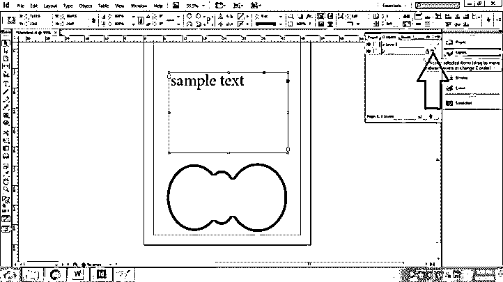

#### 如何修改图层并在特定对象上使用效果？

继续上面的例子；

1.  要复制第 2 层，右键单击该层并选择复制第 2 层。

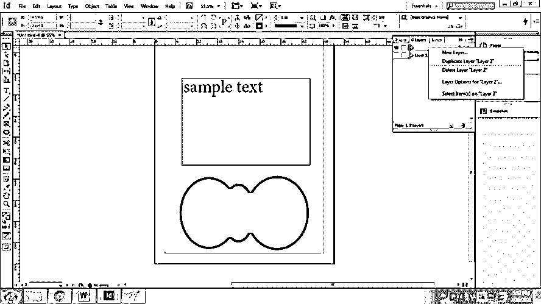

2.  我们也可以通过点击 2 和列中的锁定选项来锁定该层，如下所示。

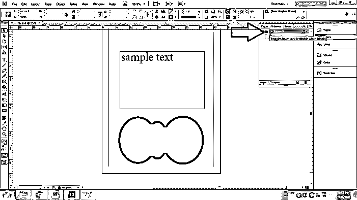

3.  合并图层有助于用户减少不需要的图层数量，同时也从整体上减小了文件的大小。要合并两层，选择两层，右键单击并选择合并，如下所示-

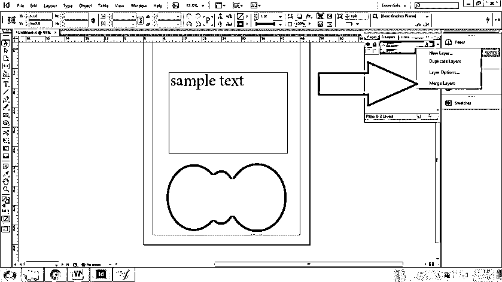

4.  类似地，我们可以通过将层拖到回收站中或者右键单击层并选择删除选项来删除特定层。

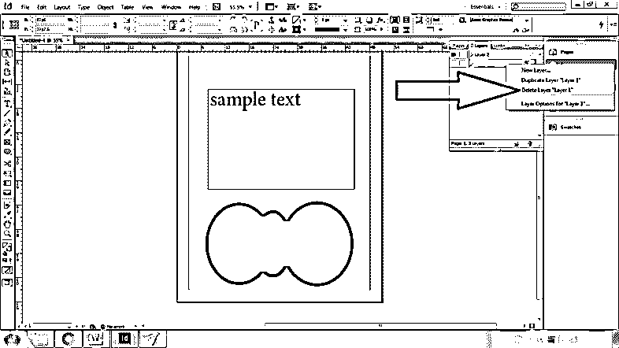

5.  要查看层内的单个对象，点击层名前的小三角形，如下图所示

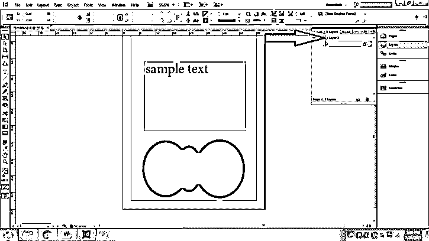

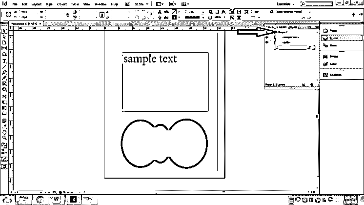

6.  要从打印中删除一个层，双击该层并取消选择打印层。

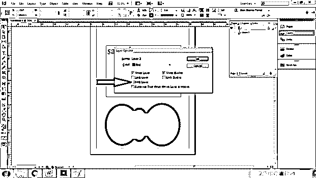

7.  要给对象添加滤镜，请转到“窗口”>“效果”。

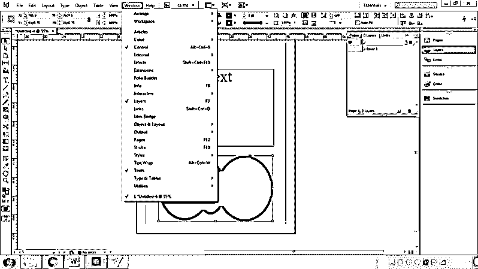

8.  确保对象被选中，并根据需要应用效果。

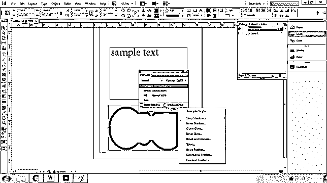

### 结论

如果用户有使用其他图形编辑软件的经验，在 InDesign 中使用图层会更容易。否则，初学者可能会发现功能复杂且难以掌握。然而，一旦学会了这些功能，对设计者来说可能是有益的。此外，Adobe InDesign 还集成了一些特殊的工具，这些工具可以快速、安全地执行图层功能，这使得该软件与其他软件有所不同。

### 推荐文章

这是 InDesign 图层指南。在这里，我们将逐步讨论如何在 Indesign 中创建和使用图层。您也可以看看以下文章，了解更多信息–

1.  [Indesign 版本](https://www.educba.com/indesign-version/)
2.  [Indesign 的替代方案](https://www.educba.com/alternative-to-indesign/)
3.  [什么是 Adobe InDesign](https://www.educba.com/what-is-adobe-indesign/)
4.  [InDesign 文档设置](https://www.educba.com/indesign-document-setup/)

